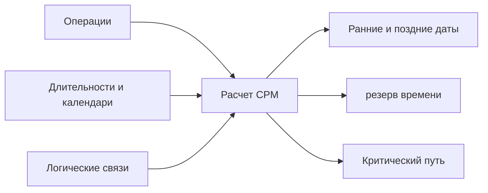

Critical Path Method, или CPM, это основной метод расчета серьезного проектного графика. Он превращает список операций в логическую модель, которая отвечает на ключевые вопросы: когда проект может завершиться, какие операции контролируют эту дату и где в графике есть гибкость.

В Primavera P6 CPM часто скрыт за кнопкой расчета графика. Программа быстро рассчитывает даты, резерв времени и критические операции. Но сам метод важно понимать. Если планировщик не понимает CPM, график может рассчитаться, но результат может не отражать реальный план выполнения.

## Что Делает CPM

CPM рассчитывает длительность проекта из сети операций, длительностей, календарей и логических связей.

Главная идея проста: длительность проекта — это не сумма всех операций. Это длительность самого длинного связанного пути зависимых работ в сети. Этот путь называется критический путь.

Если операция на этом пути задерживается, завершение проекта также задерживается, если команда не восстановит время на этом же пути.

## Какие Входные Данные Нужны CPM

CPM зависит от качества сети графика.

Во-первых, графику нужны операции, которые представляют понятные части работ. У каждой операции должен быть определенный объем, разумная длительность и понятный критерий завершения.

Во-вторых, каждой операции нужна длительность. В большинстве графиков P6 это детерминированная оценка, основанная на производительности, ресурсах, календарях и предположениях выполнения.

В-третьих, операциям нужна логика. Связи определяют, что должно произойти раньше, что может идти параллельно и какие условия позволяют последователю начать или закончить.

CPM не знает, хорошая ли логика. Он рассчитывает то, что получил. Если сеть содержит недостающую логику, слабые ограничения, чрезмерные задержки или неполные SS/FF связи, результат может быть математически правильным, но практически ненадежным.

## Прямой и Обратный Проход

CPM рассчитывает график двумя основными проходами.

Прямой проход идет от даты данных к завершению проекта. Он рассчитывает самые ранние даты начала и окончания каждой операции с учетом логики, длительностей, календарей и ограничений.

Это раннее начало и раннее окончание.

Обратный проход идет от завершения проекта обратно к началу. Он рассчитывает самые поздние даты начала и окончания операций без задержки завершения проекта или выбранной целевой даты.

Это позднее начало и позднее окончание.

После этого P6 может рассчитать резерв времени.

## Резерв Времени

Резерв времени — это время, на которое операция может сдвинуться до того, как повлияет на заданную цель графика.

Полный резерв времени обычно является основным показателем в P6. Он показывает, насколько операция может задержаться до влияния на завершение проекта или контролирующий путь.

Свободный резерв времени более локален. Он показывает, насколько операция может задержаться без влияния на раннее начало непосредственного последователя.

Резерв времени не является свободным временем для случайного использования. Это гибкость графика. Когда резерв времени расходуется, у проекта остается меньше защиты от будущих задержек.

## Критический Путь

Критический путь это самый длинный связанный путь зависимых операций, контролирующий завершение проекта. Во многих графиках критические операции определяются по нулевому или отрицательному полному резерву времени, но лучший подход - понимать самый длинный путь и проверять, имеет ли он смысл.

Хороший критический путь должен рассказывать правдоподобную историю выполнения. Он должен проходить через операции, которые действительно контролируют завершение: выпуск проектной документации, закупки, строительные последовательности, испытания, пусконаладка, передача или другие реальные драйверы.

Если критический путь проходит через странные вехи, лишние ограничения, отсутствующую логику или операции, которые реально не контролируют завершение, график может давать ложный сигнал.

## Почти Критические Работы

Команда не должна смотреть только на операции с нулевым резервом времени.

Почти критические операции имеют небольшой резерв времени и могут стать критическими при умеренной задержке. Порог зависит от размера и чувствительности проекта. На крупных проектах операции с резервом времени менее 10 или 20 рабочих дней могут требовать близкого контроля.

Почти критические пути важны, потому что риск редко находится в одной линии. В плотном строительстве, пусконаладка или shutdown периодах несколько путей могут быть близки к критичности.

## CPM и Анализ Рисков

CPM дает детерминированный ответ: если каждая операция займет плановую длительность, проект завершится в эту дату.

Анализ рисков графика идет дальше. Он проверяет неопределенность, применяя диапазоны или вероятностные распределения к длительностям и выполняя множество симуляций. Это помогает оценить вероятность завершения к целевой дате.

Но анализ рисков зависит от сети CPM. Если логика слабая, результат риска тоже будет слабым. Monte Carlo не исправляет недостающую логику, нереалистичные длительности или плохую структуру графика.

## CPM в Primavera P6

P6 делает расчет CPM быстрым, но эта скорость может скрывать предположения.

При расчете графика P6 использует дату данных, календари, длительности, связи, ограничения, фактические данные, оставшиеся длительности и параметры расчета графика. Небольшие изменения этих настроек могут изменить резерв времени, критический путь и прогнозные даты.

Поэтому планировщик не должен просто нажимать F9 и принимать результат. Нужно проверить, соответствует ли расчет реальному плану выполнения.

## Хорошая Практика

Стройте CPM сеть на реальной логике выполнения. Не добавляйте связи только для прохождения проверки или получения желаемой даты.

Проверяйте критический путь после каждого обновления. Убедитесь, что его начало и конец соответствуют текущему статусу проекта.

Отслеживайте движение резерва времени во времени. Проект может выглядеть по плану, пока резерв времени тихо расходуется.

Проверяйте почти критические пути. Они часто показывают, где появится следующая проблема графика.

Поддерживайте график достаточно чистым для CPM. Открытые начала, открытые окончания, жесткие ограничения, чрезмерная задержка и неполные связи снижают ценность расчета.

## Вывод

CPM это двигатель, который превращает график Primavera P6 в инструмент контроля проекта. Он рассчитывает ранние даты, поздние даты, резерв времени и критический путь из сети операций.

Но CPM надежен настолько, насколько надежен график, который он рассчитывает. Хорошие операции, реалистичные длительности, корректные календари и сильная логика делают результат значимым.

Ценность CPM не только в дате завершения. Его настоящая ценность в том, что он объясняет, почему эта дата контролируется, где есть гибкость и куда руководство должно направить внимание.
## Связанные материалы
- [Критический путь или путь резерва времени, начинающийся с ограничения - Обзор](../../metrics/09_cp_or_float_path_starting_with_constraint/02_guide_template.md)
- [Связи SS и FF](../15_SS%20&%20FF%20RELATIONS/15_SS%20&%20FF%20RELATIONS.md)
- [Разработка Проектного Графика](../17_DEVELOPE%20A%20PROJECT%20SCHEDULE/17_DEVELOPE%20A%20PROJECT%20SCHEDULE.md)
