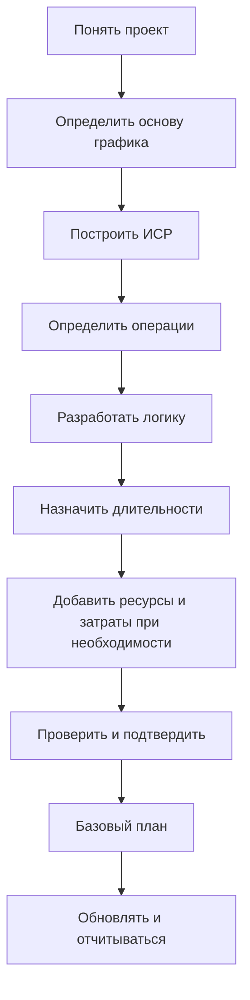

Разработка проектного графика с нуля - это не просто ввод операций в Primavera P6. Это перевод объема работ, стратегии выполнения, ограничений, ресурсов и обязательств проекта в модель времени, которую можно проверять, утверждать, обновлять и использовать для решений.

Хороший график строится до того, как рассчитывается. Качество файла P6 зависит от мышления до ввода первой операции.

## Поток Разработки

## Сначала Понять Проект

Не начинайте с P6 до понимания проекта.

Изучите контракт, объем работ, спецификации, ключевые вехи, стратегию выполнения, ограничения закупки, разрешения, доступы и требования к передаче. Затем поговорите с командой управления проектом, проектировщиками, закупками, строительством, пусконаладкой, субподрядчиками и поставщиками.

График - это модель того, как команда намерена выполнить проект. Если планировщик не понимает этого намерения, график будет построен на предположениях.

## Определить Основу Графика

Основа графика объясняет, как будет построен график. Документ должен определить ИСР, календари, кодирование, уровень детализации, правила связей, политику задержек, настройки P6, правило даты данных, отчетность и подход к базовому плану.

Этот документ важен, потому что объясняет, почему график построен именно так. Он также помогает рецензентам при проверке качества и сравнении будущих обновлений.

## Построить ИСР

Иерархическая структура работ (WBS) является организационной основой графика. Она должна отражать, как проект будет управляться и отчитываться.

ИСР может быть организована по фазам, зонам, системам, дисциплинам, результатам поставки, контрактным пакетам или их комбинации. Структура должна поддерживать фильтрацию, измерение прогресса, ответственность и отчетность.

Если ИСР не соответствует способу контроля проекта, графиком будет трудно пользоваться, даже если операции корректны.

## Определить Операции

Операции должны представлять понятные и измеримые части работ. У каждой операции должен быть определенный объем, ясное условие начала, ясное условие окончания и один ответственный.

Слишком крупные операции трудно статусировать. Слишком мелкие операции делают график дорогим в сопровождении. Правильная детализация зависит от фазы, контракта, отчетности и требований контроля.

Названия операций важны. Хорошее название должно говорить, какая работа выполняется, где она выполняется и с каким объектом, системой или результатом она связана.

## Разработать Логику

Логика - сердце CPM графика. Она определяет, что должно быть до чего, что может идти параллельно и какое условие позволяет операции начаться или закончиться.

Логику нужно разрабатывать с людьми, которые знают работу. В P6 не стоит строить последовательность только за столом. Проверьте ее с руководителями дисциплин, менеджерами строительства, командой пусконаладки, закупками и субподрядчикамии.

Используйте FS, когда он лучше отражает работу. Используйте SS и FF осторожно, когда перекрытие реально. Избегайте отрицательных задержек и SF без ясной утвержденной причины. Каждая операция обычно должна иметь предшественника и последователя, кроме корректных вех начала и конца проекта.

## Назначить Длительности

Длительности должны быть реалистичными, а не желаемыми. Они должны основываться на объеме, производительности, ресурсах, календарях, данных vendors, subcontractors и опыте похожих работ.

Длительность - не просто число. Она предполагает определенную бригаду, темп производства, календарь, условия доступа и метод выполнения. Если эти предположения меняются, длительность тоже может измениться.

Документируйте важные предположения по длительности. Это помогает при проверках, обновлениях, управление изменениями и анализ задержек.

## Добавить Ресурсы и Затраты

Если график используется для resource planning, загрузка затрат, освоенный объем или денежный поток, ресурсы и затраты нужно добавлять аккуратно.

Загрузка ресурсов показывает спрос на труд, оборудование, материалы и возможные перегрузки. Загрузка затрат связывает график с бюджетом, прогнозные и кривыми оплаты или прогресса.

Не добавляйте ресурсы только для вида. Если проект использует эти данные, их нужно поддерживать при обновлениях.

## Проверить и Подтвердить

Перед утверждением базовый план график нужно проверить технически и операционно.

Проверьте открытые начала, открытые окончания, типы связей, задержкаs, ограничения, чрезмерно длинные длительности, отсутствующая логика, распределение резерв времени и правдоподобность критический путь. проверки типа DCMA проверки полезны, но требуют проектного суждения.

Пройдите график с командой. Спросите, соответствуют ли логика, длительности, ресурсы и вехи реальному плану выполнения. График, которое проходит метрики, но не проходит полевую проверку, не готово.

## Утвердить Базовый план

После проверки и утверждения график становится базовый план. Базовый план - это ссылка для измерения прогресса, отклонений, задержек, восстановления и performance.

Базовый план должен утверждаться формально. Сохраните утвержденную версию, защитите ее от неконтролируемых изменений и документируйте утверждениеs. Поздние изменения должны проходить change control.

Базовый план, который меняется каждый раз при задержке проекта, не является базовый план. Это движущаяся цель.

## Установить Цикл Обновления

График остается полезным только при регулярном обновлении.

Определите, кто предоставляет прогресс, когда данные собираются, какие доказательства нужны, как проверяются actual даты, как пересматриваются оставшиеся длительности и какие отчеты выпускаются. Активное строительство и пусконаладка могут требовать еженедельных обновлений или обновлений раз в две недели. Ранние фазы могут обновляться ежемесячными.

Цикл обновления превращает базовый план из статического документа в живой инструмент контроля.

## Вывод

Разработка проектного графика - структурированный процесс. Понять проект, определить основу графика, построить ИСР, создать операции, разработать логику, назначить длительности, загрузить ресурсы при необходимости, проверить результат, утвердить базовый план и поддерживать обновлениями.

Лучшие графика не появляются от быстрого открытия P6. Они создаются через понимание работы, проверку предположений и модель, которой проектная команда может доверять.
## Связанные материалы
- [Действия, начинающиеся с даты данных, без управляющей логики: почему этот показатель графика имеет значение - Обзор](../../metrics/01_activities_starting_in_dd_with_no_logic_driving/02_guide_template.md)
- [CPM (Critical Path Method)](../16_CPM%20(CRITICAL%20PATH%20METHOD)/16_CPM%20(CRITICAL%20PATH%20METHOD).md)
- [Коды операций](../18_ACTIVITY%20CODES/18_ACTIVITY%20CODES.md)
