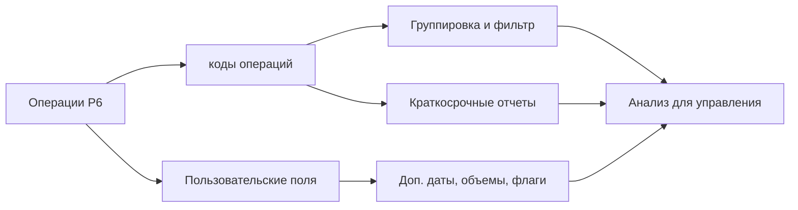

# Коды Операций

Коды операций в Primavera P6 являются одним из основных инструментов, которые превращают график из списка операций в полезную базу данных контроля проекта. Они позволяют группировать, фильтровать, сортировать, отчитываться и анализировать график с разных управленческих точек зрения.

График - это не только линейный график. В P6 каждая операция также является записью, которая может содержать информацию об ответственности, фазе, зоне, системе, дисциплине, контракте, типе вехи и других атрибутах проекта. Коды операций помогают организовать эту информацию управляемо.

## Что Такое Коды Операций

Коды операций — это структурированные классификационные поля, назначаемые операциям. Каждый тип кода представляет одно измерение отчетности, а каждое значение кода представляет один вариант внутри этого измерения.

Например:

- Тип кода: Area.
- Значения кода: Unit 1, Unit 2, Tank Farm, Utilities.

Или:

- Тип кода: Дисциплина.
- Значения кода: Civil, Mechanical, Electrical, Instrumentation, Пусконаладка.

ИСР показывает, где работа находится в структуре проекта. Коды операций показывают, как эту работу можно смотреть для отчетности и анализа.

## Чем Они Не Являются

Коды операций не заменяют ИСР. ИСР - это иерархия содержания работ. Коды — дополнительные представления тех же операций.

Коды операций не заменяют логику. Логика определяет последовательность работ.

Коды операций не заменяют ресурсы. Ресурсы определяют труд, оборудование, материалы и загрузка затрат.

Когда эти понятия смешиваются, график становится труднее поддерживать. Чистый график P6 использует ИСР, логику, ресурсы, коды операций и пользовательские поля для разных целей.

## Глобальные и проектные коды операций

В P6 есть Глобальные коды операций и Проектные коды операций.

Глобальные коды операций общие для проектов. Они полезны, когда одна классификация используется в портфеле: стандартные фазы, корпоративные группы ответственности или категории программной отчетности.

Проектные коды операций принадлежат конкретному проекту. Они полезны для проектных нужд: зоны, системы, контрактные пакеты, фронты работ, пакеты передачи или локальные категории отчетности.

Используйте глобальные коды осторожно, потому что изменения могут повлиять на другие проекты. Для атрибутов, значимых только в одном проекте, используйте проектные коды.

## Типичные Типы кодов операций

Полезные типы кодов зависят от проекта, но частые примеры:

- Ответственная сторона.
- Дисциплина.
- Фаза проекта.
- Зона или место.
- Система или подсистема.
- Контрактный пакет.
- Пакет работ.
- Тип вехи.
- Пакет передачи.
- Уровень отчетности.

Лучшие типы кодов исходят из требований отчетность. Перед созданием кодов спросите: на какие вопросы должен отвечать график?

Примеры:

- Какие работы запланированы в зоне A в следующем месяце?
- Какие операции относятся к электромонтажному подрядчику?
- Какие системы контролируют пусконаладку?
- Какой контрактный пакет отстает?
- Какие вехи нужно отчитывать перед клиентом?

## Пользовательские поля

Пользовательские поля, или пользовательские поля, отличаются от кодов операций. Коды классифицируют операции по категориям. пользовательские поля хранят пользовательские данные: даты, числа, текст, затраты, объемы или индикаторы да/нет.

Используйте пользовательские поля, когда информация не является простой категорией.

Примеры:

- Договорная дата окончания.
- Прогнозная дата окончания.
- Флаг риска.
- Плановый объем.
- Смонтированный объем.
- Номер изменения.
- Ссылка на чертеж.
- Статус инспекции.

Коды операций лучше для группировки и фильтров. пользовательские поля лучше для хранения дополнительной информации, которой нет в стандартных полях P6.

## Почему Они Важны Для Отчетности

Хорошее кодирование делает отчеты быстрее и надежнее.

С согласованными кодами операций планировщик может быстро создавать краткосрочные планы по дисциплинам, отчеты по зонам, сводки по контрактным пакетам, отчеты по системам пусконаладки, отчеты по вехам и панели мониторинга без ручного пересоздания фильтров.

Без кодов отчетность часто становится ручной. Команда экспортирует данные, редактирует таблицы, вручную добавляет метки и повторяет это при каждом обновлении. Это создает ошибки и тратит время.

Коды делают график повторно используемым источником данных.

## Управление Кодами

коды операций требуют управления. Если каждый создает значения свободно, график быстро становится непоследовательным.

Например, один человек использует "Electrical", другой "Elec", третий "E&I". Отчет может потерять операции, потому что одна категория разбита на несколько меток.

Определяйте типы кодов и допустимые значения до утверждения базового плана, когда возможно. Документируйте значение каждого кода, ответственного и обязательность.

Coding completeness нужно проверять как показатель качества графика. Если обязательные codes отсутствуют у многих операций, отчеты на их основе нельзя считать надежными.

## Избегать Избыточности

Больше codes не означает автоматически лучший контроль.

Каждый код и UDF создает работу по поддержке. Если code никогда не используется в отчете, filter, панели мониторинга или analysis, возможно, он не нужен.

Начинайте с важных отчетность questions. Создавайте структуру, достаточную для ответа на них, но не создавайте fields только потому, что они когда-нибудь могут пригодиться.

## Хорошая Практика

Проектируйте кодирование structure во время разработки графика, а не после базовый план.

Свяжите codes с отчетность plan проекта. Если проект отчитывается по area, discipline, contract и system, эти измерения должны быть в P6.

Держите значение кодаs согласованными и контролируемыми. Избегайте дубликатов и неясных сокращений.

Используйте пользовательские поля для пользовательских дат, объемов, ссылок и indicators. Не помещайте числовую или date информацию насильно в коды операций.

Проверяйте кодирование при каждом обновления. Новые операции должны получить необходимые codes до выпуска отчеты.

## Вывод

Коды операций — это не просто административные метки. Они позволяют графику Primavera P6 быстро и последовательно отвечать на управленческие вопросы.

При правильном использовании codes упрощают фильтрацию, группировку, отчетность и анализ. пользовательские поля расширяют это, храня проектную информацию, не покрытую стандартными полями P6.

Bar chart показывает время. Coding structure объясняет, как график можно читать, делить и использовать.
## Связанные материалы
- [Отсутствующие зависимости в Primavera P6 - Обзор](../../metrics/21_missing_dependencies/02_guide_template.md)
- [Разработка Проектного Графика](../17_DEVELOPE%20A%20PROJECT%20SCHEDULE/17_DEVELOPE%20A%20PROJECT%20SCHEDULE.md)
- [Schedule Basis](../19_SCHEDULE%20BASIS/19_SCHEDULE%20BASIS.md)
