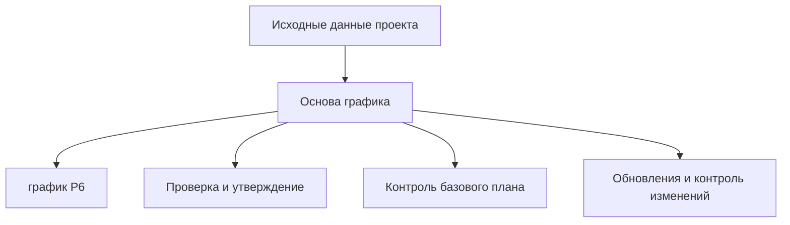

# Основа графика

Основа графика — это документ, который объясняет, как был построен график проекта и какие предположения его поддерживают. Это письменное сопровождение файла Primavera P6.

График показывает даты, логику, резерв времени, вехи, ресурсы и критический путь. Основа графика объясняет, почему эти элементы выглядят именно так.

## Для Чего Используется

Основа графика поддерживает проверку, утверждение, контроль базового плана, обновления, управление изменениями и анализ задержек. Она помогает рецензенту понять правила, предположения, исходные данные и ограничения графика.

Без него файл P6 может рассчитываться правильно, но команда может не знать, какие допущения использовались и подходит ли график для управленческих решений.

## Кто Пишет и Для Кого

Основа графика обычно готовит планировщик или инженер по планированию при участии менеджера проекта, проектирования, закупок, строительства, пусконаладки, контроля проекта, контракты и группы по затратам.

Документ адресован проектной команде, клиенту, PMO, рецензентам, аналитикам по претензиям и всем, кто должен понимать, как был построен график.

## Почему Это Важно

График содержит много решений. Календари, длительности, логика, бригады, вехи, циклы утверждения, разрешения и лимиты ресурсов влияют на даты и резерв времени.

Основа графика делает эти решения видимыми. Он снижает неоднозначность, поддерживает аудит и предотвращает будущие споры о предположениях базового плана.

## Что Должно Быть Внутри

Полная основа графика должен включать:

- Объем и исключения.
- Назначение графика и договорное использование.
- Методологию разработки графика.
- ИСР и структуру кодов операций.
- Календари, смены, праздники, погоду и нерабочие периоды.
- Ключевые допущения и ограничения.
- Вехи: начало, завершение, доступ, утверждения, поставка материалов.
- Циклы утверждений и разрешений.
- Допущения по передаче и завершению.
- Правила логики, типы связей и политика задержек.
- Основа длительностей, нормы производительности и нормы.
- Бригады, доступность ресурсов, лимиты трудозатрат и лимиты оборудования.
- Правила затрат, если применимо.
- Критический путь и объяснение почти критических путей.
- Допущения по рискам и основные неопределенности.
- Цикл обновления, правила статуса и подход к отчетности.

## Допущения

Допущения должны быть ясными и проверяемыми. Они могут включать даты доступа к площадке, выпуски проектной документации, даты поставок поставщиков, длительности согласования разрешений, периоды проверки клиентом, доступность бригад, погодные резервы и допущения по последовательности пусконаладки.

Если допущение влияет на даты, резерв времени, ресурсы или передачу, оно должно быть в основе графика.

## Календари и Рабочие Периоды

Документ должен объяснять основные календари, используемые в P6. Включите рабочие дни, смены, праздники, сезонные остановы, погодные календари, ночные работы, работы в выходные и нерабочие периоды.

Календари напрямую влияют на даты операций и резерв времени. Если проектирование, закупки, строительство, пусконаладка или ресурсы используют разные календари, объясните почему.

## Бригады, Ресурсы и Лимиты

Длительности имеют смысл только когда понятны допущения по ресурсам. Основа графика должна указать допущения по бригадам, доступность ресурсов, лимиты трудозатрат, лимиты оборудования и сверхурочную работу или стратегию сменности.

Если есть загрузка ресурсов, объясните, используется ли она для планирования трудовых ресурсов, загрузки затрат, освоенный объем или выравнивания ресурсов.

## Вехи, Утверждения, Разрешения и Передача

Основные вехи должны быть перечислены и объяснены: начало проекта, договорное завершение, предоставление доступа, утверждения клиента, интерфейсы третьих сторон, поставка материалов, разрешения, передачи систем и финальная передача.

Циклы утверждений и разрешений должны показывать предполагаемые длительности и ответственные стороны. Если действие клиента или третьей стороны управляет графиком, это должно быть видно.

## Методология, Производительность и Затраты

Основа графика должна объяснять, как был разработан график: использованные источники, рабочие совещания, логика последовательности, метод оценки длительности, нормы производительности, нормы и процесс проверки.

Если есть загрузки затрат, укажите правила. Объясните, как назначаются затраты по ресурсу, расходу, операции, ИСР, контрактному пакету или методу освоенного объема.

## Критический Путь и Риск

Основа графика должна кратко описать критический путь и объяснить, почему он разумен. Также нужно определить почти критические пути, основные риски, чувствительности графика и допущения, которые могут измениться при исполнении.

Это помогает понять не только плановую дату окончания, но и то, что ее контролирует.

## Хорошая Практика

Пишите основу графика до утверждения базового плана. Держите его согласованным с файлом P6. Обновляйте его, когда утвержденные изменения меняют ключевые допущения, календари, вехи, стратегию ресурсов или методологию.

Документ не должен быть общим текстом. Он должен быть достаточно конкретным, чтобы другой планировщик понял, как был построен график.

## Вывод

Основа графика — это объяснение графика. Он показывает, что график предполагает, как построено, что включает, что исключает и какие условия должны оставаться верными, чтобы даты оставались действительными.

Сильная основа графика делает файл P6 проще для проверки, защиты, обновления и доверия.
## Связанные материалы
- [Действия, начинающиеся с даты данных, без управляющей логики: почему этот показатель графика имеет значение - Обзор](../../metrics/01_activities_starting_in_dd_with_no_logic_driving/02_guide_template.md)
- [Коды операций](../18_ACTIVITY%20CODES/18_ACTIVITY%20CODES.md)
