Тип активности — одно из наиболее важных полей настройки в Primavera P6. Он сообщает P6, какой вид деятельности он рассчитывает и как эта деятельность должна вести себя в расписании.

Многие планировщики в первую очередь фокусируются на названиях действий, продолжительности, датах и ​​связях. Это важно, но тип деятельности также имеет значение. Действие задачи, этап, действие «Уровень усилий» и действие «Сводка WBS» ведут себя по-разному. Выбор неправильного типа может исказить даты, ход выполнения, загрузку ресурсов, плавание и отчетность.

Цель этого блога — объяснить основные виды деятельности, доступные в P6, для чего каждый из них используется и как решить, какой тип подходит для планируемой работы.

## Почему тип деятельности имеет значение

Тип операции должен соответствовать цели планирования элемента. Это реальная работа с длительностью? Это момент времени? Это резюме работы, охватывающее другие виды деятельности? Зависят ли усилия от ресурсов, а не от фиксированной продолжительности задачи?

Если тип деятельности не соответствует цели, график может запутаться. Веха с продолжительностью не является вехой. Обычная задача, используемая в качестве резюме, может скрывать логику. Уровень усилий, используемый для стимулирования работы, может исказить критический путь. Неправильно использованное ресурсозависимое действие может рассчитываться иначе, чем ожидалось.

В P6 вид деятельности помогает ответить на практический вопрос: как должен вести себя этот элемент при расчете расписания?

## Основные виды деятельности в P6

Наиболее распространенными видами активности Primavera P6 являются:

- Зависимость от задачи.
- Зависимость от ресурсов.
- Уровень усилий.
- Запустите Майлстоун.
- Завершить этап.
- Резюме WBS.

У каждого своя цель.

```mermaid
flowchart TD
    A["Что вы планируете?"] --> B{"Это момент времени?"}
    B -- "Да, начать мероприятие" --> C["Начало этапа"]
    B -- "Да, завершить мероприятие" --> D["Завершить этап"]
    B -- "Нет" --> E{"Это реальная работа с продолжительностью?"}
    E -- "Да" --> F{"Должна ли продолжительность определяться ресурсами?"}
    F -- "Нет" --> G["Зависит от задачи"]
    F -- "Да" --> H["Зависит от ресурса"]
    E -- "Нет" --> I{"Охватывает ли это другие виды деятельности?"}
    I -- "Да, поддержка" --> J["Уровень усилий"]
    I -- "Да, объединение WBS" --> K["Сводная информация по WBS"]
```

## Зависимые от задачи действия

Зависимость от задачи — наиболее распространенный тип деятельности в P6. Используйте его для обычной плановой работы, где продолжительность действия контролируется назначенным для действия календарем, а не календарями отдельных ресурсов.

Примеры включают в себя:

- Выкопать фундамент.
- Установите кабельный лоток.
- Залить бетонную плиту.
- Подготовить пакет дизайна.
- Выполните испытание давлением.

Зависимые от задачи действия обычно являются лучшим выбором для большинства задач строительства, проектирования, закупок, испытаний и ввода в эксплуатацию. Они ясны, стабильны и просты для понимания. Планировщик определяет продолжительность, назначает календарь активности, подключает логику, а P6 рассчитывает даты.

Используйте параметр «Зависит от задачи», если действие представляет собой дискретный объем работ и продолжительность работы не должна меняться в зависимости от календарей ресурсов.

## Ресурсозависимая деятельность

Ресурсозависимые действия используются, когда на продолжительность и поведение планирования должны влиять ресурсы, назначенные этому действию. В этом случае P6 может использовать календари ресурсов и доступность ресурсов для расчета планирования активности.

Это может быть полезно, когда доступность ресурсов является реальным фактором работы. Например, специализированная бригада, инспектор или оборудование могут быть доступны только в определенные дни или смены.

Примеры могут включать в себя:

- Специализированная проверка ограниченным инспектором.
- Техническая поддержка поставщиков.
- Калибровка оборудования с использованием ограниченного ресурса.
- Ресурсно-ориентированные работы по техническому обслуживанию.

Ресурсозависимые виды деятельности следует использовать с осторожностью. Если проект не активно загружает или не выравнивает ресурсы, использование Resource Dependent по привычке может создать путаницу. Во многих расписаниях по умолчанию используется параметр «Зависит от задачи», поскольку календарь действий является основной основой планирования.

Используйте параметр «Зависит от ресурсов», если ресурсы и их календари должны влиять на расчет расписания.

## Начало этапа

Начальная веха — это действие нулевой продолжительности, которое представляет собой начало события, фазы, окна доступа, авторизации или основного рабочего состояния.

Примеры включают в себя:

- Уведомление о продолжении получено.
- Доступ на территорию предоставлен.
- Начало строительства.
- Проектный пакет передан в реализацию.
- Окно запуска ввода в эксплуатацию.

Стартовые этапы не отражают выполняемую работу. Они представляют собой момент времени, который позволяет начать работу или отмечает важное стартовое событие.

Используйте стартовую точку, когда в расписании необходимо отметить начало чего-то важного. Обычно это должно быть связано с логикой, которая объясняет, что движет этой вехой и какую работу она высвобождает.

## Завершить этап

Этап завершения — это действие нулевой продолжительности, которое представляет собой завершение события, фазы, конечного результата или контрактной точки.

Примеры включают в себя:

- Механическая завершенность достигнута.
- Обмен системы завершен.
- Разрешение на получение разрешения получено.
- Существенное завершение.
- Окончательное завершение.

Вехи завершения полезны для отчетности, поскольку они отмечают достижения. Их не следует использовать в качестве обычной рабочей деятельности. Если для достижения вехи требуются усилия, эти усилия следует моделировать как задачи, ведущие к этой вехе.

Используйте этап завершения, когда в расписании необходимо отметить, что что-то завершено или достигнуто.

## Уровень усилий

Уровень усилий, часто называемый LOE, используется для действий, которые охватывают другую работу, а не непосредственно управляют проектом. Деятельность LOE обычно используется для управления, надзора, поддержки инспекций, контроля проекта или постоянной координации.

Примеры включают в себя:

- Поддержка управления проектом.
- Надзор за сайтом.
- Инженерный менеджмент.
- Управление строительством.
- Поддержка контроля качества.

Даты операции LOE обычно определяются на основе других операций. Это должно отражать усилия по поддержке, которые продолжаются, пока выполняется другая работа. Обычно он не предназначен для решения отдельных строительных или инженерных задач.

Используйте LOE, когда деятельность представляет собой постоянную поддержку, надзор или управление, которое должно охватывать группу действий.

Будьте осторожны с логикой LOE. Если LOE связан неправильно, может показаться, что он управляет датами или искажает плавающую дату. Действия LOE следует проверять во время проверок качества расписания, особенно когда они появляются на критическом пути или имеют необычные отношения FS или SF.

## Сводная информация по WBS

Действия сводки WBS обобщают группу действий внутри элемента WBS. Их даты взяты из деятельности в рамках WBS, а не из их собственной детальной логики.

Примеры включают в себя:

- Инженерное резюме.
- Резюме закупок.
- Обзор строительства района А.
- Обзор ввода в эксплуатацию системы 01.

Действия сводки WBS могут быть полезны для отчетности высокого уровня, но они не должны заменять реальные действия или логику. Это инструменты объединения, а не задачи выполнения.

Используйте действия сводки WBS, когда вам нужно представление раздела WBS на уровне сводки, и только тогда, когда метод отчетности проекта поддерживает их использование.

## Выбор правильного типа

Простое правило помогает:

- Если это реальная работа с продолжительностью, используйте Task Dependent, если только календари ресурсов не должны управлять ею.
- Если доступность ресурсов должна способствовать этому, используйте Resource Dependent.
- Если это стартовое событие, используйте Start Milestone.
- Если это событие завершения, используйте Finish Milestone.
- Если это постоянная поддержка, охватывающая другую работу, используйте Уровень усилий.
- Если это сводная отчетность, используйте сводку WBS.

Тип деятельности должен облегчить понимание расписания. Если рецензентам нужно спросить, почему веха имеет продолжительность, почему LOE стимулирует работу или почему сводка WBS отображается в подробной логике, тип действия может быть неправильным.

## Распространенные ошибки

Одна из распространенных ошибок — использование вех в качестве замены работы. Веха должна обозначать определенный момент времени. Если требуется работа, создайте мероприятия для этой работы.

Другая ошибка — использование деятельности LOE для контроля дискретной работы. LOE должен поддерживать или охватывать работу, а не подменять логику между реальными действиями.

Третья ошибка — использование Resource Dependent без процесса планирования, основанного на ресурсах. Если календари ресурсов не поддерживаются, тип деятельности может создать больше путаницы, чем пользы.

Наконец, избегайте использования действий сводки WBS вместо хорошо построенной WBS и подробной логики. Сводки полезны для отчетности, но для составления графика по-прежнему нужны реальные действия.

## Заключение

Типы действий в P6 определяют, как ведут себя действия. Это не просто ярлыки. Правильный тип активности помогает правильно рассчитать график и четко изложить его.

Зависимые от задачи действия представляют собой наиболее обычную работу. Ресурсозависимые действия полезны, когда календари ресурсов должны контролировать планирование. Вехи начала и завершения отмечают ключевые моменты во времени. Мероприятия уровня усилий представляют собой поддержку, охватывающую другую работу. Действия сводки WBS поддерживают сводную отчетность.

Выбор правильного типа деятельности упрощает просмотр и объяснение графика, а также делает его более надежным для контроля над проектом. В сильном графике есть не только хорошие даты и логика. Он также использует правильный вид деятельности для представляемого произведения.
