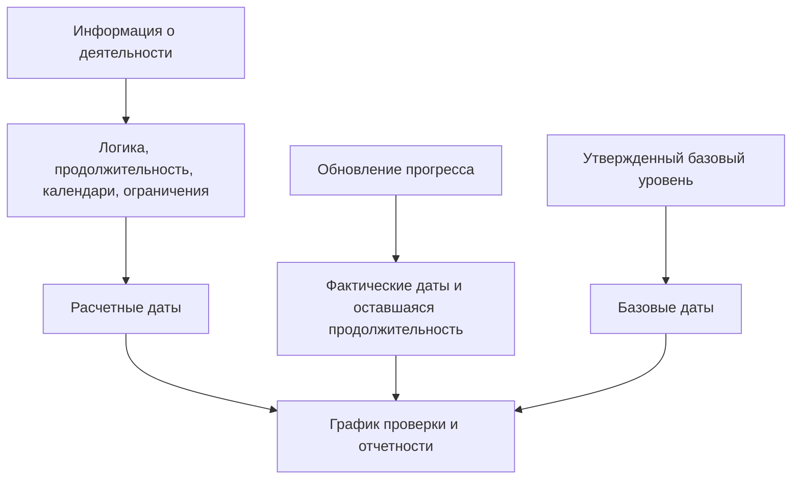

Даты в Primavera P6 могут сбивать с толку, поскольку у действия нет только одной даты начала и одной даты окончания. В нем могут быть запланированные даты, текущие даты расписания, ранние даты, поздние даты, фактические даты, базовые даты, даты ограничений, ожидаемые даты, а иногда и внешние даты или даты, связанные с прогнозом, в зависимости от макета и настроек проекта.

Эти даты не все означают одно и то же. Некоторые рассчитываются по логике CPM. Некоторые из них вводятся во время обновлений хода выполнения. Некоторые используются для сравнения. Некоторые используются для контроля или ограничения расписания. Понимание этой разницы необходимо для обеспечения качества расписания, отчетности PMO, готовности к анализу задержек и базового управления проектом.

Самый главный вопрос прост: о чем говорит мне эта дата и откуда она взялась?

## Почему у P6 так много дат

P6 — это не только список дат. Это расчетная модель. Программное обеспечение рассчитывает даты на основе продолжительности действий, календарей, отношений, ограничений, ресурсов, статуса прогресса и даты данных.

Существуют разные поля даты, поскольку планировщикам необходимо отвечать на разные вопросы:

- Каков был первоначальный план?
- Каков текущий прогноз?
- Что же произошло на самом деле?
- В какое время может начаться или закончиться действие?
- Что самое позднее можно начать или закончить, не повлияв на проект?
- Вынуждает ли ограничение выполнять деятельность?
- Насколько текущий план соотносится с базовым?

Проблема начинается, когда эти типы дат смешиваются друг с другом без понимания их назначения.

## Дата данных

Дата данных не является датой действия, но она определяет, как следует интерпретировать все даты действия.

Дата данных — это граница между фактической производительностью и прогнозируемой работой. Работа до Даты данных должна быть актуализирована или статусирована. Работы после Даты данных следует прогнозировать.

Если у действия есть фактические даты после Даты данных, это обычно является ошибкой статуса. Если открытое действие начинается точно в дату данных и не имеет логики управления, это может указывать на отсутствие последовательности. Если ожидаемое завершение наступает раньше Даты данных, это может указывать на устаревшую обновленную информацию.

Прежде чем просматривать любую дату действия, подтвердите дату данных.

## Старт и финиш

Начало и окончание — это основные даты расписания, которые большинство пользователей видят в макетах P6. Они представляют собой текущие рассчитанные или запланированные даты для действия на основе данных расписания.

Для неначатых действий Начало и Окончание являются прогнозируемыми датами. Для незавершенной деятельности они могут сочетать фактическое состояние и оставшийся прогноз. Для завершенных мероприятий они должны соответствовать фактическим датам.

Обычно это даты, используемые в отчетах, прогнозных графиках и обсуждениях с руководством. Однако их не следует принимать без проверки их логики и статуса.

Используйте «Начало» и «Окончание», чтобы ответить: когда в данный момент запланировано начало и окончание действия?

## Ранний старт и ранний финиш

Раннее начало и раннее окончание — это даты расчета цены за тысячу показов. Они показывают самые ранние даты начала и завершения действия на основе логики предшественника, календарей, ограничений и текущих условий расписания.

Ранние даты важны, поскольку они помогают объяснить дальнейший переход расчета расписания. Они показывают, как работа может перемещаться по сети, как только позволяет логика.

Если многие виды деятельности имеют ранний старт на дату данных, проверяющий должен проверить, действительно ли они готовы или являются открытыми, ограниченными или слабо связанными видами деятельности.

Используйте «Ранний старт» и «Ранний конец», чтобы ответить: в какое время может произойти это действие в соответствии с текущей сетью?

## Позднее начало и позднее окончание

Позднее начало и позднее окончание показывают самые поздние даты, когда действие может начаться или закончиться без задержки завершения проекта или контрольной точки завершения, в зависимости от настройки расписания.

Поздние даты являются частью обратного прохода. Они используются для расчета float. Разница между ранними и поздними датами помогает показать, насколько гибкой является деятельность.

Если поздние даты кажутся странными, поищите ограничения, отсутствующих преемников, открытые сроки завершения, календари или необычные настройки завершения проекта.

Используйте «Позднее начало» и «Позднее окончание», чтобы ответить: насколько поздно может быть перенесено это действие, прежде чем оно повлияет на контрольную дату завершения?

## Фактическое начало и фактическое окончание

Фактическое начало и фактическое окончание являются фактами состояния. Они должны отражать то, что на самом деле произошло на местах или в ходе реализации проекта.

Фактический старт означает, что действие действительно началось. Фактическое завершение означает фактическое завершение действия. Эти даты не следует использовать в качестве целей планирования или дат прогноза.

Фактические даты обычно должны совпадать с Датой данных или предшествовать ей. Если фактические даты после Даты данных, в графике будущая работа сообщается как уже начатая или завершенная, что снижает достоверность обновлений.

Используйте «Фактическое начало» и «Фактическое окончание», чтобы ответить: что произошло на самом деле?

## Планируемое начало и запланированное окончание

Планируемое начало и запланированное окончание часто неправильно понимаются. В зависимости от того, как расписание создается, обновляется и отображается, эти поля могут не вести себя как официально утвержденный базовый план.

Некоторые пользователи ожидают, что в запланированных датах всегда будет отображаться первоначальный план. Это не всегда безопасное предположение. Для формальных отчетов об отклонениях назначенный базовый план обычно более надежен, чем случайное использование плановых дат.

Используйте запланированное начало и запланированное окончание только в том случае, если ваша процедура управления проектом четко определяет, как они выполняются и что они означают.

## Базовое начало и базовое окончание

Базовые даты берутся из назначенного базового графика. Они используются для сравнения текущего графика с утвержденным планом.

Например, BL1 Начало и BL1 Окончание могут отображать даты начала и окончания действия из утвержденного базового плана. Текущее начало и окончание показывают последний прогноз. Разница между ними показывает дисперсию.

Базовые даты играют центральную роль в составлении отчетов об исполнении, отклонении графика, контроле изменений и подготовке анализа задержек.

Используйте «Базовое начало» и «Базовое окончание», чтобы ответить: как текущий график соотносится с утвержденным планом?

## Дата ограничения

Даты ограничений — это налагаемые элементы управления датами. Они связаны с такими типами ограничений, как «Начало», «Начало или после», «Окончание», «Окончание» или «До», «Обязательное начало» или «Обязательное окончание».

Ограничения не являются автоматически неправильными. Некоторые из них отражают реальные даты контрактов, ограничения доступа, выдачу разрешений, периоды простоев или требования владельца. Но ограничения также могут скрывать недостающую логику или навязывать нереалистичные сроки.

Жесткие ограничения, особенно обязательный старт и обязательный финиш, должны встречаться редко и документироваться.

Используйте дату ограничения, чтобы ответить: контролирует ли установленная дата эту деятельность или ограничивает ее?

## Ожидаемые даты окончания и прогнозируемые даты

Ожидаемое завершение часто используется во время обновлений, чтобы определить, когда команда проекта ожидает завершения действия. В зависимости от настроек и процедур ожидаемые даты могут влиять на то, как P6 рассчитывает или отображает даты действий.

Ожидаемое окончание может быть полезно для незавершенной работы, когда полевые команды предоставляют реалистичные ожидания завершения. Но если его не поддерживать, он может устареть. Ожидаемое завершение до даты данных является распространенным предупреждающим знаком.

В некоторых проектах для отчетов также используются поля дат, связанные с прогнозами, или определяемые пользователем поля. Ключевым моментом является их четкое определение, чтобы команда знала, рассчитываются ли они, вводятся вручную или импортируются.

Используйте ожидаемые или прогнозируемые даты, чтобы ответить: каковы последние ожидания команды и контролируется ли это определенной процедурой обновления?

## Даты первичного и вторичного ограничения

P6 может содержать более одного условия ограничения для действия, в зависимости от выбранных полей ограничений. Первичное ограничение обычно является основным, отображаемым в стандартных макетах, но вторичное ограничение также может влиять на интерпретацию.

Во время просмотра расписания не смотрите только на начало и окончание. Добавьте в макет поля типа ограничения и даты ограничения. Если даты ведут себя не так, как ожидалось, в первую очередь следует проверить ограничения.

## Какие даты следует использовать?

Используйте каждую дату по назначению:

- Используйте «Начало» и «Окончание» для прогноза текущего расписания.
- Используйте ранние и поздние даты, чтобы понять расчет цены за тысячу показов и плавающую дату.
- Используйте фактические даты для завершенных или начатых работ.
- Используйте базовые даты для отклонения от утвержденного плана.
- Используйте даты ограничений, чтобы определить налагаемые элементы управления датами.
- Используйте поля ожидаемого окончания или прогноза только в том случае, если они определены процедурой обновления.
- Используйте дату данных, чтобы отделить фактическую производительность от прогнозной работы.

## Распространенные ошибки

Одна из распространенных ошибок – сравнение неправильных дат. Например, сравнение текущего начала с запланированным началом может не иметь смысла, если запланированные даты не контролируются процедурой проекта.

Еще одна ошибка — рассматривать фактическое начало как прогноз. Фактические даты должны отражать реальные результаты, а не намерения.

Третья ошибка — игнорирование времени суток. P6 хранит даты со временем, и календарные различия могут создавать явные однодневные сдвиги или преподносить сюрпризы.

Наконец, избегайте сокрытия дат ограничений. Если дата навязана, рецензенты должны ее видеть.

## Заключение

Даты в P6 имеют большое значение, поскольку они рассказывают разные части расписания. Текущие даты показывают прогноз. Ранние и поздние даты объясняют расчет цены за тысячу показов. Фактические даты фиксируют то, что произошло. Базовые даты поддерживают сравнение. Даты ограничений свидетельствуют о введенном контроле. Ожидаемые даты могут поддерживать обновления, если они поддерживаются должным образом.

Тщательный пересмотр расписания не задает только вопрос: «Какая дата?» Он спрашивает: «Что это за дата, откуда она взялась и заслуживает ли она доверия?»

Когда команда проекта понимает значение каждого поля даты, график становится легче объяснять, его легче проверять и он становится более надежным для управления проектом.
