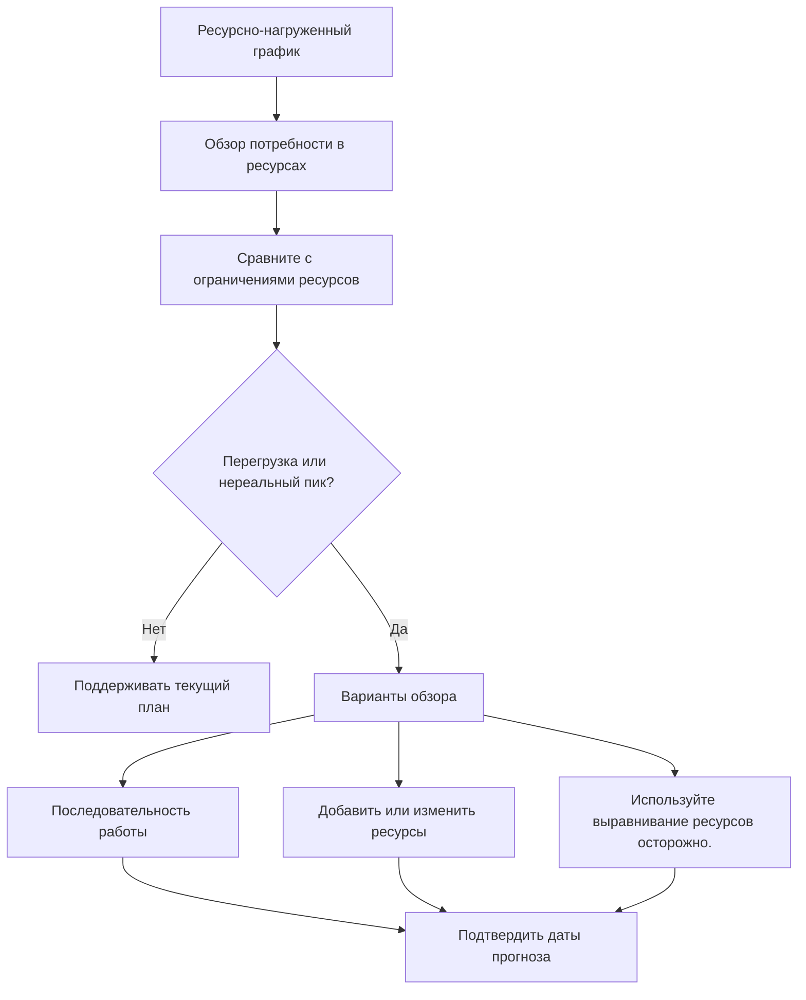

Балансировка ресурсов в Primavera P6 — это процесс сопоставления потребности в ресурсах с доступной мощностью и корректировки плана таким образом, чтобы работу можно было выполнить с использованием имеющихся ресурсов. Это помогает команде проекта понять, является ли график только логически правильным или практичным с точки зрения ресурсов.

При ежедневном планировании люди часто используют слова «балансировка ресурсов» и «выравнивание ресурсов», как будто они означают одно и то же. Они родственны, но не совсем тождественны.

Балансировка ресурсов — это более широкий анализ планирования. Он включает в себя изучение гистограмм, профилей ресурсов, доступности экипажа, потребности в оборудовании, пиков рабочей силы и реалистичности плана.

Выравнивание ресурсов — это функция P6, которая может перемещать действия в зависимости от доступности ресурсов и настроек выравнивания.

Эта функция может быть полезной, но ее следует использовать с контролем. P6 может рассчитать выровненный результат, но планировщик должен решить, имеет ли этот результат смысл для проекта.

## Что такое балансировка ресурсов

Балансировка ресурсов задает практический вопрос: может ли проект выполнить этот график с теми ресурсами, которые у него фактически есть?

График может иметь хорошую логику, приемлемые даты и разумный критический путь. Но если для работы в слишком многих местах одновременно потребуется одна и та же ограниченная команда или оборудование, этот план может оказаться нереалистичным.

Балансировка ресурсов означает анализ этого спроса и принятие решения о том, как им управлять.

Возможные действия включают в себя:

- Перенос некритической работы.
- Добавление ресурсов.
- Разделение работы на разные бригады или участки.
- Изменение последовательности действий.
- Использование сверхурочной или посменной работы.
- Корректировка календарей.
- Обновление лимитов ресурсов.
- Принятие временного пика, если он реалистичный и одобренный.

Цель не состоит в том, чтобы сделать гистограмму идеально плоской. Реальные проекты имеют пики и спады. Цель состоит в том, чтобы убедиться, что потребность в ресурсах понятна, достижима и соответствует плану выполнения.

## Почему это важно

Балансировка ресурсов имеет важное значение, поскольку расписание должно поддерживать выполнение, а не только расчеты.

Если на следующей неделе по плану требуется 50 сварщиков, а подрядчик может предоставить только 30, график показывает спрос, который невозможно удовлетворить. Если для двух критически важных операций одновременно требуется один и тот же кран, возможно, хотя бы один из них придется переместить. Если для всех работ по инженерной экспертизе требуется один и тот же специалист, узкое место может возникнуть еще до начала строительства.

Без балансировки ресурсов проект может полагать, что у него больше возможностей, чем есть на самом деле.

Это может повлиять на:

- Перспективное планирование на ближайшую перспективу.
- Прогнозы по кадрам.
- Планирование оборудования.
- Критический путь доверия.
- Прогнозы освоенного объема.
- Кривые затрат и денежных потоков.
- Обязательства по прогрессу.
- Планы восстановления.

Балансировка ресурсов помогает связать график CPM с реальной мощностью на местах и ​​в офисах.

## Балансировка ресурсов против выравнивания ресурсов

Балансировка ресурсов — это деятельность по управлению и планированию.

Выравнивание ресурсов — это расчет планирования.

Это различие важно. Планировщик может сбалансировать ресурсы вручную, просматривая гистограммы и корректируя график на основе знаний о проекте. Выравнивание ресурсов P6 также может помочь, автоматически откладывая действия, когда спрос на ресурсы превышает доступность.

Оба подхода могут быть полезны.

Ручная балансировка предпочтительнее, когда планировщику требуется суждение, ввод данных на местах, проверка технологичности или тщательный контроль над тем, какие действия перемещаются.

Выравнивание ресурсов P6 полезно, когда данные о ресурсах надежны, ограничения ресурсов определены, календари верны, а планировщик хочет проверить, как меняется расписание при принудительной доступности ресурсов.

Уравнивание не должно заменять суждение о планировании. Оно должно это поддерживать.

## Что нужно P6 перед прокачкой

Перед использованием функции выравнивания ресурсов P6 расписание должно быть готово к анализу ресурсов.

Как минимум проверьте:

- Действия имеют значимые назначения ресурсов.
- Ресурсные единицы отражают реальный спрос.
- Ограничения ресурсов отражают реальную доступность.
- Календари ресурсов верны.
- Календари активности верны.
- Логика достаточно полна, чтобы поддерживать решения по планированию.
- Ограничения понятны.
- Приоритеты определены или пересмотрены.
- Текущее расписание было сохранено, чтобы можно было сравнить выровненный результат.

Если эти предметы слабы, прокачка может дать результат, который выглядит точным, но бесполезен.

Например, если все строительные работы назначены на один общий ресурс «строительная бригада», P6 может показать перегрузку ресурса, но результат может не сказать проекту, является ли проблема общестроительной, трубопроводной, электрической или механической. Настройка ресурса должна соответствовать плановому решению.

## Как P6 использует выравнивание ресурсов

При выравнивании ресурсов P6 проверяется назначение и доступность ресурсов. В зависимости от настроек это может привести к задержке действий по уменьшению или устранению перераспределения ресурсов.

При расчете могут учитываться ограничения ресурсов, логика активности, резерв, календари, приоритеты и варианты выравнивания. Точный результат зависит от того, как настроен проект.

На практике P6 ищет ситуации, когда потребность в ресурсах превышает их доступность, а затем пытается перенести действия на даты, когда ресурсы доступны.

Это может создать более осуществимый с точки зрения ресурсов график, но также может изменить критический путь, задержать этапы или переместить работу в сторону, требующую пересмотра.

После выравнивания планировщик должен сравнить результат с исходным прогнозом:

- Какие виды деятельности переместились?
- Какие вехи изменились?
- Изменился ли критический путь?
- Использовал ли при выравнивании доступный резерв или задержал завершение проекта?
- Возможны ли новые даты?
- Решил ли результат проблему с ресурсами или создал еще одну?

Выровненный график не следует принимать слепо.

## Когда использовать балансировку ресурсов

Используйте балансировку ресурсов всякий раз, когда доступность ресурсов влияет на выполнение.

Это особенно полезно в:

- Графики строительства с ограничениями по бригаде.
- Отключения, остановки и простои.
- Планы ввода в эксплуатацию с ограниченным количеством специалистов.
- Инженерные графики с общими рецензентами.
- Проекты с дорогим или общим оборудованием.
- Программы, в которых один пул ресурсов поддерживает несколько проектов.
- Планы восстановления, в которых рассматриваются дополнительные ресурсы.

Балансировка ресурсов также полезна перед утверждением базового плана. Базовый уровень, предполагающий нереальную доступность рабочей силы или оборудования, впоследствии может оказаться трудным для защиты.

Во время обновлений балансировка ресурсов помогает подтвердить, можно ли выполнить оставшуюся работу с помощью текущей команды и оборудования.

## Когда быть осторожным

Будьте осторожны, если данные ресурсов не сохраняются.

Если фактические единицы не обновляются, кривые ресурсов могут отклоняться от реальности. Если ресурсы выделяются только для покрытия затрат, единицы могут не отражать реальную мощность. Если календари неправильные, доступность ресурсов тоже может быть неправильной.

Также будьте осторожны при использовании выравнивания ресурсов по контрактному или базовому графику. Выравнивание может перемещать даты и влиять на плавающий объем. Команда должна понимать, является ли выравниваемый график официальным планом, сценарием «что, если» или внутренним представлением планирования.

Прокачка также может скрыть логические слабости. Если действие перемещается из-за выравнивания, рецензенты могут упустить из виду, что исходная логика была неполной или неправильной. Всегда сначала проверяйте логику, а затем ресурсы.

## Как использовать это на практике

Начните с определения наиболее важных ресурсов. Не пытайтесь сбалансировать каждый второстепенный ресурс с одинаковым уровнем детализации. Сосредоточьтесь на ключевых бригадах, критически важных специалистах, общем оборудовании и ресурсах, которые могут повлиять на основные этапы.

Затем просмотрите профиль ресурса или гистограмму на P6. Ищите пики, перегрузки, провалы и внезапные изменения спроса.

Сравните спрос с ограничениями ресурсов. Если спрос превышает лимит, обсудите проблему с ответственной командой. Ответ может быть оперативным, а не только планированием.

Далее определитесь со способом коррекции:

- Если лимит ресурсов неправильный, обновите лимит ресурсов.
- Если потребность в ресурсах неверна, исправьте назначение.
- Если последовательность нереалистична, скорректируйте логику или время действий.
- Если перегрузка реальна, решите, следует ли добавлять ресурсы, использовать сверхурочную работу, перемещать работу или соглашаться на пиковую нагрузку.
- Если автоматическое выравнивание подходит, запустите его как контролируемый сценарий и сравните результат.

Сохраните копию невыровненного расписания перед запуском выравнивания ресурсов. Это дает команде ориентир и помогает объяснить, что изменилось.

## Хорошая практика

Используйте балансировку ресурсов как часть проверки расписания, а не как разовую очистку.

Просматривайте кривые ресурсов во время базовой разработки, основных прогнозов, планирования восстановления и регулярных циклов обновления.

Не стоит нивелировать некачественный график и ожидать, что результат станет достоверным. Сначала исправьте логику, календари, статус активности, оставшуюся продолжительность и назначения ресурсов.

Настройки выравнивания документа при использовании функции P6. Выравнивание ресурсов может давать разные результаты в зависимости от выбранных параметров, поэтому параметры являются частью записи расписания.

Самое главное, согласуйте план ресурсов с людьми, которым принадлежит работа. Команда проекта должна подтвердить, достижимы ли пики ресурсов, практична ли последовательность действий и действительно ли доступны дополнительные ресурсы.

## Заключение

Балансировка ресурсов в P6 помогает команде проекта проверить, можно ли выполнить график с имеющимися ресурсами. Он связывает даты и логику с рабочей силой, оборудованием, наличием специалистов и реальными производственными мощностями.

Выравнивание ресурсов P6 может поддержать этот анализ, перемещая действия в зависимости от доступности ресурсов, но его следует использовать осторожно и проверять после расчета.

Сбалансированный график – это не обязательно идеально ровный график. Это график, в котором потребность в ресурсах видна, реалистична и соответствует тому, как проект будет фактически реализован.
