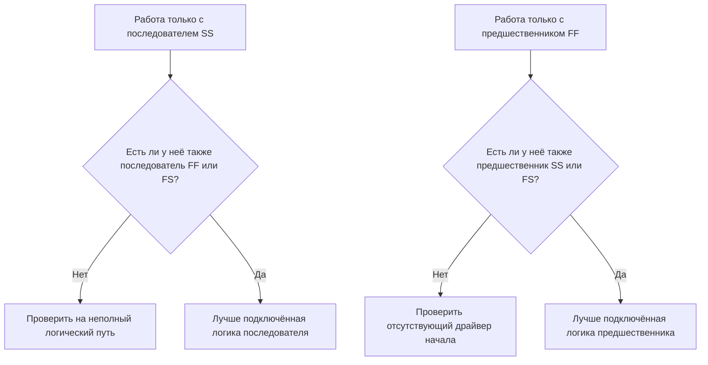

Логика — это математическое представление последовательности и зависимостей внутри расписания проекта. Она объясняет, что должно происходить до чего, какие работы могут выполняться одновременно и как команда намерена продвигаться от первой работы к финальному завершению.

В хорошем расписании Primavera P6 логика — это не украшение. Это движущий механизм, который позволяет расписанию рассчитывать даты, резерв времени, критический путь и движение прогноза. Она рассказывает историю выполнения способом, который можно проверять, оспаривать и совершенствовать.

Если расписание говорит «залить фундаменты, затем возвести стены, затем построить крышу», логика — это то, что превращает эту последовательность в вычислимую сеть. Плановик не просто рисует временну́ю шкалу. Плановик определяет путь поставки.

## Логика рассказывает историю работ

У каждой команды проекта есть намеченный способ выполнения проекта. Проектирование может выпускать документацию по участкам. Закупки могут поставлять оборудование пакетами. Гражданское строительство может подготавливать доступ до начала конструктивных работ. Механическая готовность может быть необходима до начала ввода в эксплуатацию.

Логические связи — это математическое выражение этого плана.

Эта простая диаграмма — не просто последовательность. Это модель принятия решений. Если фундаменты опаздывают, стены могут опоздать. Если стены опаздывают, крыша может опоздать. Если крыша опаздывает, внутренние работы могут пострадать. Расписание может показать это влияние только при наличии логики.

Надёжная логика означает, что расписание может объяснить, почему работы начинаются, почему они завершаются и что происходит, когда одна часть плана сдвигается.

## Почему надёжная логика важна на дату данных

Метрика «Работы, начинающиеся на дату данных без управляющей логики» — это строгий тест качества расписания.

Дата данных — это граница между фактическим выполнением и прогнозируемыми работами. Когда работа начинается точно на дату данных, проверяющий должен задать простой вопрос: что управляет этим началом?

Если у работы есть действительная логика предшественника, расписание может объяснить начало. Возможно, участок был передан. Возможно, поставка материала была завершена. Возможно, предшествующая работа закончилась и позволила следующей бригаде приступить.

Если у работы нет управляющей логики, начало слабее. Работа может находиться на дате данных потому, что у неё нет предшественника, потому что логика неполна, потому что ограничение принуждает её, или потому что актуализация была выполнена не полностью.

Вот почему важна надёжная логика. Расписание не должно позволять работе казаться готовой просто потому, что дата данных сдвинулась. Оно должно показывать реальное условие, позволяющее работе начаться.

## Баланс: достаточно логики, но без избыточности

Хорошая логика сбалансирована. Расписание нуждается в достаточном количестве связей, чтобы правильно соединять работы с предшественниками и последователями. При этом следует избегать избыточной логики, которая повторяет одну и ту же зависимость ненужными способами.

Слишком мало логики создаёт открытые начала, открытые окончания, ненадёжный резерв и слабые результаты критического пути. Слишком много логики может усложнить проверку сети и скрыть истинный драйвер работы.

Цель — не максимизировать количество связей. Цель — чётко представить обязательные и требуемые зависимости.

Для каждой работы плановик должен быть в состоянии ответить:

- Что позволяет этой работе начаться?
- Что эта работа разблокирует следующим?
- Какая связь действительно управляет работой?
- Есть ли дублирующие или ненужные связи?
- Поймёт ли проверяющий намеченную последовательность?

Этот баланс занимает центральное место в проверках расписания ПМО. Плотная сеть — это не автоматически сильная сеть. Лёгкая сеть — это не автоматически чистая сеть. Правильная сеть объясняет план выполнения без лишнего.

## Каждая работа нуждается в драйвере начала

Надёжная логика означает, что у каждой работы есть предшественник, разрешающий или запускающий её начало, за исключением обоснованных исключений для начала проекта или внешне авторизованных работ.

Для строительной работы драйвером начала может быть допуск к участку, завершение предшествующей работы, наличие материала, выпуск проектной документации, согласование разрешений или завершение предшествующего подряда. Для закупочной работы это может быть согласование проектной документации или выпуск заказа на покупку. Для работ по вводу в эксплуатацию — механическая готовность, готовность пакета испытаний или пуск системы.

Когда этот драйвер начала отсутствует, работа может занять искусственное положение в расписании. При актуализациях она может появляться на дате данных. Это создаёт ложное ощущение готовности.

Рассмотрим работу «Монтаж насосов». Если она начинается на дату данных, но не имеет предшественника по завершению фундамента, поставке насосов или передаче участка, расписание не объясняет, почему монтаж может начаться. Работа может быть запланирована, но логика не является надёжной.

## Связи SS и FF — это «половинные» связи

Связи «начало-начало» (Start-to-Start, SS) и «окончание-окончание» (Finish-to-Finish, FF) полезны, но их следует использовать осторожно. Во многих проверках расписания их лучше всего рассматривать как «половинные» связи, поскольку сами по себе они не помещают работу в полный логический путь.

Связь SS может объяснить, когда работа может начаться, но не объясняет, когда она должна завершиться или что она передаёт. Связь FF может объяснить выравнивание окончаний, но не объясняет, когда работа может начаться.

Это не делает SS или FF ошибочными. Перекрывающиеся работы распространены и часто реалистичны. Проблема в том, полностью ли подключена работа.

Например:

- Работа с последователем SS обычно должна также иметь последователя FF или FS.
- Работа с предшественником FF обычно должна также иметь предшественника SS или FS.

Это помогает предотвратить подключение работ только с одной стороны их продолжительности. Расписание должно объяснять как то, как работа начинается, так и то, как работа завершается.

## Надёжная логика на практике

Практическая проверка логики должна начинаться с работ вблизи даты данных, критических и около-критических работ, а также основных путей передачи. Именно эти области оказывают наибольшее влияние на текущее принятие решений.

В P6 полезные столбцы проверки включают идентификатор работы, наименование работы, WBS, дату начала, дату окончания, статус работы, общий резерв, предшественников, последователей, тип связи, запаздывание, ограничения, календарь и индикаторы управляющих связей при наличии.

Для каждой работы, начинающейся на дату данных, спросите:

- Действительно ли работа готова к началу?
- Какой предшественник разрешает начало?
- Этот предшественник завершён, выполняется или прогнозируется?
- Является ли связь управляющей?
- Заменяют ли ограничение или ожидаемая дата логику?
- Имеет ли работа также действительную логику последователя?

Если ответ неясен, работа должна быть рассмотрена с ответственным владельцем. Корректировка может включать добавление отсутствующего предшественника, изменение типа связи, удаление ограничения, актуализацию фактических данных или документирование обоснованного исключения.

## Избегайте искусственной логики

Одна ошибка — добавлять связи только для прохождения метрики. Это не создаёт надёжную логику. Это создаёт искусственную логику.

Связи должны представлять реальные зависимости. Если связь не отражает строительную последовательность, выпуск проектной документации, потребность в закупках, доступ на объект, согласование, испытания, ввод в эксплуатацию или передачу, она может не принадлежать сети.

Другая ошибка — оставлять избыточную логику, потому что она кажется более надёжной. Если та же зависимость уже представлена более чёткой связью, дополнительные связи могут запутать критический путь и затруднить аудит сети.

Надёжная логика ясна, целенаправленна и обоснована.

## Заключение

Логика — это математическая история того, как будет выполняться проект. Она определяет, что должно происходить сначала, что может происходить вместе и что следует далее.

Надёжная логика не означает добавление как можно большего количества связей. Это означает добавление правильных связей: достаточно, чтобы соединить каждую работу с реальными предшественниками и последователями, но не настолько много, чтобы сеть стала избыточной или вводящей в заблуждение.

Когда работы начинаются на дату данных без управляющей логики, расписание обнажает слабость в этой истории. Работа может отображаться как готовая, но сеть не объясняет, почему.

Надёжное расписание должно чётко отвечать на этот вопрос. Что позволяет этой работе начаться? Что она разблокирует следующим? Если расписание может ответить на оба вопроса, логика становится надёжной. Если нет, команде проекта предстоит ещё поработать над последовательностью, прежде чем прогнозу можно доверять.
