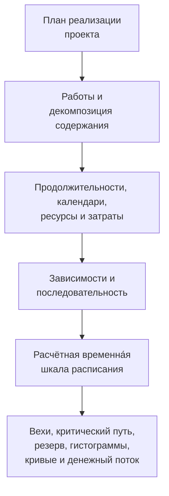

Расписание проекта — это нечто большее, чем список дат. Это графическое и логическое представление плана реализации проекта. Оно объясняет, как будет выполняться проект от начала до конца, как связаны пакеты работ, когда должны быть достигнуты ключевые вехи и какой информацией должна руководствоваться команда при принятии решений.

Проще говоря, расписание превращает план проекта в дорожную карту. Оно помогает всем участникам понять, что нужно сделать, когда это нужно сделать и кто несёт ответственность за выполнение. Для руководителей проектов, плановиков, строительных бригад, инженеров, специалистов по закупкам и аналитиков ПМО расписание становится одним из главных инструментов координации и контроля.

Расписание — это временна́я шкала, но не только она. Слабое расписание может показывать даты. Сильное расписание объясняет, почему эти даты достоверны.

## Расписание как дорожная карта поставки

Каждый проект начинается с намерения. Команда знает, что нужно сдать: здание, объект, промышленную систему, остановочный ремонт, инфраструктурный актив или пакет работ. Но для реализации недостаточно знать конечную цель. Команда должна понимать последовательность.

Что делается в первую очередь? Что может выполняться параллельно? Что должно ждать согласования проектной документации, поставки материалов, доступа на объект, выдачи разрешений, испытаний или сдачи? Какие работы определяют дату окончания? Какие вехи наиболее важны для заказчика?

Расписание отвечает на эти вопросы, преобразуя план в работы, продолжительности, зависимости, календари, ресурсы, затраты и вехи.

Графическая временна́я шкала полезна тем, что люди видят работу. Сеть логических связей полезна тем, что программа может рассчитать работу. Вместе они позволяют расписанию быть одновременно инструментом коммуникации и инструментом контроля.

## Исходные данные для расписания

Расписание настолько надёжно, насколько надёжна информация, использованная для его построения. В Primavera P6 расписание формируется на основе нескольких ключевых источников данных.

Первый источник — перечень работ. Работы разбивают проект на управляемые части. Каждая работа должна быть достаточно чётко определена, чтобы её можно было планировать, отслеживать и измерять.

Второй источник — детерминированная продолжительность. Это плановое рабочее время, необходимое для выполнения каждой работы. Продолжительность должна отражать метод выполнения, допущения о производительности, численность бригады, условия доступа, ограничения на рабочей площадке и условия проекта.

Третий источник — логика зависимостей. Зависимости объясняют, как работы связаны друг с другом. Одна работа может завершиться до того, как начнётся другая. Две работы могут начинаться одновременно. Два завершения могут совпадать. Эти связи создают сеть МКП (метода критического пути).

Четвёртый источник — последовательность. Последовательность — это практический порядок выполнения. Она учитывает технологичность строительства, поток проектирования, сроки закупок, доступ на объект, логику ввода в эксплуатацию, стратегию сдачи и приоритеты заказчика.

Пятый источник — ресурсы и затраты. Ресурсное планирование позволяет расписанию отражать потребности в труде, технике и материалах во времени. Загрузка затратами позволяет расписанию поддерживать денежный поток, освоенный объём и финансовое прогнозирование.

Когда эти источники данных полны и реалистичны, расписание может давать полезные результаты.

## Что сообщает расписание

Хорошо построенное расписание сообщает общую продолжительность проекта. Оно показывает плановые вехи завершения и промежуточные результаты. Оно формирует гистограммы ресурсов, показывающие, когда возрастает и снижается потребность в труде или технике. Оно поддерживает кривые освоения, кривые денежного потока, отчётность по освоенному объёму и краткосрочное планирование.

Самое важное — расписание определяет критический путь или наидлиннейший путь. Это цепочка работ, которая определяет дату окончания проекта. Если работы на этом пути сдвигаются, дата завершения проекта может тоже сдвинуться. Именно поэтому логика так важна. Без надлежащих зависимостей критический путь может не показывать реальные факторы, управляющие проектом.

Резерв времени (float) — ещё один важный результат. Резерв показывает, сколько гибкости имеет работа до того, как она затронет другую работу или дату окончания проекта. Но резерв имеет смысл только тогда, когда сеть расписания полна. Если в работах отсутствует логика, резерв может выглядеть лучше или хуже действительности.

## Почему логика делает временну́ю шкалу достоверной

Именно здесь метрика «Работы, начинающиеся на дату данных без управляющей логики», приобретает значение.

Дата данных (Data Date) в P6 — это граница между фактическим выполнением и прогнозом. Всё, что предшествует дате данных, должно отражать то, что уже произошло. Всё, что следует за датой данных, должно представлять план на дальнейший период.

Когда работы начинаются точно на дату данных без управляющей логики, расписание подаёт предупреждающий сигнал. Может казаться, что работа готова начаться немедленно, но расписание не в состоянии объяснить, почему. Возможно, нет предшественника, указывающего на доступность участка; нет связи с поставкой материалов; нет привязки к согласованию проектной документации; нет связи с выпуском разрешения на инспекцию; нет логики от предшествующих работ.

Это важно, потому что расписание не должно просто помещать работу на дату. Оно должно объяснять путь к этой дате.

Если работа начинается на дату данных потому, что все необходимые предшествующие работы завершены и логика поддерживает начало, эта дата обоснована. Если работа начинается там потому, что она открыта, не управляется, ограничена или плохо актуализирована, дата слаба. Команда проекта может считать, что работа готова, тогда как реальные разрешающие условия не смоделированы.

## Практический пример

Представьте расписание проекта с датой данных 01 июня. После актуализации несколько работ начинаются 01 июня:

- Монтаж кабельных лотков в зоне Б.
- Начало гидравлических испытаний трубопроводов.
- Начало центровки оборудования.
- Мобилизация бригады по тепловой изоляции.

На первый взгляд краткосрочный план выглядит насыщенным и готовым к исполнению. Но когда плановик проверяет логику, проблема становится очевидной. Монтаж кабельных лотков не связан с поставкой материалов. Гидравлические испытания не привязаны к завершению монтажа трубопроводов. В центровке оборудования отсутствует предшественник по механической готовности. Мобилизация бригады по тепловой изоляции не имеет предшественника по допуску на объект.

Расписание показывает работы на дату данных, но не объясняет, почему они могут начаться. Это ненадёжная дорожная карта — это список ближайших намерений.

Исправление заключается в добавлении или корректировке реальной логики МКП. Если поставка материалов управляет монтажом кабельных лотков — добавьте связь. Если завершение монтажа трубопроводов управляет гидравлическими испытаниями — добавьте связь. Если допуск на объект управляет тепловой изоляцией — смоделируйте это условие. После пересчёта некоторые работы по-прежнему могут начинаться вблизи даты данных, но теперь расписание сможет объяснить, почему.

## Каким должно быть хорошее расписание

Хорошее расписание должно помогать команде видеть план, проверять план и управлять планом.

Оно должно показывать, что нужно сделать. Оно должно объяснять порядок работ. Оно должно определять, кому и когда нужно действовать. Оно должно выявлять критический путь. Оно должно поддерживать ресурсное планирование, измерение прогресса, прогнозирование денежного потока и отчётность ПМО.

Оно также должно делать слабые места видимыми. Отсутствующая логика, жёсткие ограничения, устаревшие даты, открытые начала, открытые окончания и работы, скапливающиеся на дате данных, — это не просто технические проблемы. Они влияют на то, как команда проекта понимает готовность, риски и контроль.

## Заключение

Расписание — это план реализации проекта, выраженный во времени, логике и измеримых работах. Это дорожная карта, модель расчётов и инструмент коммуникации.

Когда расписание построено хорошо, оно сообщает команде, что нужно сделать, когда это нужно сделать и почему даты достоверны. Когда работы начинаются на дату данных без управляющей логики, эта достоверность ослабевает. Расписание перестаёт объяснять план и начинает угадывать следующий шаг.

По этой причине проверки качества расписания всегда должны задавать простой вопрос: объясняет ли расписание, почему работа начинается именно тогда, когда начинается? Если ответ «да», расписание выполняет свою функцию. Если ответ «нет», дорожная карта нуждается в дополнительной логике, прежде чем ей можно доверять.
