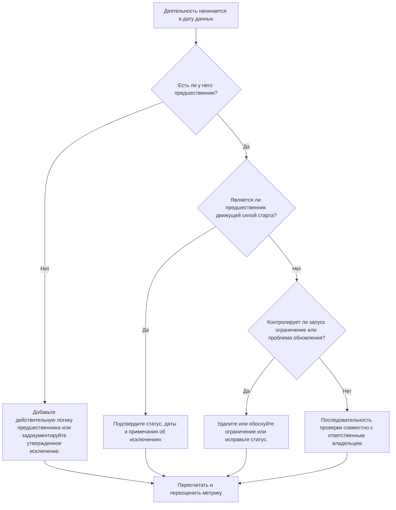

# Действия, начинающиеся с даты данных, без управляющей логики - Руководство по улучшению

## Цель

Это руководство помогает планировщикам и группам управления проектами сократить или исключить действия, начало которых запланировано на дату данных Primavera P6 без действующей логики предшественника, определяющей запуск. Это относится к плановым проверкам качества, проверкам работоспособности PMO и проверке цикла обновлений.

Цель состоит в том, чтобы подтвердить, что краткосрочная работа поддерживается четкой логикой CPM и что деятельность не начинается в дату данных только из-за отсутствия связей, ограничений, дат, установленных вручную, или неполных обновлений о ходе выполнения.

## Прежде чем начать

Прежде чем предпринимать действия, соберите следующую информацию:

- Текущий результат оценки для этого показателя.
- Данные проекта Дата, использованная в последнем расчете графика.
- Список открытых или неначатых активностей с датой начала, равной дате данных.
- Подробности отношений предшественника и преемника для каждого действия.
- Ограничения, ожидаемые даты, фактические даты и назначения календаря.
- Параметры планирования P6, используемые для обновления, включая сохраненную логику или настройки переопределения прогресса, где это необходимо.
- Любые утвержденные исключения, такие как действия по запуску проекта, этапы внешнего интерфейса или запуски по указанию владельца.

## Поймите свой результат

Хорошим результатом является отсутствие нерешенных действий, начиная с даты данных, без использования предшествующей логики. Это означает, что текущая и ближайшая работа связана с сетью графика, и дата данных не скрывает отсутствующую последовательность.

Приемлемый результат может включать небольшое количество задокументированных исключений. Их следует рассматривать и утверждать, а не игнорировать. Например, этап уведомления о продолжении или действие, санкционированное извне, может не нуждаться в обычном предшественнике, но причина должна быть видна проверяющим.

Слабый результат означает, что в дату данных начинается несколько видов деятельности без четкой логической мотивации. Это может указывать на открытые начала, отсутствие связей предшественников, чрезмерные ограничения, неполные обновления хода выполнения или действия, последовательность которых не была должным образом изменена после последнего обновления.

## Цель улучшения

Целью является 0 неразрешенных действий, начиная с Даты данных, без действительной логики движения.

Целью улучшения является не только уменьшение количества. Более глубокая цель — убедиться, что каждое действие вблизи Даты данных имеет обоснованную причину для начала прогноза. После исправления каждое затронутое действие должно иметь либо соответствующую логику предшественника, либо документированное исключение, либо исправленное условие статуса/даты.

## План действий

### Шаг 1: Определите основную проблему

Создайте макет или отчет P6, который фильтрует открытые или неначатые действия с датой начала, равной дате данных. Включите столбцы для идентификатора действия, имени действия, ИСР, начала, окончания, статуса, общего резерва, календаря, основного ограничения, предшественников, преемников и индикаторов движущих связей, если таковые имеются.

Просмотрите каждое задание и спросите:

- Есть ли у данного мероприятия предшественники?
- Если предшественники существуют, действительно ли они положили начало?
- Действие удерживается или перемещается из-за ограничения?
- У действия отсутствует фактическое начало или обновление прогресса?
- Является ли действие допустимым исключением, например, вехой начала проекта?
- Относится ли деятельность к области ИСР, где логика обычно слаба?

Сгруппируйте результаты по практическим причинам: отсутствующие предшественники, неработающие предшественники, ограничения или ожидаемые даты, ошибки обновления/статуса или утвержденные исключения.

### Шаг 2. Примените рекомендуемые исправления

Начните с отсутствующей или слабой логики. Добавьте действительные связи-предшественники, которые представляют реальную последовательность работы, например отношения «окончание-начало», «начало-начало» или «окончание-окончание», где это необходимо. Избегайте добавления отношений только для удовлетворения метрики; каждая взаимосвязь должна отражать реальную зависимость от строительства, проектирования, закупок, доступа, утверждения или передачи.

Далее рассмотрим ограничения. Если деятельность начинается в дату данных из-за ограничения начала, подтвердите, оправдано ли это ограничение с точки зрения контракта или с операционной точки зрения. Удалите ненужные ограничения и позвольте деятельности управляться логикой. Если ограничение допустимо, задокументируйте причину и подтвердите, что оно не искажает критический путь.

Проверьте статус прогресса. Если работа уже началась, правильно обновите фактическое начало и оставшуюся продолжительность. Если работа не началась, подтвердите, что начало прогноза должно оставаться на дате данных. Действие не должно выглядеть готовым к запуску только потому, что цикл обновления перенес его на текущую дату.

После внесения изменений пересчитайте график и еще раз просмотрите затронутые действия. Убедитесь, что дата начала теперь определяется логикой, имеет правильный статус или задокументирована как утвержденное исключение.

### Шаг 3. Удалите распространенные блокировщики

Распространенными препятствиями являются неясная обратная связь с места работы, отсутствие информации об интерфейсе и давление, требующее, чтобы ближайшая работа выглядела готовой. Устраните их, рассмотрев затронутые действия вместе с руководителями дисциплин, менеджерами по строительству, владельцами закупок или менеджерами пакетов.

Еще одним распространенным препятствием является неправильное использование ограничений вместо логики. В некоторых случаях могут потребоваться ограничения, но они не должны заменять сеть графиков. Если ограничение сохраняется, задокументируйте, почему оно существует и как оно влияет на резерв времени и на самый длинный путь.

Также проверьте, вызвана ли проблема настройками расчета графика или методами обновления. Если переопределение прогресса, сохраненная логика, неупорядоченный прогресс или неполная актуализация влияют на результат, согласуйте метод обновления с процедурой управления проектом, прежде чем переоценивать метрику.

### Шаг 4. Подтвердите изменения

Подтвердите исправленный график перед следующей оценкой. Повторно запустите фильтр для открытых или неначатых действий, начинающихся с даты данных, без движущейся логики. Убедитесь, что каждый оставшийся элемент либо исправлен, либо задокументирован как утвержденное исключение.

Просмотрите общий резерв, самый длинный путь и краткосрочные прогнозные действия после пересчета. Логическая коррекция может изменить критический путь или выявить дополнительные проблемы последовательности. Если изменение графика является значительным, сообщите о влиянии руководителю отдела управления проектом или проверяющему PMO.

## График улучшений

### День 1: Обзор и диагностика

Запустите метрику, подтвердите дату данных и создайте список действий. Разделите результаты на отсутствующую логику, неуправляющую логику, ограничения, ошибки состояния и потенциальные исключения.

### Дни 2-3: Реализация приоритетных действий

В первую очередь исправьте наиболее важные действия, особенно критические или почти критические. Добавьте допустимую логику предшественника, удалите ненужные ограничения, обновите неверный статус и документируйте исключения.

### Дни 4–5: Мониторинг первых результатов

Пересчитайте график и проверьте, управляются ли теперь затронутые действия логикой. Проверьте наличие неожиданных изменений в общем резерве, самом длинном пути и датах контрольных точек.

### День 6: Окончательные корректировки

Устраните оставшиеся блокирующие проблемы вместе с ответственным за дисциплину или владельцем пакета. Подтвердите, что любые сохраненные исключения обоснованы и четко задокументированы.

### День 7: Переоцените и сравните

Запустите оценку еще раз и сравните новый результат с предыдущим результатом и целевым порогом. Убедитесь, что метрика равна нулю неразрешенных действий или требуются дальнейшие действия.

## Отслеживание прогресса

Используйте простой трекер для управления исправлениями и утверждениями.

| Дата | Принятые меры | Ожидаемый эффект | Результат/Наблюдение | Следующий шаг |
| --- | --- | --- | --- | --- |
| [Дата] | Проверенные действия, начиная с Даты данных, без логики движения | Определите недостающую или слабую логику | [Наблюдаемый результат] | Назначьте исправления ответственному владельцу |
| [Дата] | Добавлены действительные отношения предшественника. | Улучшите последовательность цен за тысячу показов | [Наблюдаемый результат] | Пересчитать и просмотреть влияние плавающего эффекта |
| [Дата] | Удалены или обоснованы ограничения | Уменьшить искусственные запуски | [Наблюдаемый результат] | Подтвердите оставшиеся исключения |
| [Дата] | Обновлен неверный статус активности. | Повысьте точность обновления | [Наблюдаемый результат] | Повторная оценка |

## Если результаты не улучшаются

Если результат не улучшится, проверьте, не выполняются ли по-прежнему те же действия или появляются ли новые действия на дату данных. Повторяющиеся сбои могут указывать на более широкую проблему разработки графика, например неполную логику в области ИСР, слабую дисциплину обновления или непоследовательное использование ограничений.

Эскалируйте постоянные проблемы руководителю системы управления проектом, менеджеру по планированию или рецензенту PMO. Для крупных графиков рассмотрите возможность проведения семинара по целенаправленному логическому анализу затронутых пакетов работ. Если график используется для отчетности по контракту, анализа задержек или прогнозирования освоенного объема, нерешенные вопросы следует рассматривать как проблему качества.

## Обслуживание

Просматривайте эту метрику во время каждого цикла обновления перед публикацией графика. Проверка должна быть частью стандартного графика проверки работоспособности, особенно после обновлений хода выполнения, изменения последовательности, серьезных изменений объема или планирования восстановления.

Хорошие привычки обслуживания включают в себя сохранение видимости столбцов предшественника и преемника в макетах P6, проверку открытых запусков перед каждой отправкой, документирование утвержденных исключений и проверку того, чтобы перемещение даты данных не создавало новую группу неуправляемых действий.

## Сводный контрольный список

- [ ] Текущий результат рассмотрен
- [ ] Целевой порог подтвержден
- [ ] Дата подтверждения подтверждена
- [ ] Деятельность, начинающаяся с указанной Даты данных
- [ ] Выявлена ​​основная проблема
- [ ] Исправлена ​​отсутствующая или слабая логика
- [ ] Ограничения рассмотрены и обоснованы или удалены
- [ ] Даты статуса проверены
- [ ] Утвержденные исключения документированы
- [ ] График пересчитано
- [ ] Результаты отслеживаются
- [ ] Оценка повторена
- [ ] Следующие шаги задокументированы
## Связанные материалы
- [Действия, начинающиеся с даты данных, без управляющей логики: почему этот показатель графика имеет значение - Обзор](01_overview_template.md)
- [Шаблон блога](03_blog_template.md)
- [Что такое график](../../07b_blogs_ru/01_WHAT%20A%20SCHEDULE%20IS/01_blog.md)
- [Надежная логика](../../07b_blogs_ru/02_ROBUST%20LOGIC/02_ROBUST%20LOGIC.md)
