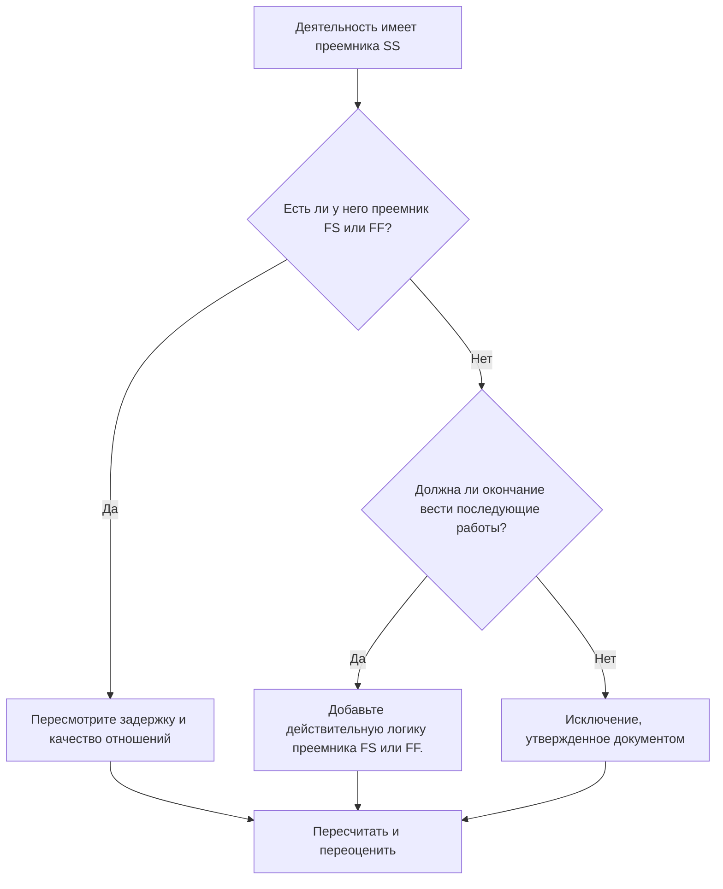

# Действия с преемниками SS и без преемников FS или FF - Руководство по улучшению

## Цель

Это руководство помогает планировщикам просматривать и исправлять действия, у которых есть преемники «Начало-начало», но нет преемников «Окончание-начало» или «Окончание-окончание». Он поддерживает более строгую логику CPM, подтверждая, что завершение действий, а не только начало, подключено к нисходящей сети графика.

## Прежде чем начать

Прежде чем предпринимать действия, соберите следующую информацию:

- Текущий результат оценки для этого показателя.
- Список видов деятельности с преемниками SS и без преемников FS или FF.
- Подробности отношений преемника для каждого действия.
- Тип действия, продолжительность, статус, календарь, общий резерв и ИСР.
- Любые задержки, ограничения или ожидаемые даты, влияющие на действие или его преемников.
- Соответствующая информация о строительстве, проектировании, закупках или последовательности передачи.

## Поймите свой результат

Хорошим результатом является отсутствие неразрешенных действий в этом состоянии. Это означает, что действия, которые начинают дальнейшую работу, также имеют логику, основанную на завершении, где имеет значение завершение работы.

Приемлемый результат может включать документированные исключения, такие как действия по уровню усилий, административные действия или намеренно дублирующая работа, где логика завершения не требуется. Их следует пересматривать, а не считать действительными.

Слабый результат означает, что некоторые действия могут начать последователей, но не контролируют завершение последующих действий или начало их собственного завершения. Это может позволить незавершенной работе перестать влиять на график.

## Цель улучшения

Целью является 0 нерешенных действий с преемниками SS и отсутствие преемников FS или FF.

Цель состоит в том, чтобы подтвердить, что каждое действие имеет реалистичного преемника, ориентированного на завершение, где завершение влияет на последующие работы, или что отсутствие логики завершения оправдано и задокументировано.

## План действий

### Шаг 1: Определите основную проблему

Создайте или экспортируйте макет P6, в котором перечислены действия, по крайней мере, с одним преемником SS и без преемника FS или FF. Include ID операции, название операции, ИСР, исходная длительность, оставшаяся длительность, полный резерв времени, последователи, тип связи, задержка, ограничения, and Activity Status.

Просмотрите каждое задание и спросите:

- Какая работа начинается, потому что начинается эта деятельность?
- Какая работа, этап, передача или проверка зависят от завершения этого действия?
- Отсутствует ли преемник FS или FF?
- Правильно ли используется связь SS для моделирования перекрывающихся работ?
- Является ли данное действие допустимым исключением, например, уровнем усилий или вспомогательной деятельностью?

### Шаг 2. Примените рекомендуемые исправления

Добавьте логику, основанную на завершении, где завершение действия должно контролировать последующую работу. Используйте FS, когда преемник не может начать работу до завершения действия. Используйте FF, когда преемник может перекрываться, но не может завершиться, пока не завершится предшественник.

Пересмотрите отношения СС с лагом. Если задержка используется для аппроксимации зависимости финиша, замените или дополните ее более четкой зависимостью FS или FF. Избегайте добавления логики только для удовлетворения метрики; каждое отношение должно отражать реальную последовательность работы.

Если действие является допустимым исключением, задокументируйте причину в теме записной книжки, пользовательской функции, поле комментария или в средстве отслеживания качества графика.

### Шаг 3. Удалите распространенные блокировщики

Распространенные препятствия включают скопированную логику из старых графиков, чрезмерные связи SS, неясные точки передачи и отсутствие информации от руководителей на местах или дисциплин. Решите эти проблемы, просмотрев фактическую последовательность работ вместе с ответственным владельцем.

Еще одним препятствием является убеждение, что для перекрывающейся работы всегда нужна только логика СС. Перекрытие может быть действительным, но финиш предшественника часто все равно должен контролировать последующий финиш, проверку, оборот или последующую деятельность.

### Шаг 4. Подтвердите изменения

Пересчитайте график после исправлений. Повторно запустите метрику и убедитесь, что каждое оставшееся действие либо исправлено, либо задокументировано как утвержденное исключение.

Просмотрите влияние на общий резерв, критический путь, самый длинный путь и краткосрочные этапы. Если добавление логики завершения изменяет контрольные даты, сообщите результат руководителю отдела управления проектом или рецензенту PMO.

## График улучшений

### День 1: Обзор и диагностика

Запустите метрику, подтвердите список затронутых действий и разделите действия на отсутствующую логику завершения, слабую логику SS, проблемы с задержкой и возможные исключения.

### Дни 2-3: Реализация приоритетных действий

В первую очередь исправьте критические и околокритические действия. Добавляйте действительных преемников FS или FF, корректируйте неподходящую логику SS и документируйте обоснованные исключения.

### Дни 4–5: Мониторинг первых результатов

Пересчитайте график и просмотрите движение по плавающим, самым длинным маршрутам и датам вех.

### День 6: Окончательные корректировки

Решите оставшиеся неясные вопросы вместе с ответственным лицом, владельцем упаковки или руководителем строительства.

### День 7: Переоцените и сравните

Запустите оценку еще раз и сравните результат с целевым порогом.

## Отслеживание прогресса

Используйте простой трекер для управления исправлениями и утверждениями.

| Дата | Принятые меры | Ожидаемый эффект | Результат/Наблюдение | Следующий шаг |
| --- | --- | --- | --- | --- |
| [Дата] | Рассмотрены последующие действия только для SS | Определить недостающую логику завершения | [Наблюдаемый результат] | Назначение исправлений |
| [Дата] | Добавлена ​​логика преемника FS или FF. | Повышение непрерывности CPM | [Наблюдаемый результат] | Пересчитать график |
| [Дата] | Документированные действительные исключения | Улучшите отслеживаемость отзывов | [Наблюдаемый результат] | Переоценить метрику |

## Если результаты не улучшаются

Если результаты не улучшаются, проверьте, выявляет ли фильтр допустимые исключения, повторяющуюся логику или действия в определенной области ИСР со слабым развитием сети. Повторяющаяся проблема может указывать на то, что команда слишком сильно полагается на отношения SS во время планирования.

Передавайте нерешенные проблемы руководителю планирования или рецензенту PMO, когда они влияют на критические, околокритические, контрактные или связанные с передачей работы работы.

## Обслуживание

Просматривайте эту метрику при каждом обновлении графика и перед утверждением базового плана. Обратите особое внимание после изменения последовательности, планирования восстановления, разработки скопированного графика или серьезных изменений объема.

## Сводный контрольный список

- [ ] Текущий результат рассмотрен
- [ ] Целевой порог подтвержден
- [ ] Выявлена ​​основная проблема
- [ ] Преемники СС рассмотрены
- [ ] Исправлена ​​недостающая логика FS или FF.
- [ ] Проверены лаги и ограничения
- [ ] Действительные исключения задокументированы
- [ ] График пересчитано
- [ ] Результаты отслеживаются
- [ ] Оценка повторена
- [ ] Следующие шаги задокументированы
## Связанные материалы
- [Действия с преемниками SS и без преемников FS или FF - Обзор](01_overview_template.md)
- [Шаблон блога](03_blog_template.md)
- [Что такое график](../../07b_blogs_ru/01_WHAT%20A%20SCHEDULE%20IS/01_blog.md)
- [Надежная логика](../../07b_blogs_ru/02_ROBUST%20LOGIC/02_ROBUST%20LOGIC.md)
