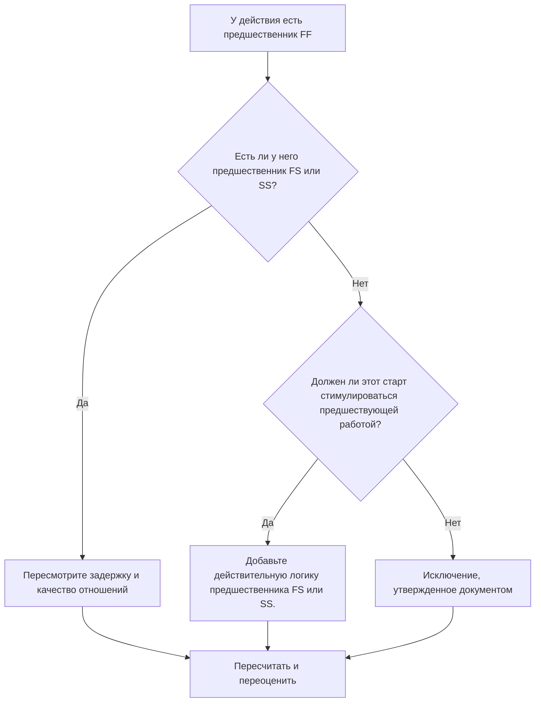

## Цель

Это руководство помогает планировщикам просматривать и исправлять действия, у которых есть предшественники «Окончание-окончание», но нет предшественников «Окончание-начало» или «Начало-начало». Он поддерживает более строгую логику CPM, подтверждая, что начало деятельности, а не только ее завершение, подключено к вышестоящей сети графика.

## Прежде чем начать

Прежде чем предпринимать действия, соберите следующую информацию:

- Текущий результат оценки для этого показателя.
- Список видов деятельности с предшественниками FF и без предшественников FS или SS.
- Подробности отношений предшественников для каждого действия.
- Тип действия, продолжительность, статус, календарь, общий резерв и ИСР.
- Любые задержки, ограничения или ожидаемые даты, влияющие на действие или его предшественников.
- Соответствующая информация о строительстве, проектировании, закупках, доступе, утверждении или последовательности передачи.

## Поймите свой результат

Хорошим результатом является отсутствие неразрешенных действий в этом состоянии. Это означает, что действия, завершение которых связано с предыдущей работой, также имеют действительную логику начала и движения там, где это необходимо.

Приемлемый результат может включать документированные исключения, такие как действия уровня усилий, административная деятельность или намеренно смоделированная параллельная работа, где логика запуска не требуется. Их следует пересматривать, а не считать действительными.

Слабый результат означает, что некоторые действия могут завершиться по отношению к предшественникам, но их запуск не контролируется предшествующей работой. Это может позволить начать действия раньше, чем поддерживает реальная последовательность.

## Цель улучшения

Целью является 0 нерешенных действий с предшественниками FF и отсутствие предшественников FS или SS.

Цель состоит в том, чтобы подтвердить, что каждое действие имеет реалистичного предшественника, при котором старт зависит от предшествующей работы, или что отсутствие стартовой логики оправдано и документировано.

## План действий

### Шаг 1: Определите основную проблему

Создайте макет P6 или экспортируйте его, в котором перечислены действия, по крайней мере, с одним предшественником FF и без предшественника FS или SS. Включите идентификатор действия, имя действия, ИСР, исходную продолжительность, оставшуюся продолжительность, общий резерв, предшественников, тип связи, задержку, ограничения и статус действия.

Просмотрите каждое задание и спросите:

- Что должно произойти, прежде чем эта деятельность сможет начаться?
- Предшественник FF контролирует только финишное выравнивание?
- Отсутствует предшественник FS или SS?
- Правильно ли используется связь FF для моделирования работы перекрытия?
- Является ли данное действие допустимым исключением, например, уровнем усилий или вспомогательной деятельностью?

### Шаг 2. Примените рекомендуемые исправления

Добавьте логику запуска, при которой начало действия должно зависеть от предыдущей работы. Используйте FS, когда действие не может начаться до завершения предшественника. Используйте SS, когда действие может начаться после запуска предшественника или достижения определенной точки выполнения.

Просмотрите отношения FF с задержкой. Если задержка используется для аппроксимации зависимости запуска, замените или дополните ее более четкой логикой FS или SS. Избегайте добавления отношений только для удовлетворения метрики; каждое отношение должно отражать реальную последовательность работы.

Если действие является допустимым исключением, задокументируйте причину в теме записной книжки, пользовательской функции, поле комментария или в средстве отслеживания качества графика.

### Шаг 3. Удалите распространенные блокировщики

К распространенным блокирующим факторам относятся копирование логики из старых графиков, чрезмерное использование связей FF, неясные точки доступа или выпуска, а также отсутствие данных от руководителей на местах или в дисциплинах. Устраните эту проблему, просмотрев фактическое состояние запуска вместе с ответственным владельцем.

Еще одним препятствием является вера в то, что логики FF достаточно, когда два действия должны завершиться вместе. Согласование завершения может быть допустимым, но последующая деятельность часто все еще требует четкого условия начала.

### Шаг 4. Подтвердите изменения

Пересчитайте график после исправлений. Повторно запустите метрику и убедитесь, что каждое оставшееся действие либо исправлено, либо задокументировано как утвержденное исключение.

Просмотрите влияние на ранние даты, общий резерв, критический путь, самый длинный путь и краткосрочные этапы. Если добавление логики запуска приводит к изменению контрольных дат, сообщите результат руководителю отдела управления проектом или рецензенту PMO.

## График улучшений

### День 1: Обзор и диагностика

Запустите метрику, подтвердите список затронутых действий и разделите действия на отсутствующую логику запуска, слабую логику FF, проблемы с задержкой и возможные исключения.

### Дни 2-3: Реализация приоритетных действий

В первую очередь исправьте критические и околокритические действия. Добавьте допустимые предшественники FS или SS, откорректируйте неподходящую логику FF и задокументируйте обоснованные исключения.

### Дни 4–5: Мониторинг первых результатов

Пересчитайте график и просмотрите движение по ранним, плавающим, самым длинным маршрутам и контрольным датам.

### День 6: Окончательные корректировки

Решите оставшиеся неясные вопросы вместе с ответственным лицом, владельцем упаковки или руководителем строительства.

### День 7: Переоцените и сравните

Запустите оценку еще раз и сравните результат с целевым порогом.

## Отслеживание прогресса

Используйте простой трекер для управления исправлениями и утверждениями.

| Дата | Принятые меры | Ожидаемый эффект | Результат/Наблюдение | Следующий шаг |
| --- | --- | --- | --- | --- |
| [Дата] | Рассмотрены предшествующие действия только для FF. | Определить отсутствующую логику запуска | [Наблюдаемый результат] | Назначение исправлений |
| [Дата] | Добавлена ​​логика предшественника FS или SS. | Повышение непрерывности CPM | [Наблюдаемый результат] | Пересчитать график |
| [Дата] | Документированные действительные исключения | Улучшите отслеживаемость отзывов | [Наблюдаемый результат] | Переоценить метрику |

## Если результаты не улучшаются

Если результаты не улучшаются, проверьте, выявляет ли фильтр допустимые исключения, повторяющуюся логику или действия в определенной области ИСР со слабым развитием сети. Повторяющаяся проблема может указывать на то, что команда слишком сильно полагается на отношения FF во время планирования.

Передавайте нерешенные проблемы руководителю планирования или проверяющему PMO, когда они влияют на критические, околокритические, контрактные, связанные с доступом или передачей работы работы.

## Обслуживание

Просматривайте эту метрику при каждом обновлении графика и перед утверждением базового плана. Обратите особое внимание после изменения последовательности, планирования восстановления, разработки скопированного графика или серьезных изменений объема.

## Сводный контрольный список

- [ ] Текущий результат рассмотрен
- [ ] Целевой порог подтвержден
- [ ] Выявлена ​​основная проблема
- [ ] Обзор предшественников FF
- [ ] Исправлена ​​недостающая логика FS или SS.
- [ ] Проверены лаги и ограничения
- [ ] Действительные исключения задокументированы
- [ ] График пересчитано
- [ ] Результаты отслеживаются
- [ ] Оценка повторена
- [ ] Следующие шаги задокументированы
## Связанные материалы
- [Шаблон блога](03_blog_template.md)
- [Что такое график](../../07b_blogs_ru/01_WHAT%20A%20SCHEDULE%20IS/01_blog.md)
- [Надежная логика](../../07b_blogs_ru/02_ROBUST%20LOGIC/02_ROBUST%20LOGIC.md)
