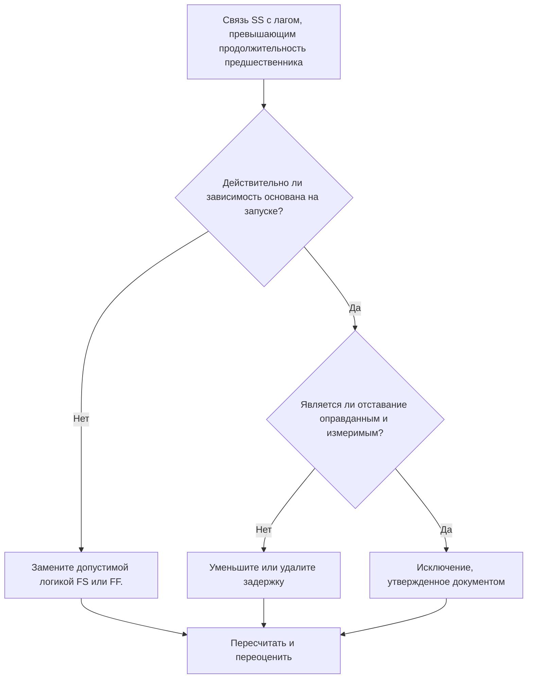

## Цель

Это руководство помогает планировщикам проверять и корректировать отношения «Начало-начало», когда задержка превышает продолжительность предшествующего действия. Он поддерживает более четкую логику CPM, заменяя чрезмерную задержку SS логикой отношений, которая лучше отражает реальную последовательность работ.

## Прежде чем начать

Прежде чем предпринимать действия, соберите следующую информацию:

- Текущий результат оценки для этого показателя.
- Список отношений SS, в которых задержка превышает продолжительность предшественника.
- Идентификаторы действий предшественника и преемника, имена, ИСР, продолжительность, календари и статус.
- Задержка отношений, тип отношений и любые связанные ограничения.
- Настройки расчета графика и календарная основа, используемая для задержки.
- Логика эксплуатации, проектирования, закупок или передачи, объясняющая предполагаемую зависимость.

## Поймите свой результат

Хорошим результатом является отсутствие неразрешенных связей SS, где задержка превышает продолжительность предшественника.

Приемлемый результат может включать документированные исключения, но они должны быть редкими. Длительная задержка SS часто указывает на то, что тип связи не соответствует моделируемой зависимости.

Слабый результат означает, что график содержит несколько ссылок «начало-начало», где преемник запускается только после задержки, превышающей продолжительность предшественника. Это может скрывать за отношениями СС логику достижения цели.

## Цель улучшения

Целью является 0 неразрешенных отношений SS с задержкой, превышающей продолжительность предшественника.

Цель состоит в том, чтобы подтвердить, должно ли каждое отношение оставаться SS, быть преобразовано в логику FS или FF, иметь уменьшенную задержку или быть задокументировано как допустимое исключение.

## План действий

### Шаг 1: Определите основную проблему

Создайте макет P6 или экспортируйте его, в котором перечислены отношения SS, в которых задержка превышает продолжительность предшественника. Включите идентификатор предшествующего и последующего действия, имя действия, ИСР, исходную продолжительность, оставшуюся продолжительность, тип связи, задержку, календарь, общий резерв и состояние действия.

Просмотрите каждое отношение и спросите:

- Почему преемник стартует с такой большой задержкой?
- Действительно ли преемник зависит от начала предшественника или от завершения предшественника?
- Является ли задержка больше, чем исходная продолжительность предшественника, оставшаяся продолжительность или и то, и другое?
- Используется ли задержка для моделирования закупок, лечения, времени проверки, доступа или другого реального периода ожидания?
- Могут ли отношения FS или FF сделать зависимость более ясной?

### Шаг 2. Примените рекомендуемые исправления

Если преемник должен начаться после завершения предшественника, замените отношение SS отношением FS. Если работа может перекрываться, но преемник не может завершиться до тех пор, пока не завершит работу предшественник, используйте логику FF.

Если связь действительно основана на запуске, просмотрите значение задержки. Уменьшите чрезмерную задержку, когда она использовалась в качестве грубого заполнителя или унаследована от скопированной логики. Если задержка представляет собой реальный период ожидания, убедитесь, что единица измерения, календарь и объяснение верны.

Не используйте длительную задержку вместо действий, которые должны быть видны в графике. Если задержка представляет собой время проверки, исправления, доставки, мобилизации или утверждения, рассмотрите возможность моделирования этой работы как отдельного вида деятельности.

### Шаг 3. Удалите распространенные блокировщики

К распространенным блокировщикам относятся копирование логики из предыдущих графиков, скрытые периоды ожидания, путаница в календаре и давление с целью сохранить простоту сети. Устраните эту проблему, подтвердив предполагаемую зависимость у ответственного владельца.

Другой блокировщик считает задержку безобидной. Длительный лаг может быть трудным для анализа, может скрыть риск и затруднить анализ задержек, поскольку период ожидания не отображается как действие.

### Шаг 4. Подтвердите изменения

Пересчитайте график после исправлений. Повторно запустите метрику и убедитесь, что каждый оставшийся элемент либо исправлен, либо задокументирован как утвержденное исключение.

Просмотрите общий резерв, самый длинный путь, критический путь и ближайшие вехи. Если изменения в отношениях смещают ключевые даты, сообщите о результате руководителю отдела управления проектом или рецензенту PMO.

## График улучшений

### День 1: Обзор и диагностика

Запустите метрику, подтвердите список затронутых связей и разделите элементы на неправильный тип связи, чрезмерную задержку, скрытую активность, проблему с календарем и возможное исключение.

### Дни 2-3: Реализация приоритетных действий

Сначала исправьте критические и околокритические отношения. Преобразуйте логику SS в FS или FF, где это необходимо, уменьшите неоправданную задержку и документируйте допустимые исключения.

### Дни 4–5: Мониторинг первых результатов

Пересчитайте график и просмотрите движение по плавающим, самым длинным маршрутам и датам вех.

### День 6: Окончательные корректировки

Решите оставшиеся неясные вопросы вместе с ответственным лицом, владельцем упаковки или руководителем строительства.

### День 7: Переоцените и сравните

Запустите оценку еще раз и сравните результат с целевым порогом.

## Отслеживание прогресса

Используйте простой трекер для управления исправлениями и утверждениями.

| Дата | Принятые меры | Ожидаемый эффект | Результат/Наблюдение | Следующий шаг |
| --- | --- | --- | --- | --- |
| [Дата] | Пересмотренная задержка SS превышает продолжительность предшественника | Определите слабую или неясную логику | [Наблюдаемый результат] | Назначение исправлений |
| [Дата] | Преобразованное отношение в FS или FF | Улучшение ясности логики CPM | [Наблюдаемый результат] | Пересчитать график |
| [Дата] | Снижение или документирование задержки | Улучшите отслеживаемость отзывов | [Наблюдаемый результат] | Переоценить метрику |

## Если результаты не улучшаются

Если результаты не улучшаются, проверьте, повторяются ли одни и те же шаблоны отношений в определенной области ИСР, дисциплине или скопированном разделе графика. Повторные результаты могут указывать на то, что команда использует задержку SS в качестве стандартного ярлыка вместо моделирования реальных зависимостей.

Эскалируйте нерешенные проблемы, когда они влияют на критические, околокритические, контрактные работы, работы, связанные с закупками, утверждением или передачей.

## Обслуживание

Просматривайте эту метрику при каждом обновлении графика и перед утверждением базового плана. Обратите особое внимание после разработки скопированного графика, изменения последовательности, планирования восстановления или серьезных изменений объема.

## Сводный контрольный список

- [ ] Текущий результат рассмотрен
- [ ] Целевой порог подтвержден
- [ ] Выявлена ​​основная проблема
- [ ] Отношения СС пересмотрены
- [ ] Чрезмерное отставание исправлено или обосновано
- [ ] При необходимости применяются замены FS или FF.
- [ ] Скрытая работа моделируется там, где это необходимо.
- [ ] График пересчитано
- [ ] Результаты отслеживаются
- [ ] Оценка повторена
- [ ] Следующие шаги задокументированы
## Связанные материалы
- [Шаблон блога](03_blog_template.md)
- [Что такое график](../../07b_blogs_ru/01_WHAT%20A%20SCHEDULE%20IS/01_blog.md)
- [Надежная логика](../../07b_blogs_ru/02_ROBUST%20LOGIC/02_ROBUST%20LOGIC.md)
