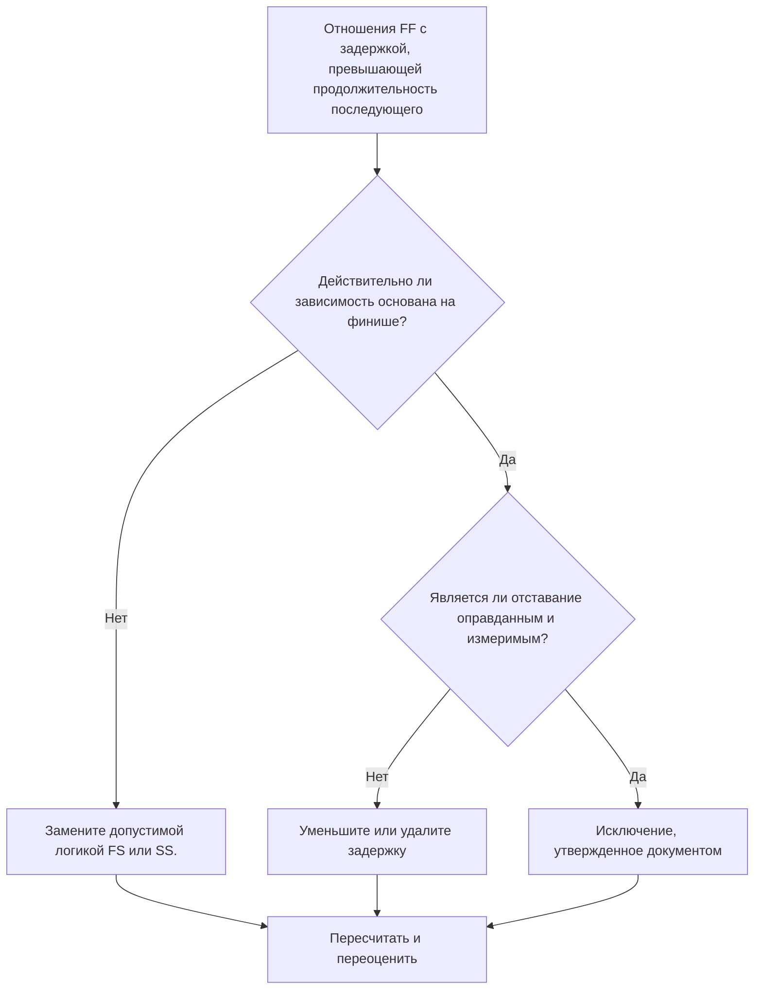

# Отношения FF с задержкой, превышающей продолжительность преемника - Руководство по улучшению

## Цель

Это руководство помогает планировщикам проверять и исправлять отношения между окончанием и завершением, когда задержка превышает продолжительность последующего действия. Он поддерживает более четкую логику CPM, заменяя чрезмерную задержку FF логикой отношений или видимыми действиями, которые лучше отражают реальную последовательность работ.

## Прежде чем начать

Прежде чем предпринимать действия, соберите следующую информацию:

- Текущий результат оценки для этого показателя.
- Список отношений FF, в которых задержка превышает продолжительность преемника.
- Идентификаторы действий предшественника и преемника, имена, ИСР, продолжительность, календари и статус.
- Задержка отношений, тип отношений и любые связанные ограничения.
- Настройки расчета графика и календарная основа, используемая для задержки.
- Логика эксплуатации, проектирования, закупок, утверждения или передачи, объясняющая предполагаемую зависимость.

## Поймите свой результат

Хорошим результатом является отсутствие неразрешенных отношений FF, когда задержка превышает продолжительность последующего.

Приемлемый результат может включать документированные исключения, но они должны быть редкими. Длинная задержка FF часто указывает на то, что тип связи не соответствует моделируемой зависимости.

Слабый результат означает, что график содержит несколько связей между окончанием и завершением, где последующее завершение задерживается на время, большее, чем продолжительность последующей операции. Это может скрыть логику запуска, периоды ожидания или отсутствие промежуточных действий.

## Цель улучшения

Целью является 0 неразрешенных отношений FF с задержкой, превышающей продолжительность последующего.

Цель состоит в том, чтобы подтвердить, должно ли каждое отношение оставаться FF, быть преобразовано в логику FS или SS, иметь уменьшенную задержку или быть задокументировано как допустимое исключение.

## План действий

### Шаг 1: Определите основную проблему

Создайте макет P6 или экспортируйте его, в котором перечислены отношения FF, в которых задержка превышает длительность последующего. Включите идентификатор предшествующего и последующего действия, имя действия, ИСР, исходную продолжительность, оставшуюся продолжительность, тип связи, задержку, календарь, общий резерв и состояние действия.

Просмотрите каждое отношение и спросите:

- Почему преемник завершает работу после такой долгой задержки?
- Действительно ли преемник зависит от завершения работы предшественника или от других условий начала или передачи обслуживания?
- Является ли задержка больше, чем исходная продолжительность преемника, оставшаяся продолжительность или и то, и другое?
- Используется ли задержка для моделирования времени проверки, исправления, доставки, утверждения, доступа или другого реального периода ожидания?
- Могут ли отношения FS или SS сделать зависимость более ясной?

### Шаг 2. Примените рекомендуемые исправления

Если преемник должен начаться после завершения предшественника, замените отношение FF отношением FS. Если преемник может начать работу после запуска предшественника или достижения определенной точки прогресса, используйте логику SS.

Если связь действительно основана на финише, просмотрите значение задержки. Уменьшите чрезмерную задержку, когда она использовалась в качестве грубого заполнителя или унаследована от скопированной логики. Если задержка представляет собой реальный период ожидания, убедитесь, что единица измерения, календарь и объяснение верны.

Не используйте длительную задержку вместо действий, которые должны быть видны в графике. Если задержка представляет собой время рассмотрения, исправления, доставки, мобилизации, утверждения или закрытия, рассмотрите моделирование этой работы как отдельное действие.

### Шаг 3. Удалите распространенные блокировщики

К распространенным блокировщикам относятся копирование логики из предыдущих графиков, скрытые периоды ожидания, путаница в календаре и давление с целью сохранить простоту сети. Устраните эту проблему, подтвердив предполагаемую зависимость у ответственного владельца.

Другой блокировщик считает задержку безобидной. Длительный лаг может быть трудным для анализа, может скрыть риск и затруднить анализ задержек, поскольку период ожидания не отображается как действие.

### Шаг 4. Подтвердите изменения

Пересчитайте график после исправлений. Повторно запустите метрику и убедитесь, что каждый оставшийся элемент либо исправлен, либо задокументирован как утвержденное исключение.

Просмотрите общий резерв, самый длинный путь, критический путь и ближайшие вехи. Если изменения в отношениях смещают ключевые даты, сообщите о результате руководителю отдела управления проектом или рецензенту PMO.

## График улучшений

### День 1: Обзор и диагностика

Запустите метрику, подтвердите список затронутых связей и разделите элементы на неправильный тип связи, чрезмерную задержку, скрытую активность, проблему с календарем и возможное исключение.

### Дни 2-3: Реализация приоритетных действий

Сначала исправьте критические и околокритические отношения. Преобразуйте логику FF в FS или SS, где это необходимо, уменьшите неоправданную задержку и документируйте допустимые исключения.

### Дни 4–5: Мониторинг первых результатов

Пересчитайте график и просмотрите движение по плавающим, самым длинным маршрутам и датам вех.

### День 6: Окончательные корректировки

Решите оставшиеся неясные вопросы вместе с ответственным лицом, владельцем упаковки или руководителем строительства.

### День 7: Переоцените и сравните

Запустите оценку еще раз и сравните результат с целевым порогом.

## Отслеживание прогресса

Используйте простой трекер для управления исправлениями и утверждениями.

| Дата | Принятые меры | Ожидаемый эффект | Результат/Наблюдение | Следующий шаг |
| --- | --- | --- | --- | --- |
| [Дата] | Проверенная задержка FF превышает продолжительность преемника | Определите слабую или неясную логику | [Наблюдаемый результат] | Назначение исправлений |
| [Дата] | Преобразованное отношение к FS или SS | Улучшение ясности логики CPM | [Наблюдаемый результат] | Пересчитать график |
| [Дата] | Снижение или документирование задержки | Улучшите отслеживаемость отзывов | [Наблюдаемый результат] | Переоценить метрику |

## Если результаты не улучшаются

Если результаты не улучшаются, проверьте, повторяются ли одни и те же шаблоны отношений в определенной области ИСР, дисциплине или скопированном разделе графика. Повторные результаты могут указывать на то, что команда использует задержку FF в качестве стандартного ярлыка вместо моделирования реальных зависимостей.

Эскалируйте нерешенные вопросы, когда они затрагивают критические, околокритические, контрактные работы, работы по закупкам, утверждению, вводу в эксплуатацию или передаче.

## Обслуживание

Просматривайте эту метрику при каждом обновлении графика и перед утверждением базового плана. Обратите особое внимание после разработки скопированного графика, изменения последовательности, планирования восстановления или серьезных изменений объема.

## Сводный контрольный список

- [ ] Текущий результат рассмотрен
- [ ] Целевой порог подтвержден
- [ ] Выявлена ​​основная проблема
- [ ] Отношения с ФФ пересмотрены
- [ ] Чрезмерное отставание исправлено или обосновано
- [ ] При необходимости применяются замены FS или SS.
- [ ] Скрытая работа моделируется там, где это необходимо.
- [ ] График пересчитано
- [ ] Результаты отслеживаются
- [ ] Оценка повторена
- [ ] Следующие шаги задокументированы
## Связанные материалы
- [Отношения FF с задержкой, превышающей продолжительность преемника - Обзор](01_overview_template.md)
- [Шаблон блога](03_blog_template.md)
- [Что такое график](../../07b_blogs_ru/01_WHAT%20A%20SCHEDULE%20IS/01_blog.md)
- [Надежная логика](../../07b_blogs_ru/02_ROBUST%20LOGIC/02_ROBUST%20LOGIC.md)
