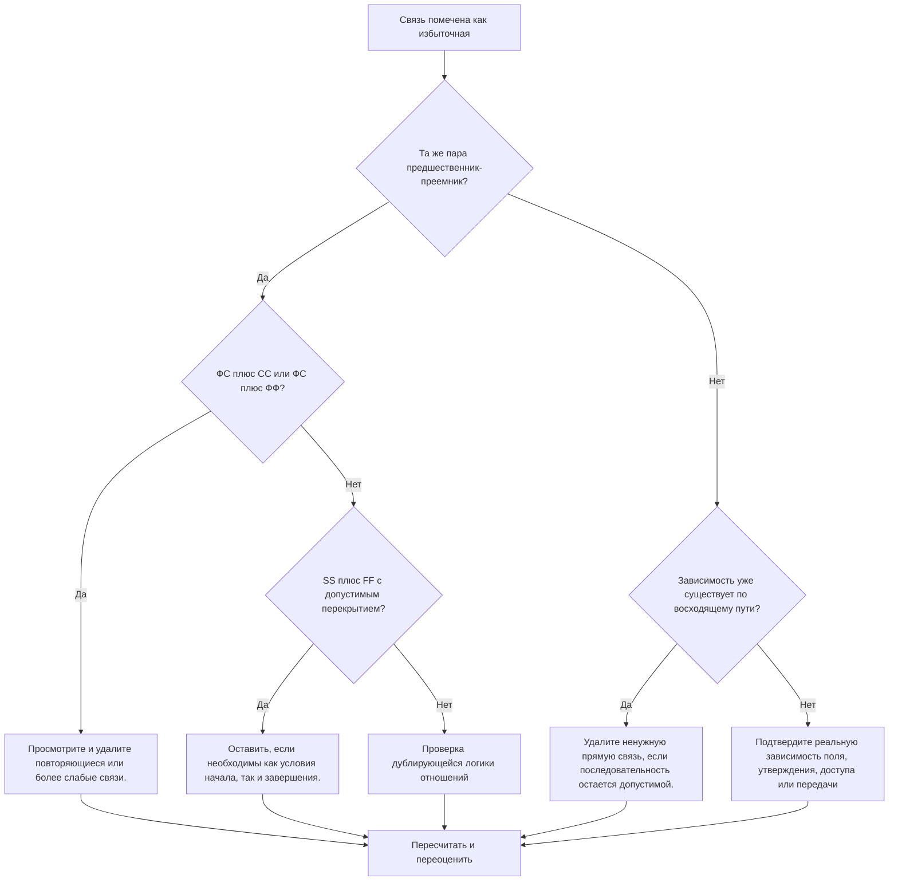

## Цель

Это руководство помогает планировщикам выявлять и удалять избыточную логику из графика Primavera P6. Это относится к повторяющимся шаблонам отношений, повторяющейся логике предшественников и ненужным зависимостям, которые не представляют реальную последовательность работ.

## Прежде чем начать

Прежде чем предпринимать действия, соберите следующую информацию:

- Текущий результат оценки для этого показателя.
- Список действий и отношений, помеченных как избыточная логика.
- Сведения о предшественнике и преемнике для каждого помеченного действия.
- Типы отношений, лаги, календари, общий резерв и индикаторы движущих отношений.
- ИСР, коды деятельности и владение дисциплиной или пакетом работ.
- Информация о полевых работах, проектировании, закупках, утверждении или передаче, объясняющая реальную зависимость.

## Поймите свой результат

Хороший результат — отсутствие неразрешенных избыточных связей.

Приемлемый результат может включать редкие задокументированные исключения, когда дублирующаяся логика намеренно используется по обоснованной причине. Эти случаи следует тщательно проанализировать, поскольку избыточная логика обычно является проблемой качества графика.

Слабый результат означает, что график содержит повторяющуюся или ненужную логику отношений. Это может произойти, если скопированные разделы графика не очищаются, связи добавляются без проверки существующих путей или между одними и теми же действиями используются несколько типов зависимостей.

## Цель улучшения

Цель — 0 неразрешенных избыточных связей.

Цель состоит в том, чтобы сохранить только те отношения, которые представляют реальные зависимости, и удалить логику, которая дублирует, маскирует или преувеличивает фактическую последовательность работ.

## План действий

### Шаг 1: Определите основную проблему

Создайте макет P6, отчет или анализ внешних связей, в котором будет выявлена ​​вероятная избыточная логика. Сосредоточьтесь на следующих случаях:

- Один и тот же предшественник подключался к одному и тому же преемнику более одного раза, особенно FS плюс SS или FS плюс FF.
- SS плюс FF между одними и теми же двумя видами деятельности могут быть допустимы, если перекрытие смоделировано правильно и имеют значение как условия начала, так и завершения.
- Действие с тем же предшественником и типом связи, что и у его собственного предшественника, создающее повторяющуюся унаследованную логику в цепочке.
- Более длинные повторяющиеся цепочки предшественников, в которых одна и та же зависимость появляется несколько шагов назад.
- Зависимости, которые не меняют последовательность, даты, резерв времени перемещение, передачу, доступ или контроль рисков.

Просмотрите каждую отмеченную связь и спросите:

- Добавляют ли эти отношения реальную зависимость?
- Представлена ​​ли зависимость уже другими отношениями между теми же видами деятельности?
- Представлена ​​ли зависимость уже восходящим путем?
- Изменит ли удаление связи действительную логику графика или только упростит сеть?
- Являются ли отношения причиной свиданий по законной причине или только потому, что была добавлена ​​​​избыточная логика?

### Шаг 2. Примените рекомендуемые исправления

Начните с точных дубликатов и повторяющихся пар предшественник-преемник. Если одни и те же два вида деятельности связаны с FS плюс SS или FS плюс FF, определите, какая связь представляет собой реальную зависимость. Удалите отношения, которые дублируют или ослабляют логику.

Рассмотрите пары SS плюс FF отдельно. Эта комбинация может быть допустимой, когда одна связь определяет, когда может начинаться перекрывающаяся работа, а другая — когда она может заканчиваться. Сохраняйте его только в том случае, если оба условия реальны и документированы последовательностью работ.

Далее рассмотрим унаследованную логику предшественника. Если действие C имеет ту же связь-предшественник, что и действие B, и действие B уже является предшественником действия C, прямая связь с более ранним действием может быть ненужной. Удалите его, если последовательность CPM по существующему пути остается правильной.

Наконец, удалите ненужные зависимости, которые не поддерживают последовательность работ, доступ, утверждение, передачу, контроль рисков или договорную логику.

### Шаг 3. Удалите распространенные блокировщики

К распространенным блокировщикам относятся копирование логики из старых графиков, чрезмерное моделирование, чтобы сеть выглядела связанной, а также добавление связей во время обновлений без проверки существующего пути.

Еще одним препятствием является страх, что прекращение отношений ослабит график. Цель состоит не в том, чтобы удалить действительные элементы управления; это удаление отношений, которые дублируют элементы управления, уже присутствующие в сети.

### Шаг 4. Подтвердите изменения

Пересчитайте график после удаления или настройки избыточной логики. Просмотрите общий резерв, движущие связи, самый длинный путь, критический путь и даты ключевых этапов.

Если удаление связи неожиданно меняет даты, выясните, действительно ли удаленная ссылка обслуживала действительную зависимость или необходимо более точно добавить другую отсутствующую связь.

## График улучшений

### День 1: Обзор и диагностика

Запустите метрику, подтвердите список затронутых взаимосвязей и разделите результаты на повторяющиеся пары, комбинации FS плюс SS/FF, унаследованную логику предшественников и ненужные зависимости.

### Дни 2-3: Реализация приоритетных действий

Сначала исправьте критические и околокритические отношения. Удалите точные дубликаты, очистите повторяющиеся пары предшественников и задокументируйте действительные комбинации SS и FF.

### Дни 4–5: Мониторинг первых результатов

Пересчитайте график и просмотрите движение в плавающем режиме, самом длинном пути, связях движущих сил и контрольных датах.

### День 6: Окончательные корректировки

Решайте неясные вопросы совместно с ответственным лицом, владельцем упаковки или руководителем строительства.

### День 7: Переоцените и сравните

Запустите оценку еще раз и сравните результат с целевым порогом.

## Отслеживание прогресса

Используйте простой трекер для управления исправлениями и утверждениями.

| Дата | Принятые меры | Ожидаемый эффект | Результат/Наблюдение | Следующий шаг |
| --- | --- | --- | --- | --- |
| [Дата] | Пересмотренный список избыточных отношений | Выявите дублирующую или ненужную логику | [Наблюдаемый результат] | Назначение исправлений |
| [Дата] | Удалены повторяющиеся отношения. | Упрощение сети CPM | [Наблюдаемый результат] | Пересчитать график |
| [Дата] | Документированные действительные исключения | Улучшите отслеживаемость отзывов | [Наблюдаемый результат] | Переоценить метрику |

## Если результаты не улучшаются

Если результаты не улучшаются, проверьте, сосредоточена ли избыточная логика в определенной области ИСР, скопированном разделе проекта, дисциплине или периоде обновления графика. Повторные результаты могут указывать на то, что очистка отношений не является частью обычного рабочего процесса планирования.

Эскалируйте неразрешенную избыточную логику, когда она влияет на критическую, околокритическую, контрактную работу, работу, связанную с доступом, утверждением или передачей.

## Обслуживание

Просматривайте эту метрику при каждом обновлении графика и перед утверждением базового плана. Обратите особое внимание после разработки скопированного графика, изменения последовательности, планирования восстановления или крупных изменений логики.

## Сводный контрольный список

- [ ] Текущий результат рассмотрен
- [ ] Целевой порог подтвержден
- [ ] Выявлена ​​основная проблема
- [ ] Рассмотрены повторяющиеся пары предшественник-преемник
- [ ] Исправлены комбинации FS плюс SS или FS плюс FF.
- [ ] Задокументированы действительные комбинации SS и FF.
- [ ] Обзор унаследованной логики предшественника
- [ ] Ненужные зависимости удалены.
- [ ] График пересчитано
- [ ] Результаты отслеживаются
- [ ] Оценка повторена
- [ ] Следующие шаги задокументированы
## Связанные материалы
- [Шаблон блога](03_blog_template.md)
- [Что такое график](../../07b_blogs_ru/01_WHAT%20A%20SCHEDULE%20IS/01_blog.md)
- [Надежная логика](../../07b_blogs_ru/02_ROBUST%20LOGIC/02_ROBUST%20LOGIC.md)
