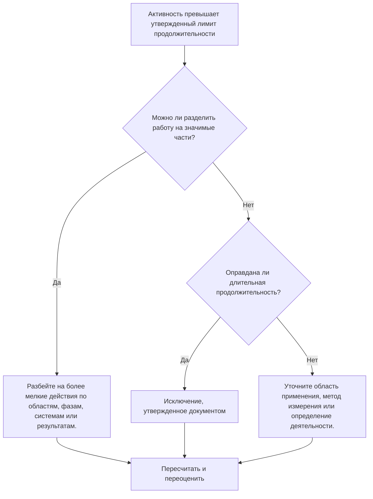

## Цель

Это руководство помогает планировщикам анализировать и улучшать действия, продолжительность которых превышает утвержденный порог проекта. Приемлемая продолжительность зависит от типа проекта, уровня детализации, цикла отчетности, требований контракта и чувствительности клиента к длительным работам.

## Прежде чем начать

Прежде чем предпринимать действия, соберите следующую информацию:

- Текущий результат оценки для этого показателя.
- Утвержденная максимальная продолжительность деятельности для уровня проекта или графика.
- Список действий, превышающих порог продолжительности.
- Исходная продолжительность, оставшаяся продолжительность, тип активности, статус, ИСР, календарь и общий резерв.
- Базовые требования, ожидания клиентов по отчетности и правила качества графика PMO.
- Период прогнозного планирования, цикл обновления прогресса и владение дисциплиной или пакетом.
- Любые обоснованные исключения, такие как закупки, исправление, доставка, проверка, тестирование или действия по уровню усилий.

## Поймите свой результат

Хорошим результатом является отсутствие нерешенных действий, превышающих утвержденный долгосрочный порог.

Приемлемый результат может включать документированные исключения, особенно для действий, которые невозможно разумно разбить на части или которые намеренно управляются как сводные контрольные действия. Они должны быть ограничены и четко обоснованы.

Слабый результат означает, что график содержит множество мероприятий, которые слишком обширны для эффективного планирования и контроля. Это может ухудшить видимость прогресса и затруднить понимание того, какая работа на самом деле влияет на график.

## Цель улучшения

Целью является 0 нерешенных действий, превышающих утвержденный лимит продолжительности.

Цель состоит в том, чтобы разделить длительные действия на более мелкие, значимые действия, где необходим лучший контроль, и документировать действительные исключения, где подходит большая продолжительность.

## План действий

### Шаг 1: Определите основную проблему

Создайте макет P6 или отчет, в котором будут перечислены действия, превышающие порог продолжительности, определенный проектом. Укажите идентификатор действия, имя действия, ИСР, тип действия, исходную продолжительность, оставшуюся продолжительность, начало, окончание, календарь, общий резерв и статус действия.

Просмотрите каждое задание и спросите:

- Превышает ли продолжительность действия утвержденный порог для этого типа проекта и уровня графика?
- Охватывает ли деятельность несколько рабочих этапов, мест, систем, областей или результатов?
- Можно ли объективно измерить прогресс во время каждого цикла обновления?
- Требуется ли более подробная информация о деятельности, поскольку клиент или проектный офис чувствителен к длительным срокам?
- Является ли действие допустимым исключением, которое должно оставаться продолжительным?

### Шаг 2. Примените рекомендуемые исправления

Разделите длительную деятельность, где работу можно спланировать и измерить, на более мелкие части. Общие методы разбивки включают местоположение, зону ИСР, дисциплину, систему, результаты, этап, последовательность действий бригады или отчетный период.

При разделении деятельности сохраняйте реальную логическую последовательность. Добавьте соответствующих предшественников и преемников, назначьте правильный календарь и подтвердите, что новые действия отражают то, как работа будет фактически выполняться.

Не разделяйте действия только для удовлетворения метрики. Разбивка должна улучшить контроль, измерение прогресса, прогнозное планирование или ясность отчетности.

### Шаг 3. Удалите распространенные блокировщики

К распространенным блокирующим факторам относятся неполное определение объема, слабая структура ИСР, ограниченный ввод данных в поля и давление, направленное на поддержание низкого уровня активности. Решите эти проблемы, проанализировав длительную деятельность с ответственным лицом, владельцем упаковки или руководителем строительства.

Другой блокировщик использует одно длинное действие для представления работы, которую следует планировать как последовательность. Если действие содержит несколько передач, рабочих сторон, результатов или контрольных точек, вероятно, оно требует более подробной информации.

### Шаг 4. Подтвердите изменения

Пересчитайте график после разделения или корректировки длительных занятий. Убедитесь, что каждое новое действие имеет соответствующую логику, продолжительность, календарь и измерение прогресса.

Просмотрите общий резерв, критический путь, самый длинный путь и даты контрольных точек. Если в разбивке изменяются контрольные даты, сообщите причину руководителю системы управления проектом или рецензенту ОУП.

## График улучшений

### День 1: Обзор и диагностика

Запустите метрику, подтвердите порог продолжительности и разделите действия на кандидатов, допустимые исключения и элементы, требующие участия владельца.

### Дни 2-3: Реализация приоритетных действий

В первую очередь исправьте критические, околокритические и чувствительные к клиенту действия. Разбейте общие действия и задокументируйте действительные исключения.

### Дни 4–5: Мониторинг первых результатов

Пересчитайте график и просмотрите движение в плавающем режиме, самом длинном пути, датах контрольных точек и прогнозируемой видимости.

### День 6: Окончательные корректировки

Решите оставшиеся неясные вопросы вместе с ответственным за дисциплину, владельцем пакета или руководителем управления проектом.

### День 7: Переоцените и сравните

Запустите оценку еще раз и сравните результат с целевым порогом.

## Отслеживание прогресса

Используйте простой трекер для управления исправлениями и утверждениями.

| Дата | Принятые меры | Ожидаемый эффект | Результат/Наблюдение | Следующий шаг |
| --- | --- | --- | --- | --- |
| [Дата] | Рассмотрены долгосрочные мероприятия | Определите действия, требующие разбивки | [Наблюдаемый результат] | Назначить владельцев |
| [Дата] | Разделите деятельность на более мелкие рабочие этапы | Улучшите видимость прогресса | [Наблюдаемый результат] | Пересчитать график |
| [Дата] | Документированное действительное исключение | Улучшите отслеживаемость отзывов | [Наблюдаемый результат] | Переоценить метрику |

## Если результаты не улучшаются

Если результаты не улучшаются, проверьте, не является ли порог продолжительности нечетким, применяется непоследовательно или не соответствует уровню графика. Также проверьте, сосредоточены ли длительные действия в конкретной области ИСР, дисциплине или этапе проекта.

Эскалируйте нерешенные долгосрочные действия, когда они затрагивают критически важную, околокритическую, контрактную, отчетную или чувствительную к клиенту работу.

## Обслуживание

Просматривайте эту метрику во время каждого обновления графика, разработки базового плана и масштабного изменения последовательности. Обновите пороговое значение, если проект переходит на другую фазу или уровень детализации.

## Сводный контрольный список

- [ ] Текущий результат рассмотрен
- [ ] Целевой порог подтвержден
- [ ] Выявлена ​​основная проблема
- [ ] Обзор длительной деятельности
- [ ] Выявлены кандидаты на раскол
- [ ] Действия разбиты там, где это полезно
- [ ] Действительные исключения задокументированы
- [ ] График пересчитано
- [ ] Результаты отслеживаются
- [ ] Оценка повторена
- [ ] Следующие шаги задокументированы
## Связанные материалы
- [Шаблон блога](03_blog_template.md)
- [Что такое график](../../07b_blogs_ru/01_WHAT%20A%20SCHEDULE%20IS/01_blog.md)
- [Надежная логика](../../07b_blogs_ru/02_ROBUST%20LOGIC/02_ROBUST%20LOGIC.md)
