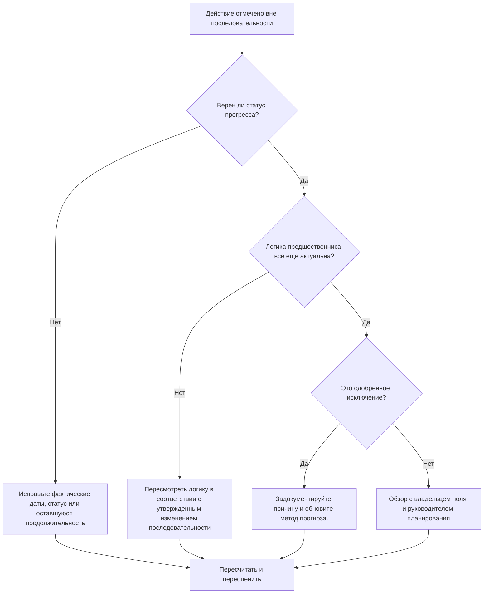

## Цель

Это руководство помогает планировщикам просматривать и исправлять действия, выходящие из последовательности в Primavera P6. Он применяется, когда действие началось или продолжалось до того, как была удовлетворена требуемая логика его предшественника.

## Прежде чем начать

Прежде чем предпринимать действия, соберите следующую информацию:

- Текущий результат оценки для этого показателя.
- Список действий, помеченных как нарушающие последовательность.
- Дата данных, использованная в последнем обновлении.
- Фактическое начало, фактическое окончание, оставшаяся продолжительность и статус активности.
- Подробности отношений предшественника и преемника, включая тип отношений и задержку.
- Настройки расчета графика, особенно сохраненная логика и переопределение прогресса.
- Полевое объяснение того, почему работа продолжалась до того, как запланированная логика была завершена.

## Поймите свой результат

Хорошим результатом является отсутствие нерешенных внеочередных действий.

Приемлемый результат может включать документированные исключения, когда работа была намеренно изменена, а логика графика была обновлена ​​в соответствии с новым планом.

Слабый результат означает, что обновление графика содержит прогресс, который конфликтует с существующей логической сетью. Это может указывать на неправильный статус, отсутствие фактических данных, устаревшую логику или реальное изменение последовательности полей, которое еще не отражено в прогнозе.

## Цель улучшения

Цель — 0 нерешенных внеочередных действий.

Цель состоит в том, чтобы определить, является ли каждый элемент ошибкой статуса, логической ошибкой или реальным событием изменения последовательности, а затем скорректировать график так, чтобы оно представляло текущий план.

## План действий

### Шаг 1: Определите основную проблему

Создайте макет P6 или отчет со списком внеочередных действий. Включите идентификатор действия, имя действия, ИСР, статус, фактическое начало, фактическое окончание, оставшуюся продолжительность, начало, окончание, общий резерв, предшественников, преемников, тип связи, задержку и индикаторы ведущей связи.

Просмотрите каждое задание и спросите:

- Действительно ли деятельность началась до того, как было выполнено предшествовавшее ей требование?
- Верен ли статус предшественника?
- Верен ли статус преемника?
- Сохраняется ли связь после изменения последовательности полей?
- Следует ли изменить логику графика или следует исправить обновление прогресса?
- Какой вариант планирования P6 используется: сохраненная логика или переопределение прогресса?

### Шаг 2. Примените рекомендуемые исправления

Сначала исправьте ошибки статуса. Если фактическое начало, фактическое окончание, оставшаяся продолжительность или статус предшественника неверны, обновите данные активности перед изменением логики.

Если последовательность полей изменилась, измените логику, чтобы она представляла утвержденный текущий план. Не удаляйте просто отношения предшественника, чтобы очистить метрику. Замените устаревшую логику отношениями, которые соответствуют реальной последовательности выполнения.

Просмотрите сохраненную логику и настройки переопределения прогресса. Сохраненная логика обычно сохраняет исходную логику предшественника для оставшейся работы, тогда как переопределение прогресса может позволить продолжить оставшуюся работу, несмотря на неполную логику предшественника. Эта настройка должна соответствовать процедуре контроля проекта и быть понята до того, как сообщать о результате.

### Шаг 3. Удалите распространенные блокировщики

К распространенным препятствиям относятся поздние обновления полей, неполные фактические даты, давление, заставляющее принять прогресс без логического анализа, а также путаница в отношении вариантов расчета графика.

Другой блокировщик рассматривает нестандартный прогресс как проблему программного обеспечения. Реальный вопрос заключается в том, изменился ли проект последовательность работ и отражает ли теперь график эту утвержденную последовательность.

### Шаг 4. Подтвердите изменения

Пересчитайте график после исправлений. Повторно запустите проверку нарушения последовательности и убедитесь, что каждый оставшийся элемент исправлен, обоснован или назначен для дальнейшего контроля.

Просмотрите общий резерв, самый длинный путь, критический путь и ближайшие вехи. Внеочередные корректировки могут изменить даты прогноза, поэтому сообщите о существенных последствиях руководителю отдела управления проектом или рецензенту PMO.

## График улучшений

### День 1: Обзор и диагностика

Запустите метрику, подтвердите дату данных и разделите результаты на ошибки статуса, логические ошибки, реальное изменение последовательности и возможные исключения.

### Дни 2-3: Реализация приоритетных действий

Сначала исправьте критические, околокритические и прогнозные действия. Обновите статус, пересмотрите устаревшую логику и задокументируйте утвержденное изменение последовательности.

### Дни 4–5: Мониторинг первых результатов

Пересчитайте график и просмотрите движение по плавающим датам, самому длинному пути, критическому пути и контрольным датам.

### День 6: Окончательные корректировки

Решите оставшиеся вопросы вместе с руководителями на местах, руководителями дисциплин или менеджером по планированию.

### День 7: Переоцените и сравните

Запустите оценку еще раз и сравните результат с целевым порогом.

## Отслеживание прогресса

Используйте простой трекер для управления исправлениями и утверждениями.

| Дата | Принятые меры | Ожидаемый эффект | Результат/Наблюдение | Следующий шаг |
| --- | --- | --- | --- | --- |
| [Дата] | Рассмотрены внеочередные действия | Определить статус или логическую проблему | [Наблюдаемый результат] | Назначить владельца |
| [Дата] | Исправленный статус или фактические даты | Повысьте точность обновления | [Наблюдаемый результат] | Пересчитать график |
| [Дата] | Пересмотренная логика утвержденного изменения последовательности | Повышение надежности прогнозов | [Наблюдаемый результат] | Переоценить метрику |

## Если результаты не улучшаются

Если результаты не улучшаются, проверьте, не происходят ли повторные изменения в одних и тех же рабочих областях. Это может указывать на слабую дисциплину обновлений, нереалистичную логику, неполную координацию на местах или частое несанкционированное изменение последовательности.

Эскалируйте неразрешенные вопросы, когда они затрагивают критические, околокритические, договорные работы, работу по доступу, передаче или работу, чувствительную к клиенту.

## Обслуживание

Просматривайте эту метрику во время каждого цикла обновления перед публикацией графика. Прежде чем отчеты о графике будут использоваться для отчетов PMO, анализа задержек или планирования восстановления, убедитесь, что прогресс, находящийся вне очереди, устранен.

## Сводный контрольный список

- [ ] Текущий результат рассмотрен
- [ ] Целевой порог подтвержден
- [ ] Дата подтверждения подтверждена
- [ ] Выявлена ​​основная проблема
- [ ] Исправлены ошибки статуса
- [ ] Исправлены логические ошибки.
- [ ] Утвержденное повторное секвенирование задокументировано
- [ ] Настройки расчета графика проверены.
- [ ] График пересчитано
- [ ] Результаты отслеживаются
- [ ] Оценка повторена
- [ ] Следующие шаги задокументированы
## Связанные материалы
- [Шаблон блога](03_blog_template.md)
- [Что такое график](../../07b_blogs_ru/01_WHAT%20A%20SCHEDULE%20IS/01_blog.md)
- [Надежная логика](../../07b_blogs_ru/02_ROBUST%20LOGIC/02_ROBUST%20LOGIC.md)
