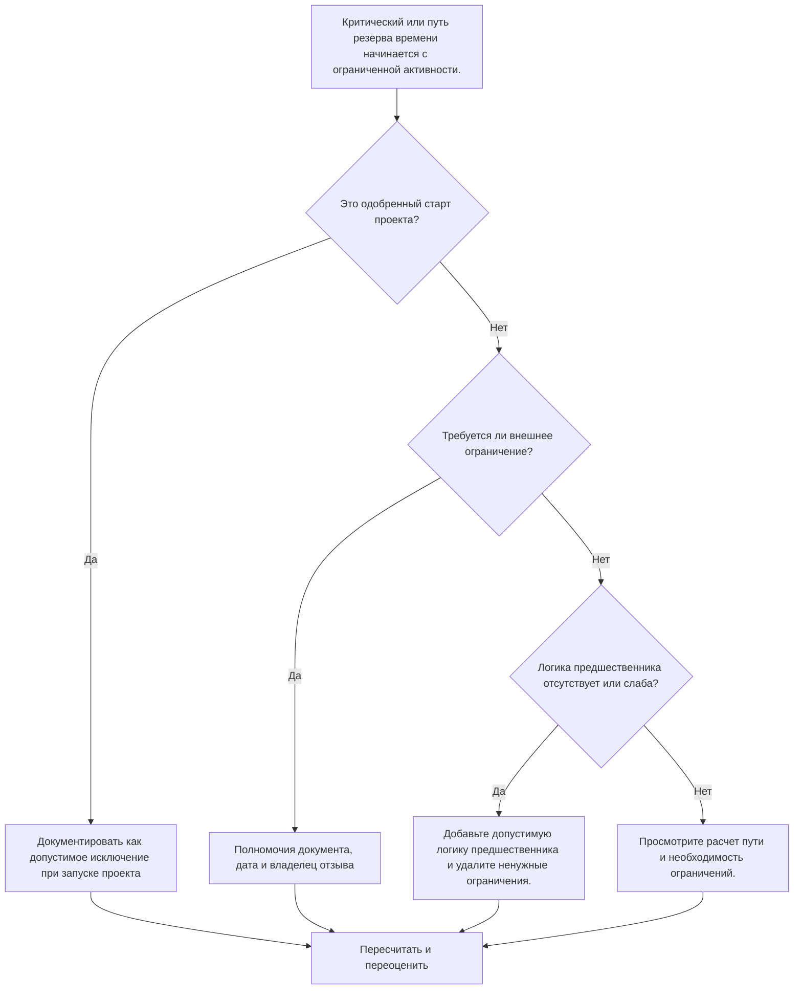

## Цель

Это руководство помогает планировщикам просматривать цепочки критических или плавающих путей, которые начинаются с ограниченного действия. Одобренное начало проекта обычно является допустимым исключением; проблема заключается в том, что нисходящий путь начинается с ограничения, а не с логической последовательности.

## Прежде чем начать

Прежде чем предпринимать действия, соберите следующую информацию:

- Текущий результат оценки для этого показателя.
- Отчет о критическом или плавающем пути от Primavera P6.
- Первое действие на каждом отмеченном пути.
- Тип ограничения, дата ограничения и ожидаемые даты.
- Отношения предшественника и преемника для действия начала пути.
- Дата данных, этап начала проекта, базовые требования и правила планирования PMO или клиента.
- Объяснение любого утвержденного внешнего ограничения.

## Поймите свой результат

Хорошим результатом является отсутствие неразрешенных критических или плавающих путей, начинающихся с ограничения, за исключением утвержденного начала проекта.

Приемлемый результат может включать документированные внешние ограничения, такие как уведомление о продолжении, разрешение доступа владельца, разрешение или договорные точки приостановки. Они должны быть четко обоснованы.

Слабый результат означает, что путь может контролироваться навязанными датами, а не сетевой логикой. Это может сделать критический путь или путь резерва времени менее надежным для прогнозирования, составления отчетов и анализа задержек.

## Цель улучшения

Цель — 0 неразрешенных путей, начинающихся с ограничения.

Цель состоит в том, чтобы подтвердить, должен ли путь начинаться с утвержденного начала проекта, с действительной логики предшественника или с документированного внешнего ограничения.

## План действий

### Шаг 1: Определите основную проблему

Создайте макет P6 или отчет, показывающий критический путь и выбранные плавающие пути. Для первого действия на каждом пути укажите идентификатор действия, имя действия, ИСР, начало, завершение, общий резерв, свободное резерв времени, основное ограничение, дату ограничения, предшественников, преемников и статус действия.

Просмотрите каждый помеченный путь и спросите:

- Это одобренное начало проекта или уведомление о начале работы?
- Требуется ли это ограничение по контракту или извне?
- У действия отсутствует логика предшественника?
- Маскирует ли ограничение слабую или неполную сеть графиков?
- Будет ли путь начинаться иначе, если ограничение будет удалено?
- Задокументирован ли ограниченный старт для PMO или проверки клиента?

### Шаг 2. Примените рекомендуемые исправления

Если ограниченное действие представляет собой утвержденное начало проекта, задокументируйте его как допустимое исключение и подтвердите, что оно является предполагаемой начальной точкой пути.

Если ограничение требуется извне, сохраняйте его только тогда, когда причина ясна. Задокументируйте источник, например, этап контракта, разрешение на доступ, разрешение, инструкции владельца или нормативные требования.

Если ограничение не требуется, удалите его и добавьте допустимую логику предшественника, где действие зависит от предыдущей работы, утверждений, передач, закупок или доступа. Пересчитайте график и убедитесь, что путь теперь управляется логикой.

### Шаг 3. Удалите распространенные блокировщики

К распространенным блокировщикам относятся ограничения, унаследованные от старых базовых показателей, ограничения, используемые для принудительного определения дат, отсутствующая логика интерфейса и неясное право собственности на внешние даты.

Другой блокировщик предполагает, что критический путь надежен просто потому, что P6 его идентифицирует. Если путь начинается с ненужного ограничения, возможно, он отражает управление датами, а не истинную логику CPM.

### Шаг 4. Подтвердите изменения

Пересчитайте график после изменения ограничений или логики. Просмотрите критический путь, самый длинный путь, выбранные пути резервирования, общий резерв и даты ключевых этапов.

Если путь существенно изменится, задокументируйте причину и сообщите о влиянии руководителю отдела управления проектом, рецензенту PMO или планировщику клиентов.

## График улучшений

### День 1: Обзор и диагностика

Запустите метрику, определите ограниченные действия в начале пути и разделите результаты на исключения начала проекта, допустимые внешние ограничения, отсутствующую логику и ненужные ограничения.

### Дни 2-3: Реализация приоритетных действий

Сначала исправьте критические и чувствительные к клиенту пути. Удалите ненужные ограничения, добавьте недостающую логику и задокументируйте утвержденные исключения.

### Дни 4–5: Мониторинг первых результатов

Пересчитайте график и просмотрите движение по критическому пути, самому длинному пути, плавающим путям и контрольным датам.

### День 6: Окончательные корректировки

Устранение оставшихся ограничений начинается с ответственного владельца, руководителя системы управления проектом или рецензента клиента.

### День 7: Переоцените и сравните

Запустите оценку еще раз и сравните результат с целевым порогом.

## Отслеживание прогресса

Используйте простой трекер для управления исправлениями и утверждениями.

| Дата | Принятые меры | Ожидаемый эффект | Результат/Наблюдение | Следующий шаг |
| --- | --- | --- | --- | --- |
| [Дата] | Рассмотрены ограниченные действия по началу пути | Определите начало пути по дате | [Наблюдаемый результат] | Назначить владельца |
| [Дата] | Убрано ненужное ограничение | Восстановить логический путь | [Наблюдаемый результат] | Пересчитать график |
| [Дата] | Документированное одобренное исключение | Улучшите отслеживаемость отзывов | [Наблюдаемый результат] | Переоценить метрику |

## Если результаты не улучшаются

Если результаты не улучшаются, проверьте, сконцентрированы ли ограничения в конкретной области ИСР, пакете интерфейса или этапе проекта. Повторные результаты могут указывать на то, что график контролируется навязанными датами, а не полной логикой.

Эскалация неразрешенных ограниченных путей начинается, когда они затрагивают критическую, околокритическую, контрактную, чувствительную к клиенту работу, работу, связанную с доступом или передачей обслуживания.

## Обслуживание

Просматривайте эту метрику во время каждого обновления графика, проверки базового уровня и масштабного изменения последовательности. Обратите особое внимание после планирования восстановления, изменения дат клиента или изменений интерфейса.

## Сводный контрольный список

- [ ] Текущий результат рассмотрен
- [ ] Целевой порог подтвержден
- [ ] Отчет о критическом или плавающем пути рассмотрен
- [ ] Выявлены исключения при запуске проекта
- [ ] База ограничений проверена
- [ ] Отсутствующая логика исправлена
- [ ] Убраны ненужные ограничения.
- [ ] Утвержденные исключения документированы
- [ ] График пересчитано
- [ ] Результаты отслеживаются
- [ ] Оценка повторена
- [ ] Следующие шаги задокументированы
## Связанные материалы
- [Шаблон блога](03_blog_template.md)
- [Что такое график](../../07b_blogs_ru/01_WHAT%20A%20SCHEDULE%20IS/01_blog.md)
- [Надежная логика](../../07b_blogs_ru/02_ROBUST%20LOGIC/02_ROBUST%20LOGIC.md)
