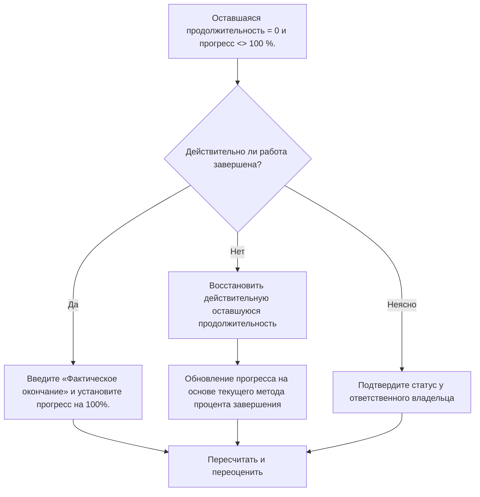

# Действия с оставшейся длительностью 0 и прогрессом не 100 % - Руководство по улучшению

## Цель

Это руководство помогает планировщикам проверять и исправлять действия, в которых оставшаяся продолжительность равна 0, но прогресс не равен 100%. Он поддерживает более чистые обновления статуса Primavera P6, выравнивая оставшуюся продолжительность, процент выполнения, фактическое завершение и статус активности.

## Прежде чем начать

Прежде чем предпринимать действия, соберите следующую информацию:

- Текущий результат оценки для этого показателя.
- Список действий с оставшейся длительностью = 0 и прогрессом <> 100%.
- Статус операции, фактическое начало, фактическое окончание, исходная продолжительность, оставшаяся продолжительность и продолжительность по завершению.
- Тип процента выполнения и соответствующие поля прогресса.
- Физический процент выполнения, Продолжительность выполнения, Процент выполнения единиц и Процент выполнения действия.
- Дата данных и последние примечания к обновлению прогресса.
- Полевое подтверждение того, завершена ли работа или еще есть работа.

## Поймите свой результат

Хорошим результатом является отсутствие действий с оставшейся продолжительностью = 0 и прогресс ниже или выше 100%.

Приемлемый результат может включать редкие задокументированные случаи, когда определенный метод процента выполнения создает временную разницу в отчетах, но их следует устранить до официального отчета.

Слабый результат означает, что график содержит действия, оставшаяся работа и статус выполнения которых не совпадают. Это может привести к неточной отчетности, проблемам с освоенным объемом или вводящему в заблуждение статусу завершения.

## Цель улучшения

Цель — 0 неразрешенных действий с оставшейся длительностью = 0 и прогрессом <> 100%.

Цель состоит в том, чтобы подтвердить, является ли каждое действие завершенным, неверно обновленным о ходе выполнения или используется метод процента завершения, который требует проверки.

## План действий

### Шаг 1: Определите основную проблему

Создайте макет или отчет P6, который фильтрует действия, у которых оставшаяся продолжительность равна 0, а прогресс не равен 100%. Включите идентификатор действия, имя действия, ИСР, статус действия, фактическое начало, фактическое окончание, исходную продолжительность, оставшуюся продолжительность, тип процента завершения, физический процент завершения, процент завершения продолжительности, процент завершения единиц и процент завершения действия.

Просмотрите каждое задание и спросите:

- Действительно ли работа завершена?
- Если все завершено, отсутствует ли фактическое окончание?
- Если не завершено, почему оставшаяся продолжительность равна 0?
- Какой процент завершения используется?
- Значение прогресса зависит от физического прогресса, продолжительности или прогресса единиц?
- Это ошибка обновления статуса или проблема с подсчетом прогресса?

### Шаг 2. Примените рекомендуемые исправления

Если работа завершена, обновите действие как завершенное. Введите фактическое окончание, подтвердите, что оставшаяся продолжительность равна 0, и подтвердите, что прогресс равен 100 % в соответствии с процедурой обновления проекта.

Если работа не завершена, восстановите соответствующую оставшуюся продолжительность. Подтвердите оставшуюся работу у ответственного владельца и обновите соответствующее поле хода выполнения на основе типа процента выполнения действия.

Если проблема вызвана методом процента завершения, проверьте, следует ли для действия использовать физический процент завершения, процент завершения по продолжительности или процент завершения по единицам. Не меняйте случайно тип процента завершения; согласовать его с процедурой контроля проекта.

### Шаг 3. Удалите распространенные блокировщики

К распространенным блокирующим факторам относятся неполные обновления полей, отсутствие дат фактического завершения, путаница между физическим процентом завершения и продолжительностью, а также прогресс, импортированный из внешних систем без проверки.

Другой блокировщик рассматривает оставшуюся продолжительность как поле прогресса. Оставшаяся продолжительность должна показывать, сколько времени еще необходимо для завершения действия, а не просто объем работы, о котором сообщается, что она завершена.

### Шаг 4. Подтвердите изменения

Пересчитайте график после исправлений. Повторно запустите метрику и убедитесь, что каждый оставшийся элемент исправлен или назначен для дальнейшего наблюдения.

Просмотрите завершенные действия, фактические даты окончания, отчеты о ходе выполнения, результаты освоенного объема и прогнозные отчеты, чтобы убедиться, что исправление не привело к новым несоответствиям.

## График улучшений

### День 1: Обзор и диагностика

Запустите метрику, подтвердите дату данных и разделите результаты на статус отсутствия завершенной работы, незавершенную работу с нулевой оставшейся продолжительностью и проблемы метода с процентом завершения.

### Дни 2-3: Реализация приоритетных действий

В первую очередь исправьте действия, используемые в отчетах. При необходимости обновите фактическое окончание, восстановите оставшуюся продолжительность или исправьте значения прогресса.

### Дни 4–5: Мониторинг первых результатов

Пересчитайте график и просмотрите отчеты о ходе работ, списки выполненных работ и полученные результаты.

### День 6: Окончательные корректировки

Решите оставшиеся неясные вопросы совместно с ответственным за дисциплину, руководителем на местах или руководителем управления проектом.

### День 7: Переоцените и сравните

Запустите оценку еще раз и сравните результат с целевым порогом.

## Отслеживание прогресса

Используйте простой трекер для управления исправлениями и утверждениями.

| Дата | Принятые меры | Ожидаемый эффект | Результат/Наблюдение | Следующий шаг |
| --- | --- | --- | --- | --- |
| [Дата] | Рассмотрено РД 0 и прогресс не 100 мероприятий | Выявление несоответствия статуса | [Наблюдаемый результат] | Назначить владельца |
| [Дата] | Введен фактический финиш и исправлен прогресс. | Выровнять статус завершения | [Наблюдаемый результат] | Пересчитать график |
| [Дата] | Восстановлена ​​оставшаяся продолжительность | Исправить статус незавершенной деятельности | [Наблюдаемый результат] | Переоценить метрику |

## Если результаты не улучшаются

Если результаты не улучшаются, проверьте, не импортируются ли, копируются или вычисляются ли обновления прогресса непоследовательно. Проверьте, используют ли разные команды разные методы определения процента выполнения или отсутствуют ли даты фактического завершения в рабочем процессе обновления.

Эскалируйте нерешенные проблемы, когда они влияют на критическую, околокритическую, освоенную стоимость, отчеты клиентов, оплату или работу, связанную с передачей.

## Обслуживание

Просматривайте эту метрику во время каждого цикла обновления перед выпуском отчетов. Это должно быть частью стандартной проверки обновлений наряду с проверкой фактических дат, оставшейся продолжительности, процента выполнения и статуса активности.

## Сводный контрольный список

- [ ] Текущий результат рассмотрен
- [ ] Целевой порог подтвержден
- [ ] Дата подтверждения подтверждена
- [ ] Выявлена ​​основная проблема
- [ ] Завершенные действия обновлены правильно
- [ ] Фактическая дата окончания указана там, где необходимо.
- [ ] Оставшаяся продолжительность восстанавливается, если работа не завершена
- [ ] Процент завершения Тип проверен
- [ ] График пересчитано
- [ ] Результаты отслеживаются
- [ ] Оценка повторена
- [ ] Следующие шаги задокументированы
## Связанные материалы
- [Действия с оставшейся длительностью 0 и прогрессом не 100 % - Обзор](01_overview_template.md)
- [Шаблон блога](03_blog_template.md)
- [Что такое график](../../07b_blogs_ru/01_WHAT%20A%20SCHEDULE%20IS/01_blog.md)
- [Надежная логика](../../07b_blogs_ru/02_ROBUST%20LOGIC/02_ROBUST%20LOGIC.md)
