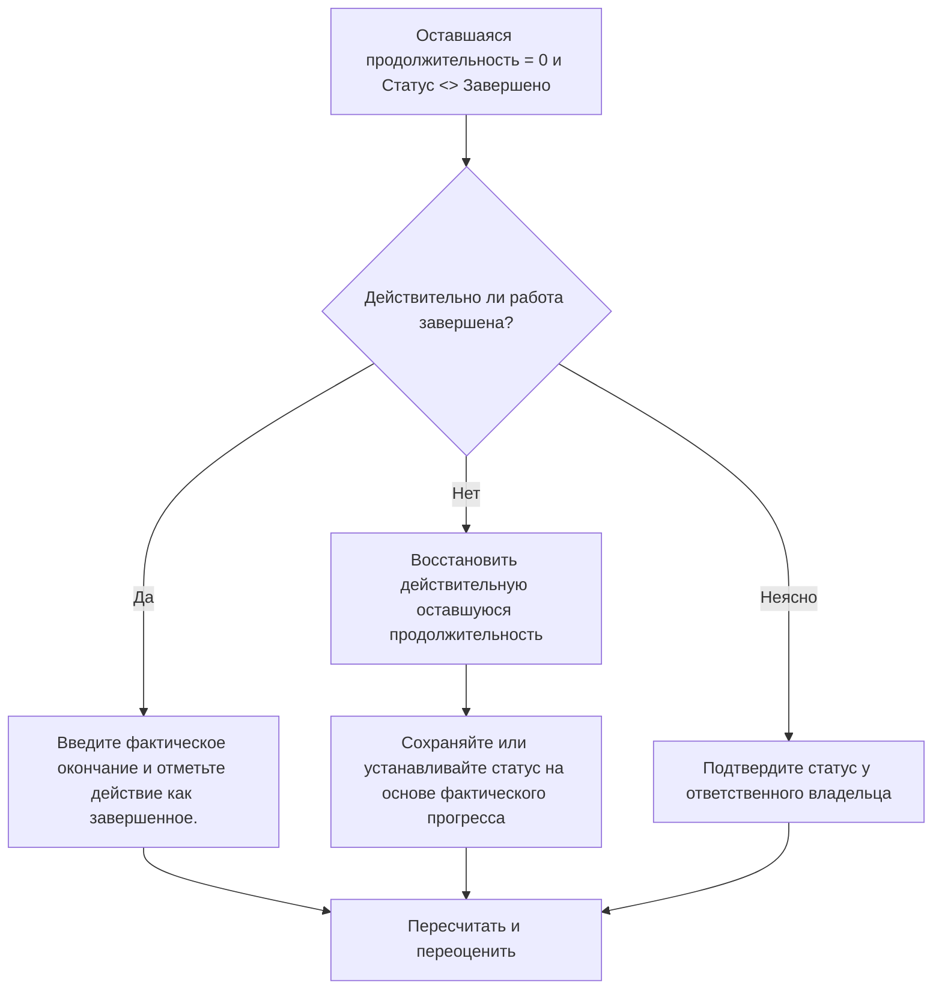

## Цель

Это руководство помогает планировщикам просматривать и исправлять действия, в которых оставшаяся продолжительность равна 0, но статус действия не завершен. Он поддерживает чистые обновления Primavera P6, выравнивая оставшуюся продолжительность, фактическое завершение и статус активности.

## Прежде чем начать

Прежде чем предпринимать действия, соберите следующую информацию:

- Текущий результат оценки для этого показателя.
- Список действий с оставшейся длительностью = 0 и статусом действия <> Завершено.
- Статус операции, фактическое начало, фактическое окончание, исходная продолжительность, оставшаяся продолжительность и продолжительность по завершению.
- Процент выполнения Тип и ключевые поля прогресса.
- Дата данных и примечания к последнему обновлению.
- Полевое подтверждение того, завершена ли работа или еще есть работа.

## Поймите свой результат

Сильный результат — ноль действий с оставшейся длительностью = 0 и статусом «Завершено».

Приемлемый результат может включать редкие случаи временного обновления, но их следует разрешить до официального отчета.

Слабый результат означает, что график содержит действия, оставшееся время которых и статус завершения не совпадают. Это может привести к созданию вводящих в заблуждение отчетов о ходе работ, неполной актуализации и ненадежным результатам прогнозирования или освоенного объема.

## Цель улучшения

Цель — 0 неразрешенных действий с оставшейся продолжительностью = 0 и статусом действия <> Завершено.

Цель состоит в том, чтобы подтвердить, является ли каждое действие завершенным и его следует закрыть, или незавершенным и должно быть восстановлено допустимое оставшееся время.

## План действий

### Шаг 1: Определите основную проблему

Создайте макет или отчет P6, который фильтрует действия, у которых оставшаяся продолжительность равна 0, а статус действия не завершен. Включите идентификатор действия, имя действия, ИСР, статус действия, фактическое начало, фактическое окончание, исходную продолжительность, оставшуюся продолжительность, тип процента завершения, процент завершения действия, начало, окончание и общий резерв.

Просмотрите каждое задание и спросите:

- Действительно ли работа завершена?
- Если завершено, почему статус действия не завершен?
- Фактическое завершение отсутствует?
- Если работа не завершена, почему оставшаяся продолжительность равна 0?
- Был ли статус импортирован или обновлен вручную?
- Является ли эта деятельность важной вехой, уровнем усилий или другим особым типом деятельности?

### Шаг 2. Примените рекомендуемые исправления

Если работа завершена, обновите действие как Завершено. Введите фактическое завершение, подтвердите, что оставшаяся продолжительность равна 0, и убедитесь, что значения хода выполнения соответствуют процедуре обновления проекта.

Если работа не завершена, восстановите соответствующую оставшуюся продолжительность. Подтвердите оставшуюся работу у ответственного владельца и сохраните статус операции «Выполняется» или «Не начато» в зависимости от фактического прогресса.

Если проблема связана с импортированными данными о ходе выполнения, просмотрите сопоставление импорта и обновите рабочий процесс. Процесс обновления не должен оставлять действия с нулевым оставшимся временем, но с незавершенным статусом.

### Шаг 3. Удалите распространенные блокировщики

К распространенным блокирующим факторам относятся отсутствие дат фактического окончания, неполное подтверждение полей, импортированные данные обновления и путаница между статусом продолжительности и статусом активности.

Другой блокировщик закрывает оставшуюся продолжительность без формального завершения действия. Оставшаяся продолжительность и статус активности должны сообщать одну и ту же историю о том, остается ли работа.

### Шаг 4. Подтвердите изменения

Пересчитайте график после исправлений. Повторно запустите метрику и убедитесь, что каждый оставшийся элемент исправлен или назначен для дальнейшего наблюдения.

Просмотрите списки выполненных работ, фактические даты окончания, отчеты о ходе выполнения, результаты освоенного объема и прогнозные отчеты, чтобы убедиться, что исправление не привело к новым несоответствиям.

## График улучшений

### День 1: Обзор и диагностика

Запустите метрику, подтвердите дату данных и разделите результаты на завершенную работу с отсутствием статуса завершения, незавершенную работу с нулевой оставшейся продолжительностью и проблемы с импортом или рабочим процессом.

### Дни 2-3: Реализация приоритетных действий

В первую очередь исправьте действия, используемые в отчетах. Введите фактическое окончание, отметьте действия как завершенные или при необходимости восстановите оставшуюся продолжительность.

### Дни 4–5: Мониторинг первых результатов

Пересчитайте график и просмотрите завершенные отчеты о деятельности, отчеты о ходе работ и полученные результаты.

### День 6: Окончательные корректировки

Решите оставшиеся неясные вопросы совместно с ответственным за дисциплину, руководителем на местах или руководителем управления проектом.

### День 7: Переоцените и сравните

Запустите оценку еще раз и сравните результат с целевым порогом.

## Отслеживание прогресса

Используйте простой трекер для управления исправлениями и утверждениями.

| Дата | Принятые меры | Ожидаемый эффект | Результат/Наблюдение | Следующий шаг |
| --- | --- | --- | --- | --- |
| [Дата] | Рассмотрено RD 0, статус не завершен. | Выявление несоответствия статуса | [Наблюдаемый результат] | Назначить владельца |
| [Дата] | Введено фактическое окончание и отмечено «Завершено». | Выровнять статус завершения | [Наблюдаемый результат] | Пересчитать график |
| [Дата] | Восстановлена ​​оставшаяся продолжительность | Исправить статус незавершенной деятельности | [Наблюдаемый результат] | Переоценить метрику |

## Если результаты не улучшаются

Если результаты не улучшаются, проверьте, не импортируются ли обновления хода выполнения, копируются или редактируются вручную непоследовательно. Проверьте, отсутствуют ли даты фактического окончания в рабочем процессе обновления или пользователи устанавливают для оставшейся продолжительности значение 0, не выполняя действия.

Эскалируйте нерешенные проблемы, когда они влияют на критическую, околокритическую, освоенную стоимость, отчеты клиентов, оплату или работу, связанную с передачей.

## Обслуживание

Просматривайте эту метрику во время каждого цикла обновления перед выпуском отчетов. Это должно быть частью стандартной проверки обновлений наряду с проверкой фактических дат, оставшейся продолжительности, процента выполнения и статуса активности.

## Сводный контрольный список

- [ ] Текущий результат рассмотрен
- [ ] Целевой порог подтвержден
- [ ] Дата подтверждения подтверждена
- [ ] Выявлена ​​основная проблема
- [ ] Завершенные действия отмечены правильно
- [ ] Фактическая дата окончания указана там, где необходимо.
- [ ] Оставшаяся продолжительность восстанавливается, если работа не завершена
- [ ] Рабочий процесс импорта или обновления проверен
- [ ] График пересчитано
- [ ] Результаты отслеживаются
- [ ] Оценка повторена
- [ ] Следующие шаги задокументированы
## Связанные материалы
- [Шаблон блога](03_blog_template.md)
- [Что такое график](../../07b_blogs_ru/01_WHAT%20A%20SCHEDULE%20IS/01_blog.md)
- [Надежная логика](../../07b_blogs_ru/02_ROBUST%20LOGIC/02_ROBUST%20LOGIC.md)
