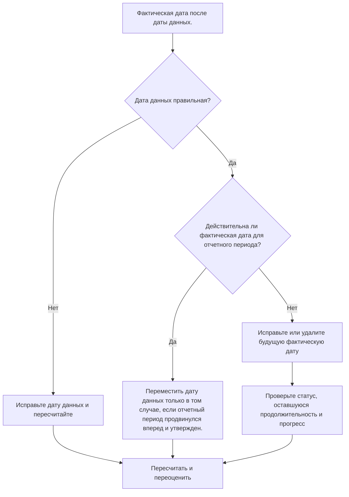

## Цель

Это руководство помогает планировщикам просматривать и корректировать действия с фактическими датами позже даты данных Primavera P6. Он поддерживает чистую дисциплину обновления, сохраняя фактическую производительность на границе обновления или до нее.

## Прежде чем начать

Прежде чем предпринимать действия, соберите следующую информацию:

- Текущий результат оценки для этого показателя.
- Данные проекта Дата, использованная в последнем обновлении графика.
- Список действий с фактическими датами, превышающими дату данных.
- Поля «Фактическое начало», «Фактическое окончание», «Состояние активности», «Оставшаяся продолжительность» и «Процент завершения».
- Источник обновления хода выполнения, например отчет с поля, файл импорта, график или обновление вручную.
- Правила прекращения обновления проекта и отчетный период.
- Любые известные рабочие записи, датированные будущим, или проблемы с импортом данных.

## Поймите свой результат

Хороший результат — отсутствие действий с фактическими датами позже даты данных.

Приемлемый результат все равно должен быть нулевым. Фактические даты после Даты данных обычно указывают на ошибку обновления или неправильную дату данных.

Слабый результат означает, что график содержит будущие фактические значения. Это может привести к тому, что отчет по графику будет работать как завершенный или запущенный до того, как период обновления фактически достигнет этой даты.

## Цель улучшения

Целью является 0 неразрешенных действий с фактическими датами, превышающими дату данных.

Цель состоит в том, чтобы подтвердить, что фактическая дата неверна, дата данных неверна или процесс импорта обновлений допускает будущие фактические значения.

## План действий

### Шаг 1: Определите основную проблему

Создайте макет или отчет P6, который фильтрует действия с фактическим началом, фактическим окончанием или другими фактическими датами, превышающими дату данных. Включите идентификатор действия, имя действия, ИСР, статус действия, фактическое начало, фактическое окончание, начало, окончание, оставшуюся продолжительность, процент завершения, календарь и ссылку на дату данных.

Просмотрите каждое задание и спросите:

- Верна ли дата данных проекта?
- Фактическая дата верна?
- Включено ли в обновление прогресс, выходящий за пределы установленной даты?
- Загрузил ли файл импорта будущие фактические даты?
- Следует ли изменить фактическую дату или следует перенести дату данных?
- Соответствует ли статус активности исправленной фактической дате?

### Шаг 2. Примените рекомендуемые исправления

Если Дата данных неправильная, исправьте ее в соответствии с утвержденным отчетным периодом и пересчитайте график.

Если фактическая дата неверна, исправьте фактическое начало или фактическое окончание на правильную дату. Если работа фактически не началась или не завершилась к дате данных, правильно удалите будущий фактический и обновленный статус, Оставшуюся продолжительность и Процент завершения.

Если проблема возникла из-за импорта, просмотрите файл импорта и сопоставление. Убедитесь, что будущие фактические даты заблокированы или проверены перед выпуском отчетов по графику.

### Шаг 3. Удалите распространенные блокировщики

К распространенным блокировщикам относятся файлы прогресса, охватывающие даты, выходящие за пределы отчетного периода, обновления вручную, вводимые без проверки даты данных, а также путаница между фактическими датами и прогнозируемыми датами.

Другой блокировщик перемещает дату данных только для того, чтобы принять будущие фактические данные. Дата данных должна представлять утвержденную границу обновления, а не изменяться случайно, чтобы скрыть ошибку статуса.

### Шаг 4. Подтвердите изменения

Пересчитайте график после исправлений. Повторно запустите метрику и убедитесь, что после даты данных не осталось фактических дат.

Просмотрите списки завершенных операций, списки незавершенных операций, результаты освоенного объема и отчеты о сравнении графиков, чтобы убедиться, что исправление не привело к другим несоответствиям статуса.

## График улучшений

### День 1: Обзор и диагностика

Запустите метрику, подтвердите дату данных и разделите результаты на неверные фактические даты, неправильную дату данных, проблемы импорта и проблемы с обновлением.

### Дни 2-3: Реализация приоритетных действий

В первую очередь исправьте действия, используемые в отчетах. Исправьте фактические даты, обновите статусы и устраните проблемы с импортом.

### Дни 4–5: Мониторинг первых результатов

Пересчитайте график и просмотрите отчеты о ходе работ, списки выполненных работ, полученные результаты и контрольные даты.

### День 6: Окончательные корректировки

Решите оставшиеся неясные вопросы совместно с ответственным за дисциплину, руководителем на местах или руководителем управления проектом.

### День 7: Переоцените и сравните

Запустите оценку еще раз и сравните результат с целевым порогом.

## Отслеживание прогресса

Используйте простой трекер для управления исправлениями и утверждениями.

| Дата | Принятые меры | Ожидаемый эффект | Результат/Наблюдение | Следующий шаг |
| --- | --- | --- | --- | --- |
| [Дата] | Проверенные фактические даты после даты данных | Определите будущие факты | [Наблюдаемый результат] | Назначить владельца |
| [Дата] | Скорректированное фактическое начало или фактическое окончание | Восстановить действительную границу статуса | [Наблюдаемый результат] | Пересчитать график |
| [Дата] | Пересмотренный процесс импорта | Предотвратить повторение будущих фактов | [Наблюдаемый результат] | Переоценить метрику |

## Если результаты не улучшаются

Если результаты не улучшаются, проверьте, не вводятся ли будущие фактические данные повторно посредством импорта, графиков или рабочих процессов обновления вручную. Просмотрите процедуру прекращения обновления и убедитесь, что дата данных четко доведена до сведения всех участников.

Эскалируйте нерешенные проблемы, когда они влияют на критическую, околокритическую, освоенную стоимость, отчеты клиентов, оплату или работу, связанную с передачей.

## Обслуживание

Просматривайте эту метрику во время каждого цикла обновления перед выпуском отчетов. Это должно быть частью стандартной проверки статуса вместе с проверками фактических дат, даты данных, оставшейся продолжительности, процента завершения и состояния активности.

## Сводный контрольный список

- [ ] Текущий результат рассмотрен
- [ ] Целевой порог подтвержден
- [ ] Дата подтверждения подтверждена
- [ ] Выявлена ​​основная проблема
- [ ] Будущие фактические даты исправлены.
- [ ] Статус активности проверен
- [ ] Оставшаяся продолжительность и прогресс проверены.
- [ ] Рабочий процесс импорта или обновления проверен
- [ ] График пересчитано
- [ ] Результаты отслеживаются
- [ ] Оценка повторена
- [ ] Следующие шаги задокументированы
## Связанные материалы
- [Шаблон блога](03_blog_template.md)
- [Что такое график](../../07b_blogs_ru/01_WHAT%20A%20SCHEDULE%20IS/01_blog.md)
- [Надежная логика](../../07b_blogs_ru/02_ROBUST%20LOGIC/02_ROBUST%20LOGIC.md)
