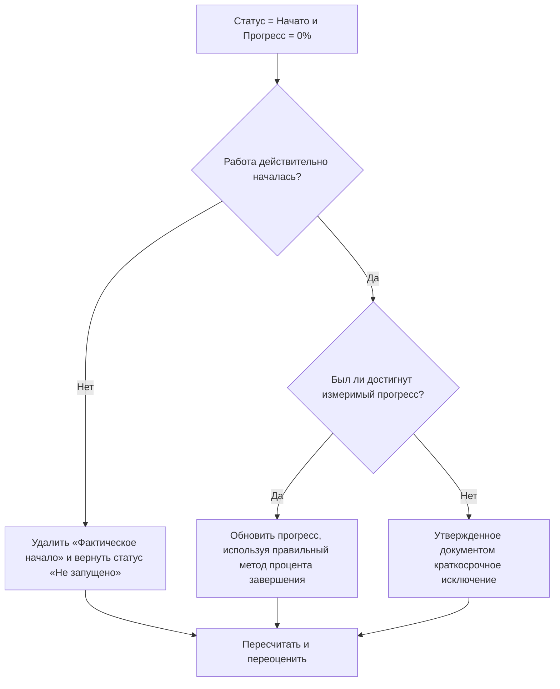

# Действия начались с 0% прогресса в Primavera P6 - Руководство по улучшению

## Цель

Это руководство помогает планировщикам просматривать и исправлять действия, в которых статус действия «Начато», но прогресс равен 0%. Он поддерживает более чистые обновления Primavera P6, выравнивая фактическое начало, статус активности, процент завершения и оставшуюся продолжительность.

## Прежде чем начать

Прежде чем предпринимать действия, соберите следующую информацию:

- Текущий результат оценки для этого показателя.
- Список действий со статусом действия = Начато и прогрессом = 0%.
- Фактическое начало, фактическое окончание, оставшаяся продолжительность, исходная продолжительность и статус активности.
- Тип процента выполнения и соответствующие поля прогресса.
- Физический процент выполнения, Продолжительность выполнения, Процент выполнения единиц и Процент выполнения действия.
- Дата данных и примечания к последнему обновлению.
- Подтверждение на месте того, действительно ли начались работы и какой прогресс был достигнут.

## Поймите свой результат

Сильный результат — ноль действий со статусом «Начато» и прогресс 0%.

Приемлемый результат может включать редкие задокументированные случаи, когда действие было начато в самом конце периода обновления, а измеримый прогресс еще не был достигнут. Эти случаи должны быть ограничены и четко объяснены.

Слабый результат означает, что график содержит действия, стартовый статус которых и значение хода выполнения не совпадают. Это может привести к созданию вводящих в заблуждение отчетов о проделанной работе, проблем с полученной стоимостью и путаницы в прогнозах.

## Цель улучшения

Цель — 0 неразрешенных действий со статусом действия = Начато и прогрессом = 0%.

Цель состоит в том, чтобы подтвердить, действительно ли началось каждое действие, был ли пропущен прогресс или следует вернуть действие в состояние «Не начато».

## План действий

### Шаг 1: Определите основную проблему

Создайте макет P6 или отчет, в котором фильтруются действия со статусом «Начато» и прогрессом 0 %. Включите идентификатор действия, имя действия, ИСР, статус действия, фактическое начало, фактическое окончание, исходную продолжительность, оставшуюся продолжительность, тип процента завершения, физический процент завершения, процент завершения продолжительности, процент завершения единиц, процент завершения действия, начало, окончание и общий резерв.

Просмотрите каждое задание и спросите:

- Работа действительно началась?
- Если работа началась, какой измеримый прогресс был достигнут?
- Верен ли фактический старт?
- Какой процент завершения используется?
- Прогресс отсутствует в нужном поле?
- Была ли деятельность начата в административном порядке без начала реальной работы?

### Шаг 2. Примените рекомендуемые исправления

Если работа фактически не началась, удалите неверное значение «Фактическое начало» и верните операцию в состояние «Не начато». Подтвердите оставшуюся продолжительность и даты прогноза остаются действительными.

Если работа началась и прогресс был достигнут, обновите правильное поле хода выполнения на основе типа «Процент завершения». В поле «Физический процент завершения» введите физический прогресс. Для параметра «Процент выполнения» подтвердите, что «Оставшаяся продолжительность» отражает выполненную работу. Для параметра «Процент выполнения единиц» подтвердите, что прогресс по единицам обновляется.

Если работа началась, но никакого измеримого прогресса не было достигнуто, задокументируйте причину. Это должно быть редким и временным явлением, например, начало мобилизации, зафиксированное ближе к моменту завершения обновления, но еще не достигнутый прогресс.

### Шаг 3. Удалите распространенные блокировщики

К распространенным препятствиям относятся отсутствие количества полей, импорт фактических запусков без значений хода выполнения, путаница в отношении типа процента выполнения и давление с требованием показать работу как начатую до того, как станет доступен измеримый прогресс.

Другой блокировщик рассматривает фактическое начало как сигнал планирования, а не как факт статуса. Фактическое начало должно означать начало реальной работы, а не намерение начать ее в ближайшее время.

### Шаг 4. Подтвердите изменения

Пересчитайте график после исправлений. Повторно запустите метрику и убедитесь, что каждый оставшийся элемент исправлен, обоснован или назначен для дальнейшего наблюдения.

Просмотрите отчеты о ходе работы, результаты освоенного объема, прогнозные отчеты и списки незавершенных действий, чтобы убедиться, что исправление не привело к новым несоответствиям.

## График улучшений

### День 1: Обзор и диагностика

Запустите метрику, подтвердите дату данных и разделите результаты на неправильные старты, отсутствующий прогресс, проблемы с процентом завершения метода и возможные исключения.

### Дни 2-3: Реализация приоритетных действий

В первую очередь исправьте действия, используемые в отчетах. Удалите неправильные фактические запуски, обновите значения прогресса или задокументируйте допустимые исключения.

### Дни 4–5: Мониторинг первых результатов

Пересчитайте график и просмотрите отчеты о ходе работы, полученные результаты, списки незавершенных работ и прогнозные отчеты.

### День 6: Окончательные корректировки

Решите оставшиеся неясные вопросы совместно с ответственным за дисциплину, руководителем на местах или руководителем управления проектом.

### День 7: Переоцените и сравните

Запустите оценку еще раз и сравните результат с целевым порогом.

## Отслеживание прогресса

Используйте простой трекер для управления исправлениями и утверждениями.

| Дата | Принятые меры | Ожидаемый эффект | Результат/Наблюдение | Следующий шаг |
| --- | --- | --- | --- | --- |
| [Дата] | Проверены начатые действия с прогрессом 0 %. | Выявление несоответствия статуса | [Наблюдаемый результат] | Назначить владельца |
| [Дата] | Удален неправильный фактический старт. | Восстановить точный статус | [Наблюдаемый результат] | Пересчитать график |
| [Дата] | Обновлено значение прогресса | Совместите статус начала с прогрессом | [Наблюдаемый результат] | Переоценить метрику |

## Если результаты не улучшаются

Если результаты не улучшаются, проверьте, импортируются ли фактические старты без сопоставления значений прогресса или команды используют разные правила для определения того, что считается начатым. Ознакомьтесь с процедурой прекращения обновления и методом процента завершения.

Эскалируйте нерешенные проблемы, когда они влияют на критическую, околокритическую, освоенную стоимость, отчеты клиентов, оплату или работу, связанную с передачей.

## Обслуживание

Просматривайте эту метрику во время каждого цикла обновления перед выпуском отчетов. Это должно быть частью стандартной проверки обновлений вместе с проверкой фактических дат, оставшейся продолжительности, процента выполнения и статуса активности.

## Сводный контрольный список

- [ ] Текущий результат рассмотрен
- [ ] Целевой порог подтвержден
- [ ] Дата подтверждения подтверждена
- [ ] Выявлена ​​основная проблема
- [ ] Неправильные фактические запуски удалены.
- [ ] Отсутствующий прогресс обновлен
- [ ] Процент завершения Тип проверен
- [ ] Действительные исключения задокументированы
- [ ] График пересчитано
- [ ] Результаты отслеживаются
- [ ] Оценка повторена
- [ ] Следующие шаги задокументированы
## Связанные материалы
- [Действия начались с 0% прогресса в Primavera P6 - Обзор](01_overview_template.md)
- [Шаблон блога](03_blog_template.md)
- [Что такое график](../../07b_blogs_ru/01_WHAT%20A%20SCHEDULE%20IS/01_blog.md)
- [Надежная логика](../../07b_blogs_ru/02_ROBUST%20LOGIC/02_ROBUST%20LOGIC.md)
