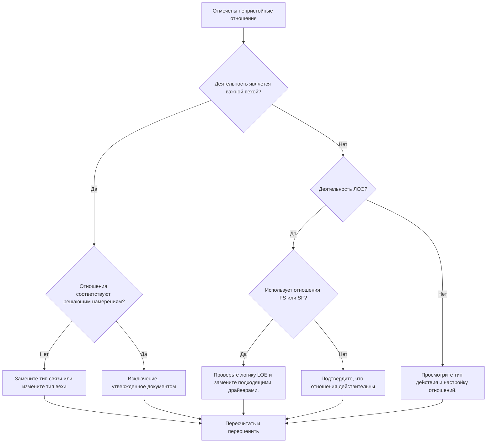

# Неблаговидные отношения в Primavera P6 - Руководство по улучшению

## Цель

Это руководство помогает планировщикам просматривать и исправлять нежелательные взаимосвязи, связанные с этапами завершения, этапами начала и уровнем усилий (LOE) в Primavera P6.

## Прежде чем начать

Прежде чем предпринимать действия, соберите следующую информацию:

- Текущий результат оценки для этого показателя.
- Список помеченных связей по предшественнику, преемнику, типу действия и типу связи.
- Идентификатор действия, имя действия, ИСР, тип действия, начало, окончание, общий резерв и состояние критического или самого длинного пути.
- Тип связи, задержка, тип предшествующего действия и тип последующего действия.
- Цель этапа, цель LOE и соответствующие требования к отчетности.
- Дата данных и последний результат расчета графика.

## Поймите свой результат

Сильный результат – ноль неразрешенных неблаговидных отношений.

Метрика должна отмечать следующие случаи:

- Завершите Milestone преемником SS или SF.
- Завершите Milestone предшественником SS.
- Запустите Milestone с предшественником FF или SF.
- Запустите Milestone с преемником FS или FF.
- Связь LOE с FS.
- LOE с отношениями SF.

Могут существовать редкие исключения, но они должны быть задокументированы и легко объяснимы во время проверки графика.

## Цель улучшения

Цель – 0 неразрешенных неблаговидных отношений.

Цель состоит в том, чтобы каждая веха и взаимосвязь LOE соответствовали предполагаемому поведению планирования, не навязывая даты и не скрывая слабую логику.

## План действий

### Шаг 1: Определите основную проблему

Создайте макет или отчет P6, в котором будут показаны все этапы и действия LOE с подробностями о предшественниках и преемниках. Включите тип активности, тип связи, задержку, начало, окончание, общий резерв и индикаторы критического или самого длинного пути.

Просмотрите каждую отмеченную связь и спросите:

- Верен ли вид деятельности?
- Соответствует ли тип отношений цели этапа или LOE?
- Пытаются ли отношения навязать начало, окончание или отчетную дату?
- Будет ли нормальная связь FS, SS или FF лучше отражать логику?
- Являются ли отношения одобренным исключением?

### Шаг 2. Примените рекомендуемые исправления

Для этапов завершения убедитесь, что логика управляет завершением или реагирует на него. Замените отношения SS или SF, если они не представляют реальной зависимости, основанной на финише.

Для стартовых этапов убедитесь, что логика поддерживает стартовое событие. Замените FF, SF, преемника FS или другие неподходящие отношения, когда они используются для принудительного установления отчетной даты.

Для действий LOE проверьте, не приводят ли отношения FS или SF к дискретной работе привода LOE. Действия LOE обычно обобщают или охватывают другую работу, поэтому к их взаимоотношениям следует относиться осторожно.

Если отношения действительны по контракту, методу клиента или специальному графику, задокументируйте причину и одобрение.

### Шаг 3. Удалите распространенные блокировщики

К распространенным блокаторам относятся копирование логики из старых графиков, неправильное понимание поведения этапов, использование отношений SF в качестве ярлыка и использование действий LOE для контроля работы, которая должна управляться дискретными действиями.

Еще один блокатор рассматривает очищение отношений как косметическое средство. Эти связи могут влиять на резервы, отчеты о критическом пути, даты контрольных точек и достоверность графика.

### Шаг 4. Подтвердите изменения

Пересчитайте график после исправлений. Повторно запустите метрику и убедитесь, что каждый оставшийся элемент исправлен, обоснован или назначен для дальнейшего наблюдения.

Просмотрите даты контрольных точек, даты LOE, общий резерв, критический или самый длинный путь и ключевые результаты отчетности, чтобы убедиться, что исправление не создало новых проблем.

## График улучшений

### День 1: Обзор и диагностика

Запустите метрику и сгруппируйте результаты по типу активности и шаблону отношений.

### Дни 2-3: Реализация приоритетных действий

В первую очередь исправьте отношения на критических, околокритических, договорных, передаточных и клиентских этапах.

### Дни 4–5: Мониторинг первых результатов

Пересчитайте график и просмотрите резерв, критический путь, движение контрольных точек и поведение LOE.

### День 6: Окончательные корректировки

Устраните оставшиеся исключения вместе с планировщиком, руководителем управления проектом или проверяющим PMO.

### День 7: Переоцените и сравните

Запустите оценку еще раз и сравните результат с целевым порогом.

## Отслеживание прогресса

Используйте простой трекер для управления исправлениями и утверждениями.

| Дата | Принятые меры | Ожидаемый эффект | Результат/Наблюдение | Следующий шаг |
| --- | --- | --- | --- | --- |
| [Дата] | Пересмотрел неблаговидные отношения | Выявление проблем типа отношений | [Наблюдаемый результат] | Назначить владельца |
| [Дата] | Исправлено соотношение вех | Согласуйте логику с целью этапа | [Наблюдаемый результат] | Пересчитать график |
| [Дата] | Пересмотренные отношения LOE | Предотвращение неправильного управления дискретной работой LOE | [Наблюдаемый результат] | Переоценить метрику |

## Если результаты не улучшаются

Если результаты не улучшаются, проверьте, не вводятся ли те же самые отношения повторно посредством импорта, копирования логики, глобальных изменений или интеграции внешнего графика.

Эскалируйте нерешенные вопросы, если они влияют на этапы контракта, отчеты о критическом пути, заявки клиентов, события оплаты или даты передачи.

## Обслуживание

Просматривайте эту метрику во время каждого цикла обновления и перед утверждением базового показателя. Это особенно полезно после импорта графика, копирования фрагментов, существенного изменения последовательности и изменений контрольных точек.

## Сводный контрольный список

- [ ] Текущий результат рассмотрен
- [ ] Целевой порог подтвержден
- [ ] Рассмотрены типы мероприятий Milestone и LOE
- [ ] Помеченные типы отношений проверены
- [ ] Исправлены неправильные отношения
- [ ] Действительные исключения задокументированы
- [ ] График пересчитано
- [ ] Путь резерва времени и критический путь рассмотрены
- [ ] Результаты отслеживаются
- [ ] Оценка повторена
- [ ] Следующие шаги задокументированы
## Связанные материалы
- [01_overview_template](../14_unusual_relations/01_overview_template.md)
- [03_blog_template](../14_unusual_relations/03_blog_template.md)
- [Что такое график](../../07b_blogs_ru/01_WHAT%20A%20SCHEDULE%20IS/01_blog.md)
- [Надежная логика](../../07b_blogs_ru/02_ROBUST%20LOGIC/02_ROBUST%20LOGIC.md)
