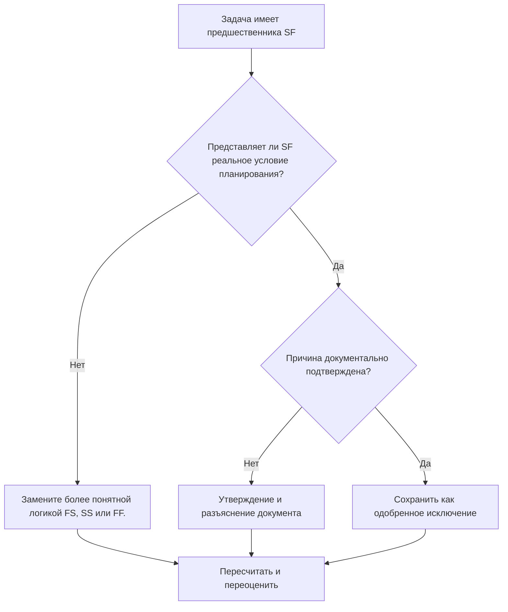

# Действия с задачами с предшественниками SF в Primavera P6 - Руководство по улучшению

## Цель

Это руководство помогает планировщикам просматривать и корректировать действия задач, которые имеют отношения предшественников «Начало-Окончание» (SF) в Primavera P6.

## Прежде чем начать

Прежде чем предпринимать действия, соберите следующую информацию:

- Текущий результат оценки для этого показателя.
- Список действий задачи, по крайней мере, с одним предшественником SF.
- Идентификатор действия, имя действия, ИСР, тип действия, начало, окончание, общий резерв и состояние критического или самого длинного пути.
- Идентификатор действия предшественника, тип действия предшественника, тип связи и задержка.
- Любые ограничения, календари, ожидаемые условия завершения и соответствующие примечания к обновлению.
- Дата данных и последний результат расчета графика.

## Поймите свой результат

Хороший результат — отсутствие нерешенных задач с отношениями предшественников SF.

Отношения SF означают, что последующая операция не может завершиться до тех пор, пока не начнется предшествующая операция. Это редкость в обычном строительстве, проектировании, закупках или вводе в эксплуатацию. Большинство взаимосвязей задач следует представлять с помощью логики FS, SS или FF, если они отражают реальную последовательность.

Слабый результат означает, что завершение действий задачи может контролироваться логикой, которую трудно обосновать или которая была скопирована из другой части графика без проверки.

## Цель улучшения

Цель — 0 неразрешенных отношений предшественников SF в действиях задачи.

Цель состоит в том, чтобы подтвердить, является ли каждое отношение SF допустимой моделью планирования или его следует заменить более четкой логикой.

## План действий

### Шаг 1: Определите основную проблему

Создайте макет P6 или отчет, который фильтрует действия задачи с помощью предшественника SF. Включите идентификаторы предшественника и преемника, тип действия, тип связи, задержку, начало, окончание, общий резерв, ограничения и индикаторы критического или самого длинного пути.

Просмотрите каждое отношение и спросите:

- Какое реальное состояние пытаются отобразить отношения научной фантастики?
- Должен ли предшествующий старт действительно контролировать последующий финиш?
- Будет ли логика FS, SS или FF более четко описывать последовательность?
- Используется ли задержка для принудительного свидания?
- Находятся ли отношения на критическом или околокритическом пути?
- Есть ли документально подтвержденная причина использования SF?

### Шаг 2. Примените рекомендуемые исправления

Если связь SF не представляет реального состояния, замените ее типом связи, который лучше всего описывает последовательность. Используйте FS, когда преемник должен начать работу после завершения предшественника, SS, когда старты связаны, и FF, когда выравнивание завершения является предполагаемой логикой.

Если связь SF была добавлена ​​для управления датой окончания, проверьте, нужен ли графику соответствующий предшественник, контрольная точка, проверка ограничений или разделение работ.

Если отношения SF действительны, задокументируйте, почему они необходимы и кто их утвердил. Это должно быть редким исключением, а не общепринятой схемой планирования.

### Шаг 3. Удалите распространенные блокировщики

Распространенными блокировщиками являются копирование отношений, импортированная внешняя логика, неправильное понимание поведения НФ и использование НФ с задержкой для принудительной даты окончания.

Другой блокировщик разрывает отношения, потому что рассчитанная дата выглядит приемлемой. Отношения по-прежнему должны быть логически обоснованными.

### Шаг 4. Подтвердите изменения

Пересчитайте график после исправлений. Повторно запустите метрику и убедитесь, что каждый оставшийся предшественник SF исправлен, обоснован или назначен для дальнейшего наблюдения.

Просмотрите общий резерв, критический или самый длинный путь, затронутые контрольные точки и прогнозные результаты, чтобы убедиться, что изменение логики не создало новых проблем.

## График улучшений

### День 1: Обзор и диагностика

Запустите метрику, подтвердите дату данных и разделите результаты на недопустимые отношения SF, возможные исключения и элементы, требующие участия владельца.

### Дни 2-3: Реализация приоритетных действий

В первую очередь исправьте отношения SF по критическим, околокритическим, контрактным и краткосрочным действиям.

### Дни 4–5: Мониторинг первых результатов

Пересчитайте график и просмотрите резерв, критический путь, прогнозные даты и движение вех.

### День 6: Окончательные корректировки

Устраните оставшиеся исключения вместе с планировщиком, руководителем дисциплины, руководителем управления проектом или проверяющим PMO.

### День 7: Переоцените и сравните

Запустите оценку еще раз и сравните результат с целевым порогом.

## Отслеживание прогресса

Используйте простой трекер для управления исправлениями и утверждениями.

| Дата | Принятые меры | Ожидаемый эффект | Результат/Наблюдение | Следующий шаг |
| --- | --- | --- | --- | --- |
| [Дата] | Рассмотрены действия по задачам с предшественниками SF | Определить необычную логику отношений | [Наблюдаемый результат] | Назначить владельца |
| [Дата] | Заменены неверные отношения SF. | Улучшите логическую ясность | [Наблюдаемый результат] | Пересчитать график |
| [Дата] | Документированное действительное исключение SF | Сохранять утвержденную специальную логику | [Наблюдаемый результат] | Переоценить метрику |

## Если результаты не улучшаются

Если результаты не улучшаются, проверьте, не вводятся ли отношения SF повторно посредством импорта, копирования фрагментов, глобальных изменений или интеграции внешнего графика.

Эскалируйте нерешенные вопросы, если они влияют на критический путь, этапы контракта, заявки клиентов, события оплаты или краткосрочные работы по выполнению.

## Обслуживание

Просматривайте эту метрику во время каждого цикла обновления и перед утверждением базового показателя. Это особенно полезно после импорта по графику, существенного изменения последовательности и упражнений по очистке логики.

## Сводный контрольный список

- [ ] Текущий результат рассмотрен
- [ ] Целевой порог подтвержден
- [ ] Создан список предшественников SF
- [ ] Критические и околокритические элементы имеют приоритет
- [ ] Исправлены неверные отношения SF.
- [ ] Действительные исключения задокументированы
- [ ] График пересчитано
- [ ] Путь резерва времени и критический путь рассмотрены
- [ ] Результаты отслеживаются
- [ ] Оценка повторена
- [ ] Следующие шаги задокументированы
## Связанные материалы
- [Действия с задачами с предшественниками SF в Primavera P6 - Обзор](01_overview_template.md)
- [Действия с задачами с предшественниками SF в Primavera P6](03_blog_template.md)
- [Что такое график](../../07b_blogs_ru/01_WHAT%20A%20SCHEDULE%20IS/01_blog.md)
- [Надежная логика](../../07b_blogs_ru/02_ROBUST%20LOGIC/02_ROBUST%20LOGIC.md)
