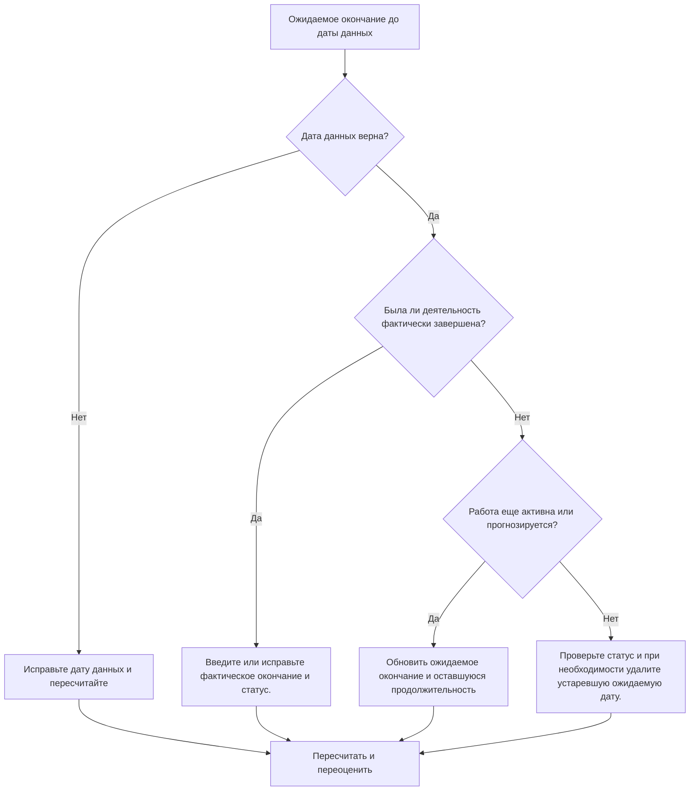

# Ожидаемое завершение до даты данных в Primavera P6 - Руководство по улучшению

## Цель

Это руководство помогает планировщикам просматривать и исправлять действия, ожидаемая дата окончания которых предшествует дате данных Primavera P6. Он поддерживает более четкую дисциплину обновлений, сохраняя ожидаемые даты в соответствии с текущими границами отчетности.

## Прежде чем начать

Прежде чем предпринимать действия, соберите следующую информацию:

- Текущий результат оценки для этого показателя.
- Данные проекта Дата, использованная в последнем обновлении графика.
- Список действий, ожидаемое окончание которых наступает раньше даты данных.
- Статус операции, фактическое начало, фактическое окончание, оставшаяся продолжительность, процент завершения, начало, окончание и общий резерв.
- Источник ожидаемого завершения, например ввод вручную, файл импорта, прогноз поля или рабочий процесс обновления P6.
- Правила прекращения обновления проекта и последние заметки о ходе работ.

## Поймите свой результат

Хорошим результатом является отсутствие операций с ожидаемым завершением раньше даты данных.

Ожидаемое завершение до Даты данных обычно означает, что прогноз или информация об ожидаемом завершении не были обновлены при перемещении графика вперед. Это также может указывать на то, что операция должна иметь фактическое окончание, пересмотренную оставшуюся продолжительность или исправленный статус.

Слабый результат означает, что график содержит ожидаемые даты завершения, которые находятся в прошлом относительно текущей границы обновления.

## Цель улучшения

Целью является 0 неразрешенных действий с ожидаемым завершением ранее даты данных.

Цель состоит в том, чтобы подтвердить, было ли каждое действие завершено, все еще выполняется, не началось или было неправильно обновлено.

## План действий

### Шаг 1: Определите основную проблему

Создайте макет или отчет P6, который фильтрует действия, у которых ожидаемое окончание раньше даты данных. Включите идентификатор действия, имя действия, ИСР, статус действия, ожидаемое завершение, фактическое начало, фактическое окончание, оставшуюся продолжительность, процент завершения, начало, окончание, общий резерв и календарь.

Просмотрите каждое задание и спросите:

- Дата данных правильная?
- Была ли деятельность фактически завершена до Даты данных?
- Если оно завершено, отсутствует ли фактическое завершение?
- Если он не завершился, следует ли обновлять ожидаемое окончание?
- Представляет ли оставшаяся продолжительность оставшуюся работу?
- Не остался ли при импорте или обновлении вручную старое значение ожидаемого завершения?

### Шаг 2. Примените рекомендуемые исправления

Если Дата данных неправильная, исправьте ее в соответствии с утвержденным отчетным периодом и пересчитайте график.

Если действие завершилось до Даты данных, введите или исправьте фактическое окончание и убедитесь, что статус действия, процент завершения и оставшаяся продолжительность совпадают.

Если действие все еще активно или не завершено, обновите ожидаемое окончание до действительной даты, наступающей на дату данных или после нее. Подтвердите оставшуюся продолжительность и прогнозные даты отражают последнюю информацию о поле.

Если ожидаемое окончание было введено посредством импорта, просмотрите файл импорта и сопоставление, чтобы устаревшие ожидаемые даты не загружались повторно.

### Шаг 3. Удалите распространенные блокировщики

К распространенным блокировщикам относятся устаревшие прогнозы по полям, импорт прогресса, который обновляет процент завершения, но не ожидаемые даты, а также путаницу между ожидаемым окончанием, прогнозируемым окончанием и фактическим окончанием.

Другой блокировщик игнорирует ожидаемое окончание, поскольку запланированные даты выглядят приемлемыми. В P6 ожидаемые даты могут влиять на расчет графика в зависимости от настроек и рабочих процессов, поэтому следует просмотреть устаревшие значения.

### Шаг 4. Подтвердите изменения

Пересчитайте график после исправлений. Повторно запустите метрику и убедитесь, что до Даты данных не осталось нерешенных дат ожидаемого окончания.

Просмотрите текущие действия, прогноз на ближайшую перспективу, общий резерв, даты контрольных этапов и отчеты о сравнении графиков, чтобы убедиться, что исправление не привело к новым несоответствиям.

## График улучшений

### День 1: Обзор и диагностика

Запустите метрику, подтвердите дату данных и разделите результаты на завершенную работу, устаревшие ожидаемые даты, проблемы с оставшейся продолжительностью и проблемы с импортом.

### Дни 2-3: Реализация приоритетных действий

В первую очередь исправьте действия, используемые в отчетах. При необходимости обновите фактическое окончание, ожидаемое окончание, оставшуюся продолжительность, процент выполнения или статус активности.

### Дни 4–5: Мониторинг первых результатов

Пересчитайте график и просмотрите предварительные отчеты, списки незавершенных действий, движение этапов и плавающие изменения.

### День 6: Окончательные корректировки

Решите оставшиеся неясные вопросы совместно с ответственным за дисциплину, руководителем на местах или руководителем управления проектом.

### День 7: Переоцените и сравните

Запустите оценку еще раз и сравните результат с целевым порогом.

## Отслеживание прогресса

Используйте простой трекер для управления исправлениями и утверждениями.

| Дата | Принятые меры | Ожидаемый эффект | Результат/Наблюдение | Следующий шаг |
| --- | --- | --- | --- | --- |
| [Дата] | Рассмотрено ожидаемое завершение до даты данных | Определите устаревшие ожидаемые даты | [Наблюдаемый результат] | Назначить владельца |
| [Дата] | Обновленное ожидаемое или фактическое окончание | Выровнять статус по границе обновления | [Наблюдаемый результат] | Пересчитать график |
| [Дата] | Пересмотренный процесс импорта | Предотвратить повторение устаревших ожидаемых дат | [Наблюдаемый результат] | Переоценить метрику |

## Если результаты не улучшаются

Если результаты не улучшаются, проверьте, не импортируются ли ожидаемые даты из полевых систем, электронных таблиц или файлов предыдущих обновлений без проверки. Просмотрите рабочий процесс обновления и подтвердите, кто является владельцем обновлений ожидаемого завершения.

Эскалируйте нерешенные проблемы, когда они влияют на критические, околокритические отчеты клиентов, платежи, передачу или краткосрочные работы по выполнению.

## Обслуживание

Просматривайте эту метрику во время каждого цикла обновления перед выпуском отчетов. Это должно быть частью стандартной проверки статуса вместе с проверками даты данных, фактических дат, оставшейся продолжительности, процента завершения и состояния активности.

## Сводный контрольный список

- [ ] Текущий результат рассмотрен
- [ ] Целевой порог подтвержден
- [ ] Дата подтверждения подтверждена
- [ ] Создан список ожидаемого завершения
- [ ] Завершенная работа с учетом фактического завершения
- [ ] Устаревшие даты ожидаемого окончания обновлены.
- [ ] Оставшаяся продолжительность проверена
- [ ] Статус активности и процент завершения проверены
- [ ] Рабочий процесс импорта или обновления проверен
- [ ] График пересчитано
- [ ] Оценка повторена
- [ ] Следующие шаги задокументированы
## Связанные материалы
- [Ожидаемое завершение до даты данных в Primavera P6 - Обзор](01_overview_template.md)
- [Ожидаемое завершение до даты данных в Primavera P6](03_blog_template.md)
- [Что такое график](../../07b_blogs_ru/01_WHAT%20A%20SCHEDULE%20IS/01_blog.md)
- [Надежная логика](../../07b_blogs_ru/02_ROBUST%20LOGIC/02_ROBUST%20LOGIC.md)
