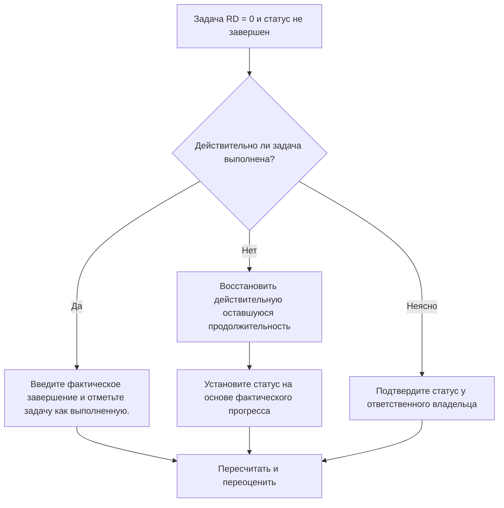

## Цель

Это руководство помогает планировщикам проверять и исправлять действия задач, в которых оставшаяся продолжительность равна 0, но состояние задачи не является завершенным. Он поддерживает чистые обновления Primavera P6, выравнивая оставшуюся работу, фактическое завершение и статус активности.

## Прежде чем начать

Прежде чем предпринимать действия, соберите следующую информацию:

- Текущий результат оценки для этого показателя.
- Список действий задачи с оставшейся продолжительностью = 0 и статусом «Не завершено».
- Идентификатор действия, имя действия, ИСР, тип действия, статус действия, фактическое начало, фактическое окончание, исходная продолжительность, оставшаяся продолжительность и продолжительность после завершения.
- Процент выполнения Тип и ключевые поля прогресса.
- Дата данных и примечания к последнему обновлению.
- Полевое подтверждение того, выполнена ли задача или еще есть работа.

## Поймите свой результат

Хорошим результатом является нулевая активность задачи с оставшейся продолжительностью = 0 и статусом «Завершено».

Эта метрика ограничена действиями по задачам, поэтому проверка фокусируется на обычных рабочих действиях, а не на контрольных точках или записях LOE. Задача с нулевой оставшейся продолжительностью обычно должна иметь статус выполненной и фактическое завершение.

Слабый результат означает, что график содержит задачи, оставшееся время выполнения и статус выполнения которых не совпадают.

## Цель улучшения

Целью является 0 нерешенных действий задачи с оставшейся длительностью = 0 и статусом «Завершено».

Цель состоит в том, чтобы подтвердить, является ли каждая задача завершенной и должна быть закрыта или неполной и должна ли быть восстановлена ​​действительная оставшаяся продолжительность.

## План действий

### Шаг 1: Определите основную проблему

Создайте макет P6 или отчет, который фильтрует действия задач, где оставшаяся продолжительность равна 0, а состояние действия не является завершенным. Включите идентификатор действия, имя действия, ИСР, тип действия, статус действия, фактическое начало, фактическое окончание, исходную продолжительность, оставшуюся продолжительность, тип процента завершения, процент завершения действия, начало, окончание и общий резерв.

Просмотрите каждое задание и спросите:

- Действительно ли задача выполнена?
- Если завершено, почему статус не «Завершено»?
- Фактическое завершение отсутствует?
- Если работа не завершена, почему оставшаяся продолжительность равна 0?
- Был ли статус импортирован или обновлен вручную?
- Соответствует ли метод процента завершения сделанному обновлению?

### Шаг 2. Примените рекомендуемые исправления

Если задача выполнена, обновите действие как Завершено. Введите фактическое завершение, подтвердите, что оставшаяся продолжительность равна 0, и убедитесь, что значения хода выполнения соответствуют процедуре обновления проекта.

Если задача не завершена, восстановите соответствующую оставшуюся продолжительность. Подтвердите оставшуюся работу у ответственного владельца и сохраните статус задачи «Выполняется» или «Не начато» в зависимости от фактического хода выполнения.

Если проблема связана с импортированными данными о ходе выполнения, просмотрите сопоставление импорта и обновите рабочий процесс. Процесс обновления не должен оставлять действия задачи с нулевым оставшимся временем, но с незавершенным статусом.

### Шаг 3. Удалите распространенные блокировщики

К распространенным блокирующим факторам относятся отсутствие дат фактического окончания, неполное подтверждение полей, импортированные данные обновления и путаница между статусом продолжительности и статусом активности.

Другой блокировщик — уменьшение оставшейся продолжительности до 0, чтобы показать прогресс без формального завершения задачи. Оставшаяся продолжительность и статус активности должны сообщать одну и ту же историю о том, остается ли работа.

### Шаг 4. Подтвердите изменения

Пересчитайте график после исправлений. Повторно запустите метрику и убедитесь, что каждый оставшийся элемент исправлен или назначен для дальнейшего наблюдения.

Просмотрите списки выполненных задач, фактические даты завершения, отчеты о ходе выполнения, результаты освоенного объема и прогнозные отчеты, чтобы убедиться, что исправление не привело к новым несоответствиям.

## График улучшений

### День 1: Обзор и диагностика

Запустите метрику, подтвердите дату данных и разделите результаты на завершенные задачи с отсутствующим статусом завершения, незавершенные задачи с нулевой оставшейся продолжительностью, а также проблемы с импортом или рабочим процессом.

### Дни 2-3: Реализация приоритетных действий

Сначала исправьте задачи, используемые в отчетах. Введите «Фактическое завершение», отметьте задачи как выполненные или восстановите оставшуюся продолжительность по мере необходимости.

### Дни 4–5: Мониторинг первых результатов

Пересчитайте график и просмотрите отчеты о выполненных задачах, отчеты о ходе выполнения, полученные результаты и прогнозные отчеты.

### День 6: Окончательные корректировки

Решите оставшиеся неясные вопросы совместно с ответственным за дисциплину, руководителем на местах или руководителем управления проектом.

### День 7: Переоцените и сравните

Запустите оценку еще раз и сравните результат с целевым порогом.

## Отслеживание прогресса

Используйте простой трекер для управления исправлениями и утверждениями.

| Дата | Принятые меры | Ожидаемый эффект | Результат/Наблюдение | Следующий шаг |
| --- | --- | --- | --- | --- |
| [Дата] | Рассмотрена задача RD 0, статус не выполнен. | Выявление несоответствия статуса задачи | [Наблюдаемый результат] | Назначить владельца |
| [Дата] | Введено фактическое окончание и отмечено завершение | Выровнять статус завершения | [Наблюдаемый результат] | Пересчитать график |
| [Дата] | Восстановлена ​​оставшаяся продолжительность | Исправить статус незавершенной задачи | [Наблюдаемый результат] | Переоценить метрику |

## Если результаты не улучшаются

Если результаты не улучшаются, проверьте, не импортируются ли обновления хода выполнения, копируются или редактируются вручную непоследовательно. Проверьте, отсутствуют ли даты фактического окончания в рабочем процессе обновления или пользователи устанавливают для оставшейся продолжительности значение 0, не выполняя задачи.

Эскалируйте нерешенные проблемы, когда они влияют на критическую, околокритическую, освоенную стоимость, отчеты клиентов, оплату или работу, связанную с передачей.

## Обслуживание

Просматривайте эту метрику во время каждого цикла обновления перед выпуском отчетов. Это должно быть частью стандартной проверки статуса задачи наряду с проверками фактических дат, оставшейся продолжительности, процента выполнения и статуса активности.

## Сводный контрольный список

- [ ] Текущий результат рассмотрен
- [ ] Целевой порог подтвержден
- [ ] Дата подтверждения подтверждена
- [ ] Фильтр только для задач подтвержден
- [ ] Выявлена ​​основная проблема
- [ ] Выполненные задачи отмечены правильно
- [ ] Фактическая дата окончания указана там, где необходимо.
- [ ] Оставшаяся продолжительность восстанавливается, если работа не завершена
- [ ] Рабочий процесс импорта или обновления проверен
- [ ] График пересчитано
- [ ] Оценка повторена
- [ ] Следующие шаги задокументированы
## Связанные материалы
- [Оставшаяся продолжительность задачи равна нулю, пока статус не завершен](03_blog_template.md)
- [Что такое график](../../07b_blogs_ru/01_WHAT%20A%20SCHEDULE%20IS/01_blog.md)
- [Надежная логика](../../07b_blogs_ru/02_ROBUST%20LOGIC/02_ROBUST%20LOGIC.md)
