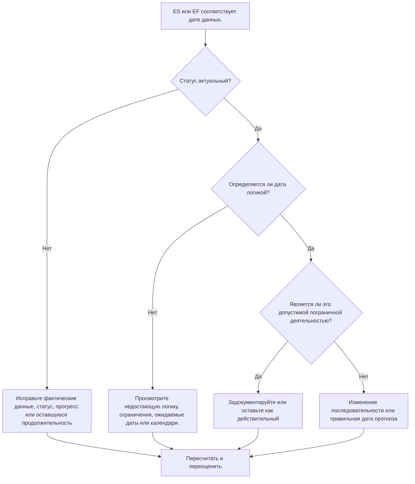

# Действия с датой данных - Руководство по улучшению

## Цель

Это руководство помогает планировщикам просматривать действия, ранний старт или раннее окончание которых приходится точно на дату данных Primavera P6. Он поддерживает проверки цикла обновления, показывая, где собирается работа на границе между фактической производительностью и прогнозируемой работой.

## Прежде чем начать

Прежде чем предпринимать действия, соберите следующую информацию:

- Текущий результат оценки для этого показателя.
- Данные проекта Дата, использованная в последнем расчете графика.
- Список мероприятий, для которых раннее начало = дата данных.
- Список мероприятий, где раннее окончание = дата данных.
- Статус активности, фактическое начало, фактическое окончание, оставшаяся продолжительность, начало, окончание, общий резерв и календарь.
- Подробности взаимоотношений предшественника и преемника.
- Ограничения, ожидаемые даты и примечания к обновлениям.

## Поймите свой результат

Хорошим результатом является отсутствие необъяснимых действий с ранним началом или ранним окончанием на дату данных.

Некоторые действия могут законно соответствовать дате данных, особенно краткосрочная работа, которая готова к продолжению, или работа, завершающаяся на границе обновления. Проблема не только в дате; проблема в том, объясняется ли дата действительным статусом, логикой и информацией об обновлении.

Слабый результат означает, что многие виды деятельности собираются на дату сбора данных без четкой причины, связанной с графиком.

## Цель улучшения

Целью является 0 необъяснимых действий с ES = Дата данных или EF = Дата данных.

Цель состоит в том, чтобы подтвердить, что каждое действие имеет правильный статус, логически обусловлено и прогнозируется на основе правильной границы обновления.

## План действий

### Шаг 1: Определите основную проблему

Создайте макет или отчет P6, который фильтрует действия, где раннее начало соответствует дате данных, а раннее окончание соответствует дате данных. Включите идентификатор действия, имя действия, ИСР, статус действия, раннее начало, раннее окончание, начало, окончание, фактическое начало, фактическое окончание, оставшуюся продолжительность, общий резерв, календарь, ограничения, предшественников и преемников.

Просмотрите каждое задание и спросите:

- Действие завершено, находится в процессе или еще не начато?
- Отсутствует фактическое начало или фактическое окончание?
- Логически ли деятельность привязана к дате данных?
- Перемещает ли действие ограничение, ожидаемая дата или календарь на дату данных?
- Является ли деятельность открытой или слабо связанной?
- Соответствует ли дата данных периоду обновления?

### Шаг 2. Примените рекомендуемые исправления

Если статус неполный, исправьте фактическое начало, фактическое окончание, оставшуюся продолжительность, процент завершения и статус активности, прежде чем изменять логику.

Если действие начинается в дату данных, поскольку логика предшественника отсутствует или не является движущей силой, добавьте или исправьте связи, которые представляют реальную последовательность работ.

Если действие завершается в дату данных, поскольку ход выполнения не был обновлен, подтвердите, завершилась ли работа к границе обновления. Введите фактическое окончание, если оно завершено, или обновите оставшуюся продолжительность и прогнозируемое окончание, если работа еще не завершена.

Если ограничения или ожидаемые даты отодвигают действия к дате данных, удалите, измените или задокументируйте их в соответствии с процедурой управления проектом.

### Шаг 3. Удалите распространенные блокировщики

К распространенным блокирующим факторам относятся неполная актуализация, открытые начала и открытые финиши, ограничения, используемые в качестве замены логики, а также перемещение даты данных без достаточного анализа статуса.

Другой блокировщик предполагает, что действия в дату данных безвредны. Большой кластер на границе обновления может скрыть недостающую последовательность или сделать краткосрочный прогноз более чистым, чем он есть на самом деле.

### Шаг 4. Подтвердите изменения

Пересчитайте график после исправлений. Повторно запустите метрику и убедитесь, что каждое оставшееся действие на дату данных объясняется текущим статусом, допустимой логикой или утвержденным исключением.

Просмотрите общий резерв, критический или самый длинный путь, контрольные даты и краткосрочные прогнозные отчеты, чтобы убедиться, что исправление не привело к новым несоответствиям.

## График улучшений

### День 1: Обзор и диагностика

Запустите метрику, подтвердите дату данных и разделите результаты на ES по дате данных, EF по дате данных, проблемы со статусом, логические проблемы, ограничения и действительные граничные действия.

### Дни 2-3: Реализация приоритетных действий

В первую очередь корректируйте критические, околокритические и краткосрочные действия. Обновите статус, добавьте или исправьте логику и просмотрите ограничения.

### Дни 4–5: Мониторинг первых результатов

Пересчитайте график и просмотрите прогнозные результаты, изменения в резерве, движение этапов и действия, все еще находящиеся на дате данных.

### День 6: Окончательные корректировки

Решите оставшиеся неясные вопросы совместно с ответственным за дисциплину, руководителем на местах или руководителем управления проектом.

### День 7: Переоцените и сравните

Запустите оценку еще раз и сравните результат с целевым порогом.

## Отслеживание прогресса

Используйте простой трекер для управления исправлениями и утверждениями.

| Дата | Принятые меры | Ожидаемый эффект | Результат/Наблюдение | Следующий шаг |
| --- | --- | --- | --- | --- |
| [Дата] | Рассмотрено ES/EF на дату сбора данных | Определить граничную кластеризацию | [Наблюдаемый результат] | Назначить владельца |
| [Дата] | Исправленный статус или фактические даты | Согласуйте рабочий статус с границей обновления | [Наблюдаемый результат] | Пересчитать график |
| [Дата] | Исправлена ​​логика или ограничения. | Уменьшите необъяснимую кластеризацию дат данных | [Наблюдаемый результат] | Переоценить метрику |

## Если результаты не улучшаются

Если результаты не улучшаются, проверьте, не переносят ли действия повторно к дате данных из-за отсутствия логики, ограничений, устаревших ожидаемых дат или неполных процедур обновления.

Эскалируйте нерешенные вопросы, когда они влияют на критические, околокритические отчеты клиентов, передачу, оплату или краткосрочную работу по выполнению.

## Обслуживание

Просматривайте эту метрику во время каждого цикла обновления перед выпуском отчетов. Это особенно полезно после перемещения даты данных, импорта прогресса, изменения последовательности работы или перерасчета после серьезных изменений статуса.

## Сводный контрольный список

- [ ] Текущий результат рассмотрен
- [ ] Целевой порог подтвержден
- [ ] Дата подтверждения подтверждена
- [ ] ES = данные Дата рассмотрения деятельности
- [ ] EF = данные по дате рассмотрения деятельности
- [ ] Статус и фактические даты проверены
- [ ] Оставшаяся продолжительность проверена
- [ ] Рассмотрены логика и ограничения
- [ ] Действительные действия на границах задокументированы
- [ ] График пересчитано
- [ ] Оценка повторена
- [ ] Следующие шаги задокументированы
## Связанные материалы
- [Действия с датой данных: проверки раннего начала и раннего завершения в Primavera P6 - Обзор](01_overview_template.md)
- [Действия с датой данных: проверки раннего начала и раннего завершения в Primavera P6](03_blog_template.md)
- [Что такое график](../../07b_blogs_ru/01_WHAT%20A%20SCHEDULE%20IS/01_blog.md)
- [Надежная логика](../../07b_blogs_ru/02_ROBUST%20LOGIC/02_ROBUST%20LOGIC.md)
