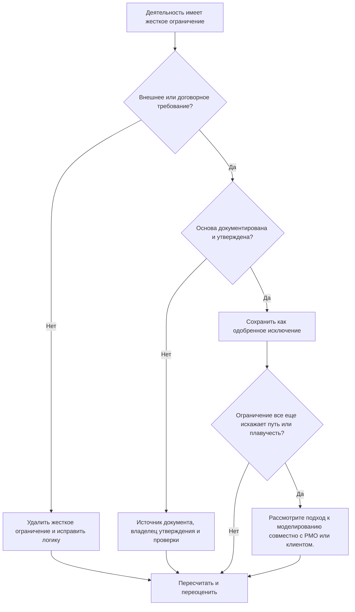

## Цель

Это руководство помогает планировщикам просмотреть и уменьшить жесткие ограничения в Primavera P6. Основное внимание уделяется ограничениям, которые строго контролируют даты действий, особенно обязательному началу и обязательному завершению.

## Прежде чем начать

Прежде чем предпринимать действия, соберите следующую информацию:

- Текущий результат оценки для этого показателя.
- Список видов деятельности с жесткими ограничениями.
- Тип ограничения и дата ограничения для каждого действия.
- Идентификатор действия, имя действия, ИСР, статус действия, начало, завершение, общий резерв и статус критического или самого длинного пути.
- Подробности взаимоотношений предшественника и преемника.
- Контракт, клиент, разрешение, доступ, нормативная база или основа передачи для любого необходимого ограничения.
- Сравнение базового или предыдущего обновления, показывающее, когда было добавлено ограничение.

## Поймите свой результат

Хороший результат — отсутствие необъяснимых жестких ограничений.

Жесткие ограничения могут переопределять или сильно ограничивать обычный расчет цены за тысячу показов. Они могут быть действительными для дат контракта, окон доступа, выдачи разрешений, точек удержания нормативных требований или требований владельца, но их не следует использовать в качестве замены отсутствующей логики.

Слабый результат означает, что график содержит навязанные даты, которые могут управлять прогнозом, а не сетевой логикой.

## Цель улучшения

Цель — 0 необъяснимых жестких ограничений.

Цель состоит в том, чтобы удалить ненужные жесткие ограничения и задокументировать любые ограничения, которые действительно необходимы.

## План действий

### Шаг 1: Определите основную проблему

Создайте макет или отчет P6, который фильтрует действия с жесткими типами ограничений. Включите идентификатор действия, имя действия, ИСР, статус действия, начало, завершение, тип ограничения, дату ограничения, общий резерв, состояние критического или самого длинного пути, предшественников и преемников.

Просмотрите каждое ограниченное действие и спросите:

- В чем источник жесткого ограничения?
- Это требуется по контракту или извне?
- Заменяет ли он отсутствующую логику предшественника или преемника?
- Навязывает ли это целевую дату, которая должна быть прогнозирована по графику?
- Влияет ли это на отчеты об общем резерве, критическом пути или контрольных точках?
- Задокументирована ли и утверждена ли причина?

### Шаг 2. Примените рекомендуемые исправления

Если жесткое ограничение не требуется извне, удалите его и добавьте или исправьте логику CPM. Используйте взаимосвязи, последовательность действий, календари и реалистичную продолжительность для моделирования работы вместо того, чтобы навязывать даты.

Если требуется жесткое ограничение, задокументируйте основу. Укажите источник, утверждение, дату, ответственного владельца и причину, по которой его невозможно смоделировать с помощью обычной логики.

Если ограничение используется для сохранения целевой даты, проверьте, будет ли более подходящим более мягкое ограничение, контрольная точка, крайний срок или отчетная записка.

### Шаг 3. Удалите распространенные блокировщики

К распространенным блокировщикам относятся ограничения, унаследованные от старых базовых показателей, целевые даты клиента, введенные как обязательные даты, планы восстановления, которые оставляют временные ограничения позади, а также отсутствующая логика интерфейса.

Другой блокировщик предполагает, что жесткое ограничение приемлемо, поскольку дата важна. Важные даты должны быть видны, но график все равно должен объяснять, как работа до них доходит.

### Шаг 4. Подтвердите изменения

Пересчитайте график после исправлений. Повторно запустите метрику и убедитесь, что оставшиеся жесткие ограничения утверждены и задокументированы.

Просмотрите общий резерв, критический или самый длинный путь, даты контрольных точек и результаты сравнения графиков, чтобы убедиться, что коррекция не привела к неожиданному движению.

## График улучшений

### День 1: Обзор и диагностика

Запустите метрику и сгруппируйте результаты по ИСР, типу ограничения, критичности и документированной основе.

### Дни 2-3: Реализация приоритетных действий

Сначала удалите ненужные жесткие ограничения из критических, околокритических, договорных и краткосрочных мероприятий. Добавьте недостающую логику там, где это необходимо.

### Дни 4–5: Мониторинг первых результатов

Пересчитайте график и просмотрите движение плавающего объекта, изменения критического пути и влияние на этапы.

### День 6: Окончательные корректировки

Устраните оставшиеся исключения вместе с планировщиком, руководителем управления проектом, рецензентом PMO или представителем клиента.

### День 7: Переоцените и сравните

Запустите оценку еще раз и сравните результат с целевым порогом.

## Отслеживание прогресса

Используйте простой трекер для управления исправлениями и утверждениями.

| Дата | Принятые меры | Ожидаемый эффект | Результат/Наблюдение | Следующий шаг |
| --- | --- | --- | --- | --- |
| [Дата] | Пересмотрены жесткие ограничения | Определите наложенный контроль дат | [Наблюдаемый результат] | Назначить владельца |
| [Дата] | Удалены ненужные жесткие ограничения. | Восстановление логических вычислений | [Наблюдаемый результат] | Пересчитать график |
| [Дата] | Документально подтвержденное жесткое ограничение | Сохранять обоснованное исключение | [Наблюдаемый результат] | Переоценить метрику |

## Если результаты не улучшаются

Если результаты не улучшаются, проверьте, не вводятся ли вновь жесткие ограничения посредством импорта, копирования фрагментов, базовых обновлений или изменений графика восстановления.

Эскалируйте нерешенные проблемы, когда они влияют на критический путь, этапы контракта, отчеты клиентов, анализ задержек, события платежей или даты передачи.

## Обслуживание

Просматривайте эту метрику во время каждого цикла обновления и перед утверждением базового показателя. Жесткие ограничения должны быть частью стандартных проверок работоспособности по графику, особенно после серьезного изменения последовательности, планирования восстановления и подготовки заявок клиентов.

## Сводный контрольный список

- [ ] Текущий результат рассмотрен
- [ ] Целевой порог подтвержден
- [ ] Создан список жестких ограничений
- [ ] Тип ограничения и дата проверены
- [ ] Внешняя база подтверждена
- [ ] Удалены ненужные жесткие ограничения.
- [ ] Отсутствующая логика исправлена
- [ ] Утвержденные исключения документированы
- [ ] График пересчитано
- [ ] Путь резерва времени и критический путь рассмотрены
- [ ] Оценка повторена
- [ ] Следующие шаги задокументированы
## Связанные материалы
- [Жесткие ограничения в Primavera P6](03_blog_template.md)
- [Что такое график](../../07b_blogs_ru/01_WHAT%20A%20SCHEDULE%20IS/01_blog.md)
- [Надежная логика](../../07b_blogs_ru/02_ROBUST%20LOGIC/02_ROBUST%20LOGIC.md)
