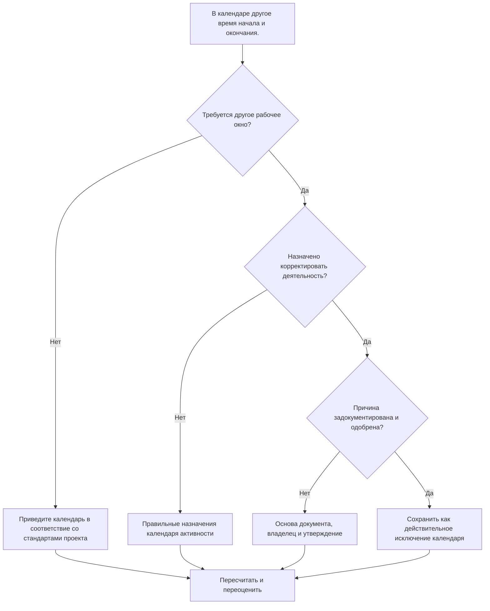

# Календари с разным временем начала и окончания в Primavera P6 - Руководство по улучшению

## Цель

Это руководство помогает планировщикам просматривать календари Primavera P6, в которых используется разное время начала и окончания рабочего дня. Он поддерживает проверки качества графика, подтверждая, что различия во времени в календаре являются преднамеренными, одобренными и понятными.

## Прежде чем начать

Прежде чем предпринимать действия, соберите следующую информацию:

- Текущий результат оценки для этого показателя.
- Утвержденный стандартный календарь проекта и обычное ежедневное рабочее окно.
- Список календарей с разным временем начала и окончания, окнами смен или графиком неполного дня.
- Действия, назначенные каждому затронутому календарю.
- Тип календаря, например глобальный, проектный или ресурсный.
- Критические или околокритические действия с использованием затронутых календарей.
- Причина каждого нестандартного календаря, например ночная смена, перерыв в работе, ограниченный доступ или особый график работы бригады.

## Поймите свой результат

Хороший результат — отсутствие необъяснимых календарей с разным временем начала и окончания.

Календарные различия могут быть действительными, когда работа действительно соответствует разным сменам, окнам доступа или доступности ресурсов. Проблема возникает, когда календари различаются по времени суток без явной причины.

Слабый результат означает, что график может содержать скрытые календарные предположения, влияющие на даты, резерв времени значение и логическое поведение.

## Цель улучшения

Цель — 0 необъяснимых календарей с разным временем начала и окончания.

Цель состоит в том, чтобы подтвердить, является ли каждое отдельное рабочее окно обязательным, документированным и назначенным только нужным действиям.

## План действий

### Шаг 1: Определите основную проблему

Создайте экспорт обзора календаря из P6 или инструмента оценки графика, в котором перечислен каждый календарь, его обычное время начала рабочего дня, время окончания, ежедневные часы, исключения и назначенные действия.

Просмотрите каждый нестандартный календарь и спросите:

- Каков утвержденный стандартный рабочий день для проекта?
- В каких календарях используется разное время начала и окончания?
- Являются ли различия намеренными или случайными?
- Какие мероприятия используют каждый календарь?
- Затронуты ли критические или околокритические виды деятельности?
- Задокументирована и утверждена ли календарная разница?

### Шаг 2. Примените рекомендуемые исправления

Если календарная разница случайна, согласуйте время начала, время окончания и ежедневные периоды работы с утвержденным стандартом проекта.

Если календарная разница действительна, задокументируйте причину. Общие допустимые случаи включают ночную смену, работу в выходные дни, окна отключения, ограничения доступа владельца, экологические ограничения или периоды работы, зависящие от ресурсов.

Если действия назначены не тому календарю, исправьте назначение календаря действий, прежде чем менять сам календарь. Действительный специальный календарь все равно может создавать проблемы, если он назначен слишком широко.

### Шаг 3. Удалите распространенные блокировщики

К распространенным блокировщикам относятся скопированные календари из старых графиков, импортированные календари со скрытыми настройками времени, календари ресурсов, используемые в качестве календарей действий, а также небольшие разницы во времени, которые не видны в стандартных макетах дат.

Другой блокировщик просматривает только дату без времени. В P6 время суток может влиять на размещение активности, резерв времени, поведение во взаимоотношениях и очевидное перемещение дат на один день.

### Шаг 4. Подтвердите изменения

Пересчитать график после календарных корректировок. Повторно запустите метрику и убедитесь, что оставшиеся календарные различия действительны и задокументированы.

Просмотрите даты затронутых действий, общий резерв, критический или самый длинный путь, связи и краткосрочные прогнозные отчеты, чтобы убедиться, что исправление не привело к неожиданному движению.

## График улучшений

### День 1: Обзор и диагностика

Запустите метрику и сгруппируйте результаты по календарю, рабочему окну, типу календаря, назначенным действиям и критичности.

### Дни 2-3: Реализация приоритетных действий

Сначала исправьте случайные разницы во времени в календаре и неправильные назначения календаря действий для критических, околокритических и ближайших действий.

### Дни 4–5: Мониторинг первых результатов

Пересчитайте график и просмотрите движение резерва, сдвиги дат, влияние на этапы и прогнозные изменения.

### День 6: Окончательные корректировки

Устраните оставшиеся календарные исключения вместе с планировщиком, владельцем дисциплины, руководителем управления проектом или проверяющим PMO.

### День 7: Переоцените и сравните

Запустите оценку еще раз и сравните результат с целевым порогом.

## Отслеживание прогресса

Используйте простой трекер для управления исправлениями и утверждениями.

| Дата | Принятые меры | Ожидаемый эффект | Результат/Наблюдение | Следующий шаг |
| --- | --- | --- | --- | --- |
| [Дата] | Пересмотрено время начала и окончания календаря. | Выявление нестандартных рабочих окон | [Наблюдаемый результат] | Назначить владельца |
| [Дата] | Календарь приведен в соответствие со стандартами проекта | Удалить случайную разницу во времени | [Наблюдаемый результат] | Пересчитать график |
| [Дата] | Документированное действительное исключение календаря | Сохранить оправданное рабочее окно | [Наблюдаемый результат] | Переоценить метрику |

## Если результаты не улучшаются

Если результаты не улучшаются, проверьте, не вводятся ли нестандартные календари повторно посредством импорта, копирования графиков, назначения ресурсов или обновлений базовых показателей.

Обостряйте неурегулированные календарные различия, когда они влияют на критический путь, отчетность клиента, этапы оплаты, простои, даты передачи или краткосрочное выполнение.

## Обслуживание

Просматривайте эту метрику во время базовой разработки, планирования импорта и каждого крупного цикла обновления. Настройки календарного времени должны быть частью стандартных проверок работоспособности графика перед выпуском отчетов.

## Сводный контрольный список

- [ ] Текущий результат рассмотрен
- [ ] Целевой порог подтвержден
- [ ] Стандарт календаря проекта подтвержден
- [ ] Выявлено нестандартное календарное время
- [ ] Назначенные мероприятия рассмотрены
- [ ] Проверены критические и околокритические воздействия
- [ ] Исправлены случайные календарные различия.
- [ ] Задокументированы действительные календарные исключения
- [ ] График пересчитано
- [ ] Изменения даты и резерва рассмотрены
- [ ] Оценка повторена
- [ ] Следующие шаги задокументированы
## Связанные материалы
- [Календари с разным временем начала и окончания в Primavera P6 - Обзор](01_overview_template.md)
- [Календари с разным временем начала и окончания в Primavera P6](03_blog_template.md)
- [Что такое график](../../07b_blogs_ru/01_WHAT%20A%20SCHEDULE%20IS/01_blog.md)
- [Надежная логика](../../07b_blogs_ru/02_ROBUST%20LOGIC/02_ROBUST%20LOGIC.md)
