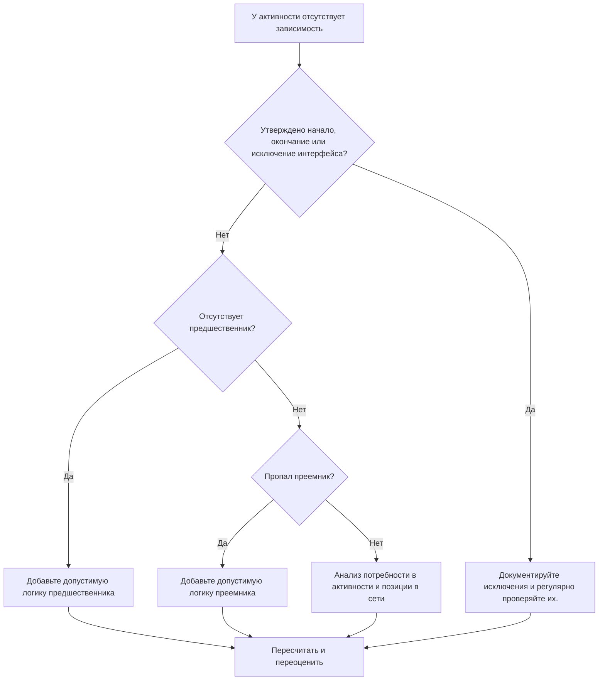

# Отсутствующие зависимости в Primavera P6 - Руководство по улучшению

## Цель

Это руководство помогает планировщикам выявлять и исправлять отсутствующую логику предшественника или преемника в Primavera P6. Он поддерживает качество графика, улучшая полноту сети CPM.

## Прежде чем начать

Прежде чем предпринимать действия, соберите следующую информацию:

- Текущий результат оценки для этого показателя.
- Список мероприятий, не имеющих предшественников.
- Список мероприятий, не имеющих преемников.
- Список действий без логики предшественника и преемника.
- Идентификатор действия, имя действия, ИСР, тип действия, статус действия, начало, окончание, общий резерв и календарь.
- Утвержденное начало проекта, завершение проекта, внешний интерфейс и список договорных исключений.
- Примечания к последним обновлениям и ответственная дисциплина или владелец пакета.

## Поймите свой результат

Хороший результат — ноль неразрешенных действий с отсутствующей логикой зависимостей.

Некоторые действия могут на законных основаниях не иметь предшественника или преемника, например, утвержденный этап начала проекта, этап окончательного завершения или утвержденные этапы внешнего интерфейса. Они должны быть ограничены и документированы.

Слабый результат означает, что график содержит действия, которые неправильно подключены к сети CPM.

## Цель улучшения

Цель — 0 неразрешенных действий с отсутствующими зависимостями.

Цель состоит в том, чтобы связать каждое действие с допустимой логикой предшественника и преемника или задокументировать утвержденную причину, по которой оно является исключением.

## План действий

### Шаг 1: Определите основную проблему

Создайте макет или отчет P6, который фильтрует действия без предшественников, преемников или ни одного из них. Включите идентификатор действия, имя действия, ИСР, тип действия, статус действия, начало, окончание, общий резерв, календарь, ограничения, предшественников и преемников.

Просмотрите каждое задание и спросите:

- Является ли это действие утвержденным началом или завершением проекта?
- Это внешний интерфейс, дата, контролируемая владельцем, или договорное исключение?
- Какая работа должна быть проделана, прежде чем эта деятельность сможет начаться?
- Какая работа зависит от завершения или начала этой деятельности?
- Является ли деятельность устаревшей, дублированной или имеет неправильный статус?
- Какой владелец может подтвердить реальную зависимость?

### Шаг 2. Примените рекомендуемые исправления

Для открытого запуска добавьте логику предшественника, которая представляет реальные условия, необходимые для начала действия. Это может включать предварительную работу, утверждения, доступ, закупки, выпуск проекта, проверку или передачу.

Для открытых отделок добавьте последующую логику, которая представляет, что зависит от действия. Это может включать в себя последующие работы, тестирование, ввод в эксплуатацию, оборот, закрытие или этап завершения.

Для изолированных действий без предшественников и последователей подтвердите, необходимо ли это действие по-прежнему. Если он действительно работает, подключите его к сети. Если он устарел, удалите или закройте его в соответствии с процедурой контроля проекта.

### Шаг 3. Удалите распространенные блокировщики

К распространенным блокировщикам относятся скопированные действия, неполные фрагменты, неясное переключение между дисциплинами, отсутствие информации об интерфейсе и необходимость загрузки действий до того, как станет известна последовательность.

Еще одним препятствием является добавление отношений заполнителей только для передачи метрики. Отношения должны представлять собой реальные зависимости, а не искусственные связи.

### Шаг 4. Подтвердите изменения

Пересчитайте график после исправлений. Повторно запустите метрику и убедитесь, что каждое оставшееся действие либо связано, либо задокументировано как утвержденное исключение.

Просмотрите общий резерв, критический или самый длинный путь, контрольные даты и прогнозные отчеты на ближайшую перспективу, чтобы убедиться, что добавленная логика не привела к неожиданному движению.

## График улучшений

### День 1: Обзор и диагностика

Запустите метрику и сгруппируйте результаты по отсутствующим предшественникам, отсутствующим преемникам, изолированным действиям, действительным исключениям и устаревшим действиям.

### Дни 2-3: Реализация приоритетных действий

В первую очередь исправьте критические, околокритические, договорные и краткосрочные действия. Добавьте действительную логику и удалите устаревшие действия, где это необходимо.

### Дни 4–5: Мониторинг первых результатов

Пересчитайте график и просмотрите резерв, критический путь, прогнозные даты и влияние контрольных точек.

### День 6: Окончательные корректировки

Решите оставшиеся вопросы зависимости вместе с руководителями дисциплин, владельцами пакетов, руководителями строительства или руководителями управления проектом.

### День 7: Переоцените и сравните

Запустите оценку еще раз и сравните результат с целевым порогом.

## Отслеживание прогресса

Используйте простой трекер для управления исправлениями и утверждениями.

| Дата | Принятые меры | Ожидаемый эффект | Результат/Наблюдение | Следующий шаг |
| --- | --- | --- | --- | --- |
| [Дата] | Просмотрены отсутствующие зависимости | Определите открытые начала и открытые финиши. | [Наблюдаемый результат] | Назначить владельца |
| [Дата] | Добавлена ​​логика предшественника | Улучшить логику запуска активности | [Наблюдаемый результат] | Пересчитать график |
| [Дата] | Добавлена ​​логика преемника | Улучшение непрерывности завершения деятельности | [Наблюдаемый результат] | Переоценить метрику |

## Если результаты не улучшаются

Если результаты не улучшаются, проверьте, не добавляются ли новые действия без логики, не являются ли импортированные фрагменты неполными или правила исключений слишком свободны.

Эскалируйте нерешенные вопросы, когда они влияют на критический путь, отчетность клиента, этапы оплаты, передачу, закупки или краткосрочное выполнение.

## Обслуживание

Просматривайте эту метрику во время каждого цикла обновления, после импорта по графику и перед утверждением базового плана. Отсутствующие зависимости должны быть частью стандартных проверок работоспособности по графику.

## Сводный контрольный список

- [ ] Текущий результат рассмотрен
- [ ] Целевой порог подтвержден
- [ ] Открытые начала рассмотрены
- [ ] Открытая окончание рассмотрена
- [ ] Отдельные виды деятельности рассмотрены
- [ ] Действительные исключения задокументированы
- [ ] Добавлена ​​отсутствующая логика предшественника
- [ ] Добавлена ​​отсутствующая логика преемника.
- [ ] Устаревшие действия решены
- [ ] График пересчитано
- [ ] Оценка повторена
- [ ] Следующие шаги задокументированы
## Связанные материалы
- [Отсутствующие зависимости в Primavera P6 - Обзор](01_overview_template.md)
- [Отсутствующие зависимости в Primavera P6](03_blog_template.md)
- [Что такое график](../../07b_blogs_ru/01_WHAT%20A%20SCHEDULE%20IS/01_blog.md)
- [Надежная логика](../../07b_blogs_ru/02_ROBUST%20LOGIC/02_ROBUST%20LOGIC.md)
