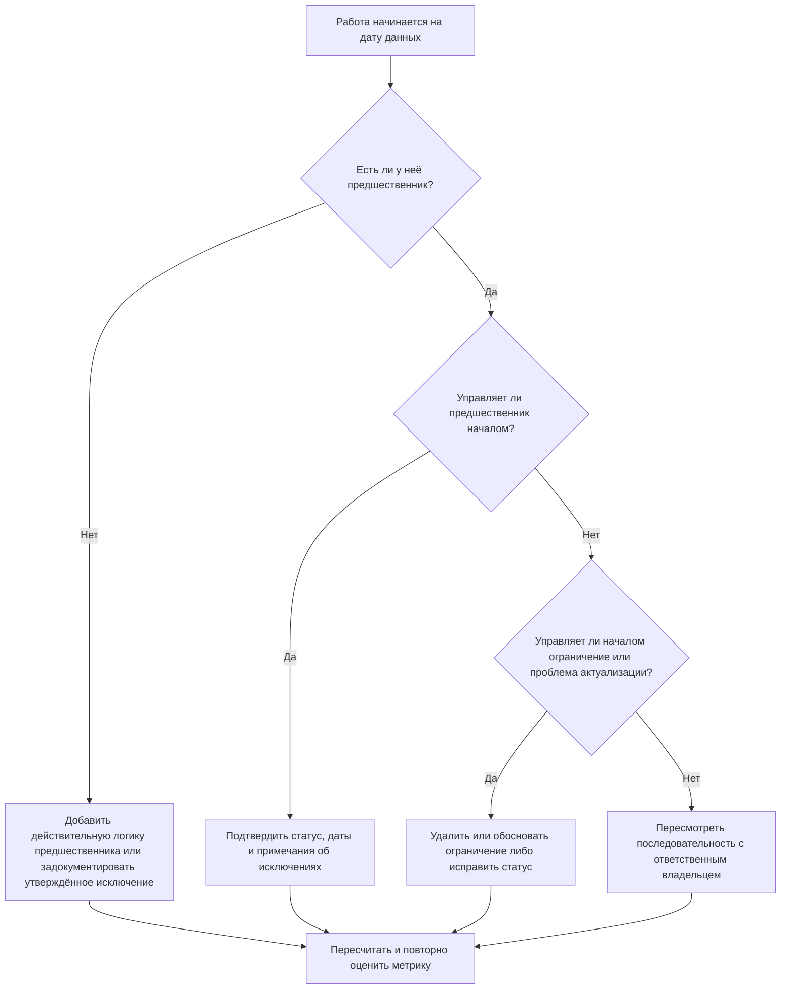

## Цель

Это руководство помогает плановикам и специалистам по управлению проектами сократить или устранить работы, запланированные к началу на дату данных Primavera P6 без действительной управляющей логики предшественника. Оно применяется при проверках качества расписания, проверках состояния ПМО и валидации в цикле актуализации.

Цель — подтвердить, что ближайшие работы поддержаны чёткой логикой МКП и что работы не начинаются на дату данных только из-за отсутствующих связей, ограничений, ручных дат или неполных актуализаций прогресса.

## Перед началом

Соберите следующую информацию перед принятием мер:

- Текущий результат оценки по данной метрике.
- Дата данных проекта, использованная в последнем расчёте расписания.
- Список открытых или не начавшихся работ с датой начала, равной дате данных.
- Сведения о связях предшественников и последователей для каждой работы.
- Ограничения, ожидаемые даты, фактические даты и назначения календарей.
- Параметры расчёта P6, использованные для актуализации, включая настройки сохранённой логики или приоритета прогресса (progress override) там, где это актуально.
- Утверждённые исключения, такие как работы начала проекта, вехи внешних интерфейсов или начала, направленные заказчиком.

## Понимание результата

Сильный результат — ноль неурегулированных работ, начинающихся на дату данных без управляющей логики предшественника. Это означает, что текущие и ближайшие работы соединены с сетью расписания, а дата данных не скрывает отсутствующую последовательность.

Приемлемый результат может включать небольшое количество задокументированных исключений. Они должны быть проверены и утверждены, а не проигнорированы. Например, веха «уведомление о начале работ» или внешне авторизованная работа могут не нуждаться в нормальном предшественнике, но причина должна быть видна проверяющим.

Слабый результат означает, что несколько работ начинаются на дату данных без чёткого логического драйвера. Это может указывать на открытые начала, отсутствующие связи предшественников, избыточные ограничения, неполные актуализации прогресса или работы, не переупорядоченные должным образом после последней актуализации.

## Цель улучшения

Целевой показатель — 0 неурегулированных работ, начинающихся на дату данных без действительной управляющей логики.

Цель улучшения — не только сократить количество. Более глубокая цель — убедиться, что у каждой работы вблизи даты данных есть обоснованная причина для прогнозируемого начала. После корректировки каждая затронутая работа должна иметь либо надлежащую логику предшественника, либо задокументированное исключение, либо исправленный статус или условие даты.

## План действий

### Шаг 1: Определите основную проблему

Создайте макет или отчёт P6, который фильтрует открытые или не начавшиеся работы с датой начала, равной дате данных. Включите столбцы для идентификатора работы, наименования работы, WBS, начала, окончания, статуса, общего резерва, календаря, основного ограничения, предшественников, последователей и индикаторов управляющих связей при наличии.

Просмотрите каждую работу и задайте вопросы:

- Есть ли у работы предшественники?
- Если предшественники существуют, действительно ли они управляют началом?
- Удерживается или перемещается ли работа ограничением?
- Отсутствует ли у работы фактическое начало или актуализация прогресса?
- Является ли работа обоснованным исключением, например вехой начала проекта?
- Принадлежит ли работа к области WBS, где логика в целом слабая?

Сгруппируйте результаты по практическим причинам: отсутствующие предшественники, неуправляющие предшественники, ограничения или ожидаемые даты, ошибки актуализации/статуса или утверждённые исключения.

### Шаг 2: Примените рекомендуемые исправления

Начните с отсутствующей или слабой логики. Добавьте действительные связи предшественников, представляющие реальную последовательность работ, — например, связи «окончание-начало» (FS), «начало-начало» (SS) или «окончание-окончание» (FF) там, где это уместно. Избегайте добавления связей только для удовлетворения метрики; каждая связь должна отражать реальную зависимость по строительству, проектированию, закупкам, допуску на объект, согласованию или передаче.

Затем проверьте ограничения. Если работа начинается на дату данных из-за ограничения начала, подтвердите, обосновано ли ограничение по контрактным или операционным соображениям. Удалите ненужные ограничения и позвольте работе управляться логикой. Если ограничение обосновано, задокументируйте причину и подтвердите, что оно не искажает критический путь.

Проверьте статус прогресса. Если работа уже началась, обновите фактическое начало и оставшуюся продолжительность правильно. Если работа не началась, подтвердите, должна ли прогнозная дата начала оставаться на дате данных. Работа не должна казаться готовой к началу просто потому, что цикл актуализации переместил её на текущую дату.

После внесения изменений пересчитайте расписание и снова просмотрите затронутые работы. Подтвердите, что дата начала теперь управляется логикой, статус корректен или задокументировано утверждённое исключение.

### Шаг 3: Устраните распространённые препятствия

К распространённым препятствиям относятся неясная обратная связь с места работ, отсутствующая информация об интерфейсах и давление с целью сделать ближайшие работы выглядящими готовыми. Устраните их, просмотрев затронутые работы с руководителями дисциплин, руководителями строительства, владельцами закупок или менеджерами пакетов.

Ещё одно распространённое препятствие — злоупотребление ограничениями как заменой логики. Ограничения могут быть необходимы в некоторых случаях, но не должны заменять сеть расписания. Если ограничение сохраняется, задокументируйте, почему оно существует и как влияет на резерв и наидлиннейший путь.

Также проверьте, не является ли проблема следствием настроек расчёта расписания или практик актуализации. Если приоритет прогресса, сохранённая логика, прогресс не по последовательности или неполная актуализация влияют на результат, согласуйте метод актуализации с процедурой управления проектом до повторной оценки метрики.

### Шаг 4: Проверьте изменения

Проверьте исправленное расписание до следующей оценки. Повторно запустите фильтр для открытых или не начавшихся работ, начинающихся на дату данных без управляющей логики. Подтвердите, что каждый оставшийся элемент либо исправлен, либо задокументирован как утверждённое исключение.

Просмотрите общий резерв, наидлиннейший путь и ближайшие работы краткосрочного плана после пересчёта. Корректировка логики может изменить критический путь или выявить дополнительные проблемы последовательности. Если движение расписания значительно, сообщите о влиянии руководителю управления проектом или аналитику ПМО.

## График улучшения

### День 1: Проверка и диагностика

Запустите метрику, подтвердите дату данных и создайте перечень работ. Разделите результаты на категории: отсутствующая логика, неуправляющая логика, ограничения, ошибки статуса и потенциальные исключения.

### Дни 2–3: Реализация приоритетных мер

Исправьте работы с наибольшим влиянием в первую очередь, особенно критические и около-критические работы. Добавьте действительную логику предшественников, удалите ненужные ограничения, исправьте некорректный статус и задокументируйте исключения.

### Дни 4–5: Мониторинг первых результатов

Пересчитайте расписание и проверьте, управляются ли теперь затронутые работы логикой. Проверьте на предмет неожиданных изменений общего резерва, наидлиннейшего пути и дат вех.

### День 6: Финальные корректировки

Устраните оставшиеся препятствия с ответственной дисциплиной или владельцем пакета. Подтвердите, что все сохранённые исключения обоснованы и чётко задокументированы.

### День 7: Повторная оценка и сравнение

Запустите оценку снова и сравните новый результат с предыдущим результатом и целевым пороговым значением. Подтвердите, достигнута ли метрика нулевых неурегулированных работ или требуются дальнейшие действия.

## Отслеживание прогресса

Используйте простой трекер для управления исправлениями и утверждениями.

| Дата | Выполненное действие | Ожидаемое влияние | Результат / Наблюдение | Следующий шаг |
| --- | --- | --- | --- | --- |
| [Дата] | Проверены работы, начинающиеся на дату данных без управляющей логики | Выявить отсутствующую или слабую логику | [Наблюдаемый результат] | Назначить исправления ответственному владельцу |
| [Дата] | Добавлены действительные связи предшественников | Улучшить последовательность МКП | [Наблюдаемый результат] | Пересчитать и проверить влияние на резерв |
| [Дата] | Удалены или обоснованы ограничения | Сократить искусственные начала | [Наблюдаемый результат] | Подтвердить оставшиеся исключения |
| [Дата] | Исправлен некорректный статус работ | Улучшить точность актуализации | [Наблюдаемый результат] | Повторно запустить оценку |

## Если результаты не улучшаются

Если результат не улучшается, проверьте, не продолжают ли те же работы не соответствовать требованиям или появляются ли новые работы на дате данных. Повторяющиеся сбои могут указывать на более широкую проблему разработки расписания, такую как неполная логика в области WBS, слабая дисциплина актуализации или непоследовательное использование ограничений.

Эскалируйте устойчивые проблемы руководителю управления проектом, менеджеру по планированию или аналитику ПМО. Для крупных расписаний рассмотрите проведение целевого рабочего совещания по проверке логики для затронутых пакетов работ. Если расписание используется для контрактной отчётности, анализа задержек или прогнозирования освоенного объёма, неурегулированные элементы следует рассматривать как проблему качества.

## Поддержание

Проверяйте эту метрику при каждом цикле актуализации до выпуска расписания. Проверка должна быть частью стандартной проверки состояния расписания, особенно после актуализаций прогресса, переупорядочивания, крупных изменений содержания или планирования восстановления.

Хорошие привычки поддержания включают сохранение столбцов предшественников и последователей видимыми в макетах P6, проверку открытых начал перед каждым представлением расписания, документирование утверждённых исключений и проверку того, что движение даты данных не создаёт новую группу неуправляемых работ.

## Контрольный список

- [ ] Текущий результат проверен
- [ ] Целевое пороговое значение подтверждено
- [ ] Дата данных подтверждена
- [ ] Работы, начинающиеся на дату данных, выявлены
- [ ] Основная проблема определена
- [ ] Отсутствующая или слабая логика исправлена
- [ ] Ограничения проверены и обоснованы или удалены
- [ ] Даты статуса проверены
- [ ] Утверждённые исключения задокументированы
- [ ] Расписание пересчитано
- [ ] Результаты отслеживаются
- [ ] Оценка повторена
- [ ] Следующие шаги задокументированы
