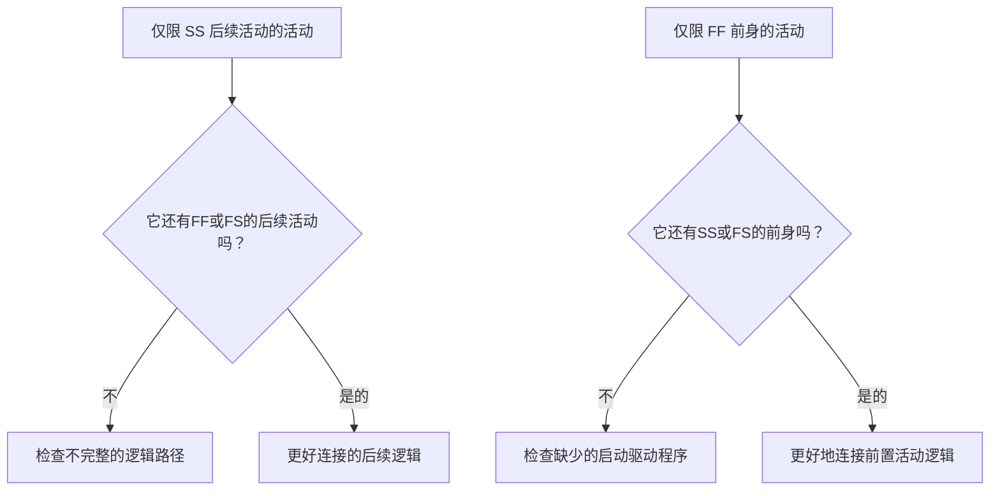

逻辑是项目进度计划内顺序和依赖关系的数学表示。它解释了在什么之前必须发生什么、哪些活动可以同时发生，以及项目团队打算如何从第一个活动过渡到最终完成。

在一个好的 Primavera P6 进度计划中，逻辑不是装饰。它是允许计划计算日期、浮时、关键路径和预测移动的引擎。它以一种可以回顾、挑战和改进的方式讲述执行的故事。

如果进度计划说“打地基，然后建造墙壁，然后建造屋顶”，那么逻辑就是将该序列转变为可计算的网络。计划者不仅仅是绘制进度计划。计划者正在定义交付路径。

## 逻辑讲述作品的故事

每个项目团队都有一种执行项目的预期方式。工程部门可能会按区域发布设计。采购可以打包交付设备。土建工程可以在结构工程开始之前准备通道。在调试开始之前可能需要进行机械完工。

逻辑链接是该计划的数学表达。

这个简单的图表不仅仅是一个序列。这是一个决策模型。如果地基建造晚了，筑墙也可能会晚。如果墙壁晚了，屋顶也可能晚了。如果屋顶迟到，室内工程可能会受到影响。只有存在逻辑时，进度计划才能显示这种影响。

强大的逻辑意味着进度计划可以解释活动为何开始、为何结束以及计划的某一部分发生变化时会发生什么。

## 为什么稳健的逻辑在数据日期很重要

“从数据日期开始且无驱动逻辑的活动”指标是对进度质量的强有力考验。

数据日期是实际绩效和预测工作之间的界限。当一项活动恰好在数据日期开始时，审核者应该问一个简单的问题：是什么推动了这一开始？

如果活动具有有效的前置逻辑，则进度计划可以解释开始。也许有一个区域被释放了。也许材料交付已经完成。也许前一个活动已经完成并允许下一个工作人员开始。

如果活动没有驱动逻辑，启动就会较弱。该活动可能停留在数据日期上，因为它没有前身，因为逻辑不完整，因为约束强制它，或者因为更新没有完全状态化。

这就是为什么强大的逻辑很重要。进度计划不应仅仅因为数据日期发生变化而让工作看起来已准备就绪。它应该显示允许工作开始的真实条件。

## 平衡：足够的逻辑，而不是冗余的逻辑

好的逻辑是平衡的。进度计划表需要足够的关系来将活动与前置活动和后续活动正确连接。同时，它应该避免以不必要的方式重复相同依赖关系的冗余逻辑。

逻辑太少会导致开放的开始、开放的结束、不可靠的浮时和薄弱的关键路径结果。太多的逻辑可能会使网络难以审查，并且可能隐藏活动的真正驱动因素。

目标不是最大化关系数量。目标是清楚地表示强制性和必需的依赖关系。

对于每项活动，进度计划人员应该能够回答：

- 是什么让这个活动开始？
- 这项活动接下来会带来什么？
- 哪种关系真正推动了活动？
- 是否存在重复或不必要的关系？
- 审稿人会理解预期的顺序吗？

这种平衡对于 PMO 进度审查至关重要。密集的网络并不一定是强大的网络。轻量网络并不自动成为一个干净的网络。正确的网络能够清晰地解释执行计划。

## 每个活动都需要一个启动驱动程序

强大的逻辑意味着每个活动都有一个允许或触发其启动的前置活动，除了有效的项目启动或外部授权的例外情况。

对于施工活动，开始驱动因素可能是区域访问、先前完成、材料可用性、设计发布、许可证批准或先前交易完成。对于采购活动，可能是设计批准或采购订单发布。对于调试，可能是机械完成、测试包准备就绪或系统周转。

当缺少该启动驱动程序时，活动可能会浮时到进度计划中的人为位置。在更新期间，它可能会出现在数据日期处。这会造成一种错误的准备就绪感。

考虑一项名为“安装泵”的活动。如果它在数据日期开始，但没有先期完成地基、泵交付或区域移交，则进度计划不会解释安装可以开始的原因。活动可能是有计划的，但逻辑并不健全。

## SS和FF是半关系

开始到开始和结束到结束关系很有用，但应谨慎使用。在许多进度审核中，最好将它们理解为“半”关系，因为它们本身并没有将活动完全放入完整的逻辑路径中。

SS 关系可以解释活动何时可以开始，但可能无法解释活动何时必须结束或移交什么。 FF 关系可以解释完成对齐，但可能无法解释活动何时被允许开始。

这并不意味着 SS 或 FF 是错误的。重叠的工作很常见，而且往往很现实。问题是活动是否完全连接。

例如：

- 具有 SS 后续活动的活动通常也应该有 FF 或 FS 后续活动。
- 具有 FF 前置活动的活动通常也应该有 SS 或 FS 前置活动。

这有助于防止活动仅在其持续时间的一侧进行连接。进度计划应解释工作如何开始和如何完成。

## 实践中的稳健逻辑

实际逻辑审查应从数据日期附近的活动、关键和近关键工作以及主要移交路径开始。这些领域对当前决策影响最大。

在 P6 中，有用的审核列包括活动 ID、活动名称、WBS、开始、完成、活动状态、总浮时、前置任务、后续任务、逻辑关系类型、滞后、约束、日历和驱动关系指示器（如果有）。

对于从数据日期开始的每项活动，询问：

- 活动真的准备好开始了吗？
- 哪个前置活动允许启动？
- 该前身是完成的、正在进行的还是预测的？
- 关系是驱动力吗？
- 约束或预期日期是否取代了逻辑？
- 该活动是否也有有效的后续逻辑？

如果答案不清楚，则应与负责人一起审查该活动。更正可能是添加缺失的前置活动、更改逻辑关系类型、删除约束、更新实际值或记录有效的异常。

## 避免人工逻辑

一个错误是添加关系只是为了传递指标。这并不能创造出强大的逻辑。它创造了人工逻辑。

关系应该代表真正的依赖关系。如果一条链路不能反映施工顺序、工程发布、采购需求、接入、审批、测试、调试或移交，则它可能不属于网络。

另一个错误是留下冗余逻辑，因为它看起来更安全。如果相同的依赖关系已经由更清晰的关系表示，则额外的链接可能会混淆关键路径并使网络更难以审核。

强大的逻辑是清晰的、有目的的、站得住脚的。

## 结论

逻辑是项目如何执行的数学故事。它定义了必须首先发生的事情、可以一起发生的事情以及接下来发生的事情。

强大的逻辑并不意味着添加尽可能多的链接。这意味着添加正确的链接：足以将每个活动与真正的前辈和后续活动连接起来，但又不能太多，以免网络变得多余或产生误导。

当活动在数据日期开始而没有驱动逻辑时，进度计划就会暴露出该故事中的弱点。该活动可能显示为就绪，但网络没有解释原因。

可靠的进度计划应该清楚地回答这个问题。是什么让这项工作得以启动？接下来它会实现什么功能？如果进度计划能够回答这两个问题，那么逻辑就会变得稳健。如果不能，项目团队需要完成更多排序工作才能信任预测。
## 相关内容
- [Primavera P6 中缺少依赖项 - 概述](../../metrics/21_missing_dependencies/02_guide_template.md)
- [Primavera P6 进度计划中的冗余逻辑 - 概述](../../metrics/06_redundant_logic/02_guide_template.md)
- [什么是进度计划](../01_WHAT%20A%20SCHEDULE%20IS/01_blog.md)
- [关键路径](../03_CRITICAL%20PATH/03_CRITICAL%20PATH.md)
