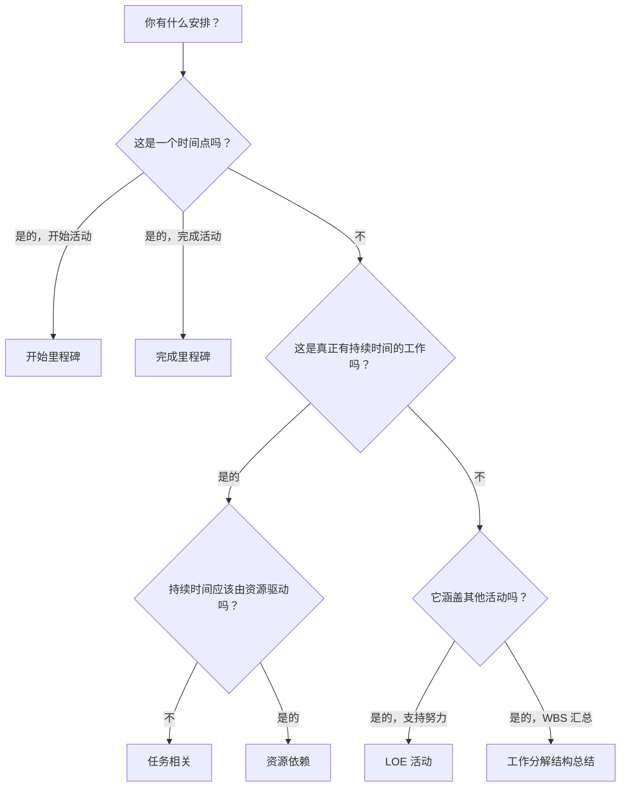

# P6 中的活动类型

活动类型是 Primavera P6 中最重要的设置字段之一。它告诉 P6 它正在计算什么类型的活动以及该活动在计划中应如何表现。

许多进度计划者首先关注活动名称、持续时间、日期和关系。这些都很重要，但活动类型也很重要。任务活动、里程碑、工作量活动和 WBS 摘要活动的行为方式不同。选择错误的类型可能会扭曲日期、进度、资源加载、浮时和报告。

本博客的目的是解释 P6 中可用的主要活动类型、每种活动类型的用途以及如何确定哪种类型适合正在计划的工作。

## 为什么活动类型很重要

活动类型应与项目的计划目的相匹配。这是真正有期限的工作吗？这是一个时间点吗？它是跨越其他活动的工作总结吗？工作量是否取决于资源而不是固定的任务持续时间？

如果活动类型与目的不符，进度计划编制可能会变得混乱。有持续时间的里程碑并不是里程碑。用作摘要的普通任务可能隐藏逻辑。用于推动工作的一定程度的努力活动可能会扭曲关键路径。资源相关活动使用不当可能会导致计算结果与预期不同。

在 P6 中，活动类型有助于回答一个实际问题：计算进度计划时该项目应如何表现？

## P6 中的主要活动类型

最常见的 Primavera P6 活动类型是：

- 任务相关。
- 资源依赖。
- LOE 活动。
- 开始里程碑。
- 完成里程碑。
- 工作分解结构摘要。

每个都有不同的目的。

## 任务相关活动

任务相关是 P6 中最常见的活动类型。将其用于正常的计划工作，其中活动持续时间由活动分配的日历控制，而不是由单个资源日历控制。

示例包括：

- 挖掘基础。
- 安装电缆桥架。
- 浇筑混凝土板。
- 准备设计包。
- 进行压力测试。

任务相关活动通常是大多数施工、工程、采购、测试和调试任务的最佳选择。它们清晰、稳定且易于理解。进度计划人员定义持续时间、分配活动日历、连接逻辑，然后 P6 计算日期。

当活动代表离散的工作范围并且工作持续时间不应根据资源日历更改时，请使用“任务相关”。

## 资源依赖活动

当持续时间和计划行为应受到分配给活动的资源影响时，使用资源相关活动。在这种情况下，P6 可以使用资源日历和资源可用性来计算如何安排活动。

当资源可用性是工作的真正驱动力时，这会很有用。例如，专业工作人员、检查员或设备资源可能仅在特定日期或轮班可用。

示例可能包括：

- 由有限的检查员进行专门检查。
- 供应商技术支持。
- 使用稀缺资源进行设备校准。
- 资源驱动的维护工作。

应谨慎使用资源依赖型活动。如果项目没有主动加载资源或资源分级，习惯性地使用资源依赖可能会造成混乱。许多计划使用“任务相关”作为默认值，因为活动日历是主要的计划基础。

当资源及其日历旨在影响计划计算时，请使用“资源相关”。

## 开始里程碑

开始里程碑是零持续时间活动，代表事件、阶段、访问窗口、授权或主要工作条件的开始。

示例包括：

- 收到继续进行的通知。
- 已授予区域访问权限。
- 施工开始。
- 设计包发布执行。
- 启动调试窗口。

开始里程碑并不代表正在执行的工作。它们代表一个允许工作开始的时间点或标志着一个重要的开始事件。

当计划需要标记重要事项的开始时，请使用开始里程碑。它通常应该与解释里程碑驱动因素及其发布的工作的逻辑相关联。

## 完成里程碑

完成里程碑是零持续时间活动，表示事件、阶段、可交付成果或合同点的完成。

示例包括：

- 机械完成已实现。
- 系统周转完成。
- 已收到许可批准。
- 实质性完成。
- 最终完成。

完成里程碑对于报告很有用，因为它们标志着成就。它们不应该被用作正常的工作活动。如果需要付出努力才能达到里程碑，则应将该努力建模为导致里程碑的任务。

当计划需要标记某些事情已完成或实现时，请使用完成里程碑。

## LOE 活动

工作量级别，通常称为 LOE，用于跨越其他工作而不是直接驱动项目的活动。 LOE 活动通常用于管理、监督、检查支持、项目控制或持续协调。

示例包括：

- 项目管理支持。
- 现场监督。
- 工程管理。
- 施工管理。
- 质量检验支持。

LOE 活动通常从其他活动中获取其日期。它应该代表在其他工作正在进行时继续进行的支持工作。它通常无意成为离散施工或工程任务的驱动程序。

当活动代表应跨越一组活动的持续支持、监督或管理时，使用 LOE。

请注意 LOE 逻辑。如果 LOE 链接不正确，则可能会影响日期或扭曲浮时。 LOE 活动应在进度质量检查期间进行审查，特别是当它们出现在关键路径上或具有不寻常的 FS 或 SF 关系时。

## 工作分解结构总结

WBS 摘要活动总结了 WBS 元素内的一组活动。他们的日期源自 WBS 下的活动，而不是源自他们自己的详细逻辑。

示例包括：

- 工程总结。
- 采购概要。
- A区建设总结。
- 系统01调试总结。

WBS 摘要活动对于高级报告很有用，但它们不应取代实际活动或逻辑。它们是汇总工具，而不是执行任务。

当您需要 WBS 部分的摘要级别视图时，并且仅当项目报告方法支持其使用时，才使用 WBS 摘要活动。

## 选择正确的类型

一个简单的规则可以帮助：

- 如果它是真正需要持续时间的工作，请使用“任务相关”，除非资源日历应该驱动它。
- 如果资源可用性应该驱动它，请使用资源相关。
- 如果是开始事件，请使用开始里程碑。
- 如果是完成事件，请使用“完成里程碑”。
- 如果是跨越其他工作的持续支持，请使用工作量级别。
- 如果是报告汇总，请使用 WBS 摘要。

活动类型应该使进度计划编制更容易理解。如果审阅者需要询问为什么里程碑有持续时间、为什么 LOE 正在推动工作，或者为什么 WBS 摘要以详细逻辑出现，则活动类型可能是错误的。

## 常见错误

一个常见的错误是使用里程碑作为工作的替代品。里程碑应该标记一个时间点。如果需要工作，请为工作创建活动。

另一个错误是使用 LOE 活动来控制离散工作。 LOE 应该支持或跨越工作，而不是取代实际活动之间的逻辑。

第三个错误是在没有资源驱动的进度计划过程的情况下使用资源依赖。如果不维护资源日历，活动类型可能会造成更多的混乱而不是价值。

最后，避免使用 WBS 摘要活动来替代构建良好的 WBS 和详细逻辑。摘要对于报告很有用，但进度计划仍然需要下面的实际活动。

## 结论

P6 中的活动类型定义活动的行为方式。它们不仅仅是标签。正确的活动类型有助于正确计算进度计划并清晰传达。

任务相关活动代表大多数正常工作。当资源日历应控制进度计划时，资源相关活动非常有用。开始和结束里程碑标志着关键时间点。LOE 活动活动代表对其他工作的支持。 WBS 摘要活动支持汇总报告。

选择正确的活动类型可以使进度计划更易于审查、更易于解释并且对于项目控制而言更可靠。一个强有力的进度计划不仅有良好的日期和逻辑。它还针对所代表的工作使用正确的活动类型。
## 相关内容
- [从数据日期开始且没有驱动逻辑的活动：为什么此计划指标很重要 - 概述](../../03_metrics_zh/01_activities_starting_in_dd_with_no_logic_driving/01_overview_template.md)
- [关键度矩阵](../04_CRITICALITY%20MATRIX/04_CRITICALITY%20MATRIX.md)
- [P6 中的持续时间类型](../06_DURATION%20TYPES%20IN%20P6/06_DURATION%20TYPES%20IN%20P6.md)
