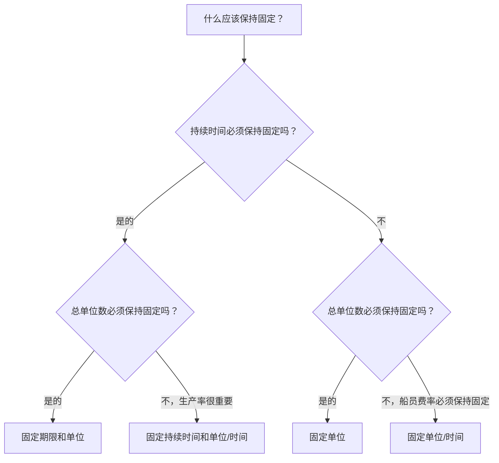

# P6 中的持续时间类型

持续时间类型是 Primavera P6 中的字段之一，用于控制当持续时间、单位和资源生产率发生变化时活动的行为方式。它很容易被忽视，但它会影响计划日期、资源加载、成本预测、挣值和更新行为。

许多进度计划者仅将持续时间视为天数。在 P6 中，持续时间不仅仅是一个数字。活动还可以具有劳动单位、非劳动单位、每次单位、资源日历、活动日历和剩余工时。持续时间类型告诉 P6 当计划重新计算或当计划程序更改资源和持续时间时应保持固定。

本博客解释了 P6 中活动可用的主要持续时间类型、它们有何不同、每种类型的用途以及何时使用一种而不是另一种。

## 持续时间类型与持续时间字段不同

在查看类型之前，区分两个想法会有所帮助。

持续时间字段是原始持续时间、剩余持续时间、实际持续时间和完成时持续时间等值。这些描述了时间。

持续时间类型是一种计算设置。它告诉 P6 在发生变化时如何平衡持续时间、总单位数和每次单位数。

例如，如果您向某个活动添加更多资源，该活动是否应该提前完成？或者持续时间应该保持不变而总工作量应该增加？答案取决于持续时间类型。

## 主要持续时间类型

常见的 P6 持续时间类型有：

- 固定期限和单位。
- 固定持续时间和单位/时间。
- 固定单位。
- 固定单位/时间。

这些名称一开始可能会让人觉得很技术性，但每个名称都回答了一个实际问题：当某些情况发生变化时，P6 应该保护活动的哪一部分？

## 固定期限和单位

固定持续时间和单位使活动持续时间和总单位保持固定。如果每次单位发生变化，P6 会调整速率，而不是更改持续时间或总工作量。

当计划时间窗口和总工作量都希望保持稳定时，此类型非常有用。

例子：

活动计划为期10天，工时400小时。进度团队希望持续时间保持为 10 天，总预算工作量保持为 400 小时。如果资源分配详细信息发生变化，计划工期和总单位数不应自动移动。

在以下情况下使用固定期限和单位：

- 该活动有固定的工作窗口。
- 总的努力已经商定。
- 资源速率的变化不应自动改变活动持续时间。
- 该计划用于稳定成本或挣值控制。

这对于计划持续时间和预算工作量都受到控制的托管工作包通常很有用。

## 固定持续时间和单位/时间

固定持续时间和单位/时间保持持续时间和资源速率固定。如果添加或删除资源，P6 可以调整总单位数。

当活动必须在固定时间窗口内发生并且资源加载率应保持一致时，此类型非常有用。

例子：

项目管理支持活动持续 20 天。团队指派一名项目工程师，每天工作8小时。持续时间应保持20天，每日费率应保持每天8小时。总单位数是时间窗口和速率的结果。

在以下情况下使用固定持续时间和单位/时间：

- 活动时间是固定的。
- 每日或每小时的资源率很重要。
- 总单位数应根据持续时间和比率计算。
- 该活动代表持续的支持或固定的工作周期。

这对于监督、管理、检查支持或基于时间的支持活动非常有用。

## 固定单位

固定单位使总单位保持固定。如果资源速率发生变化，P6可以调整持续时间。

当工作量固定但持续时间取决于生产力或资源可用性时，此类型非常有用。

例子：

一项活动需要800个工时。如果团队分配更多的人员容量，活动可能会更快完成。如果可用的船员数量较少，活动可能需要更长时间。总工作时间为800小时。

在以下情况下使用固定单位：

- 工作量或总努力是固定的。
- 持续时间应响应资源可用性或生产力。
- 团队规模可以改变完成活动所需的时间。
- 资源计划处于活动状态并得到维护。

这对于生产型工作非常有用，其中总工作量已知，并且预计持续时间会响应人员负载。

## 固定单位/时间

固定单位/时间保持资源速率固定。如果持续时间发生变化，总单位数也会随之变化。

当工作人员或资源在活动持续期间以固定速率工作时，此类型非常有用。

例子：

现场监督活动需要一名监督员，每天 8 小时。如果活动持续时间从 10 天增加到 15 天，则总单位数应增加，因为需要督导人员的天数更多。每日费率保持固定。

在以下情况下使用固定单位/时间：

- 人员或资源费率是固定的。
- 当持续时间改变时，总单位数应增加或减少。
- 该活动代表基于时间的努力。
- 资源在整个活动持续时间内分配。

这对于时间驱动总体工作量的支持、监督、检查和管理活动通常很有用。

## 如何选择正确的持续时间类型

最佳持续时间类型取决于活动所代表的内容以及项目控制团队期望 P6 如何计算变更。

一个简单的选择方法是询问：

- 持续时间是否由计划、合同、窗口或访问权限确定？
- 总工作量是由数量、预算或估算确定的吗？
- 资源率是由机组计划还是人员配备计划确定的？
- 添加资源是否应该缩短活动时间？
- 延长活动是否应该增加总单位数？

如果持续时间和总单位应保持固定，请使用固定持续时间和单位。

如果持续时间和生产率应保持固定，请使用固定持续时间和单位/时间。

如果总工作量应保持固定并且持续时间应响应资源负载，请使用固定单位。

如果资源速率应保持固定且单位应随持续时间变化，请使用固定单位/时间。

## 实际例子

对于计划为固定 1 天操作且具有明确的人员和成本预算的混凝土浇筑，固定工期和单位可能比较合适。

对于在固定报告期内以稳定的每日费率分配的项目管理支持，固定工期和单位/时间或固定单位/时间可能合适，具体取决于总单位或工期变化是否应推动预测。

对于总工作量已知且人员规模影响完成时间的安装活动，固定单位可能比较合适。

对于只要施工期延长就持续进行的现场监督，固定单位/时间可能比较合适。

重要的一点是，选择应该反映项目控制方法，而不是习惯。

## 常见错误

一个常见的错误是在每个活动上保留默认的持续时间类型，而不检查它是否符合活动目的。

另一个错误是当项目没有仔细维护资源分配时使用资源驱动的持续时间行为。如果资源数据薄弱，基于资源的计算可能会产生不可靠的结果。

第三个错误是在更新期间更改持续时间而不了解 P6 将如何重新计算单位或费率。这可能会影响成本负载、挣值和资源直方图。

最后，避免将持续时间类型视为纯粹的技术设置。当计划发生变化时，它会影响计划的表现。

## 持续时间类型和进度质量

持续时间类型是计划质量的一部分，因为它会影响预测是否可信。如果活动的持续时间、单位和资源利用率未按预期运行，则计划可能会显示误导性的日期或资源需求。

对于 PMO 审核，检查类似活动组的持续时间类型是否一致非常有用。工程活动、采购活动、施工活动、LOE 活动和支持活动可能需要不同的规则，但选择应该是有意的。

如果计划是资源负载型的，则持续时间类型变得更加重要。它有助于确定资源更改是否影响持续时间、总单位数或每次单位数。

## 结论

P6 中的持续时间类型定义了当持续时间、总单位数和资源比率发生变化时活动如何响应。它们不仅仅是背景设置。

固定工期和单位可以保护时间和总工作量。固定持续时间和单位/时间保护时间和费率。固定单位可保护总工作量。固定单位/时间可保护资源率。

选择正确的工期类型有助于以符合项目计划的方式计算进度计划。它还使资源加载、进度更新、成本预测和进度报告更易于理解和维护。
## 相关内容
- [从数据日期开始且没有驱动逻辑的活动：为什么此计划指标很重要 - 概述](../../metrics/01_activities_starting_in_dd_with_no_logic_driving/02_guide_template.md)
- [P6 中的活动类型](../05_ACTIVITY%20TYPES%20IN%20P6/05_ACTIVITY%20TYPES%20IN%20P6.md)
- [P6 中的日期](../07_DATES%20IN%20P6/07_DATES%20IN%20P6.md)
