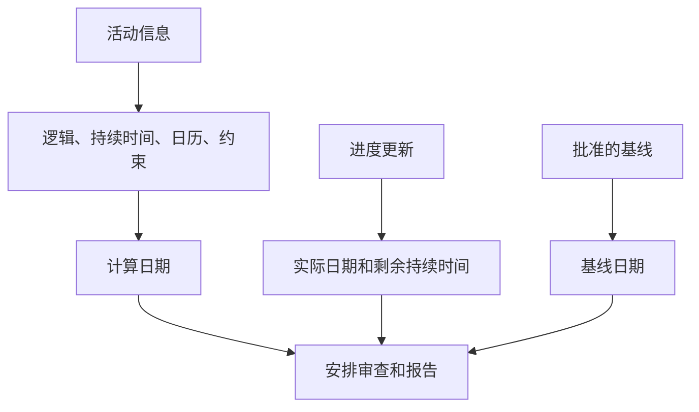

# P6 中的日期

Primavera P6 中的日期可能会令人困惑，因为一项活动不仅有一个开始日期和一个结束日期。它可以包含计划日期、当前计划日期、提前日期、延迟日期、实际日期、基准日期、约束日期、预期日期，有时还包含外部或预测相关日期，具体取决于布局和项目设置。

这些日期并不都具有相同的含义。有些是按CPM逻辑计算的。有些是在进度更新期间输入的。有些是用来比较的。有些用于控制或限制进度计划。了解差异对于进度质量、PMO 报告、延迟分析准备和基本项目控制至关重要。

最重要的问题很简单：这个日期告诉我什么，它来自哪里？

## 为什么P6有这么多日期

P6不仅仅是一个日期列表。它是一个计算模型。该软件根据活动持续时间、日历、关系、约束、资源、进度状态和数据日期来计算日期。

存在不同的日期字段是因为计划者需要回答不同的问题：

- 原来的计划是什么？
- 目前的预测是什么？
- 究竟发生了什么？
- 活动最早可以开始或结束？
- 在不影响项目的情况下，最迟可以开始或完成什么时间？
- 是否有约束迫使活动发生？
- 当前计划与基线相比如何？

当这些日期类型在不了解其用途的情况下混合在一起时，问题就开始了。

## 数据日期

数据日期不是活动日期，但它控制应如何解释所有活动日期。

数据日期是实际绩效和预测工作之间的界限。数据日期之前的工作应被实现或状态化。应预测数据日期之后的工作。

如果活动的实际日期晚于数据日期，则通常是状态错误。如果开放活动恰好在数据日期开始且没有驱动逻辑，则可能表明缺少排序。如果预期完成时间早于数据日期，则可能表明更新信息已过时。

在查看任何活动日期之前，请确认数据日期。

## 开始和结束

开始和结束是大多数用户在 P6 布局中看到的主要计划日期。它们表示基于计划数据的活动的当前计算或计划日期。

对于未开始的活动，开始和完成是预测日期。对于正在进行的活动，他们可以结合实际状态和剩余预测。对于已完成的活动，它们应与实际日期保持一致。

这些通常是报告、前瞻性进度计划和管理讨论中使用的日期。然而，在没有检查其背后的逻辑和状态的情况下，不应接受它们。

使用“开始”和“完成”来回答：当前安排的活动何时开始和结束？

## 早开始早结束

提前开始和提前完成是 CPM 计算日期。它们根据前置逻辑、日历、约束和当前计划条件显示活动可以开始和完成的最早日期。

早期日期很重要，因为它们有助于解释进度计划计算的前向传递。它们展示了在逻辑允许的情况下工作如何通过网络进行移动。

如果许多活动在数据日期有提前开始，审核者应检查它们是否真正准备好，或者它们是否是开放开始、受限活动或弱关联活动。

使用 最早开始 和 最早完成 来回答：根据当前网络，该活动最早可以发生在什么时间？

## 晚开始和晚结束

最晚开始和最晚完成显示活动可以开始或完成的最晚日期，而不会延迟项目完成或控制完成点，具体取决于计划设置。

最迟日期是向后传递的一部分。它们用于计算浮时。最早和最晚日期之间的差异有助于显示活动的灵活性。

如果最迟日期看起来很奇怪，请寻找限制、缺少的后续活动、开放的完成、日历或不寻常的项目完成设置。

使用“最晚开始”和“最晚完成”来回答：该活动可以推迟到什么时候才会影响控制完成日期？

## 实际开始和实际结束

实际开始和实际完成是状态事实。它们应该代表现场或项目执行中实际发生的情况。

实际开始意味着活动实际开始。实际完成是指实际完成的活动。这些日期不应用作计划目标或预测日期。

实际日期通常应在数据日期当天或之前。如果实际日期晚于数据日期，则计划将未来工作报告为已开始或已完成，这会削弱更新的可信度。

使用实际开始和实际完成来回答：到底发生了什么？

## 计划开始和计划结束

计划开始和计划完成经常被误解。根据计划的创建、更新和显示方式，这些字段的行为可能不像正式批准的基线。

一些用户希望计划日期永远显示原始计划。这并不总是一个安全的假设。对于正式的差异报告，指定的基线通常比随意依赖计划日期更可靠。

仅当您的项目控制程序明确定义了计划开始和计划完成的维护方式及其含义时，才使用计划开始和计划完成。

## 基线开始和基线结束

基准日期来自指定的基线进度计划。它们用于将当前进度计划与批准的计划进行比较。

例如，BL1 开始和 BL1 完成可能会显示活动相对于已批准基线的开始和完成日期。当前的开始和结束显示最新的预测。它们之间的差异显示了偏差。

基线日期对于绩效报告、进度差异、变更控制和延迟分析准备至关重要。

使用基线开始和基线完成来回答：当前进度与批准的计划相比如何？

## 约束日期

限制日期是强加的日期控制。它们连接到约束类型，例如“开始于”、“开始于或之后”、“完成于”、“完成于或之前”、“强制开始”或“强制完成”。

约束不会自动出错。有些代表真实的合同日期、访问限制、许可证发布、停电窗口或所有者要求。但约束也可能隐藏缺失的逻辑或强制制定不切实际的日期。

硬约束，尤其是强制开始和强制结束，应该很少见并记录在案。

使用约束日期来回答：是否有强制日期控制或限制此活动？

## 预计完成日期和预测类型日期

预期完成通常在更新期间使用，以捕获项目团队预计活动何时完成。根据设置和程序，预期日期可能会影响 P6 计算或显示活动日期的方式。

当现场团队提供切合实际的完成预期时，预期完成对于正在进行的工作非常有用。但如果不维护，它可能会变得陈旧。数据日期之前的预期完成是一个常见的警告信号。

一些项目还使用与预测相关的日期字段或用户定义的字段进行报告。关键是要清楚地定义它们，以便团队知道它们是计算的、手动输入的还是导入的。

使用预期或预测日期来回答：团队的最新预期是什么？它是否由定义的更新程序控制？

## 主要和次要限制日期

P6 可以在一项活动上保存多个约束条件，具体取决于所选的约束字段。主要约束通常是标准布局中显示的主要约束，但次要约束也会影响解释。

在审查进度时，不要只看开始和结束。将约束类型和约束日期字段添加到布局中。如果日期表现不符合预期，约束是首先要检查的事情之一。

## 您应该使用哪些日期？

使用每个日期的目的：

- 使用“开始”和“完成”进行当前计划预测。
- 使用最早和最迟日期来了解 CPM 计算和浮时。
- 使用已完成或开始工作的实际日期。
- 使用基准日期来确定与已批准计划的差异。
- 使用约束日期来识别施加的日期控制。
- 仅当更新过程定义时才使用预期完成或预测字段。
- 使用数据日期将实际绩效与预测工作分开。

## 常见错误

一个常见的错误是比较错误的日期。例如，如果计划日期不受项目程序控制，则将当前开始与计划开始进行比较可能没有意义。

另一个错误是将实际开始视为预测。实际日期应代表真实表现，而不是意图。

第三个错误是忽略一天中的时间。 P6 存储日期和时间，日历差异可能会造成明显的一日变化或浮时惊喜。

最后，避免隐藏约束日期。如果规定了日期，审稿人需要看到它。

## 结论

P6 中的日期非常强大，因为它们讲述了进度计划编制故事的不同部分。当前日期显示预测。早日期和晚日期解释了 CPM 计算。实际日期记录了发生的事情。基线日期支持比较。限制日期揭示了所施加的控制。如果维护得当，预计日期可以支持更新。

强有力的进度计划审查不会只问“日期是哪一天？”它询问“这是什么样的日期，它来自哪里，是否可信？”

当项目团队理解每个日期字段的含义时，进度计划变得更容易解释，更容易审核，项目控制也更可靠。
## 相关内容
- [实际日期晚于 Primavera P6 中的数据日期 - 概述](../../metrics/12_actual_date_greater_than_data_date/02_guide_template.md)
- [P6 中的持续时间类型](../06_DURATION%20TYPES%20IN%20P6/06_DURATION%20TYPES%20IN%20P6.md)
- [P6 中的日历](../08_CALENDARS%20IN%20P6/08_CALENDARS%20IN%20P6.md)
