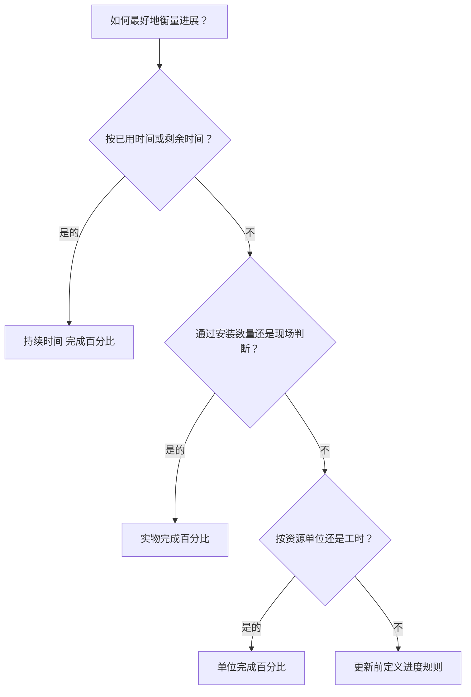

# P6 中完整类型的百分比

完成百分比是 Primavera P6 中最明显的进度字段之一，但它也是最容易被误解的字段之一。完成 50% 的值可能意味着不同的含义，具体取决于活动的配置方式以及项目衡量进度的方式。

在 P6 中，完成百分比类型控制如何计算或更新活动完成百分比。它告诉 P6 进度是否应该基于时间、体能成就或资源单位。

活动的主要完成百分比类型有：

- 持续时间完成百分比。
- 实物完成百分比。
- 单位完成百分比。

选择正确的方法很重要，因为进展不仅仅是报告数字。它影响剩余持续时间、挣值、资源报告、计划可信度以及每个更新周期的质量。

## 为什么完整类型百分比很重要

不同的活动需要不同的方法来衡量进度。

对于某些活动，时间是一个合理的指标。如果某项任务持续 10 天，并需要 5 个工作日完成，则可以合理地说该活动已完成约 50%。

对于其他活动，时间是不够的。一个工作人员可能需要花费 5 天的时间来完成 10 天的任务，仅完成 20% 的体力劳动。另一名船员可能会在前半段时间内完成80%的数量。在这些情况下，基于工期的进度可能会误导项目团队。

对于资源负载的计划，单位可能是最好的进度基础。如果某项活动计划花费 1,000 个工时，并且已赢得或消耗了 600 个工时，则完成单位百分比可能会更好地反映进度。

正确的完成百分比类型取决于活动所代表的内容以及实际衡量进度的方式。

## 活动完成百分比

活动完成百分比是显示的活动的一般进度值。其来源取决于所选的完成百分比类型。

如果活动使用“完成时间百分比”，则“活动完成百分比”由原始持续时间、实际持续时间和剩余持续时间之间的关系驱动。

如果活动使用实物完成百分比，则活动完成百分比将遵循用户输入的实物完成百分比值。

如果活动使用完成单位百分比，则活动完成百分比基于资源单位进度。

这就是为什么两项活动都可以显示 50% 完成但含义却截然不同的原因。

## 持续时间 完成百分比

持续时间完成百分比衡量基于时间的进度。它将已消耗的持续时间与总预期持续时间进行比较。

简单来说，如果一项活动的计划持续时间或完成时持续时间为 10 天，并且已消耗 5 天，则该活动可能会显示大约 50% 的持续时间 % 完成情况。

当进度与时间成合理比例时，持续时间完成百分比很有用。

示例包括：

- 行政复议期限。
- 等待或固化期。
- 基于时间的支持任务。
- 一些简单的活动，工作产出稳定。

当时间是进度的公平衡量标准并且仔细维护剩余持续时间时，请使用“完成时间百分比”。

风险在于花费的时间并不总是等于完成的工作。一项任务可能会消耗其计划工期的一半，但在物理上仍然远远落后。如果进度计划人员仅依赖于持续时间，进度报告可能看起来比实际情况更好。

## 实物完成百分比

实物完成百分比是根据实际物理进度手动输入或更新的。它代表了工作中真正取得的成就，与持续时间或资源单位无关。

对于施工、工程可交付成果、安装工作、调试包或任何进度应基于可衡量的成就的活动，这通常是最佳选择。

示例包括：

- 已发出图纸的 40%。
- 电缆桥架安装完成60%。
- 75% 的管道已焊接。
- 测试包已完成 30%。
- 设备对中100%完成。

当应通过数量、可交付状态、现场验证或负责人判断来衡量进度时，请使用实际完成百分比。

好处是它比过去的时间更能反映现实。风险在于它需要专业。项目团队必须定义如何衡量身体进步、由谁批准以及如何收集证据。

## 单位完成百分比

完成单位百分比衡量基于资源单位的进度。它将实际单位与完成单位进行比较。

当计划负载了资源并且通过人工时间、设备时间或其他可测量的资源单位跟踪进度时，这非常有用。

示例包括：

- 根据预算工时赚取的实际工时。
- 根据计划设备工时使用的设备工时。
- 已安装的工作与资源单元进度相关。
- 基于单位的挣值工作流程。

当资源单位可靠、可维护并且是项目进度方法的一部分时，使用单位完成百分比。

风险在于资源消耗并不总是等于物理进步。团队可能会花费很多时间而无法完成预期的工作。因此，当资源报告和进度测量得到良好控制时，完成单位百分比效果最佳。

## 如何选择合适的类型

选择完成百分比类型的一个实用方法是询问进度对活动意味着什么。

如果进度意味着时间已经过去，请使用“持续时间完成百分比”。

如果进度意味着已完成体力工作，请使用体力完成百分比。

如果进度意味着已获得或消耗了资源单位，请使用单位完成百分比。

相似活动组的选择应该保持一致。工程可交付成果可以使用实物完成百分比。施工安装可以根据数量使用实物完成百分比。基于时间的管理支持可以使用持续时间完成百分比。如果资源数据可靠，资源密集型工作包可以使用完成单位百分比。

## 与剩余时间的关系

完成百分比和剩余持续时间应该讲述一个一致的故事。

一项活动可能已完成 80%，但如果剩余工作困难、延迟或取决于其他条件，则仍有 10 天的剩余工期。这可能是有效的。

一项活动的持续时间可以是 50% 完成百分比，因为计划时间已经过去了一半，但如果实际完成的工作量仅为 20%，则可能应该修改剩余持续时间。

这就是为什么好的更新需要进度和预测审查。完成百分比表明已经实现了多少。剩余持续进度计划明还需要多少时间。

## 常见错误

一个常见的错误是对身体进步与时间不成比例的活动使用“完成时间百分比”。这可能会使进展看起来比实际工作更好或更糟。

另一个错误是在没有测量规则的情况下使用实物完成百分比。如果一个专业按安装数量报告实际进度，而另一个专业按意见报告，则进度计划会变得不一致。

第三个错误是当资源数据不完整或不可靠时使用完成单位百分比。如果不维护实际单位，进度值将不可信。

另一个问题是更新完成百分比但忽略剩余持续时间。一项活动可以显示进展，但仍然有不切实际的预测。

## 良好实践

在更新周期开始之前定义进度规则。项目团队应该知道哪些活动组使用持续时间、体力或完成单位百分比。

使用显示完成百分比类型、活动完成百分比、实际完成百分比、完成时间百分比、完成单位百分比、剩余持续时间、实际开始、实际完成和活动状态的布局。

检查是否存在不一致之处，例如：

- 开始活动，进度为 0%。
- 剩余持续时间 = 0 但状态未完成。
- 100% 进度，无需实际完成。
- 实物完成百分比与现场证据不匹配。
- 单位完成百分比基于缺失的资源更新。

这些检查有助于确保进展不仅被记录下来，而且是可信的。

## 结论

P6 中的完成百分比类型定义了如何衡量活动进度。持续时间完成百分比衡量基于时间的进度。实物完成百分比衡量实际完成的工作。单位完成百分比衡量资源单位进度。

没有哪一种类型适合所有活动。正确的选择取决于工作的计划、衡量和控制方式。

强大的进度计划有意使用百分比完成类型。当方法与工作相匹配时，进度更新变得更加清晰，剩余工期变得更加可靠，项目报告变得更容易辩护。
## 相关内容
- [从数据日期开始且没有驱动逻辑的活动：为什么此计划指标很重要 - 概述](../../03_metrics_zh/01_activities_starting_in_dd_with_no_logic_driving/01_overview_template.md)
- [P6 的持续时间](../09_DURATION%20IN%20P6/09_DURATION%20IN%20P6.md)
- [P6 的成本在哪里](../11_WHERE%20THE%20COST%20LIVE%20IN%20P6/11_WHERE%20THE%20COST%20LIVE%20IN%20P6.md)
