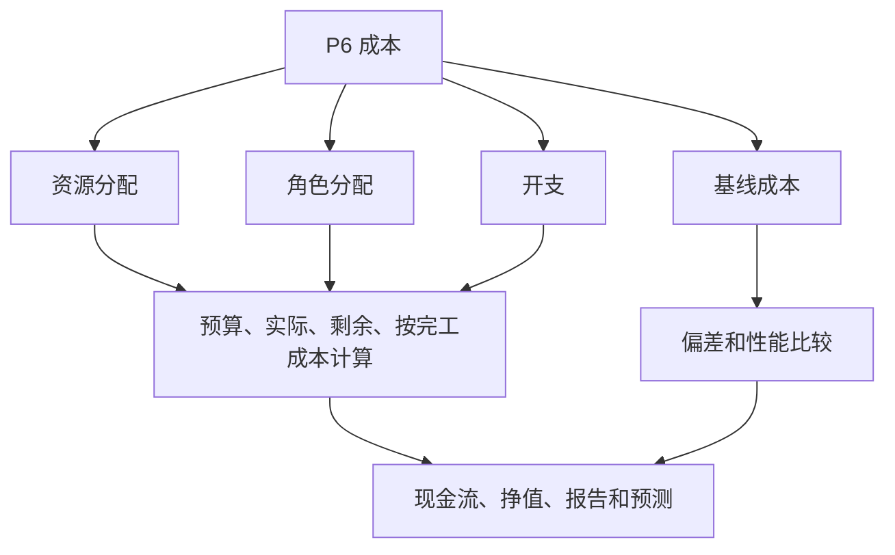

Primavera P6 的成本可以存在于多个地方。这很有用，但也可能令人困惑。进度计划可以显示预算成本、实际成本、剩余成本、完成成本、资源成本、角色成本、费用成本、挣值字段和基准成本。这些值是相关的，但它们并不都意味着同一件事。

对于项目控制团队来说，关键问题不仅仅是“成本是多少？”更好的问题是：这个成本从哪里来，它代表什么，以及应该如何使用它？

本博客解释了 P6 中可用的主要成本类型、它们之间的差异以及每种成本何时有用。

## 为什么成本定位很重要

P6 主要是一个进度计划工具，但它也可以支持成本负载进度计划、挣值、现金流和预测报告。为了正确地做到这一点，成本必须放置在进度模型的正确部分。

如果将劳动力成本作为费用输入，资源直方图可能无法说明正确的情况。如果手动输入实际成本，但项目希望它来自实际资源，则报告可能会变得不一致。如果基准成本缺失，计划差异和成本差异报告就会失去上下文。

成本位置很重要，因为成本来源会影响其汇总、更新、预测和报告的方式。

## 资源成本

资源成本来自分配给活动的资源。资源可以代表劳动力、设备或其他资源类别。每个资源都可以有费率、单位和成本计算。

例如，如果某项活动以定义的小时费率使用管道安装人员 80 小时，P6 可以根据分配的单位和费率计算劳动力成本。

当项目想要将计划活动与劳动力、设备、生产率和资源直方图联系起来时，资源成本非常有用。

在以下情况下使用资源成本：

- 劳动力或设备需求很重要。
- 需要资源直方图。
- 成本与小时或单位挂钩。
- 挣值或进度是基于资源的。
- 该计划用于资源计划。

主要风险是维护。资源密集的进度计划编制需要专业。如果不维护单位、费率、日历或实际值，则成本报告将不可靠。

## 角色成本

角色是通用工作职能，例如工程师、电工、计划员、检查员或起重机操作员。在 P6 中，可以在已知命名资源之前将角色分配给活动。

当团队知道所需资源的类型但不知道具体的人员或团队时，角色成本可以支持早期计划。

例如，在早期工程计划期间，一项活动可能需要 120 小时的“高级工程师”时间。指定的人员可能尚未分配，但该角色可以提供计划率和成本估算。

在以下情况下使用角色成本：

- 进度计划仍在计划中。
- 命名资源尚未确认。
- 该项目需要高级资源或成本估算。
- 角色稍后将被实际资源取代。

角色成本对于早期计划很有用，但随着项目的成熟应该对其进行审查。如果在了解实际资源后仍然保留角色，则进度计划可能会变得过于笼统，无法进行详细控制。

## 费用成本

费用是直接分配给活动的非资源成本。它们对于无法最好地由劳动力或设备资源代表的成本很有用。

示例包括：

- 允许。
- 旅行。
- 供应商一次性付款。
- 分包商包。
- 材料以固定金额购买。
- 测试费用。
- 动员费。

费用成本可以是预算成本、实际成本、剩余成本或完成成本，具体取决于项目如何跟踪它们。

在以下情况下使用费用：

- 成本不受资源工时的影响。
- 成本是固定的或一次性的项目。
- 该活动需要直接的非资源成本。
- 该项目需要非劳动力项目的现金流。

风险在于费用可能成为垃圾场。如果所有成本都作为费用输入，则明细表可能无法单独解释劳动力、设备和生产率。

## 预算成本

预算成本是分配给活动的计划成本。它可能来自资源分配、角色分配、费用或这些的组合。

预算成本很重要，因为它代表执行前的成本计划。它支持现金流、基准成本、挣值设置和项目控制报告。

使用预算成本来回答：该活动的计划成本是多少？

如果预算成本缺失或不一致，计划仍可能计算日期，但无法支持有意义的成本加载报告。

## 实际成本

实际成本代表已经发生的成本。根据项目设置，实际成本可以根据实际资源单位和费率计算、手动输入、从进度计划导入或从外部成本系统加载。

实际成本对于进度报告和挣值很重要。它显示了到目前为止已花费或记录的内容。

使用实际成本来回答：已经发生或记录了哪些成本？

风险在于混合来源。如果一些实际成本是从会计导入的，而其他成本是在 P6 中手动输入的，则团队需要一个明确的规则来避免重复或差距。

## 剩余成本

剩余成本是完成活动仍需要的预测成本。它与剩余单位、资源率、剩余费用和更新假设相关。

剩余成本是最重要的预测字段之一。它告诉项目团队从当前数据日期开始还剩下多少成本。

使用剩余成本来回答：预计还需要多少成本？

如果更新剩余工期但未更新剩余成本，则预测可能会变得不一致。当不维护资源单位或费用剩余值时，情况也是如此。

## 按完工成本计算

完成成本是结合实际成本和剩余成本后的活动预期总成本。

简单来说：

实际成本 + 剩余成本 = 完工成本

完成成本有助于显示预计活动完成时间是否超出、低于或未超出预算。

使用完成成本来回答：最新的预期总成本是多少？

## 基准成本

基准成本来自指定的基准计划。它用于将当前成本值与批准的计划进行比较。

基线成本对于差异报告很重要。如果没有基线，项目可能知道当前的预测成本，但不知道该预测是否比批准的计划更好或更差。

使用基准成本回答：当前成本与批准的成本计划相比如何？

使用 P6 进行挣值或正式 PMO 报告时，基线成本尤其重要。

## 挣值成本字段

P6 可以支持挣值字段，例如计划值、挣值、实际成本、成本差异和进度差异，具体取决于项目设置。

挣值使用成本加载的计划信息来比较计划工时、挣得工时和实际成本。

当项目具有正式的挣值流程时，这些字段非常有用。它们需要一致的基线、进度规则、完成百分比方法和成本负载。

在以下情况下使用挣值成本字段：

- 该项目需要 EV 报告。
- 定义了进度规则。
- 基准成本已获得批准。
- 实际成本来源受到控制。
- 活动进度保持一致。

如果没有这些控制，挣值输出可能看起来很精确，但实际上并不可靠。

## 您应该使用哪种成本类型？

使用应支持资源计划、生产力和直方图的劳动力和设备资源成本。

当命名资源未知时，使用角色成本进行早期计划。

将费用成本用于直接非资源成本、一次性付款、供应商项目、许可证、差旅或分包合同包。

使用预算成本、实际成本、剩余成本和完成成本字段来了解分阶段成本生命周期。

使用基准成本与批准的计划进行比较。

当项目具有支持 EV 报告所需的治理时，请使用挣值字段。

## 常见问题

一个常见的问题是成本重复。相同的分包商成本可以输入为资源成本，并再次输入为费用。

另一个问题是缺少实际成本。进度计划可能有预算和剩余成本，但实际成本可能存在于单独的会计系统中，并且永远不会达到 P6。

第三个问题是一切费用的支出。这会产生总成本，但资源可见性较弱。

另一个问题是进展不一致。如果完成百分比、剩余工期和剩余成本不一致，则完成成本将变得不可靠。

## 良好实践

在加载计划之前定义成本策略。决定劳动力、设备、材料、分包商和间接成本的所在地。

使用一致的成本科目、活动代码、资源、角色和费用类别。

记录实际成本是否将输入 P6、导入或从其他系统报告。

在每个更新周期期间检查成本字段。预算成本、实际成本、剩余成本和完工成本应该讲述一个连贯的故事。

## 结论

P6 中的成本可以存在于资源、角色、费用、基线和挣值字段中。每个地方都有不同的目的。

资源成本将成本与劳动力和设备联系起来。角色成本支持早期计划。费用成本包含直接非资源项目。预算成本、实际成本、剩余成本和完成成本显示成本生命周期。基线和挣值字段支持比较和绩效报告。

一个强大的成本负载计划并不是通过将数字放在合适的地方来建立的。它是通过确定每种类型的成本所属的位置并在每个更新周期中维护该结构来构建的。
## 相关内容
- [从数据日期开始且没有驱动逻辑的活动：为什么此计划指标很重要 - 概述](../../metrics/01_activities_starting_in_dd_with_no_logic_driving/02_guide_template.md)
- [P6 中完整类型的百分比](../10_PERCENT%20COMPLETION%20TYPES%20IN%20P6/10_PERCENT%20COMPLETION%20TYPES%20IN%20P6.md)
- [P6 中的资源类型](../12_RESOURCE%20TYPES%20IN%20P6/12_RESOURCE%20TYPES%20IN%20P6.md)
