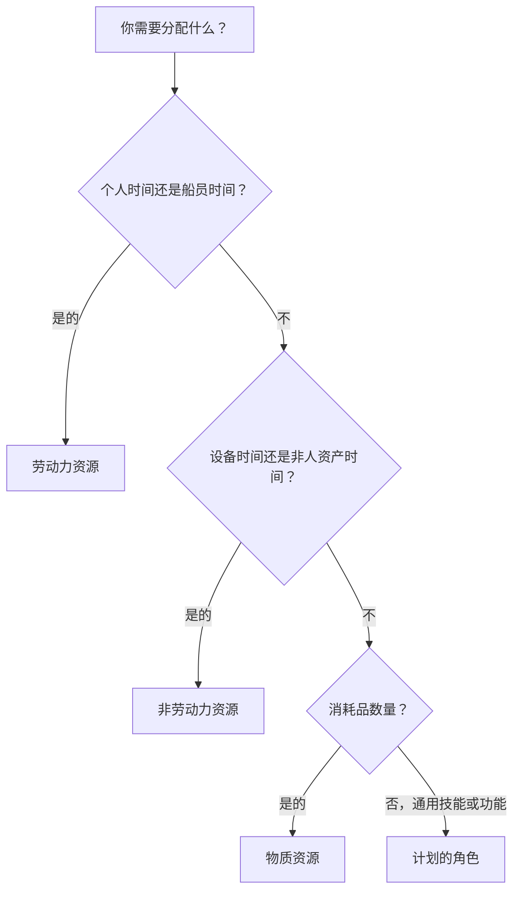

# P6 中的资源类型

Primavera P6 中的资源代表执行工作所需的人员、设备和材料。他们将计划与一段时间内的产能、生产率、成本和资源需求联系起来。

进度计划可以在没有资源的情况下存在，但加载资源的进度计划可以为项目团队提供更深入的了解。它可以显示劳动力直方图、设备需求、材料使用、成本曲线、资源限制和可能的超载。为了使该信息有用，进度计划人员必须了解 P6 中可用的不同资源类型以及何时使用每种资源类型。

P6中的主要资源类型有：

- 劳动。
- 非劳动。
- 材料。

P6还使用角色，角色与资源并不完全相同，但密切相关，并且在计划时非常有用。

## 为什么资源类型很重要

资源类型影响 P6 处理单位、费率、成本、日历和报告的方式。

劳动力资源的行为与物质资源不同。不应以与混凝土体积相同的方式对待起重机。通用工程师角色与命名工程师资源不同。如果资源类型混合不正确，直方图、成本报告、生产力审查和挣值输出可能会产生误导。

资源类型回答了一个实际问题：分配给活动的是什么类型的事物？

## 劳动力资源

劳动力资源代表人或船员。它们通常以小时、天或其他基于时间的单位来衡量。劳动力资源可以具有费率、日历、可用性限制和成本值。

示例包括：

- 计划师。
- 民用船员。
- 电工。
- 焊接人员。
- 工程师。
- 督察。
- 调试技术人员。

当计划需要显示人力或船员需求时，使用劳动力资源。劳动力资源可用于人力直方图、人员配置计划、生产率分析和劳动力成本预测。

例如，一项名为“安装电缆桥架”的活动可能需要 4 名电工进行 5 天。分配劳动力资源可以让进度计划显示该期间对电工的需求。

当项目需要将计划工时与实际工时进行比较时，劳动力资源也很有用。

## 非劳动力资源

非劳动力资源代表设备或其他可重复使用的非人员资产。它们通常是基于时间的，就像劳动力一样，但它们不是人力资源。

示例包括：

- 起重机。
- 挖掘机。
- 焊机。
- 检测设备。
- 脚手架人员设备。
- 专用工具组。
- 发电机。

当设备可用性很重要或应随时间跟踪设备成本时，使用非劳动力资源。

例如，如果重型吊装需要起重机使用两天，分配非人工起重机资源可以帮助项目团队了解起重机需求、避免冲突并预测设备成本。

当设备稀缺、昂贵、在工作区域之间共享或驱动工作顺序时，非劳动力资源就很重要。

## 物质资源

物质资源代表消耗品。它们通常以数量而不是时间来衡量。

示例包括：

- 混凝土立方米。
- 钢吨。
- 电缆米。
- 管轴。
- 阀门。
- 涂料升。
- 面板。

当计划需要跟踪基于数量的消耗或与材料相关的成本时，使用材料资源。

材料资源可以支持材料曲线、数量跟踪和成本加载。当计划与安装数量或基于数量的挣值相关联时，它们特别有用。

例如，一项活动可能包括 500 米的电缆安装。将电缆分配为材料资源有助于团队跟踪一段时间内的计划和实际安装数量。

不应使用物质资源来代表劳动时间或设备时间。它们有不同的目的。

## 角色

角色是通用的工作职能或技能类别。它们与资源不同，但它们有助于在已知命名资源之前进行计划。

示例包括：

- 高级工程师。
- 电气主管。
- 民事监察员。
- 进度计划人员。
- 调试领导。
- 起重机操作员。

角色在早期计划中非常有用，因为项目可能知道需要什么类型的技能，但不确切知道谁将执行这项工作。

例如，一项工程活动可能需要“高级电气工程师”80 小时的努力。稍后，可以使用命名资源来替换或补充该角色。

在以下情况下使用角色：

- 计划仍处于较高水平。
- 命名资源未得到确认。
- 资源需求是按技能类型需要的。
- 该组织希望尽早进行人员配置预测。

随着项目的成熟，应该对角色进行审查。如果进度计划需要详细控制，则可能需要用实际资源替换角色。

## 资源日历

资源可以有日历。这很重要，因为资源可用性可能与活动可用性不同。

例如，施工活动可能使用 6 天的活动日历，但指定的供应商专家可能仅在周一至周五有空。如果活动依赖于资源或使用资源平衡，则资源日历可能会影响计划。

劳动力和非劳动力资源通常需要日历，因为人员和设备仅在特定时间可用。物质资源通常表现不同，因为它们代表数量，而不是工作时间。

当资源日期看起来奇怪时，请检查活动日历和资源日历。

## 资源成本

资源可以承受成本率。劳动力和非劳动力资源通常使用基于时间的费率。物质资源通常使用单位费率。

例如：

- 电工：每小时费用。
- 起重机：每小时或每天的费用。
- 混凝土：每立方米成本。

当资源分配给活动时，P6 可以计算预算成本、实际成本、剩余成本和完成成本。

这对于成本负荷计划、挣值报告、资源预测和现金流分析非常有用。但只有当单位、费率、日历和进度得到更新时，它才能正常工作。

## 选择正确的资源类型

当资源是个人、工作人员或人力时，使用劳动力。

当资源是时间很重要的设备或可重复使用的资产时，使用非人工。

当资源是消耗品时使用材料。

在已知命名资源之前按技能或职能进行计划时，请使用角色。

选择应该反映项目想要如何计划、衡量和报告工作。

## 常见错误

一个常见的错误是在所有事情上都使用劳动力资源。这在一开始可以使成本负担更容易，但当设备或材料数量很重要时，它会降低清晰度。

另一个错误是将物质资源用于实际费用或分包总价的项目。如果项目不需要数量跟踪，费用可能更合适。

第三个错误是分配资源而不维护实际单位。仅当进度更新使资源数据保持最新时，资源加载计划才有用。

另一个问题是角色和资源的混淆。角色有利于计划，但当详细的分配、日历和实际情况很重要时，命名资源会更好。

## 良好实践

在加载计划之前定义资源策略。

决定哪些工作将使用劳动力资源，哪些工作将使用非劳动力资源，哪些材料需要数量跟踪，以及哪些地方应使用费用。

使用一致的命名约定和资源代码。保持资源字典干净。避免名称略有不同的重复资源。

在每个更新周期中检查资源分配。单位、成本、日历和实际值应与项目控制过程保持一致。

## 结论

P6 中的资源类型有助于定义执行工作所需的资源。劳动力资源代表人和船员。非劳动力资源代表设备和可重复使用的资产。物质资源代表消耗数量。在已知指定资源之前，角色支持按技能或功能进行计划。

选择正确的资源类型可以使计划更易于分析。它改进了劳动力直方图、设备计划、材料跟踪、成本负荷、挣值和预测报告。

一个好的资源加载进度计划不仅仅是附有资源的进度计划。这是一个进度计划，其中每种资源类型都被有意使用并在项目的整个生命周期中得到维护。
## 相关内容
- [活动开始，Primavera P6 进度为 0% - 概述](../../03_metrics_zh/13_活动_started_progress_zero/01_overview_template.md)
- [P6 的成本在哪里](../11_WHERE%20THE%20COST%20LIVE%20IN%20P6/11_WHERE%20THE%20COST%20LIVE%20IN%20P6.md)
- [P6 中的资源限制](../13_RESOURCES%20LIMITS%20IN%20P6/13_RESOURCES%20LIMITS%20IN%20P6.md)
