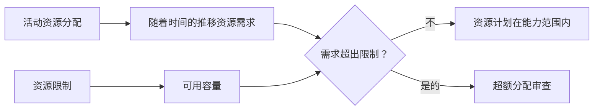

# P6 中的资源限制

Primavera P6 中的资源限制定义了一段时间内可用的资源量。它们用于将活动分配创建的资源需求与项目实际拥有的能力进行比较。

简而言之，资源限制回答了一个问题：项目可以使用多少资源？

如果进度计划规定一名工作人员必须同时从事五项活动，P6 可以显示该需求。但如果没有资源限制，进度计划就无法清楚地表明该需求是否现实。该限制允许计划者看到超载、容量问题以及可能的资源驱动的进度问题。

## 什么是资源限制

资源限制是资源的最大可用性。它可以定义为每个时间段的单位，例如每天的小时数、每周的小时数或工作期间可用的单位数。

例如：

- 一名计划员每天提供 8 小时服务。
- 三名电工每天 24 小时工作。
- 一台起重机每天可运行 8 个设备小时。
- 两名检查员每天工作 16 小时。

当活动加载资源时，P6 计算这些分配创建的资源需求。资源限制提供了与需求进行比较的容量线。

## 为什么资源限制很重要

资源限制很重要，因为进度计划通常在技术上是可行的，但实际上是不可能的。

逻辑网络可以计算出多个活动可以并行发生。日期可能看起来可以接受。关键路径可能看起来是合理的。但如果所有这些活动都需要同样有限的人员、专家或设备，那么该计划可能无法执行。

资源限制有助于揭示计算的计划和可交付的计划之间的差异。

它们可用于：

- 识别超负荷的劳动力。
- 检查设备需求。
- 支持资源直方图。
- 审查人力计划。
- 准备资源平衡。
- 解释为什么有些工作即使逻辑允许也无法开始。
- 测试计划是否与可用容量匹配。

在项目控制中，当进度计划用于人员配备、采购支持、施工计划或挣值报告时，这一点尤其有价值。

## 劳动力资源限制

劳动力限制定义了可用的人数或工时。

例如，如果项目有 10 名电工每天工作 8 小时，则每天的劳动限制可能是每天 80 小时。如果计划需求显示同一天有 120 个电工小时，则计划要求的电工数量多于项目的电工数量。

这并不意味着进度计划是错误的。这意味着计划者必须审查该计划。解决方案可能是增加人员、改变顺序、转移非关键工作、使用加班时间，或者在现实且经批准的情况下接受临时高峰。

当劳动力可用性确实受到限制时，劳动力资源限制很有用。当计划未维持在支持资源控制所需的详细程度时，它们的用处就较小。

## 非劳动力资源限制

非人工限制适用于设备和其他可重复使用的资产。

例如起重机、挖掘机、测试设备、专用工具、发电机或临时设施。如果只有一台起重机可用，则需要同一台起重机的活动不能同时执行，除非添加另一台起重机或重新排序工作。

这就是资源限制非常实用的地方。设备通常是一个真正的限制，特别是当设备价格昂贵、在区域之间共享、难以调动或关键工作需要时。

例如，两件重物可能在逻辑上都已准备就绪。但如果两者都需要相同的起重机，则资源限制可能表明该计划超出了可用容量。

## 物质资源和限制

物质资源的表现不同于劳动力和非劳动力资源。它们通常代表数量，而不是每日可用的工作时间。

材料分配可以显示计划的混凝土体积、电缆长度、钢材吨位或安装数量。项目可能仍然存在材料限制，但这些限制通常是通过采购日期、交付里程碑、库存跟踪或进度计划中的限制来管理的，而不是通过用于人员或设备的相同类型的每日资源可用性限制来管理。

这并不意味着材料不重要。这意味着计划者应该小心该限制所代表的含义。

如果问题是生产能力，例如每天可以浇筑的最大混凝土立方米，资源或生产模型可能会有用。如果问题是材料是否已到达，逻辑关系或采购里程碑可能会更清晰。

## P6 如何使用限制

P6 可以在资源配置文件、电子表格、直方图和资源分析中使用资源限制。活动分配的需求可以根据可用限制来显示。

使用资源均衡时，P6 还可以使用资源可用性来延迟活动，以便需求保持在限制范围内，具体取决于均衡设置。

这很强大，但必须小心处理。资源平衡可以改变预测日期。如果限制、日历、优先级和活动逻辑维护得不好，分级结果可能看起来很数学但不实用。

因此，资源限制应该是受控进度计划过程的一部分，而不是更新结束时按下的按钮。

## 何时使用资源限制

当资源确实有限并且计划加载的资源质量足以支持分析时，请使用资源限制。

好的用例包括：

- 具有固定人员数量的项目。
- 共用起重机或专用设备。
- 有限的工程或调试专家。
- 停机、周转和停电。
- 必须控制人力高峰的施工计划。
- 同一资源池支持多个项目的计划。

资源限制在假设分析中也很有用。计划人员可以测试当前计划是否适用于可用容量，或者是否需要额外的人员、加班或重新排序。

## 何时要小心

当资源数据不完整或具有符号性时要小心。

如果仅为了成本加载而添加资源，则单位可能不代表真实的可用性。如果所有工作都分配给通用资源，则直方图可能过于宽泛而无法支持真正的决策。如果实际单位没有更新，资源计划可能很快就会偏离现实。

还要小心人为限制。限制太低可能会在调平过程中造成不必要的延迟。过高的限制可能会隐藏实际的容量问题。

该限制应与实际计划问题相符。我们是在测试实际的人员可用性、预算人员配置、设备访问权限还是管理目标？每一个可能需要不同的设置。

## 常见错误

一个常见的错误是在没有就资源限制所代表的含义达成一致的情况下设置资源限制。资源可能显示每天 80 小时，但是当前人员、最大人员、预算人员还是承包商承诺的人员？

另一个错误是使用调平结果而不进行审查。 P6 可以根据资源规则移动活动，但计划者仍必须检查结果是否具有构造意义。

另一个问题是忽略日历。资源限制与可用性相关，而可用性取决于工作时间。如果资源日历与实际工作模式不匹配，则该限制可能会产生误导性的过载或错误的可用性。

超载资源并接受直方图就好像它只是一个报告一样也是很常见的。超载是一个计划信号。它应该引发审查，而不是简单地被忽视。

## 良好实践

从最重要的资源开始。并非每种资源都需要详细的限制。重点关注影响项目完成或主要里程碑的关键人员、稀缺设备、关键专家和资源。

定义限制是否代表正常容量、最大容量或批准的峰值容量。保持该定义一致。

在计划更新期间查看资源配置文件。如果预测发生变化，资源需求也会发生变化。应与逻辑、日历、剩余持续时间和进度一起审查限制。

仔细使用资源平衡并记录设置。将分级结果与未分级的计划进行比较，以便团队了解发生了什么变化以及原因。

最重要的是，与执行工作的人员一起验证输出。仅当直方图反映真实的资源计划时才有用。

## 结论

P6 中的资源限制定义了可用容量。它们允许项目团队将进度要求与项目实际可以提供的进行比较。

运用得当，资源限制有助于识别过载、支持人力计划、控制设备需求并提高进度的现实性。如果使用不当，它们可能会产生误导性的直方图或人为的水平结果。

最好的资源限制是简单的、有意的，并且与实际的项目决策相关。它们帮助回答一个实际问题：项目能否利用其实际拥有的资源执行该计划？
## 相关内容
- [活动开始，Primavera P6 进度为 0% - 概述](../../03_metrics_zh/13_活动_started_progress_zero/01_overview_template.md)
- [P6 中的资源类型](../12_RESOURCE%20TYPES%20IN%20P6/12_RESOURCE%20TYPES%20IN%20P6.md)
- [P6 中的资源平衡](../14_RESOURCES%20BALANCING%20IN%20P6/14_RESOURCES%20BALANCING%20IN%20P6.md)
