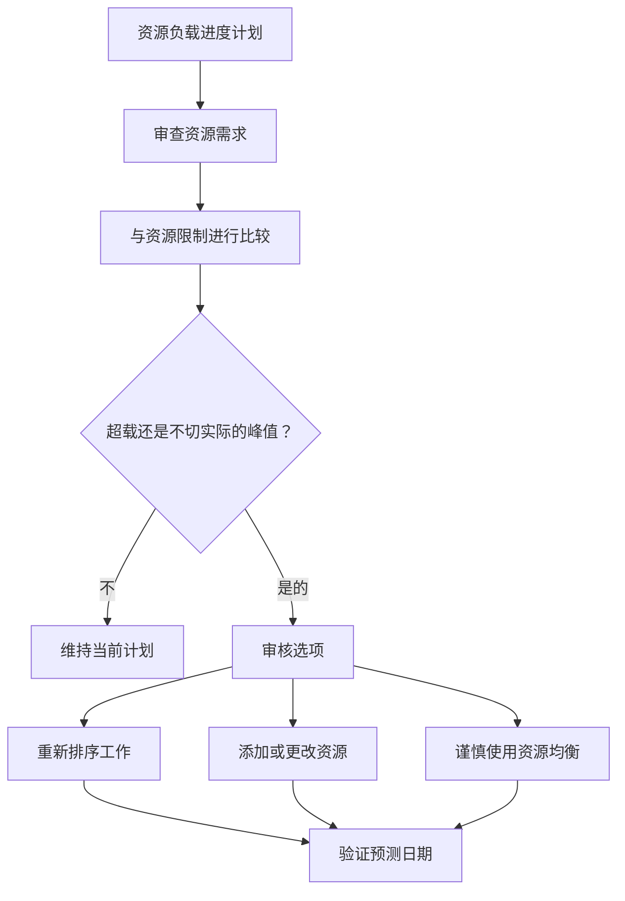

# P6 中的资源平衡

Primavera P6 中的资源平衡是根据可用容量审查资源需求并调整计划以便可以使用可用资源执行工作的过程。它可以帮助项目团队了解进度计划是否仅在逻辑上正确或从资源的角度来看是否实用。

在日常进度计划中，人们经常使用资源平衡和资源均衡这两个词，就好像它们的意思是一样的。它们是相关的，但并不完全相同。

资源平衡是更广泛的计划审查。它包括查看直方图、资源概况、人员可用性、设备需求、人力峰值和计划的现实性。

资源均衡是 P6 的一项功能，可以根据资源可用性和均衡设置移动活动。

该功能可能很有用，但应在控制下使用。 P6 可以计算分级结果，但进度计划人员必须决定该结果对项目是否有意义。

## 什么是资源平衡

资源平衡提出了一个实际问题：项目能否用其实际拥有的资源执行该计划？

进度计划可能具有良好的逻辑、可接受的日期和合理的关键路径。但如果需要同样有限的人员或设备同时在太多地方工作，那么该计划可能不太现实。

平衡资源意味着审查需求并决定如何管理它。

可能采取的行动包括：

- 移动非关键工作。
- 添加资源。
- 将工作分配给不同的人员或区域。
- 改变活动顺序。
- 使用加班或轮班工作。
- 调整日历。
- 更新资源限制。
- 如果临时高峰是现实且经批准的，则接受。

目标不是使直方图完全平坦。真正的项目有高峰和低谷。目标是确保资源需求被理解、可实现并与执行计划保持一致。

## 为什么它很重要

资源平衡很重要，因为计划应该支持执行，而不仅仅是计算。

如果计划下周需要 50 名焊工，但承包商只能提供 30 名，则进度计划显示无法满足需求。如果两项关键活动同时需要同一台起重机，则至少其中一项可能必须移动。如果工程评审活动都需要同一位专家，那么在施工开始之前就可能出现瓶颈。

如果没有资源平衡，项目可能会认为它拥有的容量比实际拥有的容量多。

这可能会影响：

- 近期前瞻性计划。
- 人力预测。
- 设备计划。
- 关键路径可信度。
- 挣值预测。
- 成本和现金流曲线。
- 进展承诺。
- 恢复计划。

资源平衡有助于将 CPM 计划与实际现场和办公室能力联系起来。

## 资源平衡与资源均衡

资源平衡是一项管理和计划活动。

资源均衡是一种进度计划计算。

这种区别很重要。计划人员可以通过查看直方图并根据项目知识调整进度计划来手动平衡资源。当资源需求超过可用性时，P6 资源平衡还可以通过自动延迟活动来提供帮助。

这两种方法都有用。

当进度计划员需要判断、现场输入、可施工性审查或仔细控制活动的移动时，手动平衡效果更好。

当资源数据可靠、资源限制已定义、日历正确并且进度计划人员想要测试强制执行资源可用性时计划如何变化时，P6 资源平衡非常有用。

平衡不应取代计划判断。应该支持一下。

## P6练级前需要什么

在使用 P6 资源均衡功能之前，应准备好计划以进行资源分析。

至少，检查：

- 活动具有有意义的资源分配。
- 资源单位反映了实际需求。
- 资源限制反映了实际的可用性。
- 资源日历是正确的。
- 活动日历正确。
- 逻辑足够完整以支持进度计划决策。
- 限制条件是可以理解的。
- 确定或审查优先事项。
- 当前计划已保存，以便可以比较分级结果。

如果这些项目很弱，调平可能会产生看起来精确但没有用处的结果。

例如，如果所有施工劳动力都分配给一种通用“施工人员”资源，P6 可能会显示资源过载，但结果可能无法告诉项目问题是土建、管道、电气还是机械问题。资源设置必须与计划决策相匹配。

## P6 如何使用资源均衡

P6 资源平衡审查资源分配和可用性。根据设置，可能会延迟减少或消除资源过度分配的活动。

计算可以考虑资源限制、活动逻辑、浮时、日历、优先级和平衡选项。确切的结果取决于项目的配置方式。

实际上，P6 会寻找资源需求高于可用性的情况，然后尝试将活动移至资源可用的日期。

这可以创建资源更可行的进度计划，但也可能改变关键路径、延迟里程碑或以需要审查的方式移动工作。

调平后，进度计划人员应将结果与原始预测进行比较：

- 哪些活动发生了变化？
- 哪些里程碑发生了变化？
- 关键路径有变化吗？
- 平整是否使用了可用的浮时或延迟了项目完成？
- 新的日期可以构建吗？
- 结果是解决了资源问题还是造成了另一个问题？

不应盲目接受分级的进度计划。

## 何时使用资源平衡

当资源可用性影响执行时，请使用资源平衡。

它在以下方面特别有用：

- 施工进度计划与人员限制。
- 停机、周转和停电。
- 与有限专家的调试计划。
- 与共享审阅者的工程计划。
- 具有昂贵或共享设备的项目。
- 一个资源池支持多个项目的计划。
- 正在考虑额外资源的恢复计划。

在基线批准之前，资源平衡也很有用。假定不切实际的人力或设备可用性的基线以后可能会变得难以捍卫。

在更新过程中，资源平衡有助于确认剩余的工作是否仍然可以用当前的团队和设备交付。

## 何时要小心

当资源数据未被维护时要小心。

如果实际单位未更新，资源曲线可能会偏离现实。如果仅针对成本负载分配资源，则单位可能不代表实际容量。如果日历错误，资源可用性也可能错误。

在合同或基准计划上使用资源平衡时也要小心。调平可以移动日期并影响浮时。团队应该了解分级进度计划是正式计划、假设场景还是内部计划视图。

调平还可以隐藏逻辑弱点。如果一项活动因调平而发生变化，审阅者可能会忽略原始逻辑不完整或不正确的情况。始终首先审查逻辑，然后再审查资源。

## 如何在实践中使用它

首先确定最重要的资源。不要试图以相同的细节水平来平衡每项次要资源。重点关注可能影响里程碑的关键人员、关键专家、共享设备和资源。

然后查看 P6 中的资源概况或直方图。寻找需求的峰值、过载、缺口和突然变化。

将需求与资源限制进行比较。如果需求超出限制，请与负责团队讨论该问题。答案可能是可操作的，而不仅仅是进度计划。

接下来，确定修正方法：

- 如果资源限制错误，请更新资源限制。
- 如果资源需求错误，请更正分配。
- 如果顺序不切实际，请调整逻辑或活动时间安排。
- 如果超载确实存在，请决定是否添加资源、使用加班、转移工作或接受高峰。
- 如果自动调平合适，请将其作为受控场景运行并比较结果。

在运行资源均衡之前，保留未均衡计划的副本。这为团队提供了参考点并有助于解释发生了什么变化。

## 良好实践

使用资源平衡作为计划审查的一部分，而不是作为一次性清理工作。

在基线开发、重大重新预测、恢复计划和定期更新周期期间审查资源曲线。

不要制定低质量的计划并期望结果变得可靠。首先修复逻辑、日历、活动状态、剩余持续时间和资源分配。

使用 P6 功能时的文档调平设置。根据所选选项的不同，资源平衡可能会产生不同的结果，因此这些设置是计划记录的一部分。

最重要的是，与拥有该工作的人员一起验证资源计划。项目团队应确认资源峰值是否可以实现，顺序是否可行，以及额外的资源是否实际可用。

## 结论

P6中的资源平衡可以帮助项目团队测试是否可以利用可用资源来执行计划。它将日期和逻辑与人力、设备、专家可用性和实际生产能力联系起来。

P6资源平衡可以通过根据资源可用性移动活动来支持这种审查，但应谨慎使用并在计算后进行审查。

平衡的进度计划不一定是完全顺利的进度计划。在这个进度计划中，资源需求是可见的、现实的，并且与项目的实际交付方式保持一致。
## 相关内容
- [活动开始，Primavera P6 进度为 0% - 概述](../../03_metrics_zh/13_活动_started_progress_zero/01_overview_template.md)
- [P6 中的资源限制](../13_RESOURCES%20LIMITS%20IN%20P6/13_RESOURCES%20LIMITS%20IN%20P6.md)
- [SS 与 FF 关系](../15_SS%20&%20FF%20RELATIONS/15_SS%20&%20FF%20RELATIONS.md)
