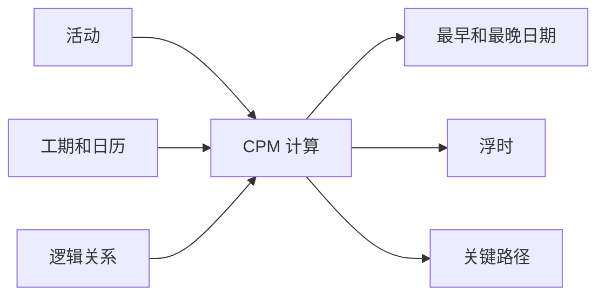

# CPM（关键路径法）

关键路径法，简称 CPM，是严肃项目计划背后的核心计算方法。它把活动清单变成一个有逻辑关系的网络模型，用来回答项目团队最关心的问题：项目最早何时可以完成，哪些活动控制完成日期，计划中哪里还有浮时空间。

在 Primavera P6 中，CPM 经常被隐藏在 进度计算按钮后面。软件可以快速计算日期、浮时和关键活动。但计划人员仍然需要理解这个方法。否则，计划虽然可以计算，但结果未必代表真实的执行逻辑。

## CPM 做什么

CPM 根据活动、工期、日历和逻辑关系计算项目工期。

核心思想很简单：项目工期不是所有活动工期的总和，而是计划网络中最长的依赖工作路径的工期。这条路径就是 关键路径。

如果这条路径上的活动延误，项目完成日期也会延误，除非团队在同一路径上追回时间。

## CPM 需要哪些输入

CPM 的结果取决于计划网络的质量。

首先，计划需要清楚定义的活动。每项活动应有明确范围、合理工期和清楚的完成标准。

其次，每项活动需要工期。在多数 P6 计划中，这是一个确定性估算，基于生产率、资源、日历和执行假设。

第三，活动需要逻辑关系。关系定义什么必须先发生，什么可以并行，以及什么条件允许后续活动开始或完成。

CPM 不会判断逻辑是否合理。它只会按照收到的逻辑计算。如果网络有缺失逻辑、过多约束、过量 滞后 或不完整 SS/FF 关系，结果可能数学正确，但管理上不可靠。

## 前推计算 和 后推计算

CPM 通常通过两个主要过程计算。

前推计算 从 数据日期 向项目结束方向计算，得出每项活动最早可以开始和完成的日期，即 最早开始 和 最早完成。

后推计算 从项目完成日期向前计算，得出每项活动在不延误项目完成前提下最晚可以开始和完成的日期，即 最晚开始 和 最晚完成。

有了早期和晚期日期，P6 就可以计算 浮时。

## 浮时

浮时 是活动可以移动而不影响某个计划目标的时间。

总浮时 通常是 P6 中最常审查的值。它显示活动可以延误多久才会影响项目完成或控制路径。

自由浮时 更局部，表示活动可以延误多久而不影响直接后续活动的 最早开始。

浮时 不是可以随便消耗的空闲时间。它是计划弹性。当 浮时 被消耗，项目抵御未来延误的能力就会降低。

## 关键路径

关键路径 是控制项目完成的最长依赖活动路径。很多计划用零或负 总浮时 识别关键活动，但更好的做法是理解 最长路径，并判断它是否符合实际。

好的 关键路径 应该讲得通。它应穿过真正控制完成的活动，例如设计发布、采购、施工顺序、测试、调试、移交 或其他真实驱动因素。

如果 关键路径 通过奇怪的里程碑、不必要约束、缺失逻辑或并不真正控制完成的活动，计划可能发出错误信号。

## 近关键工作

项目团队不应只关注零 浮时 活动。

近关键活动的浮时很低，轻微延误就可能变成关键活动。阈值取决于项目规模和敏感度。大型项目中，少于 10 或 20 个工作日浮时的活动可能需要重点关注。

近关键路径很重要，因为风险通常不只存在于一条线上。施工高峰、调试或停工阶段，多个路径可能同时接近关键。

## CPM 和风险分析

CPM 给出确定性答案：如果每项活动都按计划工期完成，项目将在何时完成。

进度风险分析 进一步处理不确定性。它对活动工期使用范围或概率分布，并运行大量模拟，以估计按目标日期完成的概率。

但风险分析依赖 CPM 网络。如果逻辑薄弱，风险结果也会薄弱。蒙特卡洛模拟不能修复缺失逻辑、不现实工期或差的网络结构。

## P6 中的 CPM

P6 让 CPM 计算非常快，但速度也可能隐藏假设。

计算计划时，P6 会使用 数据日期、日历、工期、关系、约束、实际进度、剩余工期和 进度计算选项。这些设置的小变化都可能改变 浮时、关键路径 和 预测 日期。

因此，计划人员不应只按 F9 后接受结果。应检查计算结果是否符合真实执行计划。

## 良好做法

从真实执行逻辑建立 CPM 网络。不要为了通过检查或得到想要的日期而添加关系。

每次更新后审查 关键路径，确认其开始和结束符合项目当前状态。

跟踪 浮时 的变化。项目表面可能按计划推进，但 浮时 正在悄悄消耗。

审查近关键路径。它们常常显示下一个计划问题会在哪里出现。

保持计划足够干净以支持 CPM。开放开始、开放完成、硬约束、过量滞后和不完整关系都会降低计算价值。

## 结论

CPM 是把 Primavera P6 计划变成项目控制工具的引擎。它从活动网络中计算早期日期、晚期日期、浮时和 关键路径。

但 CPM 的可靠性取决于它计算的计划。清楚的活动、现实的工期、正确的日历和强逻辑，才能让结果有意义。

CPM 的价值不只是给出完成日期。真正的价值是解释为什么这个日期被控制，哪里有弹性，以及管理层应该把注意力放在哪里。
## 相关内容
- [以约束开始的关键路径或浮时路径 - 概述](../../metrics/09_cp_or_浮时_path_starting_with_constraint/02_guide_template.md)
- [SS 与 FF 关系](../15_SS%20&%20FF%20RELATIONS/15_SS%20&%20FF%20RELATIONS.md)
- [制定项目进度计划](../17_DEVELOPE%20A%20PROJECT%20SCHEDULE/17_DEVELOPE%20A%20PROJECT%20SCHEDULE.md)
