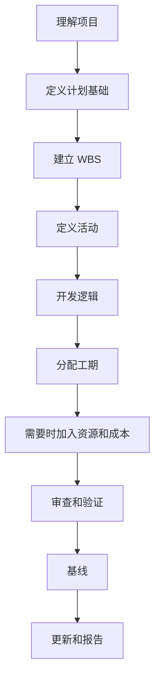

# 制定项目进度计划

从零开始制定项目进度计划，不只是把活动输入 Primavera P6。它是把范围、执行策略、约束、资源和项目承诺转化为一个可以审查、批准、更新和用于决策的时间模型。

好的计划在计算之前就已经被构建。P6 文件的质量取决于输入第一项活动之前的思考质量。

## 开发流程

## 先理解项目

不要在理解项目之前打开 P6。

先审查合同、工作范围、技术规格、关键里程碑、执行策略、采购限制、许可、现场进入条件和主要移交要求。然后与项目经理、工程、采购、施工、调试、分包商和供应商沟通。

进度计划是团队打算如何交付项目的模型。如果计划人员不了解这个意图，计划就会建立在假设上。

## 定义计划基础

计划基础说明计划将如何建立。它应定义 WBS、日历、活动编码、详细程度、关系规则、滞后 政策、P6 计算设置、数据日期 约定、报告要求和 基线 方法。

这个文件很重要，因为它解释计划为什么这样建立，也为质量审查和后续比较提供依据。

## 建立 WBS

WBS 是计划的组织框架。它应反映项目如何管理和报告。

WBS 可以按阶段、区域、系统、专业、交付物、合同包或组合方式组织。结构应支持筛选、进度测量、责任分配和报告。

如果 WBS 与项目控制方式不一致，即使活动本身正确，计划也很难使用。

## 定义活动

活动应代表清晰、可测量的工作。每项活动应有明确范围、明确开始条件、明确完成条件和一个责任人。

活动太大会难以更新。活动太小会让计划难以维护。合适的详细程度取决于项目阶段、合同要求、报告需求和控制要求。

活动名称很重要。好的名称应说明正在执行什么工作、在哪里执行，以及它与哪个对象、系统或交付物相关。

## 开发逻辑

逻辑是 CPM 计划的核心。它定义什么必须先做，什么可以并行，以及每项活动在什么条件下可以开始或完成。

逻辑应与了解工作的人员一起开发。不要只在办公室里独自建立 P6 关系。应与专业负责人、施工经理、调试、采购和分包商一起审查顺序。

当 FS 能真实表达工作时使用 FS。只有在重叠工作真实存在时才谨慎使用 SS 和 FF。避免负滞后，除非有明确批准，不使用 SF。除项目开始和完成里程碑外，活动通常应有前置活动和后续活动。

## 分配工期

工期应现实，而不是理想化。它应基于范围、生产率、资源、日历、供应商输入、分包商输入和类似项目经验。

工期不只是一个数字。它隐含某种班组、生产率、日历、进入条件和执行方法。如果这些假设改变，工期也可能需要改变。

记录重要工期假设。这有助于审查、更新、变更管理和延误分析。

## 需要时加入资源和成本

如果计划用于资源计划、成本加载、挣值或现金流，资源和成本必须谨慎加入。

资源装载可以显示人工、设备、材料数量和可能的过载。成本加载可以把计划连接到预算、预测、付款曲线或进度曲线。

不要只为了看起来完整而加入资源。如果项目依赖这些数据，更新时也必须维护。

## 审查和验证

基线 批准前，计划应经过技术和执行层面的审查。

检查开放开始、开放完成、逻辑关系类型、滞后、约束、长工期、缺失逻辑、浮时分布和关键路径合理性。DCMA 类型检查有用，但仍需要项目判断。

与项目团队一起走查计划。确认逻辑、工期、资源和里程碑是否符合真实执行计划。通过指标但无法通过现场团队审查的计划，还没有准备好。

## 基线

计划审查并批准后，就成为 基线。基线 是衡量进度、偏差、延误、恢复和绩效的参考。

基线 应是正式行为。保存批准版本，防止非受控修改，并记录批准。后续 基线 变更应遵循 变更控制。

如果 基线 每次项目落后就被修改，它就不是 基线，而是移动目标。

## 建立更新周期

计划只有持续更新才有价值。

定义谁提供进度、何时收集、需要什么证据、如何验证实际日期、如何审查剩余工期，以及发布哪些报告。施工和调试阶段可能需要每周或每两周更新，早期阶段可能每月更新。

更新周期把 基线 从静态文件变成动态控制工具。

## 结论

制定项目计划是一个结构化过程。理解项目，定义计划基础，建立 WBS，创建活动，开发逻辑，分配工期，需要时加载资源，验证结果，建立 基线，并通过更新维护。

最好的计划不是急着打开 P6 做出来的。它来自对工作的理解、对假设的挑战，以及一个项目团队可以信任的模型。
## 相关内容
- [从数据日期开始且没有驱动逻辑的活动：为什么此计划指标很重要 - 概述](../../metrics/01_activities_starting_in_dd_with_no_logic_driving/02_guide_template.md)
- [CPM（关键路径法）](../16_CPM%20(CRITICAL%20PATH%20METHOD)/16_CPM%20(CRITICAL%20PATH%20METHOD).md)
- [Activity 代码](../18_ACTIVITY%20CODES/18_ACTIVITY%20CODES.md)
