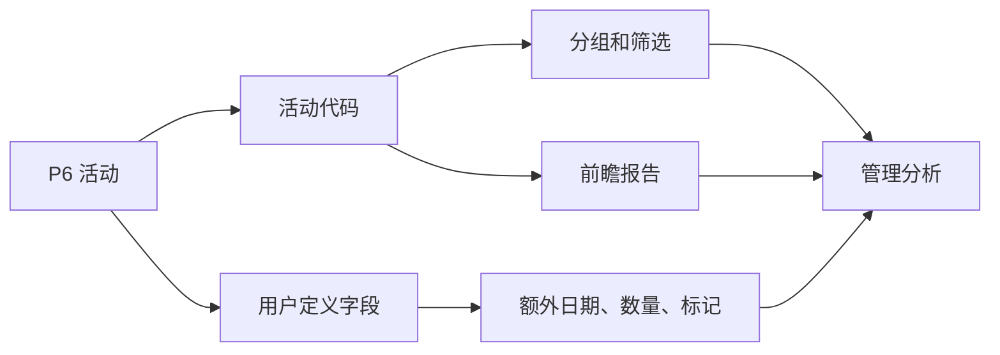

# 活动代码

Primavera P6 中的活动代码是把进度计划从活动清单变成项目控制数据库的重要工具。它们让项目团队可以从不同管理角度对计划进行分组、筛选、排序、报告和分析。

进度计划不只是横道图。在 P6 中，每项活动也是一条记录，可以带有责任方、阶段、区域、系统、专业、合同、里程碑类型和其他项目属性。活动代码可以用受控方式组织这些信息。

## 活动代码是什么

活动代码是分配给活动的结构化分类字段。每个代码类型代表一个报告维度，每个代码值代表该维度中的一个选项。

例如：

- 代码类型：区域。
- 代码值：1号装置、2号装置、罐区、公用工程。

或者：

- 代码类型：专业。
- 代码值：土建、机械、电气、仪表、调试。

WBS 说明工作在项目结构中的位置。活动代码说明可以如何从不同角度查看和分析这些工作。

## 它们不是什么

活动代码不能替代 WBS。WBS 是范围层级，代码是同一批活动的附加视图。

活动代码不能替代逻辑。逻辑定义工作顺序。

活动代码不能替代资源。资源定义人工、设备、材料需求和成本加载。

如果这些概念混在一起，计划会更难维护。清晰的 P6 计划会让 WBS、逻辑、资源、活动代码和 UDF 各自承担不同用途。

## 全局和项目活动代码

P6 有全局活动代码和项目活动代码。

全局活动代码在多个项目之间共享。它们适用于组合层面统一使用的分类，例如标准阶段、公司责任组或项目群报告类别。

项目活动代码属于单个项目。它们适用于项目特定需求，例如区域、系统、合同包、工作面、移交包或本地报告类别。

使用全局代码要谨慎，因为变更可能影响其他项目。只在单个项目内有意义的属性，通常使用项目代码。

## 常见代码类型

有用的 代码类型 取决于项目，但常见例子包括：

- 责任方。
- 专业.
- 项目阶段.
- 区域或位置.
- 系统或子系统.
- 合同包.
- 工作包.
- 里程碑类型.
- 移交包.
- 报告层级.

最好的 代码类型 来自报告需求。创建 代码 之前先问：计划需要回答哪些问题？

例如：

- 下个月 A 区有哪些工作？
- 哪些活动属于电气承包商？
- 哪些系统正在驱动 调试？
- 哪个 合同包 正在延误？
- 哪些 里程碑 需要报告给客户？

## 用户定义字段

用户定义字段，或 UDF，与活动代码不同。代码把活动归入类别。UDF 存储自定义数据，例如日期、数字、文字、成本、数量或是/否标记。

当信息不是简单分类时，应使用 UDF。

例子包括：

- 合同完成日期.
- 预测完成日期.
- 风险标志。
- 计划数量.
- 已安装数量.
- 变更单编号.
- 图纸参考.
- 检查状态.

活动代码最适合分组和筛选。UDF 最适合存储 P6 标准字段没有覆盖的额外信息。

## 为什么 代码 对报告重要

好的编码让报告更快、更可靠。

有了一致的 活动代码，进度计划人员 可以快速生成专业 前瞻计划、区域报告、合同包汇总、调试系统报告、里程碑 报告和管理 仪表板，而不需要每次重新建立筛选。

没有 代码，报告通常变成手工工作。团队导出数据、编辑 电子表格、手动加标签，并在每个 更新周期重复。这样容易出错，也浪费时间。

代码 让计划可以作为可重复使用的数据源。

## 治理

活动代码需要治理。如果每个人都自由创建值，计划很快会变得不一致。

例如，一个人使用“电气”，另一个人使用“电气专业”，另一个人使用“E&I”。报告可能漏掉活动，因为同一类别被拆成多个标签。

尽可能在基线前定义代码类型和有效值。记录每个代码的含义、维护责任人，以及是否为必填项。

编码完整性应像其他计划质量项目一样检查。如果很多活动缺少必填代码，基于这些代码的报告就不能信任。

## 避免过度设计

更多 代码 不一定代表更好控制。

每个代码和 UDF 都会带来维护工作。如果一个代码从未用于报告、筛选、仪表板或分析，可能不值得维护。

从真正重要的报告问题开始。建立足够结构来回答这些问题，但不要因为“以后可能有用”而创建字段。

## 良好做法

在计划开发期间设计编码结构，而不是 基线 之后。

让 代码 与项目报告计划一致。如果项目按区域、专业、合同和系统报告，这些维度应存在于 P6 编码结构中。

保持代码值一致并受控。避免重复和不清楚的缩写。

用 UDF 存储自定义日期、数量、参考和指标。不要把数值或日期信息强行放进活动代码。

每个 更新周期都检查编码。新活动在发布报告前应获得必要 代码。

## 结论

活动代码不只是行政标签。它们让 Primavera P6 计划能够快速、一致地回答管理问题。

使用得当时，代码 让计划更容易筛选、分组、报告和分析。UDF 通过存储 P6 标准字段未覆盖的项目信息，扩展了这种能力。

横道图显示时间。编码结构决定计划如何被阅读、切分和使用。
## 相关内容
- [Primavera P6 中缺少依赖项 - 概述](../../metrics/21_missing_dependencies/02_guide_template.md)
- [制定项目进度计划](../17_DEVELOPE%20A%20PROJECT%20SCHEDULE/17_DEVELOPE%20A%20PROJECT%20SCHEDULE.md)
- [进度计划编制依据](../19_SCHEDULE%20BASIS/19_SCHEDULE%20BASIS.md)
