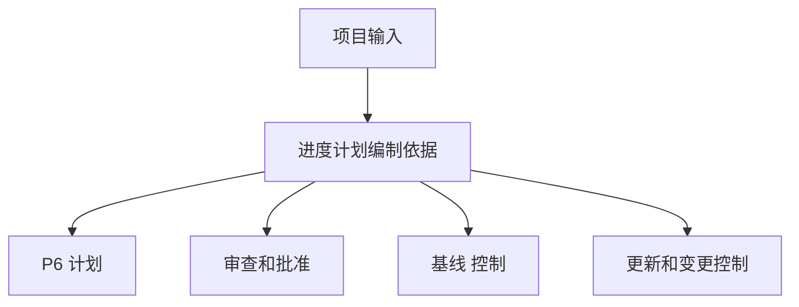

# 进度计划编制依据

进度计划编制依据，是解释项目进度计划如何建立、哪些假设支持计划的文件。它是 Primavera P6 文件的文字说明。

进度计划显示日期、逻辑、浮时、里程碑、资源和 关键路径。进度计划编制依据 解释这些内容为什么这样设置。

## 用途

进度计划编制依据 支持审查、批准、基线 控制、进度更新、变更管理 和 延误分析。它帮助审查人员理解计划背后的规则、假设、输入和限制。

没有它，P6 文件可能可以计算，但团队未必知道使用了哪些假设，也难判断计划是否适合管理决策。

## 谁编写，给谁使用

进度计划编制依据 通常由 进度计划人员 或 计划工程师 编写，并由项目经理、工程、采购、施工、调试、项目控制、合同和成本团队提供输入。

它面向项目团队、客户、PMO、审查人员、索赔分析人员，以及任何需要理解计划如何建立的人。

## 为什么重要

计划中有很多决定。日历、工期、逻辑、班组、里程碑、审批周期、许可和资源限制都会影响日期和 浮时。

进度计划编制依据 让这些决定可见。它减少歧义，支持审计，并避免未来争论 基线 时计划假设了什么。

## 应包含什么

完整 进度计划编制依据 应包括：

- 项目范围和排除项。
- 计划目的和合同用途。
- 计划开发方法。
- WBS 和 活动代码结构。
- 日历、班次、假日、天气和非工作期。
- 主要假设和 约束。
- 开始、完成、 访问权、审批和 材料交付 里程碑。
- 审批和许可周期。
- 移交 和 移交 假设。
- 逻辑规则、逻辑关系类型和 滞后 政策。
- 工期依据、生产率 和 定额。
- 班组、资源可用性、劳动力限制 和 设备限制。
- 成本规则，如适用。
- 关键路径 和 近关键路径 说明。
- 风险假设和主要不确定性。
- 更新周期、状态规则和报告方法。

## 假设

假设应清晰、可验证。它们可能包括现场访问权日期、工程发布、供应商交付、许可审批周期、客户审查期、班组可用性、天气预留时间和调试顺序。

如果某项假设影响日期、浮时、资源或 移交，它应写入 进度计划编制依据。

## 日历和工作期

文件应解释 P6 中使用的主要日历。包括工作日、班次、假日、季节性停工、天气日历、夜班、周末工作和非工作期。

日历直接影响活动日期和 浮时。如果工程、采购、施工、调试 或资源使用不同日历，应说明原因。

## 班组、资源和限制

只有理解资源假设，工期才有意义。进度计划编制依据 应说明班组假设、资源可用性、劳动力限制、设备限制，以及 加班 或 班次 策略。

如果包含 资源装载，应说明其用途是 人力计划、成本装载、挣值 还是 资源平衡。

## 里程碑、审批、许可和 移交

主要里程碑应列出并解释，包括 项目开始、合同完成、获得访问权、客户审批、第三方接口、材料交付、许可、系统移交 和 最终移交。

审批和许可周期应显示假设工期和责任方。如果客户或第三方动作驱动计划，应明确显示。

## 方法、生产率和成本

进度计划编制依据 应解释计划如何开发：使用的资料、工作坊、排序逻辑、工期估算方法、生产率、定额 和验证过程。

如包含 成本装载，应说明规则。解释成本按 资源、费用、活动、WBS、合同包 或 挣值方法 分配。

## 关键路径 和风险

进度计划编制依据 应总结 关键路径，并解释为什么合理。也应识别 近关键路径、主要风险、进度敏感性 和执行期间可能变化的假设。

这帮助团队理解的不只是计划完成日期，还有什么控制该日期。

## 良好做法

在 基线 批准前编写 进度计划编制依据。保持它与 P6 文件一致。当批准变更影响关键假设、日历、里程碑、资源策略或方法时，应更新它。

不要写成通用叙述。它应足够具体，使另一位 进度计划人员 能理解计划如何建立。

## 结论

进度计划编制依据 是计划背后的解释。它说明计划假设什么、如何建立、包含什么、排除什么，以及哪些条件必须成立才能让日期继续有效。

强有力的 进度计划编制依据 让 P6 文件更容易审查、辩护、更新和信任。
## 相关内容
- [从数据日期开始且没有驱动逻辑的活动：为什么此计划指标很重要 - 概述](../../metrics/01_activities_starting_in_dd_with_no_logic_driving/02_guide_template.md)
- [活动代码](../18_ACTIVITY%20CODES/18_ACTIVITY%20CODES.md)
