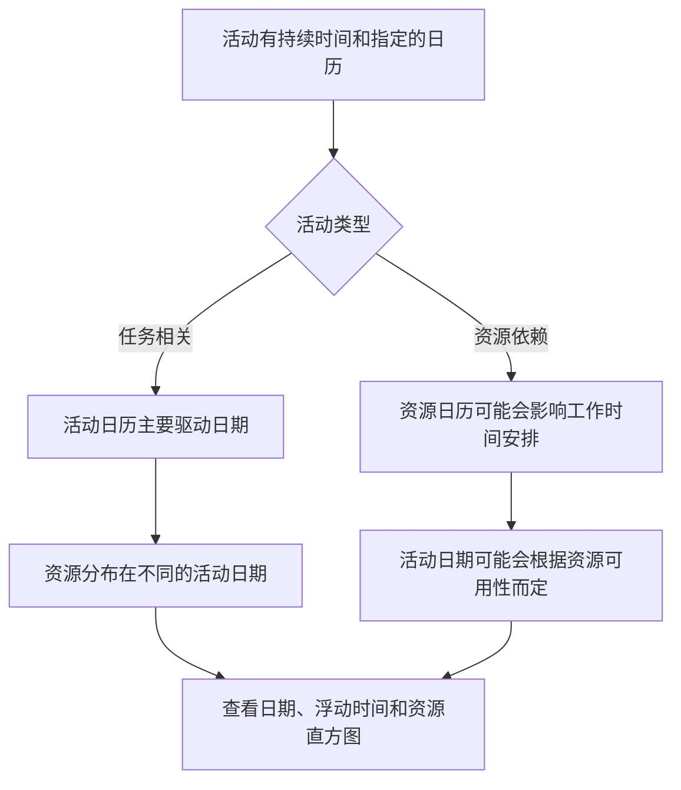

日历是 Primavera P6 日程表的安静基础之一。他们定义了工作何时可以进行。他们告诉 P6 哪些天是工作日，哪些天是非工作日，一天有多少小时可用，以及一天中什么时间开始和结束工作。

由于日历在幕后工作，因此很容易被低估。时间表可能具有很强的逻辑性和合理的持续时间，但如果日历错误或不一致，日期仍然可能会产生误导。

了解日历对于进度质量、资源规划、关键路径审查和更新规则至关重要。

## 日历在 P6 中的作用

在 P6 中，日历将持续时间转换为日期。如果一项活动的持续时间为 10 个工作日，P6 需要知道工作日意味着什么。是周一到周五吗？星期六也包括在内吗？工作日是8小时、10小时还是12小时？上班时间是7:00还是8:00？假期除外吗？

日历回答了这些问题。

日历影响：

- 活动开始和结束日期。
- 早日期和晚日期。
- 总浮动量。
- 关键路径和最长路径。
- 资源使用时间。
- 关系滞后解释。
- 更新期间日期会发生变化。
- 前瞻和报告准确性。

日历不仅仅是一个管理设置项。它是计划计算的一部分。

## 为什么可能需要不止一份日历

许多项目需要多个日历，因为并非所有工作都遵循相同的工作模式。

示例包括：

- 办公室工程工作为期 5 天。
- 现场施工工作为期 6 天。
- 24 小时日历上的停机或停电工作。
- 夜班调试工作。
- 业主访问窗口。
- 环境限制。
- 基于供应商工作日的采购活动。
- 针对检查员、供应商或专业人员的资源特定日历。

使用一个日历处理所有事情可能看起来很简单，但它可能会产生不切实际的日期。如果调试只能在晚上进行，则正常的白天日历可能是错误的。如果供应商仅在工作日工作，则 7 天的施工日历可能会夸大可用性。

目标不是创建许多日历。目标是创建足够的日历来模拟真实的工作条件，而不使日程安排变得不必要的复杂。

## 活动日历

活动日历直接分配给活动。它定义用于计算该活动的持续时间和日期的工作时间，特别是对于任务相关活动。

例如，如果“安装电缆桥架”有 6 天的施工日历，P6 将根据该日历计算其工时。如果星期六是工作日，则活动可能会比 5 天日历上的活动早结束。

活动日历通常是正常计划活动的主要日历控件。

当工作本身遵循定义的工作模式（例如白班、夜班、停工或办公室工作）时，请使用活动日历。

## 资源日历

资源日历定义资源何时可用。资源可以是人员、机组人员、设备、供应商专家或其他分配的资源。

当活动依赖于资源或项目使用资源平衡或详细资源规划时，资源日历变得尤其重要。

例如，某项活动可能被分配了 6 天的施工日历，但分配给该活动的专业检查员可能只能在周一至周三有空。如果活动是资源驱动的，P6 可以根据资源日历而不是仅根据活动日历来计算日期。

当资源可用性是一个真正的调度约束时，资源日历非常有用。如果它们被分配但不被维护，也会造成混乱。

## 活动和资源日历如何交互

活动日历和资源日历之间的关系取决于活动类型、资源设置和计划计算行为。

对于任务相关活动，活动日历通常是活动持续时间的主要依据。资源日历可能仍会影响资源分布和使用。

对于资源相关活动，资源日历可以影响工作的执行时间。这意味着资源日历可能会更直接地影响活动日期。

关键是日历必须一起回顾。活动日历可能会显示工作是可能的，而资源日历则显示分配的资源不可用。这种不匹配会造成不同步。

## 日历不同步意味着什么

当计划中的不同日历与项目应有的实际工作方式不一致时，就会发生日历不同步。

常见的例子包括：

- 活动使用 6 天日历，但分配的资源使用 5 天日历。
- 活动使用白班日历，但资源使用夜班。
- 两个链接的活动在一天中使用不同的开始和结束时间。
- 滞后是通过与工作不匹配的日历来解释的。
- 复制的活动会保留另一个项目的旧日历。
- 资源日历具有活动日历没有的假期。

结果可能会令人困惑。日期可能会意外改变。活动可能会在一天后结束。浮动可能会在没有明显逻辑原因的情况下发生变化。资源直方图可能与执行计划不匹配。关键路径可能会因日历行为而不是实际顺序而移动。

## 日历不匹配导致的问题

日历不匹配可能会导致多个日程质量问题。

首先，它可能会产生误导性的日期。由于日历的工作周期较少，任务可能看起来需要更长的时间。

其次，它会扭曲浮动。不同日历上的活动可能会以难以解释的方式计算最早和最晚日期。

第三，它会影响关键路径。路径可能变得至关重要，因为日历限制了工作，而不是因为逻辑顺序真正具有控制性。

第四，它可能会损害资源报告。资源直方图可能会显示资源实际不可用的日期的资源需求，或者可能会错过应该出现的需求。

最后，它可能会造成更新混乱。当数据日期发生变化时，不同日历上的活动可能会做出不同的响应，从而使计划更难以状态和审查。

## 如何解决不同步问题

首先确定项目日历标准。定义正常工作周、工作日开始和结束时间、假期、关闭时间和特殊工作窗口。

然后查看日程表中的所有日历。查看：

- 日历名称和目的。
- 工作日。
- 每日工作时间。
- 开始和结束时间。
- 假期和例外情况。
- 日历类型。
- 分配给日历的活动。
- 分配给日历的资源。

接下来，回顾一下日期看起来很奇怪的活动。添加活动日历、活动类型、开始、完成、提前开始、提前完成、总浮动时间、资源和资源日历（如果可用）列。

如果日历有误，请更正。如果活动分配给了错误的日历，请更改分配。如果资源日历有效但导致意外结果，请确认活动是否应与资源相关或与任务相关。

进行更正后，重新计算进度表并检查受影响的日期、浮动时间、关键路径和资源直方图。

## 良好的日历治理

日历应该像逻辑和约束一样被管理。它们不应该在没有控制的情况下繁殖。

良好的做法包括：

- 使用清晰的命名约定。
- 保留一组有限的经批准的项目日历。
- 记录特殊日历存在的原因。
- 避免从旧计划中复制未使用的日历。
- 在基线批准之前审查活动日历分配。
- 如果使用资源加载，请检查资源日历。
- 检查日历开始和结束时间，而不仅仅是工作日。

日历治理在许多用户可以添加或复制活动的大型日程中尤其重要。

## 实际例子

一个建筑项目使用 6 天的日历进行现场工作。大多数施工活动在周一至周六 7:00 至 17:00 进行。调试团队从 22:00 到 6:00 夜班工作，因为测试只能在离线操作时进行。

两个日历均有效。

当复制的施工活动意外继承夜班日历时，就会出现问题。他们的约会开始变得奇怪。有些关系似乎会将继任者推向第二天。浮动的变化方式是团队无法解释的。

修复方法不是删除夜班日历。解决方法是更正活动日历分配，确认哪些活动真正需要夜班日历，然后重新计算时间表。

## 结论

P6 中的日历定义了工作可以进行的时间。它们影响活动日期、浮动时间、关键路径、资源加载、滞后和更新行为。

通常需要不止一份日历，因为项目包括不同的工作模式：现场工作、办公室工作、夜班、停工、供应商工作和资源可用性。但多个日历必须小心控制。

主要风险是不同步。当活动日历和资源日历与实际执行计划不匹配时，计划可能会显示令人困惑的日期、误导性的浮动和不可靠的资源信息。

一个强有力的日程安排会有意地使用日历。每个日历都有一个目的，每个特殊日历都会被记录下来，并且在信任计划之前会审查活动和资源日历分配。
