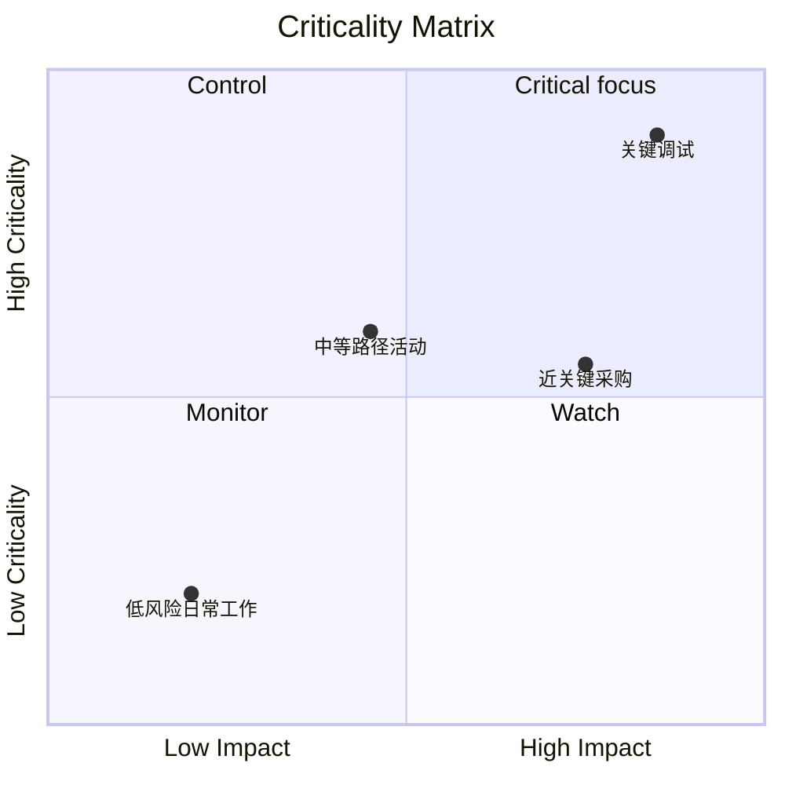

关键性矩阵是一种可视化或分析方法，用于根据项目活动对项目完成的重要性对项目活动进行分类和优先排序。在 Primavera P6 环境中，它可以帮助项目经理、计划人员和 PMO 审核人员确定哪些活动会产生最大的进度风险。

关键路径讲述了进度表当前的确定性故事。关键性矩阵更进一步。它可以帮助团队了解哪些活动已经很关键，哪些活动即将变得关键，以及哪些活动一旦失误就会造成严重影响。

这很重要，因为今天至关重要的活动并不总是唯一值得关注的活动。具有高延迟影响的近乎关键活动可能会成为明天的问题。长期采购活动可能不在当前的关键路径上，但它可能会带来足够的风险来证明严密控制是合理的。

## P6 中的关键性意味着什么

在Primavera P6中，关键性通常是指一项活动如果延迟是否会影响项目完成日期。传统上，P6 使用总浮动或最长路径设置来识别关键活动。

常见的确定性定义很简单：

- 关键活动是浮动金额为零或负数的活动。
- 这些活动位于关键路径上或与关键路径密切相关。
- 如果它们被推迟，项目完成日期可能会被推迟。

该定义很有用，但并不完整。它基于一种计算出的时间表条件。它不能完全解释不确定性、概率或活动失败时影响的大小。

关键性矩阵将讨论范围从“今天这项活动是否关键？” “这项活动变得严重的可能性有多大，以及它会造成多大的损害？”

## 关键性矩阵的组合

临界矩阵通常结合两个维度。

第一个维度是计划敏感性或可能性。这可以通过蒙特卡罗模拟期间活动变得关键的频率来衡量，或者根据总浮动或接近关键阈值来衡量它与关键的接近程度。

第二个维度是影响力。这意味着如果活动出现延误，延迟的严重程度。影响可能基于活动持续时间、对项目完成的延迟影响、敏感性指数、成本风险、合同里程碑影响或管理层判断。

这些维度共同帮助团队确定活动的优先顺序。

这种类型的视图很有用，因为它将仅出现在关键过滤器中的活动与值得管理层积极关注的活动分开。

## 简单的矩阵结构

基本的关键度矩阵可以显示为网格：

| 关键性/影响 | 低影响 | 中等影响 | 高影响力 |
| --- | --- | --- | --- |
| 低关键性 | 监视器 | 监视器 | 手表 |
| 中等危急度 | 审查 | 控制 | 高优先级 |
| 高关键性 | 控制 | 高优先级 | 关键焦点 |

确切的标签可能会因组织而改变，但想法保持不变。可以监控低重要性和低影响的活动。具有高重要性和高影响力的活动需要集中控制。

## P6 矩阵中使用的数据

默认情况下，Primavera P6 通常不提供内置的关键度矩阵视图。该矩阵通常使用 P6 活动数据结合外部分析来构建。

有用的 P6 字段包括：

- 总浮动量。
- 自由浮动。
- 活动持续时间。
- 剩余持续时间。
- 活动状态。
- 开始和结束日期。
- 限制。
- 关系逻辑。
- 日历。
- WBS 或活动代码。
- 关键或最长路径指示器。

该数据提供了确定性的时间表视图。它显示了当前计算的路径、近乎关键的工作、受限的活动以及具有长期剩余暴露的活动。

## 风险分析输入

为了使矩阵更加强大，团队可以添加来自蒙特卡罗分析的概率进度风险数据。这可能来自 Primavera 风险分析或其他风险模拟平台等工具。

重要的风险指标包括关键性指数、总浮动量、进度敏感度指数以及持续时间或影响值。

关键性指数（通常称为 CI）显示活动出现在关键路径上的模拟百分比。例如，如果某项活动的 CI = 80%，则该活动在 80% 的模拟场景中至关重要。

总浮动时间显示活动对确定性进度表中项目完成的影响程度。接近零的浮动是一个警告信号。

进度敏感度指数结合了关键性和影响力。它不仅有助于表明该活动是否变得至关重要，而且还有助于表明它是否对结果产生有意义的影响。

持续时间或影响值有助于估计严重性。较长的活动、高风险的采购包或与合同里程碑相关的任务如果延迟可能会产生更大的影响。

## 例子

考虑以下简化的活动集：

| 活动 | 漂浮 | 关键指数 | 期间 | 矩阵结果 |
| --- | ---: | ---: | ---: | --- |
| 一个 | 0 天 | 95% | 20天 | 关键焦点 |
| 乙 | 5天 | 60% | 15天 | 高优先级 |
| C | 20天 | 15% | 10天 | 监视器 |

活动 A 属于高关键性和高影响范围。它没有浮动，在大多数模拟中显得至关重要，并且持续时间很长。它值得集中控制。

活动 B 可能不如活动 A 紧急，但仍然值得关注。它的流通量有限，并且成为关键的可能性很大。

活动 C 具有更多的浮动性和较低的关键性。它不应该被忽视，但它不需要同等程度的管理重点。

## 为什么它有用

关键性矩阵有助于项目团队避免仅依赖单一确定性关键路径。确定性路径很重要，但这只是时间表的一种视图。

该矩阵可以帮助团队：

- 优先考虑要密切监控的内容。
- 将缓解重点放在关键风险活动上。
- 在近乎关键的活动变得关键之前识别它们。
- 了解概率性进度风险。
- 在一种视图中比较可能性和影响。
- 更清楚地向管理层传达进度风险。

对于 PMO 报告来说，这特别有用，因为它将进度复杂性转化为决策框架。团队可以显示哪些活动处于“关键焦点”、“高优先级”、“控制”或“监控”区域，而不是呈现数百个活动。

## 一种简单的构建方法

首先从 P6 导出活动数据。包括活动 ID、活动名称、WBS、总浮动时间、剩余持续时间、开始、完成、日历、约束以及关键或最长路径指示器。

然后添加可选的风险分析字段，例如关键性指数和进度敏感度指数。如果没有可用的模拟数据，请使用基于浮动和持续时间的实用阈值。例如，高关键性可能意味着总浮动时间小于或等于 0 天，或 CI 高于 70%。中等临界可能意味着近临界浮动或 CI 在 40% 到 70% 之间。

定义影响阈值。高影响力的活动可能持续时间较长，与合同里程碑相关，是高风险包的一部分，或者通过模拟显示会影响项目完成。

最后，在 Excel、Power BI 或其他报告工具中绘制活动图。结果不需要很复杂。价值来自于让优先级变得可见。

## 使用判断

关键度矩阵是一种决策支持工具，而不是自动答案。阈值应由项目控制团队审查，并根据项目类型、合同敏感性和进度成熟度进行调整。

另请记住，该矩阵取决于进度质量。如果 P6 时间表缺少逻辑、不切实际的持续时间、硬约束、糟糕的日历或弱状态更新，则矩阵将继承这些弱点。

矩阵的最佳用途是将分析输出与专业调度判断相结合。

## 结论

关键性矩阵根据项目活动变得关键的可能性以及延迟时产生的影响程度对项目活动进行排名。它使用P6数据，如总浮动、持续时间、约束和逻辑，并可以通过蒙特卡罗结果（如关键性指数和进度敏感度指数）进行强化。

对于项目经理和 PMO 审核人员来说，该矩阵将进度风险转变为更清晰的管理对话。它可以帮助团队专注于最重要的活动，而不仅仅是当今关键过滤器中出现的活动。

如果运用得当，关键度矩阵可以帮助项目团队从被动报告转向主动进度控制。
