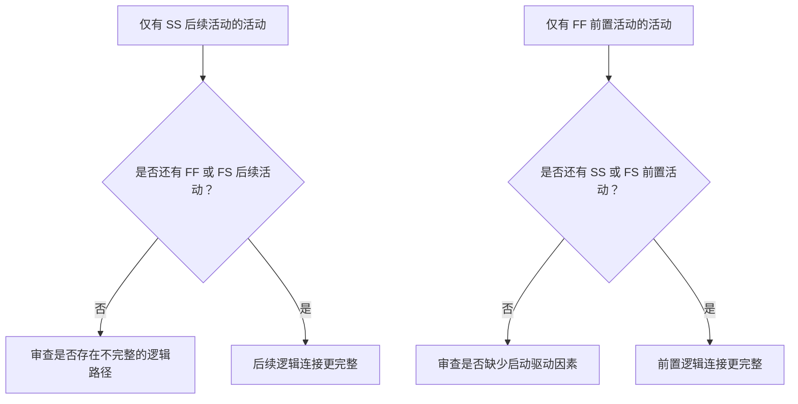

逻辑关系是项目进度计划中工序和依赖关系的数学表达。它解释了哪些工作必须先于哪些工作进行，哪些活动可以同时进行，以及项目团队打算如何从第一项活动推进到最终完工。

在一份良好的 Primavera P6 进度计划中，逻辑关系不是装饰。它是让进度计划能够计算日期、浮时、关键路径和预测变化的引擎。它以一种可被审查、质疑和改进的方式讲述执行的故事。

如果进度计划说"打地基，然后砌墙，然后建屋顶"，逻辑关系就是将这个序列转化为可计算网络的机制。计划工程师不只是在绘制时间轴，而是在定义交付路径。

## 逻辑关系讲述工作的故事

每个项目团队都有一套计划好的项目执行方式。工程可能按区域分批发布设计。采购可能按包交付设备。土建工作可能在结构工作开始之前完成通道准备。机械完工可能需要在调试开始之前完成。

逻辑关系链接是该计划的数学表达。

这个简单的图示不仅是一个序列，它是一个决策模型。如果基础延误，墙体可能延误。如果墙体延误，屋顶可能延误。如果屋顶延误，内部工程可能受影响。只有当逻辑关系存在时，进度计划才能显示这种影响。

强健的逻辑意味着进度计划能够解释活动为何启动、为何完工，以及当计划的某个部分发生移动时会发生什么。

## 为什么强健逻辑在数据日期至关重要

"在数据日期启动且无驱动逻辑的活动"这一度量指标是对进度质量的有力检验。

数据日期（Data Date）是实际绩效与预测工作之间的分界线。当一项活动恰好在数据日期启动时，审查人员应提出一个简单的问题：是什么在驱动这个启动？

如果活动具有有效的前置逻辑，进度计划可以解释该启动。也许某个区域已被移交，也许某项材料交付已完成，也许前置活动完工后允许下一个班组开始工作。

如果活动没有驱动逻辑，则该启动更加脆弱。活动可能停留在数据日期，是因为它没有前置活动、逻辑不完整、约束条件在强制驱动，或更新未完全反映进度状态。

这就是为什么强健逻辑如此重要。进度计划不应仅因为数据日期移动了就让工作显示为准备就绪，它应该展示允许工作开始的真实条件。

## 平衡之道：足够的逻辑，不冗余的逻辑

良好的逻辑是平衡的。进度计划需要足够的关系，将活动与前置和后续活动正确连接，同时应避免以不必要的方式重复相同依赖关系的冗余逻辑。

逻辑太少会造成开放式开始（open starts）、开放式完成（open finishes）、不可靠的浮时和薄弱的关键路径结果。逻辑太多会使网络难以审查，并可能掩盖活动的真实驱动因素。

目标不是最大化关系数量，而是清晰地表达强制性和必要性依赖关系。

对于每项活动，进度计划师应能够回答：

- 什么允许这项活动启动？
- 这项活动接下来使什么成为可能？
- 哪个关系真正在驱动该活动？
- 是否有关系是重复的或不必要的？
- 审查人员是否能理解预期的工作序列？

这种平衡是 PMO 进度审查的核心。一个密集的网络不自动等于一个强健的网络。一个简洁的网络不自动等于一个干净的网络。正确的网络在没有杂乱的情况下解释执行计划。

## 每项活动都需要启动驱动因素

强健逻辑意味着每项活动都有一个允许或触发其启动的前置活动，项目开始或外部授权的有效例外情况除外。

对于施工活动，启动驱动因素可能是区域通道开放、前置完工、材料到位、设计发布、许可证批准或前道工序完成。对于采购活动，可能是设计审批或采购订单发布。对于调试，可能是机械完工、测试包准备就绪或系统接管。

当这个启动驱动因素缺失时，活动可能在进度计划中漂移到一个人为的位置。在更新过程中，它可能出现在数据日期。这就造成了一种虚假的准备就绪感。

考虑一项名为"安装水泵"的活动。如果它在数据日期启动，但没有基础完工、水泵交货或区域移交的前置活动，进度计划没有在解释为何安装可以开始。该活动可能已被计划，但逻辑并不强健。

## SS 和 FF 是"半关系"

开始到开始（SS）和完成到完成（FF）关系非常有用，但应谨慎使用。在许多进度审查中，它们最好被理解为"半"关系，因为它们本身无法将活动完全置于一个完整的逻辑路径中。

SS 关系可以解释活动何时可以启动，但可能无法解释活动何时必须完工，或它移交了什么。FF 关系可以解释完工对齐，但可能无法解释活动何时被允许启动。

这不是说 SS 或 FF 是错误的。重叠工作很常见，通常也是现实的。问题在于活动是否被完整连接。

例如：

- 有 SS 后续活动的活动通常还应有 FF 或 FS 后续活动。
- 有 FF 前置活动的活动通常还应有 SS 或 FS 前置活动。

这有助于防止活动仅在其工期的一侧被连接。进度计划应解释工作如何开始，也应解释工作如何完成。

## 实践中的强健逻辑

实际的逻辑审查应从数据日期附近的活动、关键和近关键工作，以及主要移交路径开始。这些区域对当前决策的影响最大。

在 P6 中，有用的审查列包括：活动 ID、活动名称、WBS、开始日期、完成日期、活动状态、总浮时、前置活动、后续活动、关系类型、时距、约束条件、日历，以及驱动关系指标（如可用）。

对于每项在数据日期启动的活动，提问：

- 该活动是否真正准备好启动？
- 哪个前置活动允许该启动？
- 该前置活动是已完成、进行中还是预测状态？
- 关系是否在驱动启动？
- 约束条件或预期日期是否在取代逻辑关系？
- 该活动是否还具有有效的后续逻辑？

如果答案不明确，应与责任负责人一同审查该活动。纠正措施可能是添加缺失的前置活动、更改关系类型、删除约束条件、更新实际日期，或记录一个有效例外。

## 避免人为逻辑

一个常见错误是只为通过度量指标而添加关系。这不会产生强健逻辑，只会产生人为逻辑。

关系应代表真实的依赖关系。如果一个关联不反映施工序列、工程发布、采购需求、通道开放、审批、测试、调试或移交，它可能不属于网络。

另一个错误是因为看起来更安全而保留冗余逻辑。如果同一个依赖关系已经通过一个更清晰的关系表达出来，额外的关联可能会混淆关键路径，并使网络更难审计。

强健逻辑是清晰的、有目的的、可论证的。

## 结论

逻辑是项目将如何被执行的数学故事。它定义了什么必须先发生、什么可以同时发生，以及接下来发生什么。

强健逻辑不意味着添加尽可能多的关联。它意味着添加正确的关联：足以将每项活动与真实的前置和后续活动连接起来，但不至于多到使网络变得冗余或具有误导性。

当活动在数据日期启动且没有驱动逻辑时，进度计划正在暴露这个故事中的弱点。活动可能显示为准备就绪，但网络无法解释原因。

一份可靠的进度计划应该清晰地回答这个问题：是什么允许这项工作开始？它接下来使什么成为可能？如果进度计划能够回答这两个问题，则逻辑正在趋于强健。如果不能，在预测值可以被信任之前，项目团队还有更多的排序工作要做。
