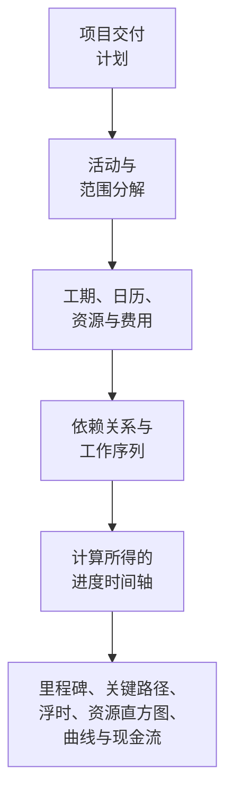

项目进度计划不只是一份日期列表。它是项目交付计划的图形化与逻辑化呈现。它阐释了项目从开始到结束的执行方式、工作包之间的关联关系、主要里程碑的计划完成时间，以及项目团队在决策时应参考的信息。

简而言之，进度计划将项目计划转化为一份路线图。它帮助所有参与方理解需要完成哪些工作、何时需要完成，以及由谁负责落实。对于项目经理、计划工程师、施工团队、工程师、采购负责人和 PMO 审查人员而言，进度计划成为协调与控制的核心工具之一。

进度计划是一份时间轴，但它不仅仅是时间轴。一份薄弱的进度计划可能只是列出日期。一份强健的进度计划能够解释为何这些日期是可信的。

## 进度计划作为交付路线图

每个项目都始于意图。团队清楚地知道必须交付什么：一栋建筑、一座设施、一套工业系统、一次停工检修、一项基础设施资产，或是一揽子工作。但交付不仅仅是了解最终目标。团队必须理解工作序列。

什么工作先做？哪些工作可以并行推进？哪些工作必须等待设计审批、材料交付、现场通道开放、许可证发放、测试或移交？哪些活动控制着完工日期？哪些里程碑对客户最为重要？

进度计划通过将计划转化为活动、工期、依赖关系、日历、资源、费用和里程碑来回答上述问题。

图形化时间轴有助于人们直观地看到工作内容。逻辑网络有助于软件进行计算。两者结合，使进度计划既成为沟通工具，又成为控制工具。

## 进度计划的输入要素

进度计划的可靠性取决于用于构建它的信息质量。在 Primavera P6 中，进度计划由几个主要输入要素支撑。

第一个输入是活动清单。活动将项目分解为可管理的工作块。每项活动应足够清晰，以便于计划、状态更新和绩效衡量。

第二个输入是确定性工期。这是完成每项活动所需的计划工作时间。工期应反映施工方法、生产率假设、班组规模、通道条件、工作面限制和项目实际情况。

第三个输入是依赖关系逻辑（逻辑关系）。依赖关系解释了活动之间的相互关系。一项活动可能需要在另一项活动开始之前完成。两项活动可能同时开始。两个完工节点可能需要对齐。这些关系构成了 CPM 网络。

第四个输入是工作序列。工序是实际执行的工作顺序，需考虑可建造性、工程流程、采购时序、通道开放、调试逻辑、移交策略和客户优先级。

第五个输入是资源与费用。资源加载使进度计划能够显示随时间变化的劳动力、设备和材料需求。费用加载使进度计划能够支持现金流、挣值和财务预测。

当这些输入完整且切实可行时，进度计划便能产生有价值的输出。

## 进度计划告诉我们什么

一份构建良好的进度计划能反映项目总工期，显示计划完工里程碑和中间交付物，生成资源直方图以展示劳动力或设备需求的起伏变化，并支持进度曲线、现金流曲线、挣值报告和近期滚动计划。

最重要的是，它能识别关键路径（critical path）或最长路径（longest path）。这是驱动项目完工的工作链。若该路径上的活动发生延误，项目完工日期也可能相应延误。这就是为什么逻辑关系如此重要。没有良好的依赖关系，关键路径可能无法反映项目的真实驱动因素。

浮时（float）是另一个重要输出。浮时反映了一项活动在影响后续活动或项目完工之前所拥有的灵活余量。但浮时只有在进度网络完整的情况下才有意义。若活动缺失逻辑关系，浮时的显示值可能比实际更好或更差。

## 为什么逻辑关系使时间轴具有可信度

这正是"在数据日期启动且无驱动逻辑的活动"这一度量指标变得重要的原因。

P6 中的数据日期（Data Date）是实际绩效与预测之间的分界线。数据日期之前的内容应代表已发生的事情，数据日期之后的内容应代表从当前起的计划。

当活动恰好在数据日期启动且没有任何逻辑驱动它时，进度计划发出了一个预警信号。表面上看工作似乎立即可以开始，但进度计划可能无法解释原因。可能没有任何前置活动表明该区域已具备条件，没有与材料交付的关联，没有与设计审批的衔接，没有与检查放行的连接，也没有与前期工作的逻辑关联。

这很重要，因为进度计划不应简单地将工作安排在某个日期上——它应该解释达到该日期的路径。

如果一项活动在数据日期启动，是因为所有必要的前置工作均已完成且逻辑支持该启动，则该日期是可以论证的。如果活动在该日期启动仅因为它是开放的、无驱动的、受约束的或更新不完整，则该日期是脆弱的。项目团队可能认为工作已准备就绪，但实际的使能条件并未在模型中体现。

## 实际案例

设想一个数据日期为 6 月 1 日的项目进度计划。更新后，有几项活动在 6 月 1 日启动：

- 在 B 区安装电缆桥架。
- 开始管道压力测试。
- 开始设备对中。
- 动员保温施工班组。

乍一看，近期计划显得繁忙且准备充分。但当进度计划师审查逻辑关系时，问题便清晰可见。电缆桥架安装未与材料交付建立关联。压力测试未与管道安装完成建立关联。设备对中缺少机械完工的前置活动。保温班组动员没有区域通道开放的前置活动。

进度计划显示工作在数据日期启动，但它没有解释为何工作可以开始。这不是可靠的路线图，而只是一份近期意向清单。

解决方法是添加或修正真实的 CPM 逻辑。如果材料交付驱动电缆桥架安装，就建立关联。如果管道完工驱动压力测试，就建立关联。如果通道开放驱动保温施工，就对该条件进行建模。重新计算后，部分活动可能仍在数据日期附近启动，但此时进度计划能够解释原因。

## 一份好的进度计划应当做什么

一份好的进度计划应帮助团队看清计划、检验计划并管理计划。

它应展示需要完成的工作内容，解释工作顺序，确定谁需要在何时采取行动，揭示关键路径，并支持资源计划、进度测量、现金流预测和 PMO 报告。

它还应使薄弱点清晰可见。缺失的逻辑关系、强制约束、过时日期、开放式开始、开放式完成以及活动集中在数据日期等问题，不仅仅是技术问题，它们影响着项目团队对准备状态、风险和控制的理解。

## 结论

进度计划是以时间、逻辑和可测量工作表达的项目交付计划。它是路线图、计算模型和沟通工具。

当构建良好时，它告诉项目团队需要发生什么、何时发生，以及为何日期是可信的。当活动在数据日期启动且没有驱动逻辑时，这种可信度便被削弱。进度计划不再能解释计划，而是开始猜测下一步。

因此，进度质量审查始终应提出一个简单的问题：进度计划是否解释了为什么工作在该时间点启动？如果答案是肯定的，进度计划正在发挥其作用。如果答案是否定的，这份路线图在获得信任之前需要补充更多逻辑关系。
