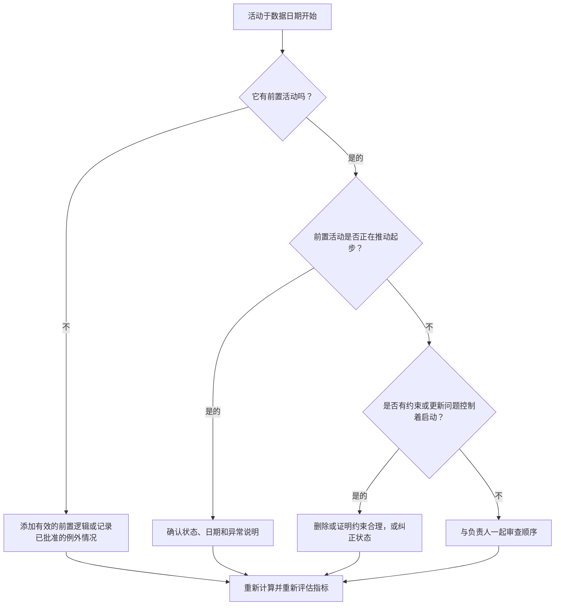

## 目的

本指南帮助进度计划员和项目控制团队减少或消除计划在 Primavera P6 数据日期开始但没有有效前置逻辑驱动启动的活动。它适用于进度质量审查、PMO 运行状况检查和更新周期验证。

目标是确认近期工作得到清晰的 CPM 逻辑的支持，并且活动未在数据日期开始只是因为缺少关系、约束、手动日期或不完整的进度更新。

## 开始之前

在采取行动之前收集以下信息：

- 该指标的当前评估结果。
- 项目数据 用于最新进度计算的日期。
- 开始日期等于数据日期的未开始或未开始活动的列表。
- 每项活动的前置活动和后续关系详细信息。
- 限制、预期日期、实际日期和日历分配。
- 用于更新的 P6 计划选项，包括相关的保留逻辑或进度覆盖设置。
- 任何批准的例外情况，例如项目启动活动、外部接口里程碑或所有者指导的启动​​。

## 了解您的结果

一个强有力的结果是，从数据日期开始，未解决的活动为零，而无需驱动前置逻辑。这意味着当前和近期工作已连接到计划网络，并且数据日期不会隐藏缺失的排序。

可接受的结果可能包括少量记录的异常情况。这些应该得到审查和批准，而不是忽视。例如，通知进行的里程碑或外部授权的活动可能不需要正常的前置任务，但审阅者应该可以看到原因。

弱结果意味着多个活动在数据日期开始，但没有明确的逻辑驱动因素。这可能表示未完成的启动、缺少前置关系、过多的约束、不完整的进度更新或在最新更新后未正确重新排序的活动。

## 改进目标

目标是从数据日期开始有 0 个未解决的活动，没有有效的驱动逻辑。

改进的目标不仅仅是减少数量。更深层次的目标是确保数据日期附近的每项活动都有其预测开始的合理理由。纠正后，每个受影响的活动都应该具有适当的前置逻辑、记录的异常或纠正后的状态/日期条件。

## 行动计划

### 第 1 步：确定主要问题

创建 P6 布局或报告，用于筛选开始日期等于数据日期的未开始或未开始的活动。包括活动 ID、活动名称、WBS、开始、完成、状态、总浮时、日历、主要约束、前置活动、后续和驱动关系指示器（如果有）列。

回顾每项活动并询问：

- 该活动有前身吗？
- 如果存在前辈，他们真的在推动起步吗？
- 活动的举行或移动是否受到限制？
- 活动是否缺少实际开始或进度更新？
- 该活动是否是有效的例外，例如项目启动里程碑？
- 该活动是否属于逻辑普遍较弱的 WBS 区域？

将调查结果分组为实际原因：缺失前置活动、非驱动前置活动、限制或预期日期、更新/状态错误或批准的例外情况。

### 第 2 步：应用建议的修复方法

从缺失或薄弱的逻辑开始。添加代表真实工作顺序的有效前置关系，例如适当时完成到开始、开始到开始或完成到完成关系。避免仅仅为了满足指标而添加关系；每个关系都应反映真实的施工、工程、采购、访问、批准或移交依赖性。

接下来检查约束条件。如果由于启动限制而导致活动在数据日期开始，请确认该限制在合同或操作上是否合理。消除不必要的约束并让活动由逻辑驱动。如果约束有效，请记录原因并确认它不会扭曲关键路径。

检查进度状态。如果工作已经开始，请正确更新实际开始时间和剩余持续时间。如果工作尚未开始，请确认预测开始时间应保留在数据日期。活动不应仅仅因为更新周期将其拉至当前日期而显得已准备好开始。

进行更改后，重新计算进度计划并再次审查受影响的活动。确认开始日期现在由逻辑驱动、正确状态或记录为已批准的例外。

### 第 3 步：删除常见拦截器

常见的障碍包括现场反馈不明确、界面信息缺失以及让近期工作看起来准备就绪的压力。通过与专业领导、施工经理、采购负责人或包经理一起审查受影响的活动来解决这些问题。

另一个常见的障碍是滥用约束来代替逻辑。在某些情况下可能需要约束，但它们不应取代进度计划网络。如果保留约束，请记录它存在的原因以及它如何影响浮时和最长路径。

另请检查问题是否是由计划计算设置或更新实践引起的。如果进度覆盖、保留逻辑、无序进度或不完整实现正在影响结果，请在重新评估指标之前将更新方法与项目控制过程保持一致。

### 第 4 步：验证更改

在下次评估之前验证更正的计划。重新运行过滤器以查找从数据日期开始的未启动或未启动的活动，没有驱动逻辑。确认每个剩余项目均已更正或记录为已批准的例外情况。

重新计算后查看总浮时、最长路径和近期前瞻活动。逻辑修正可能会改变关键路径或揭示其他排序问题。如果进度变动较大，请将影响传达给项目控制负责人或 PMO 审核员。

## 改善计划

### 第一天：回顾和诊断

运行指标，确认数据日期，并生成活动列表。将结果分为缺失逻辑、非驱动逻辑、约束、状态错误和潜在异常。

### 第 2-3 天：实施优先行动

首先纠正影响最大的活动，尤其是关键或近乎关键的活动。添加有效的前置逻辑，删除不必要的约束，更新不正确的状态并记录异常。

### 第 4-5 天：监控早期结果

重新计算计划并检查受影响的活动现在是否是逻辑驱动的。检查总浮时、最长路径和里程碑日期是否发生意外变化。

### 第六天：最终调整

与负责的专业或包所有者一起解决剩余的阻止程序。确认任何保留的例外情况均合理且有明确记录。

### 第 7 天：重新评估和比较

再次运行评估，并将新结果与之前的结果和目标阈值进行比较。确认指标现在是否为零未解决的活动，或者是否需要采取进一步的措施。

## 追踪进度

使用简单的跟踪器来管理更正和批准。

| 日期 | 采取的行动 | 预期影响 | 结果/观察 | 下一步 |
| --- | --- | --- | --- | --- |
| [日期] | 审查从数据日期开始的活动，没有驱动逻辑 | 识别缺失或薄弱的逻辑 | [观察结果] | 将更正分配给负责的所有者 |
| [日期] | 添加了有效的前置活动关系 | 改进 CPM 排序 | [观察结果] | 重新计算并审查浮时影响 |
| [日期] | 删除或合理化限制 | 减少人工启动 | [观察结果] | 确认剩余的例外情况 |
| [日期] | 更新了不正确的活动状态 | 提高更新准确性 | [观察结果] | 重新进行评估 |

## 如果结果没有改善

如果结果没有改善，请检查相同的活动是否仍然失败，或者在数据日期是否出现新的活动。重复的失败可能表明存在更广泛的进度开发问题，例如 WBS 区域中的逻辑不完整、更新规则薄弱或约束使用不一致。

将持续存在的问题上报给项目控制主管、计划经理或 PMO 审核员。对于主要进度计划编制，请考虑针对受影响的工作包举办重点逻辑审查研讨会。如果计划用于合同报告、延迟分析或挣值预测，则未解决的项目应视为质量问题。

## 维护

在发布计划之前，请在每个更新周期中查看此指标。检查应该是标准计划健康审查的一部分，特别是在进度更新、重新排序、主要范围变更或恢复计划之后。

良好的维护习惯包括保持前导列和后续列在 P6 布局中可见、在每次提交之前检查开放启动、记录批准的例外情况以及检查数据日期移动不会创建一组新的非驱动活动。

## 摘要清单

- [ ] 当前结果已审核
- [ ] 目标阈值已确定
- [ ] 数据日期确认
- [ ] 从确定的数据日期开始的活动
- [ ] 已确定的主要问题
- [ ] 已纠正缺失或薄弱的逻辑
- [ ] 审查并证明或删除限制
- [ ] 检查状态日期
- [ ] 记录批准的例外情况
- [ ] 进度计划重新计算
- [ ] 监测结果
- [ ] 重复评估
- [ ] 记录后续步骤
## 相关内容
- [博客模板](03_blog_template.md)
- [什么是进度计划](../../03b_blogs_zh/01_WHAT%20A%20SCHEDULE%20IS/01_blog.md)
- [强大的逻辑](../../03b_blogs_zh/02_ROBUST%20LOGIC/02_ROBUST%20LOGIC.md)
