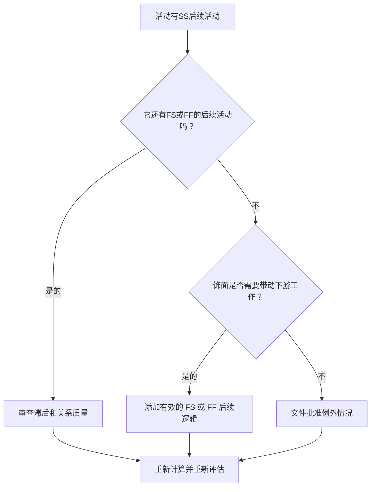

# 有 SS 后续活动且无 FS 或 FF 后续活动的活动 - 改进指南

## 目的

本指南帮助进度计划员检查和纠正具有“开始到开始”后续项但没有“完成到开始”或“完成到完成”后续项的活动。它通过确认活动结束（而不仅仅是开始）连接到下游计划网络来支持更强大的 CPM 逻辑。

## 开始之前

在采取行动之前收集以下信息：

- 该指标的当前评估结果。
- 有 SS 后续活动且没有 FS 或 FF 后续活动的活动列表。
- 每项活动的后续关系详细信息。
- 活动类型、持续时间、状态、日历、总浮时和 WBS。
- 影响活动或其后续活动的任何滞后、限制或预期日期。
- 相关施工、工程、采购或移交顺序信息。

## 了解您的结果

一个强有力的结果是在这种情况下未解决的活动为零。这意味着启动下游工作的活动也具有基于完成的逻辑，其中工作的完成很重要。

可接受的结果可能包括记录的异常情况，例如工作量活动、管理活动或不需要完成逻辑的故意重叠的工作。这些应该被审查而不是假设有效。

弱结果意味着多个活动可以启动后续活动，但不控制任何后续活动的完成或通过自己的完成来开始。这可能会让未完成的工作不再影响进度计划编制。

## 改进目标

目标是 0 个未解决的活动，其中有 SS 后续活动，没有 FS 或 FF 后续活动。

目标是确认每项活动都有一个现实的完成驱动的后续活动，其中完成会影响下游工作，或者缺乏完成逻辑是合理的并记录在案。

## 行动计划

### 第 1 步：确定主要问题

创建 P6 布局或导出，其中列出至少有一个 SS 后续项且没有 FS 或 FF 后续项的活动。包括活动 ID、活动名称、WBS、原始持续时间、剩余持续时间、总浮时、后续活动、逻辑关系类型、滞后、约束和活动状态。

回顾每项活动并询问：

- 由于此活动开始，什么工作开始？
- 哪些工作、里程碑、移交或检查取决于此活动的完成？
- 是否缺少 FS 或 FF 后续活动？
- SS 关系是否用于正确建模重叠工作？
- 该活动是否是有效的例外，例如LOE 活动或支持活动？

### 第 2 步：应用建议的修复方法

添加基于完成的逻辑，其中活动完成应控制后续工作。当后续活动在活动完成之前无法开始时，请使用 FS。当后续活动可以重叠但在前趋者完成之前无法完成时，请使用 FF。

检查具有滞后性的 SS 关系。如果使用滞后来近似完成依赖性，请用更清晰的 FS 或 FF 关系替换或补充它。避免仅仅为了满足指标而添加逻辑；每个关系都应该反映真实的工作顺序。

如果该活动是有效的异常，请在笔记本主题、UDF、注释字段或计划质量跟踪器中记录原因。

### 第 3 步：删除常见拦截器

常见的障碍包括复制旧进度计划的逻辑、过多的党卫军关系、不明确的交接点以及缺少现场或专业领导的输入。通过与负责人一起审查实际工作顺序来解决这些问题。

另一个障碍是相信重叠工作总是只需要 SS 逻辑。重叠可能是有效的，但前一个的完成通常仍然需要控制后一个的完成、检查、周转或后续活动。

### 第 4 步：验证更改

修正后重新计算进度计划。重新运行指标并确认每个剩余活动均已更正或记录为已批准的例外情况。

审查对总浮时、关键路径、最长路径和近期里程碑的影响。如果添加完成逻辑会更改关键日期，请将结果传达给项目控制主管或 PMO 审核员。

## 改善计划

### 第一天：回顾和诊断

运行指标，确认受影响的活动列表，并将活动分为缺少完成逻辑、弱 SS 逻辑、滞后问题和可能的异常。

### 第 2-3 天：实施优先行动

首先纠正关键和近乎关键的活动。添加有效的 FS 或 FF 后续活动，调整不适当的 SS 逻辑，并记录合理的例外情况。

### 第 4-5 天：监控早期结果

重新计算进度计划并审查浮时、最长路径和里程碑日期的移动。

### 第六天：最终调整

与负责的专业、包所有者或施工负责人一起解决剩余的不确定问题。

### 第 7 天：重新评估和比较

再次运行评估并将结果与​​目标阈值进行比较。

## 追踪进度

使用简单的跟踪器来管理更正和批准。

| 日期 | 采取的行动 | 预期影响 | 结果/观察 | 下一步 |
| --- | --- | --- | --- | --- |
| [日期] | 审查仅限 SS 的后续活动 | 识别缺失的完成逻辑 | [观察结果] | 分配更正 |
| [日期] | 添加了 FS 或 FF 后续逻辑 | 提高每千次展示费用的连续性 | [观察结果] | 重新计算进度计划 |
| [日期] | 记录有效的例外情况 | 提高审核的可追溯性 | [观察结果] | 重新评估指标 |

## 如果结果没有改善

如果结果没有改善，请检查过滤器是否识别出有效的异常、重复的逻辑或网络开发薄弱的特定 WBS 区域中的活动。重复出现的问题可能表明团队在计划过程中过于依赖 SS 关系。

当未解决的项目影响关键、近乎关键、合同或移交相关工作时，将其上报给计划主管或 PMO 审核员。

## 维护

在每次计划更新期间和基线批准之前查看此指标。在重新排序、恢复计划、复制计划制定或重大范围变更后要特别注意。

## 摘要清单

- [ ] 当前结果已审核
- [ ] 目标阈值已确定
- [ ] 已确定的主要问题
- [ ] 党卫军后续活动回顾
- [ ] 已更正缺失的 FS 或 FF 逻辑
- [ ] 检查滞后和约束
- [ ] 记录有效的异常情况
- [ ] 进度计划重新计算
- [ ] 监测结果
- [ ] 重复评估
- [ ] 记录后续步骤
## 相关内容
- [有 SS 后续活动且无 FS 或 FF 后续活动的活动 - 概述](01_overview_template.md)
- [博客模板](03_blog_template.md)
- [什么是进度计划](../../03b_blogs_zh/01_WHAT%20A%20SCHEDULE%20IS/01_blog.md)
- [强大的逻辑](../../03b_blogs_zh/02_ROBUST%20LOGIC/02_ROBUST%20LOGIC.md)
